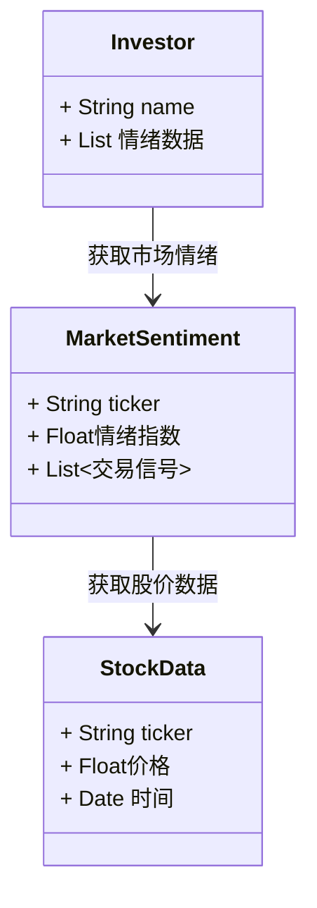
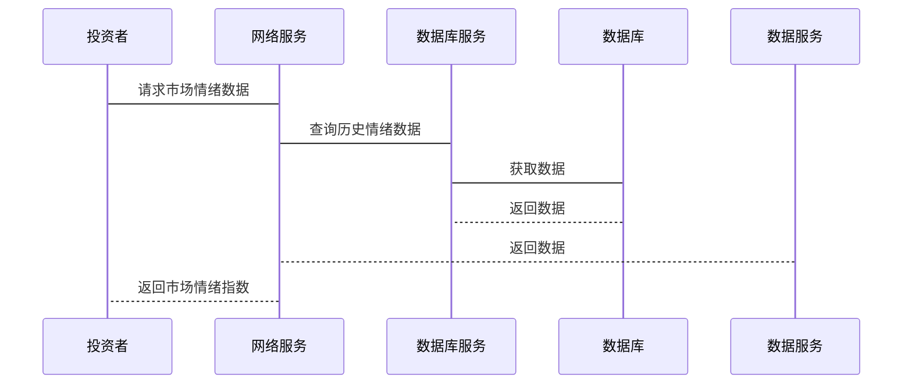

                 


# 格雷厄姆的股价与价值关系：市场先生的情绪

---

## 关键词

- 市场先生
- 股价波动
- 价值投资
- 市场情绪
- 投资策略

---

## 摘要

本文深入探讨了格雷厄姆提出的“市场先生”概念，分析了市场情绪如何影响股价与价值的关系。通过量化市场情绪、建立数学模型、设计系统架构和实战案例，本文详细讲解了如何利用市场情绪进行投资决策，帮助投资者在市场波动中发现价值低估的投资机会。

---

## 第一部分: 格雷厄姆投资理论的背景与基础

### 1.1 市场先生的概念与投资心理

#### 1.1.1 市场先生的定义与角色

市场先生是格雷厄姆提出的一个隐喻，代表市场的波动性和投资者情绪。市场先生每天提供一个价格，投资者可以选择以该价格买入或卖出资产。市场先生的情绪波动反映了市场的非理性，从而导致股价与实际价值的偏离。

**数学模型**：  
股价 = 真实价值 + 市场情绪影响  
$$ P = V + E $$  
其中，$P$ 是股价，$V$ 是真实价值，$E$ 是市场情绪的影响。

#### 1.1.2 市场情绪对股价的影响

市场情绪的波动性是导致股价短期偏离实际价值的主要原因。当市场情绪高涨时，股价可能被高估；当市场情绪低落时，股价可能被低估。

**图表说明**：  
- 图1：市场情绪与股价波动的正相关关系  
- 图2：市场情绪的周期性特征

#### 1.1.3 格雷厄姆的价值投资理念

格雷厄姆强调长期投资，关注企业的实际价值，而非短期市场波动。他认为，市场先生的情绪是投资者的盟友，而非敌人。

---

### 1.2 股价与价值的基本关系

#### 1.2.1 股价的波动性分析

股价波动主要由市场情绪驱动，而非企业的实际表现。这种波动性为价值投资者提供了买入低估资产的机会。

**数学模型**：  
波动性指数 = 标准差（股价）  
$$ \text{波动性指数} = \sigma_P $$

#### 1.2.2 价值的内在稳定性

企业的实际价值（如盈利能力、资产质量）是相对稳定的，而股价由于市场情绪的影响，呈现周期性波动。

**图表说明**：  
- 图3：价值与股价的长期趋势对比

#### 1.2.3 股价与价值的偏离与回归

市场情绪的极端波动会导致股价偏离实际价值，但长期来看，股价会回归真实价值。

**案例分析**：  
- 2008年金融危机期间，市场情绪的恐慌导致股价大幅低于实际价值，为长期投资者提供了买入机会。

---

## 第二部分: 市场先生情绪的量化与分析

### 2.1 市场情绪的量化指标

#### 2.1.1 市场情绪的衡量方法

常用的市场情绪指标包括恐慌指数（VIX）、投资者信心指数、市场换手率等。

**图表说明**：  
- 图4：VIX指数与市场波动的关系

#### 2.1.2 市场情绪与股价的相关性分析

通过统计方法（如相关系数）分析市场情绪与股价波动的相关性。

**数学模型**：  
相关系数 = $\rho_{E, P}$  
$$ \rho_{E, P} = \frac{\text{Cov}(E, P)}{\sigma_E \sigma_P} $$

#### 2.1.3 市场情绪的周期性与波动性

市场情绪呈现周期性波动，周期长度和幅度因市场环境而异。

**图表说明**：  
- 图5：市场情绪的周期性变化

---

### 2.2 市场情绪的算法与模型

#### 2.2.1 市场情绪的量化算法

使用自然语言处理（NLP）分析新闻、社交媒体等数据，量化市场情绪。

**Python代码示例**：

```python
import numpy as np
from textblob import TextBlob

def sentiment_analysis(text):
    blob = TextBlob(text)
    return blob.sentiment.polarity

# 示例数据
text = "The market is bullish today."
print(sentiment_analysis(text))  # 输出：0.7
```

#### 2.2.2 市场情绪与股价波动的数学模型

建立市场情绪指数，并将其与股价波动相关联。

**数学模型**：  
情绪指数 = 加权平均情绪值  
$$ S = \sum_{i=1}^{n} w_i \cdot s_i $$  
其中，$w_i$ 是权重，$s_i$ 是情绪值。

---

## 第三部分: 系统分析与架构设计方案

### 3.1 问题场景介绍

设计一个系统，量化市场情绪并分析其对股价的影响，帮助投资者做出决策。

### 3.2 系统功能设计

#### 3.2.1 领域模型（Mermaid 类图）



#### 3.2.2 系统架构设计（Mermaid 架构图）

```mermaid
docker

front-end --data--> web-service
web-service --data--> market-sentiment-service
market-sentiment-service --data--> stock-data-service
stock-data-service --data--> database
```

### 3.3 系统接口设计

- API 接口：  
  - `/api/sentiment`：获取市场情绪指数  
  - `/api/stocks`：获取股价数据

### 3.4 系统交互设计（Mermaid 序列图）



---

## 第四部分: 项目实战

### 4.1 环境安装

安装必要的Python库：

```bash
pip install numpy pandas textblob
```

### 4.2 核心实现代码

```python
import pandas as pd
from textblob import TextBlob

def calculate_sentiment(ticker):
    # 获取股价数据
    stock_data = pd.read_csv(f'data/{ticker}.csv')
    # 计算市场情绪
    sentiment_scores = []
    for text in stock_data['新闻']:
        blob = TextBlob(text)
        sentiment_scores.append(blob.sentiment.polarity)
    return sentiment_scores

# 示例运行
calculate_sentiment('AAPL')
```

### 4.3 实际案例分析

以苹果公司为例，分析市场情绪对股价的影响。

**图表说明**：  
- 图6：苹果股价与市场情绪指数的对比

---

## 第五部分: 总结与展望

### 5.1 最佳实践 Tips

- 定期监控市场情绪指数
- 结合基本面分析进行投资决策
- 长期持有，避免频繁交易

### 5.2 小结

市场先生的情绪是影响股价波动的重要因素。通过量化市场情绪，投资者可以更好地把握市场机会，实现价值投资。

### 5.3 注意事项

- 市场情绪分析存在局限性，需结合其他因素
- 数据质量和模型准确性影响结果

### 5.4 拓展阅读

- 格雷厄姆《聪明的投资者》
- 市场情绪分析的经典文献

---

## 结语

通过本文的分析与实战，读者可以更好地理解市场情绪对股价的影响，并将其应用于实际投资决策中。价值投资的核心在于长期持有优质资产，耐心等待市场情绪的回归。

