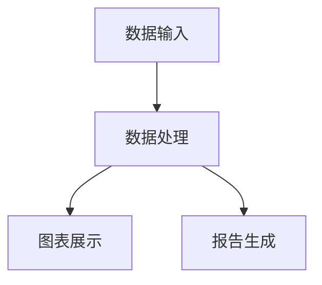
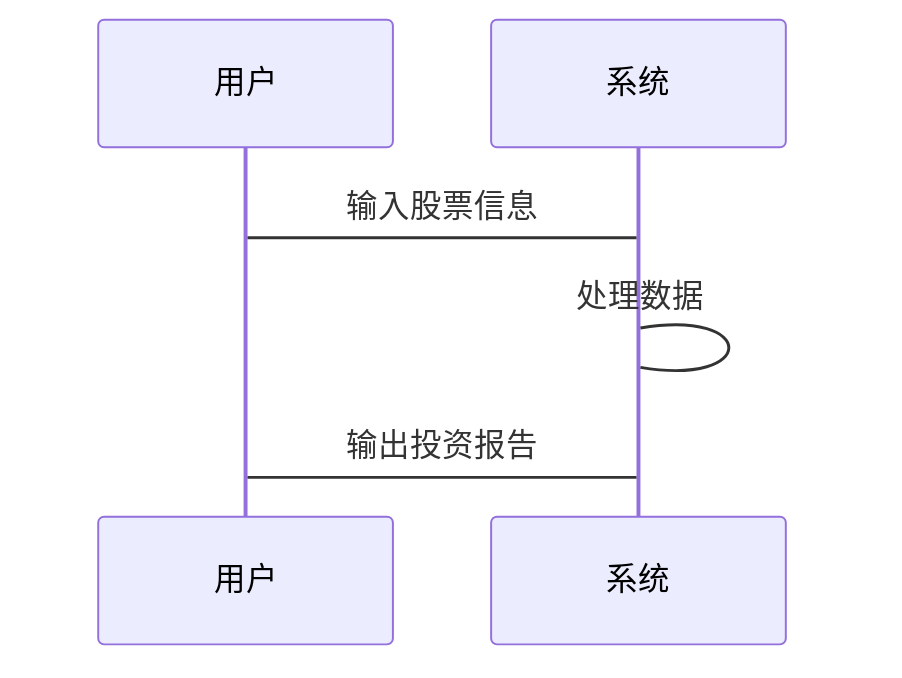

                 


# 格雷厄姆的股息投资理念：稳定现金流的重要性

## 关键词：本杰明·格雷厄姆, 股息投资, 稳定现金流, 投资策略, 风险管理, 财务分析, 价值投资

## 摘要：本篇文章深入探讨了格雷厄姆的股息投资理念，特别是稳定现金流的重要性。文章从格雷厄姆的投资哲学出发，结合股息投资的基本概念、数学模型、系统设计、实战案例以及心理因素，全面分析了如何通过股息投资实现稳健的财务回报。通过本文，读者将掌握格雷厄姆的股息投资策略，理解其背后的数学原理，并学会如何在实际投资中应用这些理念。

---

# 第一部分: 引言

## 第1章: 格雷厄姆及其股息投资理念概述

### 1.1 本杰明·格雷厄姆的生平简介

本杰明·格雷厄姆（Benjamin Graham）是20世纪著名的投资家和教授，被誉为“价值投资之父”。他于1894年出生于伦敦，后随家人迁居美国。格雷厄姆的职业生涯始于华尔街，他在1920年代开始发展自己的投资理论，并在1949年出版了经典著作《证券分析》（with David Dodd），这本书奠定了现代价值投资的基础。

### 1.2 格雷厄姆的投资哲学与方法

格雷厄姆的投资哲学的核心是“安全第一”。他认为，投资者应该购买那些具有安全边际（margin of safety）的股票，即股票的内在价值高于其市场价格。这种安全边际可以为投资者提供一个缓冲区，以应对市场波动和不确定性。

### 1.3 股息投资理念的核心思想

格雷厄姆的股息投资理念强调稳定现金流的重要性。他认为，股息是衡量一家公司财务健康状况的重要指标，稳定的股息收入可以为投资者提供持续的现金流，从而降低投资风险。

---

## 第2章: 股息投资的基本概念

### 2.1 股息的定义与分类

#### 2.1.1 什么是股息

股息是公司分配给股东的利润部分。通常以每股股息（Dividend per Share，DPS）的形式发放，也可以以股票股息的形式发放。

#### 2.1.2 股息的分类

股息可以分为以下几类：
- 现金股息：最常见的股息形式，以现金形式支付。
- 股票股息：以额外股票的形式支付。
- 特殊股息：公司一次性发放的额外股息。

### 2.2 股息的重要性与作用

#### 2.2.1 股息的重要性

股息是公司盈利的直接体现，稳定的股息收入可以为投资者提供持续的现金流，同时也能反映公司的财务健康状况。

#### 2.2.2 股息的作用

- 提供稳定的现金流。
- 反映公司的财务健康状况。
- 增加股东的财富。

### 2.3 格雷厄姆股息投资理念的核心要素

#### 2.3.1 稳定现金流的定义与特征

稳定现金流是指公司能够持续、稳定地向股东分配股息。这种现金流的稳定性通常与公司的盈利能力、财务状况和行业地位密切相关。

#### 2.3.2 股息支付率与股息增长能力

- 股息支付率（Dividend Payout Ratio）：股息支付率 = （股息总额 / 净利润）× 100%。一个合理的股息支付率通常在25%到60%之间。
- 股息增长能力：公司是否能够持续增长股息收入，反映了公司的盈利能力和成长潜力。

#### 2.3.3 安全边际的概念与应用

安全边际是格雷厄姆投资理念的核心。他建议投资者购买那些市场价格低于其内在价值的股票，从而在市场波动中获得超额收益。

---

## 第3章: 股息投资的数学模型与公式

### 3.1 股息折现模型（DDM）

#### 3.1.1 DDM的基本原理

股息折现模型（Dividend Discount Model，DDM）是一种用于评估股票内在价值的模型。它假设投资者购买股票的目的是为了获得股息收入，因此可以通过折现未来股息来计算股票的合理价格。

#### 3.1.2 DDM的数学公式推导

$$ V = \frac{D}{k - g} $$

其中：
- \( V \) 为股票的内在价值
- \( D \) 为当前股息
- \( k \) 为折现率
- \( g \) 为股息增长率

#### 3.1.3 DDM的应用案例

假设某公司的当前股息为$2，预期股息增长率为5%，折现率为10%。根据DDM公式，该股票的内在价值为：

$$ V = \frac{2}{0.10 - 0.05} = \frac{2}{0.05} = 40 $$

因此，该股票的内在价值为40元。

### 3.2 股息增长模型

#### 3.2.1 恒定增长模型

恒定增长模型假设股息以恒定的速度增长。其公式为：

$$ P = \frac{D_1}{k - g} $$

其中：
- \( P \) 为股票价格
- \( D_1 \) 为下一期股息
- \( k \) 为折现率
- \( g \) 为股息增长率

#### 3.2.2 非恒定增长模型

非恒定增长模型适用于股息增长率变化的公司。其计算较为复杂，通常需要分阶段计算股息现值。

### 3.3 股息率与投资回报的计算

#### 3.3.1 股息率的计算公式

股息率 = （股息总额 / 股票价格）× 100%

例如，某股票的价格为50元，股息为2元，则股息率为：

$$ 股息率 = \frac{2}{50} \times 100\% = 4\% $$

#### 3.3.2 投资回报率的计算

投资回报率 = （总收益 / 初始投资）× 100%

假设投资者以每股50元的价格购买某股票，持有期间获得股息收入2元，一年后以55元的价格卖出，则投资回报率为：

$$ ROI = \frac{(55 - 50 + 2)}{50} \times 100\% = \frac{7}{50} \times 100\% = 14\% $$

---

## 第4章: 股息投资的系统分析与架构设计

### 4.1 系统架构设计

#### 4.1.1 系统目标与范围

设计一个股息投资分析系统，用于筛选具有稳定股息收入的股票，并评估其内在价值。

#### 4.1.2 系统功能模块划分

- 数据输入模块：接收股票的基本信息、财务数据等。
- 数据处理模块：计算股息率、股息支付率、内在价值等。
- 图表展示模块：生成股票价格走势、股息增长率等图表。
- 报告生成模块：输出投资建议和风险提示。

#### 4.1.3 系统架构图



### 4.2 投资策略的系统实现

#### 4.2.1 股票筛选标准

- 股息支付率低于60%
- 股息增长率高于5%
- 股票价格低于其内在价值

#### 4.2.2 投资组合管理

- 根据筛选标准选择股票
- 分散投资以降低风险
- 定期评估投资组合

#### 4.2.3 风险管理与调整机制

- 设置止损点
- 定期重新评估股票价值
- 根据市场变化调整投资组合

### 4.3 系统接口设计

#### 4.3.1 数据输入接口

```python
def input_data(stock_info):
    # 输入股票信息
    pass
```

#### 4.3.2 数据处理接口

```python
def calculate_value(stock_info):
    # 计算股票内在价值
    pass
```

#### 4.3.3 结果输出接口

```python
def output_report(report):
    # 输出投资报告
    pass
```

### 4.4 系统交互设计



---

## 第5章: 股息投资的实战案例分析

### 5.1 实战环境搭建

#### 5.1.1 数据源的选择与获取

使用财经网站或数据库获取股票的财务数据和市场数据。

#### 5.1.2 分析工具的安装与配置

安装Python和相关数据分析库（如Pandas、NumPy、Matplotlib）。

#### 5.1.3 数据清洗与预处理

去除缺失值和异常值，确保数据的完整性和准确性。

### 5.2 股票筛选与分析

#### 5.2.1 股票筛选标准

- 股息支付率低于60%
- 股息增长率高于5%
- 股票价格低于其内在价值

#### 5.2.2 投资组合管理

- 分散投资以降低风险
- 定期评估投资组合
- 根据市场变化调整投资策略

#### 5.2.3 风险管理与调整机制

- 设置止损点
- 定期重新评估股票价值
- 根据市场变化调整投资组合

### 5.3 项目实战代码实现

```python
import pandas as pd
import numpy as np

# 示例数据
data = {
    '股票代码': ['AAPL', 'MSFT', 'GOOGL'],
    '股息': [2.08, 1.6, 0.88],
    '股价': [150, 100, 120]
}

df = pd.DataFrame(data)

# 计算股息率
df['股息率'] = (df['股息'] / df['股价']) * 100

# 计算内在价值（假设折现率为10%，股息增长率为5%）
df['内在价值'] = df['股息'] / (0.10 - 0.05)

print(df)
```

### 5.4 实战案例分析

以苹果公司为例，计算其股息率和内在价值：

- 股息率：\( 2.08 / 150 \times 100\% = 1.39\% \)
- 内在价值：\( 2.08 / (0.10 - 0.05) = 41.6 \)

由于苹果公司的股价（150元）高于其内在价值（41.6元），因此不建议购买。

---

## 第6章: 股息投资的心理与纪律

### 6.1 投资者心理对股息投资的影响

- 过度乐观：投资者可能高估自己选择股票的能力。
- 过度悲观：投资者可能因市场波动而恐慌性抛售。
- 从众心理：投资者可能盲目跟随市场趋势。

### 6.2 长期投资的纪律性

- 遵循格雷厄姆的投资理念，避免情绪化决策。
- 定期评估投资组合，及时调整。
- 保持耐心，长期持有优质股票。

---

## 第7章: 总结与展望

### 7.1 核心观点总结

格雷厄姆的股息投资理念强调稳定现金流的重要性。通过选择具有稳定股息收入和安全边际的股票，投资者可以在市场波动中实现稳健的财务回报。

### 7.2 未来展望

随着市场的发展和金融工具的创新，股息投资将变得更加多样化和高效。投资者需要不断学习和适应市场变化，以实现长期的财务目标。

---

## 结语

通过本文的探讨，我们深入了解了格雷厄姆的股息投资理念，掌握了稳定现金流的重要性，并学会了如何在实际投资中应用这些理念。希望本文能为投资者提供有价值的参考，帮助他们在复杂的市场环境中实现稳健的投资回报。

