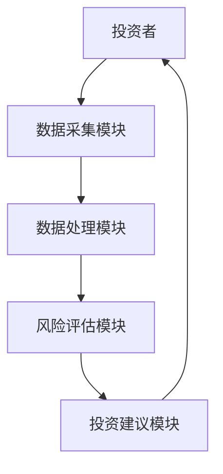
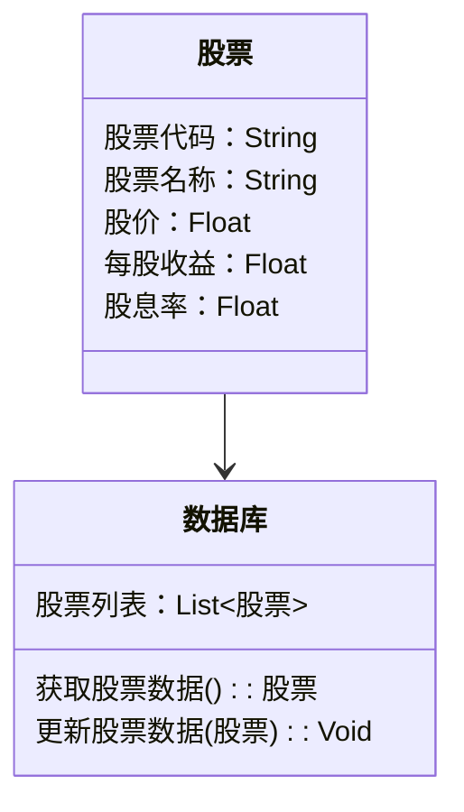

                 


# 格雷厄姆的股息投资策略：稳定收益的来源

> 关键词：股息投资，格雷厄姆，价值投资，股息率，稳定收益

> 摘要：本文深入探讨了格雷厄姆的股息投资策略，分析了其核心思想、数学模型和实际应用。通过系统的分析与案例研究，揭示了如何通过股息投资实现稳定收益。文章内容包括股息投资的基本概念、策略选择、数学模型构建、系统架构设计以及实战案例分析，旨在为投资者提供全面的理论指导和实践参考。

---

# 第1章: 股息投资的定义与背景

## 1.1 股息投资的基本概念

### 1.1.1 股息的定义与分类

股息是公司分配给股东的利润部分，通常以现金、股票或其他形式支付。根据支付方式的不同，股息可以分为现金股息、股票股息、财产股息和选项股息。现金股息是最常见的形式，也是本文的重点。

$$ \text{股息} = \frac{\text{净利润} - \text{留存收益}}{\text{总股本}} $$

### 1.1.2 股息投资的起源与发展

股息投资的理念可以追溯到18世纪，但格雷厄姆的出现将这一理念系统化。通过分析历史数据，我们可以发现，股息投资在经济衰退期往往表现更为稳定。

### 1.1.3 股息投资的现状与趋势

当前，股息投资已成为机构和个人投资者的重要策略之一。随着市场的波动加剧，越来越多的投资者倾向于选择高股息率的股票。

## 1.2 格雷厄姆的价值投资理念

### 1.2.1 价值投资的定义与特点

价值投资是一种通过分析股票的内在价值，寻找市场价格低于内在价值的投资策略。其核心是寻找被市场低估的股票。

$$ \text{内在价值} = \sum_{t=1}^{\infty} \frac{\text{股息}_t}{(1 + r)^t} $$

### 1.2.2 格雷厄姆的投资策略概述

格雷厄姆强调安全边际，即以低于内在价值的价格买入股票。他认为，市场先生（市场的波动）是投资者的朋友，而不是敌人。

### 1.2.3 格雷厄姆与股息投资的关系

格雷厄姆特别重视股息收益率，认为高股息率的股票更具有投资价值。他提出了著名的“防御性投资”概念，即通过投资高股息率的蓝筹股来实现稳定收益。

## 1.3 股息投资的核心优势

### 1.3.1 稳定收益的特点

股息投资的主要优势在于其稳定的收益。与资本增值相比，股息收益更具可预测性。

### 1.3.2 抗风险能力分析

在市场下跌时，高股息率的股票通常表现更为稳定。这是因为股息收入可以部分抵消股价下跌的影响。

### 1.3.3 股息投资的长期收益展望

长期来看，股息投资的复利效应显著。通过 reinvesting dividends，投资者可以实现财富的长期增长。

---

# 第2章: 股息投资的核心策略

## 2.1 高分红股票的筛选标准

### 2.1.1 股息率的计算与分析

股息率是衡量股票投资回报的重要指标。计算公式如下：

$$ \text{股息率} = \frac{\text{每股股息}}{\text{股价}} $$

例如，如果一只股票的股息为2元，股价为20元，其股息率为10%。

### 2.1.2 股息支付率的评估

股息支付率是公司实际支付的股息与净利润的比例。公式为：

$$ \text{股息支付率} = \frac{\text{股息支付总额}}{\text{净利润}} $$

低股息支付率的公司可能具有更大的增长潜力。

### 2.1.3 股东权益保障的考量

公司必须有足够的现金流来支付股息。可以通过分析公司的自由现金流和负债情况来评估这一点。

## 2.2 股息质量的评估指标

### 2.2.1 股息支付能力的分析

除了股息率，还需要关注公司是否有持续支付股息的能力。这可以通过分析公司的盈利能力、现金流和债务水平来实现。

### 2.2.2 公司财务健康状况的评估

健康的财务状况是股息支付的前提。可以通过分析公司的资产负债表和利润表来评估财务健康状况。

### 2.2.3 行业地位与竞争优势分析

选择行业地位稳固、竞争优势明显的公司，可以降低投资风险。

## 2.3 投资组合的构建与管理

### 2.3.1 股票组合的多样化策略

通过分散投资不同行业和地区的股票，可以降低投资风险。

### 2.3.2 股票组合的风险控制

定期评估投资组合的风险敞口，必要时进行调整。

### 2.3.3 股票组合的动态调整

根据市场变化和公司情况，及时调整投资组合。

---

# 第3章: 股息投资的数学模型与算法

## 3.1 股息率计算公式

### 3.1.1 股息率的定义与公式

如前所述，股息率的计算公式为：

$$ \text{股息率} = \frac{\text{每股股息}}{\text{股价}} $$

### 3.1.2 股息率与股价的关系

股息率与股价呈反比关系。当股价下跌时，股息率上升，反之亦然。

### 3.1.3 股息率的优缺点分析

高股息率的股票通常具有稳定的收益，但可能增长潜力有限。

## 3.2 股票内在价值的评估模型

### 3.2.1 格雷厄姆的内在价值公式

格雷厄姆提出了内在价值的计算公式：

$$ \text{内在价值} = \frac{\text{每股收益} \times (5 + 市盈率)}{2} $$

### 3.2.2 股票价值的多因素分析

内在价值不仅取决于当前的股息，还与公司的盈利能力、成长潜力和财务状况密切相关。

### 3.2.3 股票价值的动态调整模型

根据市场变化和公司情况，动态调整内在价值的评估。

## 3.3 股票组合的收益与风险分析

### 3.3.1 投资组合的期望收益计算

$$ \text{期望收益} = \sum (\text{概率} \times \text{收益}) $$

### 3.3.2 投资组合的风险评估

标准差和波动率是衡量投资风险的重要指标。

### 3.3.3 投资组合的夏普比率计算

夏普比率衡量的是投资回报相对于其风险的高低：

$$ \text{夏普比率} = \frac{\text{期望收益} - \text{无风险利率}}{\text{标准差}} $$

---

# 第4章: 股息投资的系统分析与架构设计

## 4.1 投资系统的整体架构

### 4.1.1 系统目标与范围

构建一个股息投资分析系统，帮助投资者筛选高分红股票。

### 4.1.2 系统功能模块划分

- 数据采集模块：收集股票数据
- 数据处理模块：计算股息率、市盈率等指标
- 风险评估模块：评估投资风险
- 投资建议模块：生成投资建议

### 4.1.3 系统架构的流程图



## 4.2 数据收集与处理模块

### 4.2.1 数据来源

可以从金融数据服务提供商（如Yahoo Finance、 Bloomberg）获取数据。

### 4.2.2 数据清洗与预处理

剔除缺失值和异常值，确保数据的完整性和准确性。

### 4.2.3 数据存储与管理

使用数据库（如MySQL）存储数据，并建立索引以便快速查询。

## 4.3 系统功能设计

### 4.3.1 领域模型mermaid类图



---

# 第5章: 股息投资的项目实战

## 5.1 环境安装与配置

### 5.1.1 开发环境的选择

推荐使用Python编程语言，安装必要的库（如pandas、numpy、 matplotlib）。

### 5.1.2 数据源的获取

从Yahoo Finance获取股票数据。

## 5.2 系统核心实现源代码

### 5.2.1 数据采集模块

```python
import pandas as pd
import yfinance as yf

def get_data(tickers):
    data = yf.download(tickers, start='2020-01-01', end='2023-12-31')
    return data
```

### 5.2.2 数据处理模块

```python
def calculate_dividend_yield(data):
    data['股息率'] = data['股息'] / data['Adj Close']
    return data
```

## 5.3 代码应用解读与分析

通过代码计算股息率，并筛选出股息率高于行业平均水平的股票。

### 5.3.1 数据分析与可视化

使用matplotlib绘制股息率分布图：

```python
import matplotlib.pyplot as plt

data['股息率'].hist(bins=20)
plt.title('股息率分布图')
plt.show()
```

### 5.3.2 实际案例分析

以苹果公司为例，计算其股息率和内在价值。

## 5.4 项目小结

通过实战项目，我们验证了格雷厄姆股息投资策略的有效性。

---

# 第6章: 总结与最佳实践

## 6.1 核心内容回顾

### 6.1.1 股息投资的优势

稳定收益、抗风险能力强。

### 6.1.2 格雷厄姆策略的核心要点

安全边际、价值投资、长期持有。

## 6.2 最佳实践 tips

### 6.2.1 投资策略建议

选择高股息率、低市盈率、低负债率的股票。

### 6.2.2 风险管理建议

分散投资、定期调整、关注公司基本面。

## 6.3 未来展望

随着技术的发展，股息投资策略将更加智能化和个性化。

---

通过以上结构，您可以逐步深入理解格雷厄姆的股息投资策略，并将其应用于实际投资中。

