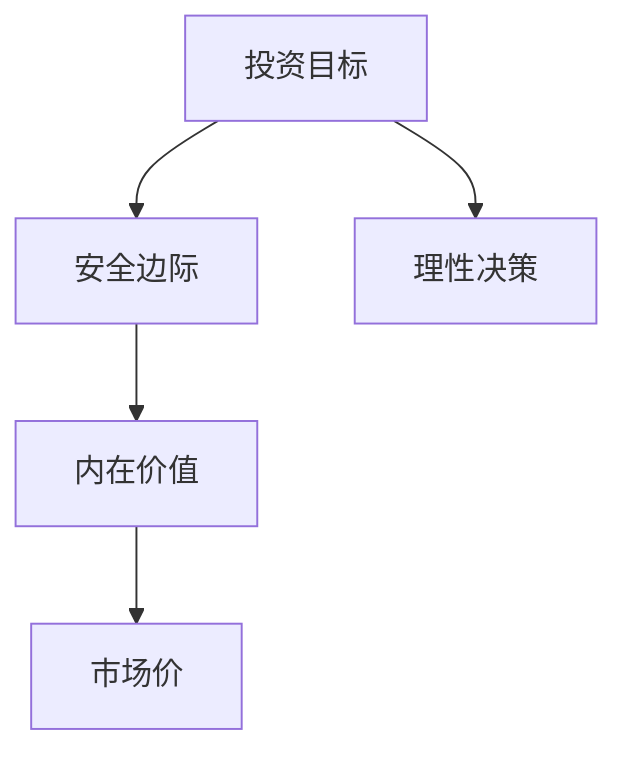
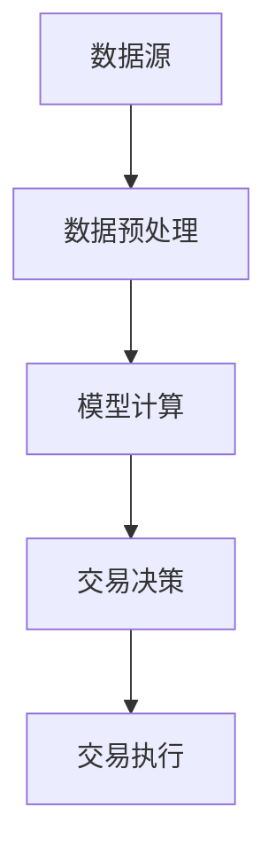
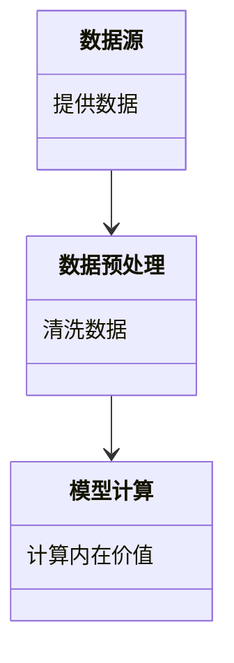

                 


# 格雷厄姆的股票选择公式及其现代应用

---

## 关键词：
- 格雷厄姆，股票选择公式，价值投资，安全边际，现代投资，量化分析，大数据，算法交易

---

## 摘要：
本文深入探讨了本杰明·格雷厄姆的股票选择公式及其在现代投资中的应用。从格雷厄姆的投资理念和选股标准入手，分析其公式的核心原理和数学模型，结合现代量化分析和大数据技术，探讨其在当今复杂金融市场中的应用价值。文章通过实际案例分析，展示了如何将格雷厄姆的经典理论与现代技术相结合，为投资者提供新的视角和工具。

---

## 第一部分: 格雷厄姆的股票选择公式基础

### 第1章: 格雷厄姆及其投资理念

#### 1.1 本杰明·格雷厄姆的简介
本杰明·格雷厄姆（Benjamin Graham）是20世纪最著名的投资理论家之一，被誉为“价值投资之父”。他于1894年出生于英国伦敦，后随家人移居美国。格雷厄姆在哥伦比亚大学学习期间，对金融和投资产生了浓厚兴趣。他在1926年出版的《新思想》（New Ideas）一书中首次提出了一些重要的投资理论。

**图1-1：格雷厄姆的价值投资理念框架**



#### 1.2 格雷厄姆的投资哲学
格雷厄姆的价值投资理念强调“安全边际”，即以低于内在价值的价格买入股票，以确保投资的安全性和 profitability。他认为，市场的波动性和非理性行为为投资者提供了以折扣价买入优质股票的机会。

#### 1.3 格雷厄姆的选股标准
格雷厄姆的选股标准主要包括以下几个方面：
1. **低市盈率（P/E）**：市盈率低于市场平均水平。
2. **低市净率（P/B）**：市净率低于市场平均水平。
3. **高股息率**：股息率较高，表明公司愿意将利润返还给股东。

---

### 第2章: 格雷厄姆的股票选择公式

#### 2.1 选股标准的数学模型
格雷厄姆的股票选择公式基于以下核心公式：

$$ \text{内在价值} = \frac{E}{P} + \frac{E}{P} \times \left(1 - \frac{D}{E}\right) $$

其中：
- \( E \) 表示公司股东权益。
- \( P \) 表示公司息税前利润（EBIT）。
- \( D \) 表示公司债务。

#### 2.2 公式中的变量与参数
- **息税前利润（EBIT）**：衡量公司盈利能力的核心指标。
- **股东权益（E）**：公司净资产的衡量标准。
- **债务（D）**：公司负债的总和。

#### 2.3 公式的适用场景与限制
格雷厄姆的选股公式主要适用于传统制造业和服务业公司，而不适合高科技公司和成长型企业。其主要限制在于对市场的假设过于简化。

---

### 第3章: 格雷厄姆选股公式的数学模型

#### 3.1 核心变量的属性对比
下表展示了格雷厄姆选股公式中核心变量的属性对比：

| 变量 | 属性 | 定义 | 单位 |
|------|------|------|------|
| E    | 股东权益 | 公司净资产 | 美元/人民币等 |
| P    | 息税前利润 | 公司税前利润 | 美元/人民币等 |
| D    | 债务 | 公司总负债 | 美元/人民币等 |

#### 3.2 现代量化分析中的应用
格雷厄姆公式在现代量化分析中的应用可以通过以下步骤实现：

1. 数据收集：收集目标公司的财务数据，包括EBIT、股东权益和债务。
2. 计算内在价值：使用格雷厄姆公式计算内在价值。
3. 对比市场价格：判断市场价格是否低于内在价值。

---

## 第二部分: 格雷厄姆选股公式的现代应用

### 第4章: 现代市场环境的变化

#### 4.1 现代市场的复杂性
现代金融市场高度复杂，涉及大量的衍生品和算法交易，传统的选股公式需要进行调整。

#### 4.2 格雷厄姆公式在现代的应用
格雷厄姆公式在现代投资中的应用主要体现在以下几个方面：
1. **量化投资策略**：将格雷厄姆公式融入量化模型中，筛选出符合条件的股票。
2. **大数据分析**：利用大数据技术，对海量数据进行分析，寻找符合格雷厄姆标准的公司。

#### 4.3 现代技术对选股的影响
现代技术的发展，尤其是大数据和人工智能的兴起，为格雷厄姆选股公式提供了新的工具和方法。

---

### 第5章: 现代量化分析中的格雷厄姆策略

#### 5.1 量化投资中的格雷厄姆策略
量化投资通过算法交易实现对格雷厄姆策略的自动化执行。以下是实现步骤：

1. **数据收集**：获取目标公司的财务数据。
2. **计算筛选条件**：根据格雷厄姆公式计算内在价值。
3. **交易执行**：当市场价格低于内在价值时，执行买入指令。

#### 5.2 系统架构设计
以下是量化系统的系统架构图：



---

### 第6章: 格雷厄姆公式与大数据分析

#### 6.1 大数据分析的应用
通过大数据分析，可以更高效地筛选出符合格雷厄姆选股标准的公司。以下是具体的实现步骤：

1. **数据收集**：从多个数据源获取公司数据。
2. **数据清洗**：去除无效数据，确保数据质量。
3. **特征提取**：提取关键财务指标，如EBIT、股东权益和债务。
4. **模型计算**：计算内在价值，筛选出符合条件的股票。

#### 6.2 系统接口设计
以下是系统接口设计的类图：



---

## 第三部分: 项目实战

### 第7章: 项目实战

#### 7.1 环境安装
- **工具安装**：安装Python、Pandas、NumPy等工具。
- **数据源**：获取历史财务数据。

#### 7.2 核心实现
以下是实现格雷厄姆选股公式的Python代码：

```python
import pandas as pd
import numpy as np

def calculate_intrinsic_value(e, p, d):
    return e/p + (e/p) * (1 - d/e)

# 数据加载
data = pd.read_csv('financial_data.csv')

# 计算内在价值
data['intrinsic_value'] = calculate_intrinsic_value(data['E'], data['P'], data['D'])

# 筛选股票
data['is_value'] = data['intrinsic_value'] < data['market_price']
```

#### 7.3 实际案例分析
以下是实际案例分析：

- **案例公司**：假设某公司财务数据如下：
  - E = 1000万
  - P = 200万
  - D = 500万
  - 市场价格 = 8元

- **计算内在价值**：
  $$ \text{intrinsic\_value} = \frac{1000}{200} + \frac{1000}{200} \times \left(1 - \frac{500}{1000}\right) = 5 + 5 \times 0.5 = 7.5 \text{元} $$

- **结论**：
  - 市场价格（8元） > 内在价值（7.5元），不建议买入。

---

## 第四部分: 总结与展望

### 第8章: 总结与展望

#### 8.1 核心观点总结
格雷厄姆的股票选择公式在现代投资中仍然具有重要的参考价值，尤其是在量化分析和大数据技术的支持下，其选股策略可以更加高效和精准。

#### 8.2 未来展望
未来，随着人工智能和大数据技术的进一步发展，格雷厄姆选股公式可能会被集成到更加复杂的量化模型中，为投资者提供更强大的工具和策略。

---

## 参考文献
1. 格雷厄姆，B. (1974). 《聪明的投资者》。
2. Fama, E. F. (1970). Efficient Capital Markets: A Review of Theory and Practice.
3. Sharpe, W. F. (1991). 投资组合理论。

---

**本文通过系统地分析格雷厄姆的股票选择公式，结合现代投资技术，为投资者提供了新的视角和工具。希望本文能为投资者在复杂多变的金融市场中提供有益的指导。**

