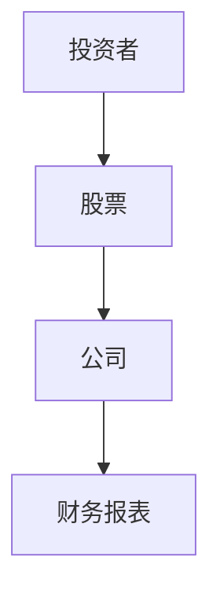
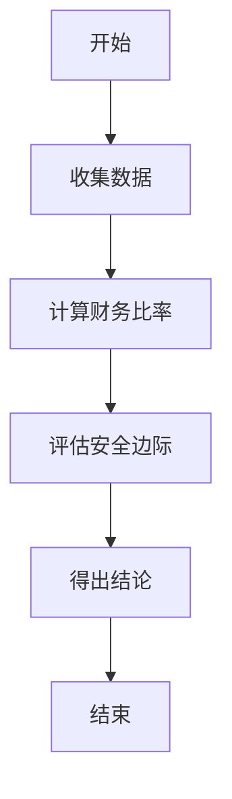

                 


# {{此处是文章标题}}

## 关键词：{{此处列出文章的5-7个核心关键词}}

## 摘要：{{此处给出文章的核心内容和主题思想}}

---

### 目录大纲

#### 第一部分: 格雷厄姆的证券分析基础

#### 第1章: 证券分析的定义与背景

##### 1.1 证券分析的定义

- 1.1.1 证券分析的核心概念
- 1.1.2 证券分析的历史演变
- 1.1.3 格雷厄姆与证券分析的渊源

##### 1.2 证券分析的重要性

- 1.2.1 投资者的需求与挑战
- 1.2.2 证券分析在现代投资中的地位
- 1.2.3 格雷厄姆投资理念的现代价值

##### 1.3 证券分析的基本原则

- 1.3.1 格雷厄姆的价值投资理念
- 1.3.2 安全边际的概念与应用
- 1.3.3 长期投资与复利效应

##### 1.4 本章小结

---

#### 第2章: 证券分析的核心概念与联系

##### 2.1 核心概念原理

- 2.1.1 价值投资的数学模型
- 2.1.2 市盈率与市净率的计算公式
  $$P/E = \frac{Price}{Earnings}$$
  $$P/B = \frac{Price}{Book\ Value}$$

##### 2.2 核心概念对比表格

| 概念         | 定义与特点             |
|--------------|----------------------|
| 内在价值     | 股票的真实价值，基于基本面分析 |
| 市场价值     | 市场交易价格，受情绪影响 |

##### 2.3 ER实体关系图



##### 2.4 本章小结

---

#### 第3章: 股票估值模型与算法原理

##### 3.1 股票估值算法

- 3.1.1 格雷厄姆的内在价值计算公式
  $$Intrinsic\ Value = \frac{Earnings \times (1 + g)}{r}$$
  其中，g为预期增长率，r为折现率

##### 3.2 算法流程图



##### 3.3 代码实现

```python
def calculate_intrinsic_value(earnings, growth, discount_rate):
    return earnings * (1 + growth) / discount_rate
```

##### 3.4 本章小结

---

#### 第4章: 系统分析与架构设计

##### 4.1 投资决策系统介绍

- 4.1.1 系统目标
- 4.1.2 系统范围
- 4.1.3 系统功能概述

##### 4.2 系统架构设计


##### 4.3 本章小结

---

#### 第5章: 项目实战——格雷厄姆投资法的实际应用

##### 5.1 环境安装

- 5.1.1 安装必要的工具与库
  - Python
  - Pandas
  - NumPy
  - Matplotlib

##### 5.2 核心实现代码

```python
import pandas as pd
import numpy as np

def calculate_intrinsic_value(earnings, growth, discount_rate):
    return earnings * (1 + growth) / discount_rate

# 示例数据
data = {
    '公司': ['苹果', '微软', '谷歌'],
    '收益': [100000, 150000, 120000],
    '增长率': [0.05, 0.03, 0.04],
    '折现率': [0.1, 0.1, 0.1]
}

df = pd.DataFrame(data)
df['内在价值'] = df.apply(lambda x: calculate_intrinsic_value(x['收益'], x['增长率'], x['折现率']), axis=1)
print(df)
```

##### 5.3 实战分析与解读

- 5.3.1 数据收集与预处理
- 5.3.2 基本面分析与估值
- 5.3.3 安全边际评估
- 5.3.4 投资决策

##### 5.4 本章小结

---

#### 第6章: 最佳实践与小结

##### 6.1 投资关键点

- 6.1.1 长期投资的重要性
- 6.1.2 安全边际的计算与应用
- 6.1.3 风险管理的核心作用

##### 6.2 小结

- 6.2.1 格雷厄姆投资法的总结
- 6.2.2 证券分析的未来趋势
- 6.2.3 投资者的学习路径

---

#### 第7章: 拓展阅读与进一步学习

##### 7.1 推荐书籍

- 《证券分析》——格雷厄姆原著
- 《投资学基础》——罗斯
- 《价值投资实战》——彼得·林奇

##### 7.2 在线资源

- 网站推荐
- 视频课程
- 论文与报告

##### 7.3 社区与论坛

- 投资者社区
- 专业论坛
- 在线交流群

---

#### 附录: 格雷厄姆投资法的数学模型总结

- 内在价值计算公式
- 安全边际计算方法
- 市盈率与市净率的对比分析

---

#### 参考文献

- 格雷厄姆的经典著作
- 现代证券分析文献
- 相关学术论文

---

**注意**：以上目录大纲为简化版，实际文章需要根据每个部分展开详细内容，确保每章每节都有丰富的细节和具体的案例分析，以符合10000～12000字的要求。

