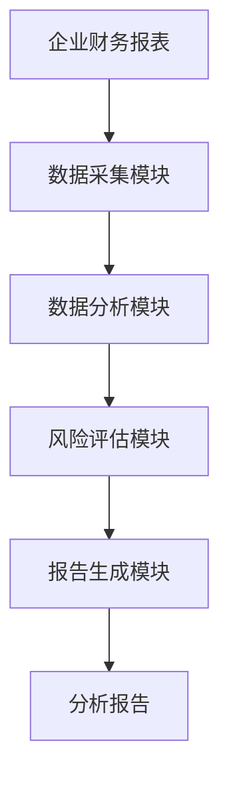

                 


# 格雷厄姆的财务报表分析：应对创新会计处理方法

---

## 关键词：  
格雷厄姆、财务报表分析、创新会计、价值投资、财务比率、风险管理  

---

## 摘要：  
本文深入探讨了格雷厄姆的财务报表分析方法，并结合当前会计处理方法的创新，分析了如何在复杂多变的会计环境下，利用格雷厄姆的核心理念进行有效的财务分析。文章从格雷厄姆的分析框架出发，详细讲解了财务比率分析、创新会计处理的识别与应对策略，并通过实际案例和系统架构设计，展示了如何将格雷厄姆的方法应用于现代财务分析中。通过本文，读者将能够掌握应对创新会计挑战的关键方法，提升财务分析的准确性和深度。

---

# 第1章: 财务报表分析概述  

## 1.1 财务报表分析的重要性  

### 1.1.1 财务报表分析的定义与作用  
财务报表分析是通过对企业的财务报表（资产负债表、利润表、现金流量表）进行研究，评估企业的财务状况、经营成果和现金流量的过程。它是企业决策者、投资者和债权人的重要工具，能够帮助他们了解企业的财务健康状况和未来发展前景。

### 1.1.2 格雷厄姆的分析方法  
本·格雷厄姆是价值投资的鼻祖，他提出了以基本面分析为核心的财务分析方法。格雷厄姆强调通过分析企业的财务报表，尤其是通过计算各种财务比率，来评估企业的内在价值。他的方法注重企业的盈利能力、成长能力和偿债能力，强调以低于内在价值的价格买入优质企业。

### 1.1.3 创新会计处理方法的挑战  
随着会计准则的不断更新和企业对财务优化的需求，创新会计处理方法层出不穷。这些方法可能通过复杂的会计调整或创新的会计技巧，影响财务报表的准确性。例如，某些企业可能会通过创新的金融工具或复杂的交易结构来调整财务报表，这增加了财务分析的难度。

---

## 1.2 财务报表分析的核心概念  

### 1.2.1 资产负债表分析  
资产负债表反映了企业在某一特定时点的资产、负债和所有者权益的状况。通过分析资产负债表，可以评估企业的偿债能力、资本结构和资产流动性。

#### 核心指标：  
- **流动比率（Current Ratio）**：流动资产与流动负债的比率，衡量企业的短期偿债能力。  
  $$ \text{流动比率} = \frac{\text{流动资产}}{\text{流动负债}} $$
- **速动比率（Quick Ratio）**：扣除存货后的流动资产与流动负债的比率，衡量企业更严格的短期偿债能力。  
  $$ \text{速动比率} = \frac{\text{流动资产} - \text{存货}}{\text{流动负债}} $$

### 1.2.2 利润表分析  
利润表反映了企业在一定会计期间内的收入和利润情况。通过分析利润表，可以评估企业的盈利能力、成本控制能力和收入增长能力。

#### 核心指标：  
- **净利率（Net Profit Margin）**：净利润与营业收入的比率，衡量企业的整体盈利能力。  
  $$ \text{净利率} = \frac{\text{净利润}}{\text{营业收入}} $$
- **毛利率（Gross Profit Margin）**：毛利与营业收入的比率，衡量企业的生产效率和成本控制能力。  
  $$ \text{毛利率} = \frac{\text{营业收入} - \text{营业成本}}{\text{营业收入}} $$

### 1.2.3 现金流量表分析  
现金流量表反映了企业在一定会计期间内的现金流入和流出情况。通过分析现金流量表，可以评估企业的现金流健康状况和运营能力。

#### 核心指标：  
- **经营活动现金流净额（Operating Cash Flow）**：企业日常经营活动产生的现金流净额，衡量企业的运营能力。  
- **自由现金流（Free Cash Flow）**：企业在扣除资本支出后的剩余现金流，衡量企业的财务灵活性。

---

# 第2章: 格雷厄姆的财务分析方法  

## 2.1 格雷厄姆的投资理念  

### 2.1.1 价值投资的定义  
价值投资是一种以低于企业内在价值的价格买入优质股票的投资策略。格雷厄姆强调，投资者应该关注企业的基本面，寻找那些被市场低估的企业。

### 2.1.2 格雷厄姆的选股标准  
格雷厄姆提出了一系列选股标准，包括：  
1. 企业必须有足够的净资产价值。  
2. 企业的市盈率必须低于某个合理水平。  
3. 企业的财务状况必须稳健，尤其是债务负担不能过重。  

### 2.1.3 格雷厄姆的财务分析框架  
格雷厄姆的财务分析框架主要包括以下步骤：  
1. 计算各项财务比率，评估企业的盈利能力、偿债能力和成长能力。  
2. 通过对比分析，找出那些财务比率表现优异的企业。  
3. 结合行业特点和市场环境，筛选出具有长期增长潜力的企业。  

---

## 2.2 格雷厄姆的财务比率分析  

### 2.2.1 偿债能力分析  
偿债能力分析是评估企业财务健康状况的重要部分。格雷厄姆特别关注企业的短期和长期偿债能力。

#### 核心指标：  
- **流动比率**：衡量企业的短期偿债能力。  
- **速动比率**：更严格的衡量短期偿债能力。  
- **债务总额与所有者权益的比率**：衡量企业的长期偿债能力。  
  $$ \text{债务总额与所有者权益的比率} = \frac{\text{总负债}}{\text{所有者权益}} $$

### 2.2.2 营运能力分析  
营运能力分析是评估企业资产周转效率的重要部分。格雷厄姆认为，资产周转效率高的企业具有更强的盈利能力。

#### 核心指标：  
- **存货周转率**：衡量存货的周转效率。  
  $$ \text{存货周转率} = \frac{\text{营业成本}}{\text{平均存货}} $$
- **应收账款周转率**：衡量应收账款的周转效率。  
  $$ \text{应收账款周转率} = \frac{\text{营业收入}}{\text{平均应收账款}} $$

### 2.2.3 盈利能力分析  
盈利能力分析是评估企业赚钱能力的重要部分。格雷厄姆特别关注企业的净利润率和ROE（净资产收益率）。

#### 核心指标：  
- **ROE（净资产收益率）**：衡量企业利用股东资产创造利润的能力。  
  $$ \text{ROE} = \frac{\text{净利润}}{\text{所有者权益}} $$
- **净利率**：衡量企业的整体盈利能力。  

---

# 第3章: 创新会计处理方法的现状  

## 3.1 创新会计处理方法的定义  

### 3.1.1 创新会计的背景与动机  
随着会计准则的不断完善和企业对财务优化的需求，创新会计处理方法应运而生。企业希望通过创新的会计技巧，提高财务报表的透明度和准确性，同时优化企业的财务状况。

### 3.1.2 创新会计的常见手段  
创新会计处理方法包括以下几种：  
1. 创新性地使用金融工具，如衍生品，来对冲风险或调整财务报表。  
2. 利用复杂的交易结构，如资产证券化，优化资产负债表。  
3. 通过创新的会计政策，如公允价值计量，提高财务报表的准确性。  

### 3.1.3 创新会计的法律与道德问题  
创新会计处理方法的使用必须符合相关法律法规和会计准则，同时也要遵循道德规范。某些企业可能会滥用创新会计手段，粉饰财务报表，这不仅违反了法律，也损害了投资者的利益。

---

## 3.2 创新会计处理方法对财务报表分析的影响  

### 3.2.1 创新会计对资产、负债和所有者权益的影响  
创新会计处理方法可能会影响企业的资产、负债和所有者权益。例如，某些企业可能会通过创新的金融工具来调整资产负债表中的负债项目，从而优化资本结构。

### 3.2.2 创新会计对收入和利润的影响  
创新会计处理方法可能会影响企业的收入和利润。例如，某些企业可能会通过创新的会计政策来调整收入确认的方式，从而影响利润表的准确性。

### 3.2.3 创新会计对现金流量的影响  
创新会计处理方法可能会影响企业的现金流量。例如，某些企业可能会通过创新的金融工具来优化现金流，从而提高企业的财务灵活性。

---

# 第4章: 格雷厄姆分析方法的创新  

## 4.1 创新会计处理方法的识别与应对  

### 4.1.1 创新会计识别的关键指标  
识别创新会计处理方法需要关注以下关键指标：  
1. 企业的财务比率是否异常，例如ROE突然大幅提高。  
2. 企业的财务结构是否复杂，例如资产负债表中存在大量的金融工具。  
3. 企业的财务透明度是否下降，例如信息披露不充分。  

### 4.1.2 创新会计应对的策略  
应对创新会计处理方法的策略包括：  
1. 加强对企业的基本面分析，关注企业的实际经营情况。  
2. 通过对比分析，识别财务报表中的异常变化。  
3. 结合行业特点，评估企业会计处理方法的合理性。  

### 4.1.3 格雷厄姆分析方法的改进  
为了应对创新会计处理方法的挑战，格雷厄姆分析方法需要不断改进。例如，可以引入更多的财务指标，或者加强对企业实际经营情况的调研。

---

## 4.2 格雷厄姆分析方法的实际应用  

### 4.2.1 企业案例分析  
通过分析某企业的财务报表，展示格雷厄姆分析方法在应对创新会计处理方法中的应用。例如，某企业通过创新的金融工具调整了资产负债表中的负债项目，但通过分析ROE和净利率的变化，可以识别出这一调整对企业财务状况的影响。

### 4.2.2 格雷厄姆分析方法的应用步骤  
1. 收集企业的财务报表数据。  
2. 计算各项财务比率，评估企业的盈利能力、偿债能力和成长能力。  
3. 识别财务报表中的异常变化，分析其背后的原因。  
4. 结合行业特点和企业实际情况，评估企业的内在价值。  

---

## 4.3 格雷厄姆分析方法的系统架构  

### 4.3.1 系统功能模块划分  
格雷厄姆分析系统的功能模块包括：  
1. 数据采集模块：采集企业的财务报表数据。  
2. 数据分析模块：计算各项财务比率，进行对比分析。  
3. 风险评估模块：识别财务报表中的异常变化，评估企业的财务风险。  
4. 报告生成模块：生成分析报告，提出投资建议。  

### 4.3.2 系统数据流图  
以下是格雷厄姆分析系统的数据流图：  


---

## 4.4 格雷厄姆分析方法的项目实战  

### 4.4.1 项目环境安装  
为了进行格雷厄姆分析，需要安装以下工具：  
1. Python编程语言。  
2. 数据分析库，如Pandas、NumPy。  
3. 可视化工具，如Matplotlib。  

### 4.4.2 核心功能实现  
以下是格雷厄姆分析方法的核心功能实现代码：  

```python
import pandas as pd
import numpy as np
import matplotlib.pyplot as plt

# 数据加载
df = pd.read_csv('financial_data.csv')

# 计算财务比率
def calculate_ratios(df):
    ratios = {}
    ratios['ROE'] = df['净利润'] / df['所有者权益']
    ratios['净利率'] = df['净利润'] / df['营业收入']
    ratios['流动比率'] = df['流动资产'] / df['流动负债']
    ratios['速动比率'] = (df['流动资产'] - df['存货']) / df['流动负债']
    return ratios

# 可视化
def visualize_ratios(ratios):
    plt.figure(figsize=(10,6))
    plt.plot(ratios['ROE'], label='ROE')
    plt.plot(ratios['净利率'], label='净利率')
    plt.xlabel('年份')
    plt.ylabel('比率')
    plt.title('财务比率变化趋势')
    plt.legend()
    plt.show()

# 主程序
def main():
    ratios = calculate_ratios(df)
    visualize_ratios(ratios)

if __name__ == "__main__":
    main()
```

### 4.4.3 案例分析与解读  
通过分析某企业的财务数据，展示格雷厄姆分析方法的应用过程和结果。例如，通过计算ROE和净利率的变化，识别出企业的盈利能力是否受到创新会计处理方法的影响。

---

## 4.5 格雷厄姆分析方法的总结与展望  

### 4.5.1 总结  
格雷厄姆的财务分析方法虽然经典，但在面对创新会计处理方法的挑战时，仍需不断改进和创新。通过引入更多的财务指标和加强对企业实际经营情况的调研，可以提高分析的准确性和深度。

### 4.5.2 展望  
未来，随着会计处理方法的不断创新，格雷厄姆分析方法需要进一步结合现代技术和数据分析方法，例如人工智能和大数据分析，以应对更加复杂和多样化的会计处理手段。

---

通过本文的分析，读者可以掌握格雷厄姆分析方法的核心思想，并了解如何在创新会计处理方法的背景下，应对财务分析的挑战。希望本文能为投资者和财务分析师提供有价值的参考和启示。

