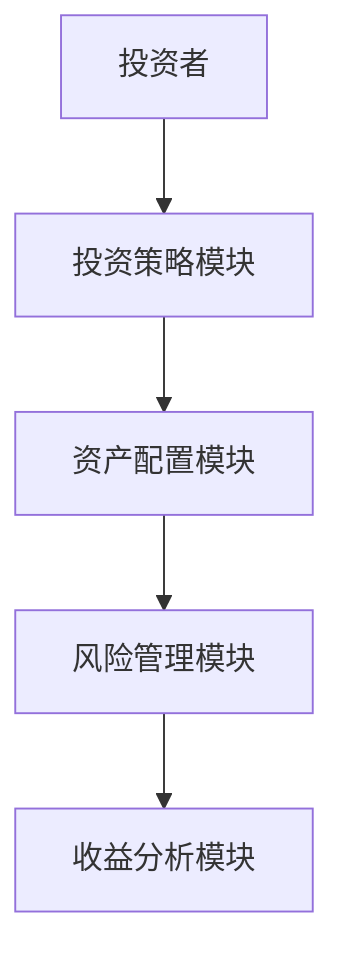
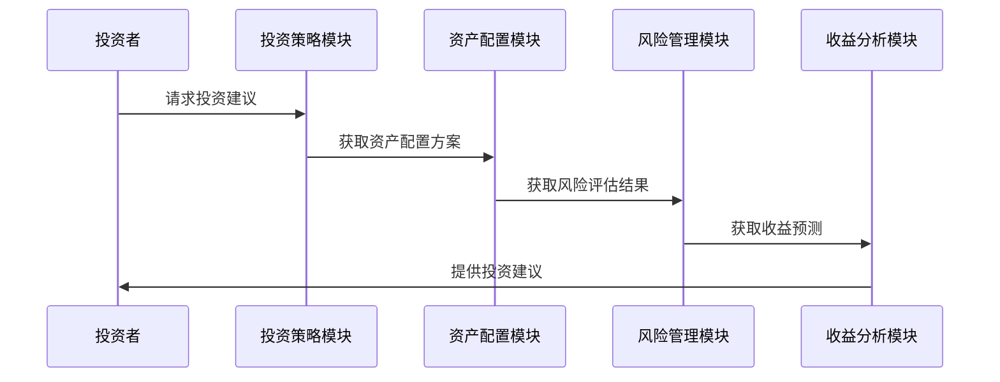

                 


# 格雷厄姆的防御型与进取型投资者区分

> 关键词：防御型投资，进取型投资，格雷厄姆，投资策略，风险管理

> 摘要：本文详细探讨了格雷厄姆提出的防御型与进取型投资者的区分及其投资理念。通过分析两种投资策略的核心原则、实践方法以及优缺点，帮助投资者根据自身风险偏好和市场环境选择合适的投资策略。文章还结合数学模型和系统架构设计，展示了如何将这些理论应用于实际投资决策。

---

# 第一部分: 投资学基础与格雷厄姆的投资理念

## 第1章: 投资学的基本概念与格雷厄姆的贡献

### 1.1 投资学的基本概念

#### 1.1.1 什么是投资

投资是指将资金投入到能够产生收益的资产或项目中，以实现财富增值的过程。投资的核心在于资产的选择和风险管理。

#### 1.1.2 投资的基本原则

投资的基本原则包括：

1. **分散化**：通过投资不同类型的资产降低风险。
2. **长期视角**：关注资产的长期表现，而非短期波动。
3. **价值评估**：基于资产的内在价值进行投资决策。
4. **风险管理**：识别和控制投资中的潜在风险。

#### 1.1.3 格雷厄姆在投资学中的地位

本杰明·格雷厄姆是价值投资的奠基人，他的投资理念对现代投资理论产生了深远影响。格雷厄姆强调安全边际和防御性投资，倡导以合理价格买入具有内在价值的资产。

### 1.2 防御型与进取型投资的基本区别

#### 1.2.1 防御型投资的定义与特点

防御型投资是一种以风险厌恶为核心的投资策略，注重资产的安全性和稳定性，适合风险承受能力较低的投资者。其特点包括：

1. **低风险**：优先选择风险较低的资产，如债券、蓝筹股等。
2. **长期稳定**：注重资产的长期稳定性，追求稳定的收益。
3. **安全边际**：买入价格低于内在价值的资产，以降低风险。

#### 1.2.2 进取型投资的定义与特点

进取型投资是一种以高风险高回报为核心的投资策略，注重资产的高增长潜力，适合风险承受能力较高的投资者。其特点包括：

1. **高风险**：愿意承担更高的风险以追求更高的收益。
2. **短期波动**：关注市场的短期波动，抓住投资机会。
3. **高增长潜力**：投资于具有高增长潜力的资产，如新兴行业、成长股等。

#### 1.2.3 两种投资策略的对比分析

通过对比分析防御型和进取型投资策略，可以帮助投资者根据自身需求选择合适的投资方式。

| 对比维度 | 防御型投资 | 进取型投资 |
|----------|------------|------------|
| 风险偏好 | 低风险厌恶 | 高风险偏好 |
| 收益目标 | 稳定收益   | 高收益目标 |
| 投资期限 | 长期稳定   | 短期波动   |
| 适用场景 | 稳定性需求 | 增长性需求 |

---

## 第2章: 防御型投资者的核心理念

### 2.1 防御型投资的基本原则

#### 2.1.1 风险厌恶与安全边际

防御型投资者注重安全边际，即买入价格低于资产内在价值，以降低投资风险。安全边际是格雷厄姆投资理论的核心概念之一。

#### 2.1.2 投资组合的分散化

通过分散投资不同类型的资产，降低单一资产的风险。例如，投资股票、债券、房地产等多种资产以分散风险。

#### 2.1.3 价值投资的真谛

防御型投资者注重资产的内在价值，而非市场情绪。通过分析资产的财务数据和行业前景，选择具有稳定收益的资产。

### 2.2 防御型投资的实践策略

#### 2.2.1 如何选择防御型投资标的

防御型投资者应选择具有稳定现金流、低波动性和高分红率的资产。例如，投资于公用事业、消费必需品等行业。

#### 2.2.2 防御型投资的风险管理

通过设定止损点和分散投资策略，降低投资风险。例如，当资产价格跌破内在价值时，及时止损。

#### 2.2.3 防御型投资的长期收益分析

防御型投资注重长期稳定的收益，适合追求资产保值的投资者。通过长期持有优质资产，实现财富的稳步增长。

---

## 第3章: 进取型投资者的核心理念

### 3.1 进取型投资的基本原则

#### 3.1.1 高风险高回报的平衡

进取型投资者愿意承担更高的风险以追求更高的收益。例如，投资于高增长行业和新兴市场。

#### 3.1.2 进取型投资的市场敏感性

进取型投资者高度关注市场波动和投资机会，善于利用市场的短期波动获取收益。例如，通过技术分析捕捉短期趋势。

#### 3.1.3 进取型投资的心理特征

进取型投资者具有较高的风险承受能力和冒险精神，能够在不确定的市场环境中保持冷静和果断。

### 3.2 进取型投资的实践策略

#### 3.2.1 如何选择进取型投资标的

进取型投资者应选择具有高增长潜力的资产，例如科技股、创业公司等。通过分析公司的成长性和行业前景，选择具有竞争优势的资产。

#### 3.2.2 进取型投资的市场参与度

进取型投资者积极参与市场交易，通过频繁买卖资产捕捉短期收益。例如，利用杠杆工具放大投资收益。

#### 3.2.3 进取型投资的风险管理

尽管进取型投资者承担更高的风险，但仍然需要通过严格的风险管理控制潜在损失。例如，设定止损点和风险敞口限制。

---

## 第4章: 防御型与进取型投资的优缺点比较

### 4.1 防御型投资的优缺点

#### 优点：
- 风险较低，适合风险厌恶型投资者。
- 收益稳定，适合长期投资。

#### 缺点：
- 收益有限，难以在高增长市场中获取超额收益。
- 投资选择较少，主要集中在低波动性资产。

### 4.2 进取型投资的优缺点

#### 优点：
- 收益潜力大，适合高增长市场。
- 投资选择多样，涵盖高增长行业和新兴市场。

#### 缺点：
- 风险较高，容易遭受重大损失。
- 对市场波动敏感，需要较高的市场敏感性和决策能力。

---

## 第5章: 数学模型与投资策略分析

### 5.1 防御型与进取型投资的风险收益模型

通过数学模型分析防御型和进取型投资的风险收益特征，帮助投资者更好地理解不同策略的表现。

#### 5.1.1 风险收益模型

风险收益模型可以通过资产的预期收益和标准差来衡量其风险收益特征。标准差越小，风险越低；标准差越大，风险越高。

#### 5.1.2 资产配置模型

通过资产配置模型，投资者可以根据自身的风险偏好选择合适比例的防御型和进取型资产。例如，防御型投资者可以选择60%的债券和40%的股票，而进取型投资者可以选择30%的债券和70%的股票。

---

## 第6章: 系统分析与架构设计方案

### 6.1 投资决策支持系统的功能设计

#### 6.1.1 系统目标

开发一个投资决策支持系统，帮助投资者根据防御型和进取型策略选择合适的投资组合。

#### 6.1.2 领域模型设计

通过领域模型类图展示系统的核心实体及其关系。


#### 6.1.3 系统架构设计

通过系统架构图展示系统的模块划分和功能分布。



#### 6.1.4 系统接口设计

通过接口设计展示系统各模块之间的数据交互。



---

## 第7章: 项目实战与投资策略应用

### 7.1 环境安装与配置

#### 7.1.1 安装Python环境

```bash
python --version
pip install numpy pandas matplotlib
```

#### 7.1.2 安装投资分析库

```bash
pip install pandas_datareader yfinance
```

### 7.2 核心代码实现

#### 7.2.1 防御型投资策略实现

```python
import pandas as pd
import numpy as np

# 防御型投资组合
def defensive_portfolio(assets, weights):
    portfolio = pd.DataFrame(columns=['资产', '权重'])
    for i in range(len(assets)):
        portfolio.loc[i] = [assets[i], weights[i]]
    return portfolio

# 示例：投资组合配置
assets = ['债券', '蓝筹股', '房地产']
weights = [0.6, 0.3, 0.1]
portfolio = defensive_portfolio(assets, weights)
print(portfolio)
```

#### 7.2.2 进取型投资策略实现

```python
import pandas as pd
import numpy as np

# 进取型投资组合
def aggressive_portfolio(assets, weights):
    portfolio = pd.DataFrame(columns=['资产', '权重'])
    for i in range(len(assets)):
        portfolio.loc[i] = [assets[i], weights[i]]
    return portfolio

# 示例：投资组合配置
assets = ['科技股', '创业公司', '新兴市场']
weights = [0.7, 0.2, 0.1]
portfolio = aggressive_portfolio(assets, weights)
print(portfolio)
```

### 7.3 案例分析与策略解读

#### 7.3.1 防御型投资案例分析

假设投资者选择60%的债券、30%的蓝筹股和10%的房地产作为防御型投资组合。通过历史数据模拟，该组合在经济衰退时期的波动较小，收益稳定。

#### 7.3.2 进取型投资案例分析

假设投资者选择70%的科技股、20%的创业公司和10%的新兴市场作为进取型投资组合。通过历史数据模拟，该组合在科技牛市中的收益较高，但波动性也较大。

---

## 第8章: 项目小结与投资策略优化

### 8.1 项目小结

通过项目实战，我们验证了防御型和进取型投资策略在实际中的应用效果。防御型策略适合风险厌恶型投资者，而进取型策略适合风险承受能力强的投资者。

### 8.2 投资策略优化

结合市场环境和个人风险偏好，动态调整投资组合中的防御型和进取型资产比例。例如，在市场低迷时期增加防御型资产，而在市场繁荣时期增加进取型资产。

### 8.3 最佳实践 Tips

- **定期复盘**：定期评估投资组合的表现，根据市场变化调整策略。
- **分散投资**：避免过度集中于某一种资产，降低风险。
- **长期视角**：坚持长期投资，避免被短期波动干扰。

---

## 第9章: 总结与展望

### 9.1 总结

格雷厄姆提出的防御型与进取型投资者区分是一种经典的投资理念，至今仍具有重要的现实意义。通过本文的分析和实战，我们了解了两种投资策略的核心原则和实践方法，帮助投资者根据自身需求选择合适的投资策略。

### 9.2 展望

随着市场环境的变化和投资理论的发展，防御型与进取型投资策略也在不断优化和创新。未来，我们可以进一步研究如何将人工智能和大数据分析应用于投资决策，提升投资策略的科学性和效率性。

--- 

以上是文章的完整目录大纲和内容概要，您可以根据需要进一步扩展每个部分的内容。

