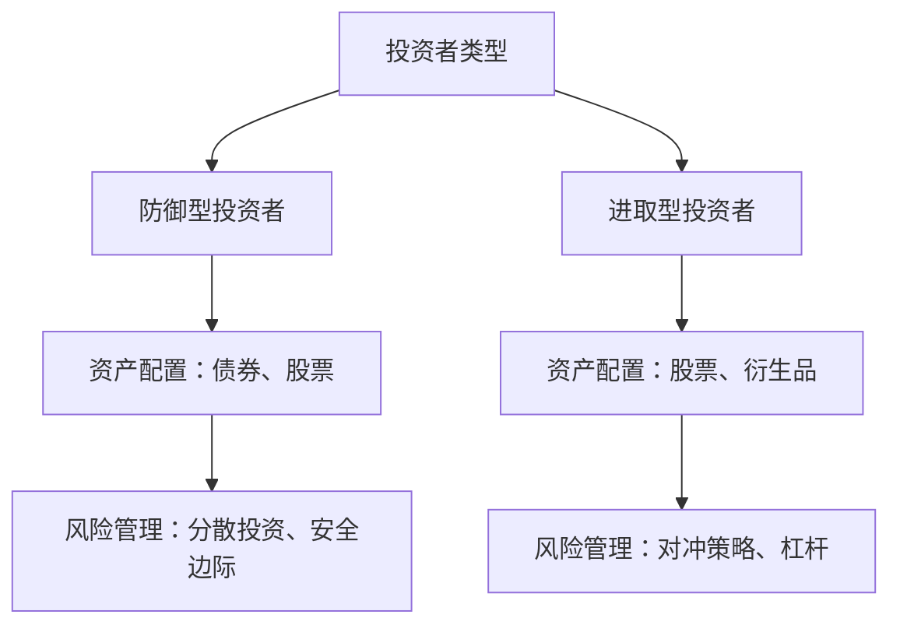

                 


# 格雷厄姆的防御型和进取型投资者区别

## 关键词：
- 格雷厄姆
- 防御型投资者
- 进取型投资者
- 投资策略
- 资产配置
- 风险管理

## 摘要：
本文详细探讨了格雷厄姆提出的防御型和进取型投资者之间的区别，分析了两者的投资目标、风险承受能力、资产配置策略及适用场景。通过对比，读者可以更好地理解不同类型投资者的特点，从而做出适合自身风险偏好的投资决策。

---

## 第1章：投资者的类型与投资策略背景

### 1.1 投资者的类型概述

#### 1.1.1 投资者的定义与分类
- 投资者是指通过购买资产以获取未来收益的个人或机构。
- 格雷厄姆将投资者分为两类：防御型和进取型。

#### 1.1.2 格雷厄姆的投资理念与背景
- 格雷厄姆是价值投资的鼻祖，强调安全边际和长期稳健的投资策略。
- 他在《证券分析》中首次提出防御型和进取型投资者的概念。

#### 1.1.3 防御型与进取型投资者的定义
- 防御型投资者：注重本金安全，追求稳定收益，风险厌恶型。
- 进取型投资者：追求高收益，愿意承担较高风险，具有较高的风险承受能力。

---

### 1.2 防御型与进取型投资者的核心区别

#### 1.2.1 投资目标与风险承受能力的对比
- 防御型投资者：追求稳定收益，本金安全优先。
- 进取型投资者：追求高回报，愿意承担更多风险。

#### 1.2.2 投资时间 horizon 的差异
- 防御型投资者：通常为中长期投资，注重稳健增长。
- 进取型投资者：可能更关注短期机会，投资时间 horizon 较短。

#### 1.2.3 投资策略与资产配置的区别
- 防御型投资者：注重资产分散，债券和蓝筹股为主。
- 进取型投资者：可能更多投资于成长股、风险资产。

---

## 第2章：防御型投资者的核心策略

### 2.1 防御型投资者的特征与目标

#### 2.1.1 风险厌恶型投资者的定义
- 防御型投资者对本金损失有强烈的规避心理，注重资产的安全性。

#### 2.1.2 防御型投资者的三大核心目标
1. 本金安全：避免重大损失。
2. 稳定收益：追求每年稳定的回报。
3. 风险可控：通过分散投资降低风险。

#### 2.1.3 防御型投资者的典型特征
- 低风险承受能力。
- 长期稳健的投资目标。
- 保守的资产配置策略。

---

### 2.2 防御型投资者的资产配置策略

#### 2.2.1 资产配置的基本原则
- 分散投资：避免过度集中于高风险资产。
- 优质资产：选择信誉良好的债券、蓝筹股和黄金等。

#### 2.2.2 格雷厄姆的"安全边际"概念
- 安全边际 = 实际价值 - 市场价格。
- 通过购买低于内在价值的股票来降低风险。

#### 2.2.3 防御型投资者的债券与股票配置比例
- 债券：50%以上。
- 股票：不超过50%，且选择具有安全边际的股票。

---

### 2.3 防御型投资者的风险管理策略

#### 2.3.1 风险评估的基本方法
- 资产比例分析：评估债券、股票等资产的比例是否合理。
- 市场风险评估：关注市场波动对资产的影响。

#### 2.3.2 风险分散策略
- 多元化投资：分散在不同资产类别和行业中。
- 定期再平衡：定期调整资产配置以保持风险可控。

#### 2.3.3 保险与应急储备的管理
- 购买适当的保险（如重疾险、人寿险）。
- 保持6-12个月的紧急储备金。

---

## 第3章：进取型投资者的核心策略

### 3.1 进取型投资者的特征与目标

#### 3.1.1 进取型投资者的定义
- 进取型投资者愿意承担更高的风险以追求更高的回报。

#### 3.1.2 高风险高回报的投资目标
- 追求资本增值，愿意承担波动性风险。

#### 3.1.3 进取型投资者的典型特征
- 高风险承受能力。
- 短期或中期高回报目标。
- 积极主动的投资策略。

---

### 3.2 进取型投资者的资产配置策略

#### 3.2.1 进取型投资者的股票与债券配置比例
- 股票：60%-80%。
- 债券：10%-30%。
- 其他资产：如期权、期货等。

#### 3.2.2 高风险资产的投资策略
- 成长股：投资于高增长潜力的公司。
- 创业投资：参与初创企业的融资。
- 期权与期货：利用衍生品放大收益或对冲风险。

#### 3.2.3 时机选择与市场预测的重要性
- 关注市场周期，寻找最佳入场时机。
- 利用技术分析和基本面分析做出投资决策。

---

### 3.3 进取型投资者的风险管理策略

#### 3.3.1 风险承受能力评估
- 确定自身能承受的最大损失比例。
- 定期评估市场环境和自身风险偏好。

#### 3.3.2 风险对冲策略的应用
- 使用衍生品（如期权）对冲市场风险。
- 分散投资于不同行业和市场。

#### 3.3.3 进取型投资者的杠杆使用原则
- 适度使用杠杆以放大收益。
- 严格控制杠杆比例，避免过度杠杆化。

---

## 第4章：防御型与进取型投资者的比较分析

### 4.1 投资目标与风险承受能力的对比

| **维度**         | **防御型投资者**               | **进取型投资者**               |
|------------------|-------------------------------|-------------------------------|
| 投资目标         | 稳定收益，本金安全             | 高回报，资本增值             |
| 风险承受能力     | 低风险承受，厌恶风险           | 高风险承受，愿意承担风险     |
| 投资时间 horizon | 中长期，注重稳健增长           | 短期或中期，关注市场机会     |

---

### 4.2 投资策略与资产配置的对比

| **策略维度**       | **防御型投资者**               | **进取型投资者**               |
|--------------------|-------------------------------|-------------------------------|
| 资产配置           | 债券为主，少量股票             | 股票为主，少量债券             |
| 投资工具           | 低风险资产（债券、蓝筹股）     | 高风险资产（成长股、衍生品） |
| 投资策略           | 安全边际、分散投资             | 时机选择、杠杆使用             |

---

### 4.3 风险管理与收益预期的对比

| **风险管理维度**     | **防御型投资者**               | **进取型投资者**               |
|---------------------|-------------------------------|-------------------------------|
| 风险管理工具         | 保险、应急储备、分散投资       | 衍生品、对冲策略、杠杆         |
| 预期收益             | 稳定但不高                    | 高回报，但波动大              |

---

## 第5章：防御型与进取型投资者的适用场景

### 5.1 防御型投资者的适用场景

#### 5.1.1 稳定现金流的需求场景
- 如退休人士或需要稳定收入的个人。

#### 5.1.2 低风险偏好者的适用场景
- 对风险极度厌恶，追求本金安全的人群。

#### 5.1.3 中长期稳健投资的适用场景
- 对未来资金需求明确，且希望稳步增长的投资者。

---

### 5.2 进取型投资者的适用场景

#### 5.2.1 高风险高回报需求的场景
- 追求资本快速增值的年轻人或企业家。

#### 5.2.2 市场牛市环境下的适用场景
- 市场上涨时，进取型投资者能够抓住机会获取更高收益。

#### 5.2.3 创业或高风险项目投资的适用场景
- 参与初创企业或新兴行业投资，寻求高回报机会。

---

## 第6章：防御型与进取型投资者的数学模型与公式

### 6.1 防御型投资者的资产配置模型

假设防御型投资者的资产配置为：
- 债券：B
- 股票：S
- 黄金：G

则：
$$ B + S + G = 1 $$

其中，$$ B \geq 0.5, S \leq 0.5 $$

### 6.2 进取型投资者的资产配置模型

假设进取型投资者的资产配置为：
- 股票：S
- 衍生品：D
- 现金：C

则：
$$ S + D + C = 1 $$

其中，$$ S \geq 0.6, D \geq 0.1 $$

---

## 第7章：防御型与进取型投资者的系统架构图



---

## 第8章：项目实战与代码实现

### 8.1 环境安装
- Python 3.8+
- Pandas、NumPy、Matplotlib库

### 8.2 核心实现代码

```python
import pandas as pd
import numpy as np

# 防御型投资者资产配置示例
defensive_portfolio = {
    '债券': 0.5,
    '股票': 0.25,
    '黄金': 0.25
}

# 进取型投资者资产配置示例
aggressive_portfolio = {
    '股票': 0.7,
    '衍生品': 0.2,
    '现金': 0.1
}

# 计算预期收益
def calculate_expected_return(portfolio):
    returns = {
        '债券': 0.05,
        '股票': 0.10,
        '黄金': 0.03,
        '衍生品': 0.20,
        '现金': 0.01
    }
    total_return = 0
    for asset in portfolio:
        total_return += portfolio[asset] * returns.get(asset, 0)
    return total_return

# 示例计算
print("防御型投资者预期收益:", calculate_expected_return(defensive_portfolio))
print("进取型投资者预期收益:", calculate_expected_return(aggressive_portfolio))
```

---

## 第9章：案例分析与总结

### 9.1 案例分析

#### 防御型投资者案例
- 投资者A，50岁，已退休，希望每年获得稳定的收入。
- 选择投资债券（60%）、蓝筹股（30%）、黄金（10%）。
- 预期年收益：债券5%，股票6%，黄金3%。
- 总体预期收益：$$ 0.6*0.05 + 0.3*0.06 + 0.1*0.03 = 0.057 \text{或} 5.7\% $$

#### 进取型投资者案例
- 投资者B，35岁，追求资本增值。
- 选择投资成长股（70%）、期权（20%）、少量现金（10%）。
- 预期年收益：股票15%，期权20%，现金2%。
- 总体预期收益：$$ 0.7*0.15 + 0.2*0.20 + 0.1*0.02 = 0.145 \text{或} 14.5\% $$

---

### 9.2 总结

- 防御型投资者适合注重本金安全、追求稳定收益的人群。
- 进取型投资者适合愿意承担高风险，追求高回报的人群。
- 投资者应根据自身风险偏好、财务状况和投资目标选择合适策略。
- 在实际投资中，可结合两种策略，根据市场环境动态调整资产配置。

---

## 第10章：最佳实践与注意事项

### 10.1 最佳实践 tips
1. 定期评估和调整投资组合，以适应市场变化。
2. 避免过度集中投资，保持资产分散。
3. 根据自身风险承受能力选择合适的投资策略。

### 10.2 注意事项
- 防御型投资者应警惕通货膨胀对债券收益率的影响。
- 进取型投资者需注意市场波动对投资组合的影响。
- 无论哪种策略，都应保持长期投资视角，避免短期波动干扰。

---

## 第11章：拓展阅读

- 格雷厄姆的《证券分析》和《聪明的投资者》。
- 现代投资组合理论（MPT）的相关书籍。
- 关于资产配置和风险管理的经典著作。

---

通过本文的详细分析，读者可以更好地理解防御型和进取型投资者的区别，并根据自身情况选择合适的投资策略。无论是稳健投资还是追求高回报，合理配置资产、有效管理风险是实现投资目标的关键。

