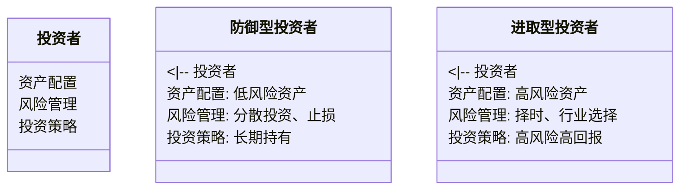
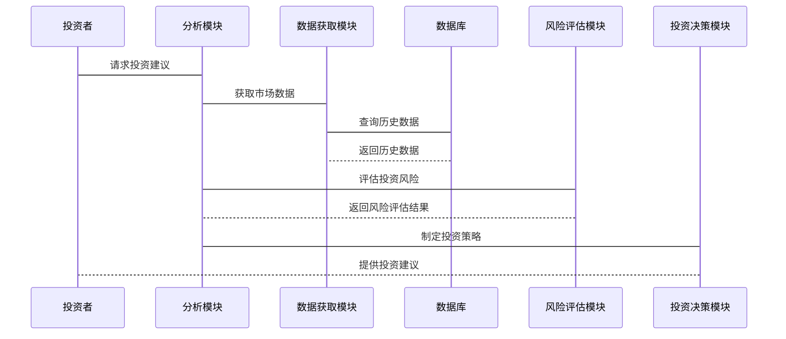

                 


# 格雷厄姆的防御型和进取型投资者：知己知彼

> 关键词：格雷厄姆、防御型投资者、进取型投资者、投资策略、数学模型

> 摘要：本文将深入探讨格雷厄姆的防御型和进取型投资者理念，分析两者的区别与联系，结合数学模型和实际案例，帮助读者理解如何在投资中知己知彼，制定有效的投资策略。

---

# 第1章 格雷厄姆的投资理念与防御型/进取型投资者概述

## 1.1 格雷厄姆的生平与投资思想

### 1.1.1 格雷厄姆的生平简介

本章节将介绍格雷厄姆的生平，包括他的教育背景、职业经历以及他对投资理论的贡献。

### 1.1.2 格雷厄姆投资思想的核心理念

格雷厄姆的投资理念以价值投资为核心，强调安全边际和长期稳定的投资回报。

### 1.1.3 格雷厄姆与价值投资的渊源

详细探讨格雷厄姆如何将价值投资理念系统化，并对后来的投资理论产生深远影响。

## 1.2 防御型与进取型投资者的定义

### 1.2.1 防御型投资者的定义与特征

防御型投资者注重本金的安全性和稳定的收益，适合风险承受能力较低的投资者。

### 1.2.2 进取型投资者的定义与特征

进取型投资者追求高回报，愿意承担较高的风险，适合有较强风险承受能力和投资经验的投资者。

### 1.2.3 防御型与进取型投资者的区别与联系

通过对比分析，明确两种投资者在目标、策略和风险承受能力上的差异。

---

# 第2章 防御型与进取型投资者的核心策略

## 2.1 防御型投资者的核心策略

### 2.1.1 防御型投资者的资产配置策略

防御型投资者通常选择低风险资产，如债券、蓝筹股等，注重资产的稳定性。

### 2.1.2 防御型投资者的风险控制策略

通过分散投资、设置止损等方法，降低投资风险。

### 2.1.3 防御型投资者的长期投资策略

注重长期持有优质资产，避免频繁交易，追求稳定的复利收益。

## 2.2 进取型投资者的核心策略

### 2.2.1 高风险高回报策略

进取型投资者愿意承担更高的风险，以追求更高的回报，通常投资于成长股或新兴行业。

### 2.2.2 市场择时策略

通过分析市场趋势，选择合适的时机进行投资，以获取超额收益。

### 2.2.3 行业选择策略

注重选择高增长行业的股票，关注行业前景和公司基本面。

## 2.3 防御型与进取型投资者的策略对比

### 2.3.1 投资目标的差异

防御型投资者注重安全和稳定，进取型投资者追求高回报。

### 2.3.2 投资期限的差异

防御型投资者通常投资期限较长，进取型投资者可能更注重短期收益。

### 2.3.3 风险承受能力的差异

防御型投资者风险承受能力较低，进取型投资者风险承受能力较高。

---

# 第3章 格雷厄姆防御型投资者的数学模型与公式

## 3.1 格雷厄姆防御型投资者的数学模型

### 3.1.1 内在价值公式

$$内在价值 = \frac{股息}{贴现率}$$

通过公式推导和实例分析，解释如何计算股票的内在价值。

### 3.1.2 安全边际公式

$$安全边际 = 市场价格 - 内在价值$$

解释安全边际的重要性，以及如何利用它来选择被低估的股票。

## 3.2 格雷厄姆防御型投资者的策略分析

### 3.2.1 市盈率分析

通过市盈率分析，选择低市盈率的股票，降低投资风险。

### 3.2.2 市净率分析

市净率低于行业平均水平的股票通常具有较高的安全边际。

### 3.2.3 股息率分析

选择股息率高且稳定的股票，确保稳定的现金流。

---

# 第4章 系统分析与架构设计方案

## 4.1 问题场景介绍

### 4.1.1 投资者面临的市场不确定性

### 4.1.2 防御型与进取型投资者的决策困境

## 4.2 系统功能设计

### 4.2.1 领域模型（Mermaid类图）



### 4.3 系统架构设计（Mermaid架构图）

```mermaid
archiecture {
    title 投资者系统架构

    投资者 --> 分析模块
    分析模块 --> 数据获取模块
    数据获取模块 --> 数据库
    分析模块 --> 风险评估模块
    风险评估模块 --> 投资决策模块
    投资决策模块 --> 投资组合模块
}
```

### 4.4 系统接口设计

### 4.5 系统交互（Mermaid序列图）



---

# 第5章 项目实战：格雷厄姆防御型投资者的策略实现

## 5.1 环境安装

### 5.1.1 安装Python环境

```bash
python --version
pip install numpy pandas matplotlib
```

### 5.1.2 安装数据获取工具

```bash
pip install yfinance
```

## 5.2 核心实现源代码

### 5.2.1 计算内在价值的Python代码

```python
import pandas as pd
import numpy as np

def calculate_intrinsic_value(dividend, discount_rate):
    return dividend / discount_rate

# 示例数据
dividend = 1.5  # 每股股息
discount_rate = 0.05  # 贴现率

intrinsic_value = calculate_intrinsic_value(dividend, discount_rate)
print(f"内在价值: {intrinsic_value}")
```

### 5.2.2 计算安全边际的Python代码

```python
import yfinance as yf

def calculate_margin_of_safety(stock_price, intrinsic_value):
    return stock_price - intrinsic_value

# 示例数据
stock_price = 50  # 股票价格
intrinsic_value = 40  # 内在价值

margin_of_safety = calculate_margin_of_safety(stock_price, intrinsic_value)
print(f"安全边际: {margin_of_safety}")
```

## 5.3 案例分析与解读

### 5.3.1 防御型投资者的实战案例

分析一个防御型投资者在经济危机中的投资策略，展示其如何通过低市盈率股票获得稳定收益。

### 5.3.2 进取型投资者的实战案例

分析一个进取型投资者在科技股中的投资机会，展示其如何通过高增长行业获得超额收益。

## 5.4 项目小结

总结项目实现的关键点，强调格雷厄姆防御型投资者策略的实际应用价值。

---

# 第6章 知己知彼：防御型与进取型投资者的策略优化

## 6.1 知己知彼的核心思想

### 6.1.1 分析市场整体走势

### 6.1.2 分析行业趋势

### 6.1.3 分析公司基本面

## 6.2 市场分析与行业选择

### 6.2.1 市场周期分析

通过分析市场周期，判断当前市场的阶段，优化投资策略。

### 6.2.2 行业趋势分析

选择具有高增长潜力的行业，结合防御型和进取型投资者的需求进行投资。

## 6.3 公司分析与投资决策

### 6.3.1 公司基本面分析

通过财务报表分析公司的盈利能力、资产负债情况等。

### 6.3.2 公司估值分析

结合内在价值和市场价格，判断投资价值。

---

# 第7章 总结与最佳实践

## 7.1 核心观点回顾

### 7.1.1 格雷厄姆防御型投资者的核心理念

### 7.1.2 进取型投资者的风险与收益平衡

## 7.2 投资策略的优缺点

### 7.2.1 防御型投资者的优势与局限

### 7.2.2 进取型投资者的优势与局限

## 7.3 最佳实践 tips

### 7.3.1 风险管理的重要性

### 7.3.2 长期投资的价值

### 7.3.3 定期复盘与调整

## 7.4 未来投资趋势展望

结合当前市场环境，预测未来投资趋势，为读者提供前瞻性建议。

---

# 附录

## 附录A: 格雷厄姆经典著作推荐

## 附录B: Python投资分析代码库

## 附录C: 市场分析工具推荐

---

通过以上目录结构，本文将系统地分析格雷厄姆防御型和进取型投资者的理念，结合数学模型、系统架构和实战案例，帮助读者全面理解并掌握这两种投资策略的核心思想与实际应用。

