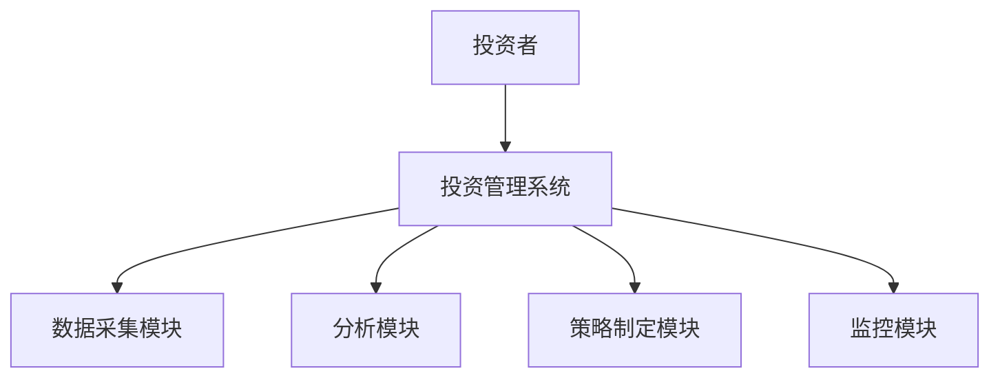
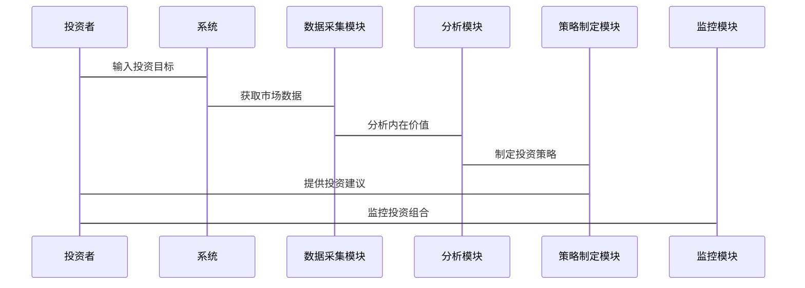

                 


# 防御型投资者策略：格雷厄姆的投资智慧

## 关键词：防御型投资，格雷厄姆，安全边际，价值评估，分散投资，长期稳健

## 摘要：  
格雷厄姆的防御型投资者策略是一种以长期稳健为目标的投资方法，强调通过安全边际、价值评估和分散投资来降低风险，确保资本的保值与稳定增长。本文将深入解析这一策略的核心理念、数学模型、系统架构，并通过实战案例展示其在现代投资中的应用。

---

## 第1章: 防御型投资的核心理念

### 1.1 防御型投资的起源与发展

#### 1.1.1 防御型投资的起源  
防御型投资理念起源于20世纪初，由本杰明·格雷厄姆提出。他主张通过分析企业的基本面，寻找被市场低估的投资标的，以实现长期稳健的收益。

#### 1.1.2 格雷厄姆的投资理念  
格雷厄姆强调“安全边际”，即以低于内在价值的价格买入资产，以降低投资风险。他认为市场波动是投资机会的来源，而非风险的信号。

#### 1.1.3 防御型投资在现代投资中的地位  
在当前市场环境下，防御型投资策略尤为重要。它不仅适用于经济不景气时的避险，也适合长期投资者在高波动市场中的稳健选择。

### 1.2 防御型投资的核心概念

#### 1.2.1 投资的定义与分类  
投资分为进攻型和防御型。进攻型追求高回报，风险较高；防御型注重稳健，风险较低。

#### 1.2.2 防御型投资的特征  
- 低风险：通过安全边际和分散投资降低波动性。
- 长期稳健：注重资本的保值与逐步增长。
- 价值导向：基于内在价值而非市场情绪做出决策。

#### 1.2.3 防御型投资与进攻型投资的对比  

| 对比维度       | 防御型投资                   | 进攻型投资                   |
|----------------|------------------------------|------------------------------|
| 目标           | 长期稳健，资本保值           | 短期高回报，高风险           |
| 风险           | 低                          | 高                          |
| 投资策略       | 价值导向，注重安全边际       | 市场导向，追求高增长         |

### 1.3 防御型投资的目标与策略

#### 1.3.1 长期资本保值  
防御型投资的核心目标是确保资本不缩水，通过安全边际和价值评估实现保值。

#### 1.3.2 降低投资风险  
通过分散投资和安全边际，降低单一资产的风险，避免重大损失。

#### 1.3.3 稳定的投资回报  
防御型投资追求稳定的收益，而非暴利，适合长期投资者。

### 1.4 防御型投资的适用场景

#### 1.4.1 稳定的经济环境  
在经济不景气时，防御型投资提供避风港。

#### 1.4.2 高风险市场的应对策略  
在高波动市场中，防御型投资策略能有效降低风险。

#### 1.4.3 长期投资者的首选  
适合那些不追求短期收益，注重长期稳健的投资者。

### 1.5 本章小结  
防御型投资以稳健为目标，通过安全边际和价值评估降低风险，适用于长期投资者和经济不景气时的风险规避。

---

## 第2章: 防御型投资的核心原理

### 2.1 安全边际的概念

#### 2.1.1 安全边际的定义  
安全边际是投资标的市场价与内在价值之间的差距，确保即使市场波动，也能避免重大损失。

#### 2.1.2 安全边际的计算方法  
$$ \text{安全边际} = \text{内在价值} - \text{市场价格} $$

#### 2.1.3 安全边际在投资中的作用  
通过预留安全边际，降低市场波动带来的风险，确保投资的稳健性。

### 2.2 价值评估的基本原理

#### 2.2.1 资产的内在价值  
内在价值是基于企业基本面的合理估值，计算公式为：  
$$ \text{内在价值} = \text{现金流折现} + \text{资产价值} $$

#### 2.2.2 市场价值与内在价值的对比  
市场价值受情绪影响，内在价值基于理性分析。防御型投资基于内在价值做出决策。

#### 2.2.3 价值评估的常见方法  
包括DCF模型、市盈率分析和股息率分析。

### 2.3 分散投资的风险管理

#### 2.3.1 分散投资的定义  
通过投资多个资产降低风险，避免过度集中。

#### 2.3.2 分散投资的原理  
通过多样化投资，降低单一资产的风险。

#### 2.3.3 分散投资的实际应用  
如投资股票、债券和房地产等多种资产类别。

### 2.4 防御型投资的数学模型

#### 2.4.1 投资回报率的计算公式  
$$ \text{投资回报率} = \frac{\text{净利润}}{\text{总投资}} $$

#### 2.4.2 风险与收益的平衡模型  
通过CAPM模型平衡风险与收益，公式：  
$$ R = R_f + \beta (R_m - R_f) $$

#### 2.4.3 防御型投资的优化算法  
如现代投资组合理论，通过优化算法实现风险与收益的平衡。

### 2.5 本章小结  
防御型投资通过安全边际、价值评估和分散投资实现稳健回报，数学模型为投资决策提供支持。

---

## 第3章: 防御型投资的策略与实践

### 3.1 防御型投资的选股策略

#### 3.1.1 低市盈率股票的选择  
市盈率低于行业平均水平的股票具有较高的安全边际。

#### 3.1.2 高股息率股票的优势  
高股息率股票提供稳定的现金流，降低投资风险。

#### 3.1.3 优质企业的识别标准  
选择具有强大财务状况和竞争优势的企业。

### 3.2 防御型投资的组合管理

#### 3.2.1 投资组合的构建原则  
根据资产配置理论，构建多样化投资组合。

#### 3.2.2 组合调整的时机与方法  
定期调整组合，根据市场变化和企业基本面进行优化。

#### 3.2.3 组合风险的监控与控制  
使用VaR模型监控组合风险，制定风险对冲策略。

### 3.3 防御型投资的长期规划

#### 3.3.1 长期投资目标的设定  
根据个人财务目标设定合理的投资目标。

#### 3.3.2 投资计划的制定与执行  
制定详细的投资计划，并严格执行纪律。

#### 3.3.3 长期投资的注意事项  
避免频繁交易，控制情绪化决策。

### 3.4 防御型投资的案例分析

#### 3.4.1 经典防御型投资案例  
如巴菲特早期投资National Cash Register，通过安全边际实现收益。

#### 3.4.2 案例的启示与经验总结  
案例显示，防御型投资策略在长期中表现稳健。

#### 3.4.3 案例对现代投资的借鉴意义  
现代投资者可借鉴其理念，应用于当前市场环境。

### 3.5 本章小结  
防御型投资策略通过科学选股和组合管理实现长期稳健回报，案例分析提供了实践依据。

---

## 第4章: 防御型投资的系统架构设计

### 4.1 系统架构设计

#### 4.1.1 系统功能设计  
- 数据采集模块：收集市场数据和企业基本面信息。
- 分析模块：计算内在价值和安全边际。
- 策略制定模块：生成投资策略。
- 监控模块：实时监控投资组合表现。

#### 4.1.2 系统架构图  



#### 4.1.3 系统交互设计  



### 4.2 本章小结  
系统架构设计为防御型投资策略的实施提供技术支持，通过模块化设计实现高效的投资管理。

---

## 第5章: 防御型投资的项目实战

### 5.1 项目环境安装

#### 5.1.1 安装Python环境  
安装Anaconda，配置Jupyter Notebook。

#### 5.1.2 安装数据分析库  
安装Pandas、NumPy和Matplotlib。

### 5.2 核心代码实现

#### 5.2.1 计算市盈率的代码  

```python
import pandas as pd

def calculate_pe_ratio(stock_data):
    pe_ratio = stock_data['Price'] / stock_data['Earnings Per Share']
    return pe_ratio

# 示例数据
stock_data = {
    'Price': [100],
    'Earnings Per Share': [10]
}
df = pd.DataFrame(stock_data)
print("市盈率：", calculate_pe_ratio(df))
```

#### 5.2.2 计算内在价值的代码  

```python
def calculate_intrinsic_value(cash_flows, discount_rate):
    iv = sum(cash_flows / (1 + discount_rate)**i for i in range(len(cash_flows)))
    return iv

# 示例数据
cash_flows = [100, 120, 140]
discount_rate = 0.08
print("内在价值：", calculate_intrinsic_value(cash_flows, discount_rate))
```

### 5.3 代码应用解读与分析

#### 5.3.1 市盈率分析  
市盈率低于行业平均水平的股票具有较高的安全边际。

#### 5.3.2 内在价值评估  
通过现金流折现法计算内在价值，指导投资决策。

### 5.4 实际案例分析

#### 5.4.1 案例背景  
以某公司为例，计算其市盈率和内在价值，判断是否具备投资价值。

#### 5.4.2 数据分析  
使用Python分析公司过去5年的财务数据，计算出市盈率和内在价值。

#### 5.4.3 投资建议  
根据分析结果，制定投资策略，建议买入或观望。

### 5.5 项目总结  
通过实战项目，验证防御型投资策略的有效性，提升投资决策能力。

---

## 第6章: 最佳实践与小结

### 6.1 本章小结  
防御型投资策略通过安全边际和价值评估实现稳健回报，系统架构和实战项目为投资提供了科学支持。

### 6.2 投资小结  
防御型投资是一种稳健的投资策略，适合长期投资者和风险厌恶者。

### 6.3 注意事项  
- 避免过度分散，确保资产的流动性。
- 定期评估投资组合，及时调整策略。
- 避免情绪化决策，坚持长期投资。

### 6.4 拓展阅读  
推荐阅读格雷厄姆的《聪明的投资者》和彼得·林奇的《投资最重要的事情》。

---

通过本文的详细解析，读者可以深入理解防御型投资策略的核心思想和实际应用。从理论到实践，从策略到系统，全面掌握这一稳健的投资方法。

