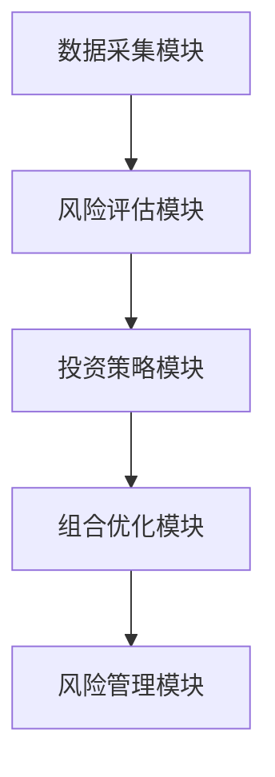
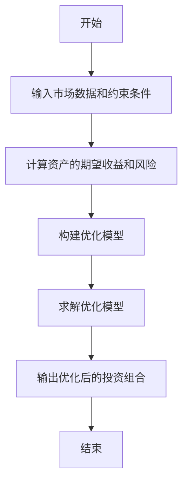
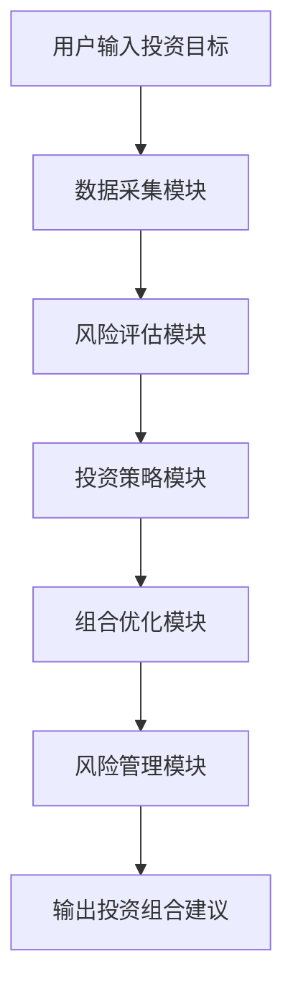

                 


# 防御型投资的系统分析与架构设计

## 第四章: 防御型投资的系统分析

### 4.1 投资决策的系统模型

#### 4.1.1 投资决策的系统构成
防御型投资的系统模型包括以下几个核心组成部分：
1. **市场环境**：包括宏观经济指标、地缘政治风险、市场波动性等。
2. **投资目标**：如保值、稳健收益、风险控制等。
3. **投资策略**：包括资产配置、风险控制、安全边际等。
4. **投资组合**：包括股票、债券、现金等资产的组合。
5. **风险管理**：包括风险评估、风险对冲等。

#### 4.1.2 系统模型的构建与分析
- **构建过程**：首先确定投资目标和约束条件，然后根据市场环境和风险偏好选择合适的资产组合，最后通过风险管理确保投资目标的实现。
- **分析方法**：使用系统动力学模型和反馈机制分析投资决策对系统稳定性的影响。

#### 4.1.3 投资决策的系统边界与输入输出
- **输入**：市场数据、经济指标、地缘政治事件、投资者风险偏好。
- **输出**：投资组合建议、风险评估报告、投资策略调整建议。

### 4.2 投资组合优化的数学模型

#### 4.2.1 投资组合优化的目标函数
目标函数通常包括以下几个方面：
1. 最大化预期收益。
2. 最小化风险（方差）。
3. 满足投资约束条件（如资产配置比例、流动性要求等）。

数学表达式为：
$$ \text{Maximize } E(R_p) - \lambda \sigma_p $$
其中，$\lambda$ 是风险厌恶系数，$E(R_p)$ 是投资组合的预期收益，$\sigma_p$ 是投资组合的风险（标准差）。

#### 4.2.2 约束条件的设定与分析
常见的约束条件包括：
1. 投资比例约束：每个资产的投资比例不超过某个上限或下限。
2. 流动性约束：部分资产需要保持一定的流动性。
3. 风险约束：投资组合的风险不超过某个阈值。

数学表达式为：
$$ w_i \geq 0 \quad \forall i $$
$$ \sum_{i=1}^{n} w_i = 1 $$
$$ \sigma_p \leq \sigma_{\text{max}} $$

#### 4.2.3 数学模型的求解方法
常用的方法包括：
1. **均值-方差优化**：使用拉格朗日乘数法求解。
2. **风险管理模型**：如CVaR（条件在险损失）模型。
3. **整数规划**：当投资比例需要满足整数约束时使用。

## 第五章: 防御型投资的架构设计方案

### 5.1 投资组合管理的架构设计

#### 5.1.1 投资组合管理的模块划分
- **数据采集模块**：收集市场数据、经济指标、地缘政治事件等。
- **风险评估模块**：评估投资组合的风险，包括波动率、VaR、CVaR等。
- **投资策略模块**：根据风险评估结果制定投资策略。
- **组合优化模块**：基于投资策略优化投资组合。
- **风险管理模块**：实时监控和调整投资组合，确保风险在可接受范围内。

#### 5.1.2 架构设计的详细描述
1. **数据采集模块**：通过API接口获取实时市场数据，包括股票价格、债券收益率、汇率等。
2. **风险评估模块**：使用历史数据和蒙特卡洛模拟评估投资组合的风险。
3. **投资策略模块**：根据风险偏好和市场环境选择防御型投资策略。
4. **组合优化模块**：使用数学优化算法（如二次规划）优化投资组合。
5. **风险管理模块**：实时监控投资组合的风险指标，当风险超过阈值时触发调整机制。

### 5.2 防御型投资的架构设计

#### 5.2.1 系统架构图
使用mermaid图展示系统架构：


#### 5.2.2 系统功能模块的详细描述
1. **数据采集模块**：
   - 通过API接口获取市场数据。
   - 数据清洗和预处理。

2. **风险评估模块**：
   - 计算投资组合的波动率、VaR、CVaR等风险指标。
   - 使用历史数据和蒙特卡洛模拟进行风险预测。

3. **投资策略模块**：
   - 根据风险评估结果制定防御型投资策略。
   - 确定资产配置比例，选择低波动率、高流动性资产。

4. **组合优化模块**：
   - 使用数学优化算法（如二次规划）优化投资组合。
   - 确保投资组合在风险和收益之间达到最佳平衡。

5. **风险管理模块**：
   - 实时监控投资组合的风险指标。
   - 当风险超过阈值时，触发调整机制，如减少高风险资产的持仓比例。

### 5.3 投资组合优化的算法流程图



### 5.4 投资组合优化的Python代码实现

```python
import numpy as np
import pandas as pd
from scipy.optimize import minimize

# 假设我们有n个资产，每个资产的收益率和风险已知
n = 5
returns = np.array([0.1, 0.12, 0.08, 0.15, 0.1])
cov_matrix = np.array([
    [0.02, 0.01, 0.01, 0.01, 0.01],
    [0.01, 0.03, 0.01, 0.01, 0.01],
    [0.01, 0.01, 0.03, 0.01, 0.01],
    [0.01, 0.01, 0.01, 0.04, 0.01],
    [0.01, 0.01, 0.01, 0.01, 0.05]
])

def portfolio_optimization(returns, cov_matrix, risk_aversion=1):
    n = len(returns)
    # 定义优化目标函数
    def objective(weights, returns, cov_matrix, risk_aversion):
        return -weights.T @ returns + risk_aversion * weights.T @ cov_matrix @ weights

    # 定义约束条件
    constraints = [{'type': 'eq', 'fun': lambda w: sum(w) - 1},
                   {'type': 'ineq', 'fun': lambda w: w[i] for i in range(n)}]

    # 初始化权重向量
    init_weights = np.array([1/n]*n)

    # 使用 scipy 的 minimize 函数求解
    result = minimize(objective, init_weights, args=(returns, cov_matrix, risk_aversion), 
                      method='SLSQP', constraints=constraints)

    return result.x

# 调用优化函数
opt_weights = portfolio_optimization(returns, cov_matrix)

print("优化后的权重为:", opt_weights)
```

### 5.5 投资组合优化的数学模型与公式

- **优化目标**：最大化预期收益减去风险厌恶系数乘以风险。
$$ \text{Maximize } E(R_p) - \lambda \sigma_p $$

- **约束条件**：
  1. 投资权重之和等于1。
  $$ \sum_{i=1}^{n} w_i = 1 $$
  2. 每个资产的权重非负。
  $$ w_i \geq 0 \quad \forall i $$

### 5.6 系统交互流程图



### 5.7 系统架构设计总结

- **系统架构**：模块化设计，各模块之间耦合度低，便于维护和扩展。
- **技术选型**：使用Python和相关库（如NumPy、SciPy）进行数据处理和优化计算。
- **算法选择**：采用二次规划算法进行投资组合优化。

---

## 总结

通过系统分析和架构设计，我们可以构建一个完善的防御型投资系统，能够有效应对地缘政治不确定性带来的风险。从数据采集到风险评估，再到投资策略的制定和组合优化，每一步都需要精确的数学模型和高效的算法支持。通过实际的Python代码实现，可以更好地理解和应用这些理论。

---

## 最佳实践与注意事项

1. **风险控制**：始终将风险控制放在首位，特别是在地缘政治不确定性较高的情况下。
2. **持续监控**：定期监控投资组合的风险指标，及时调整以应对市场变化。
3. **模型优化**：根据市场环境的变化，不断优化投资组合优化模型，提高系统的适应性。
4. **技术实现**：在技术实现上，建议使用高效的数学优化库和工具，确保计算效率和准确性。
5. **学习与提升**：持续学习投资理论和新技术，保持对市场动态的敏感性。

---

## 拓展阅读

- 格雷厄姆的《防御型投资》经典著作。
- 现代投资组合理论的相关文献。
- 风险管理的经典模型，如VaR、CVaR等。

通过本文的系统分析和架构设计，我们可以更好地理解防御型投资在地缘政治不确定性中的重要性，并能够实际应用这些理论和方法来制定有效的投资策略。

