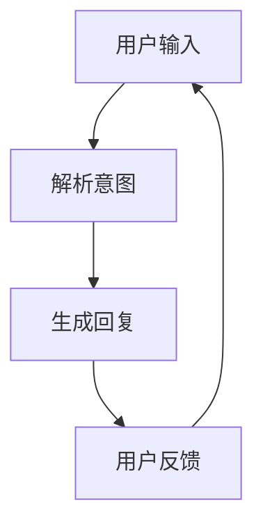
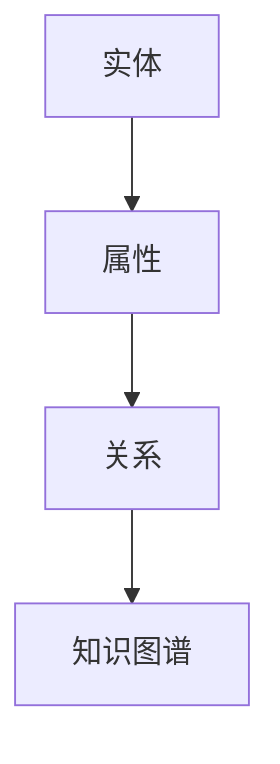
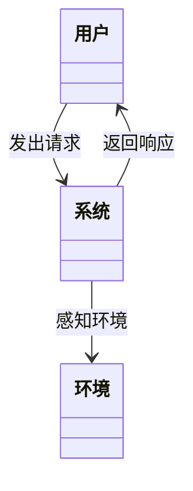
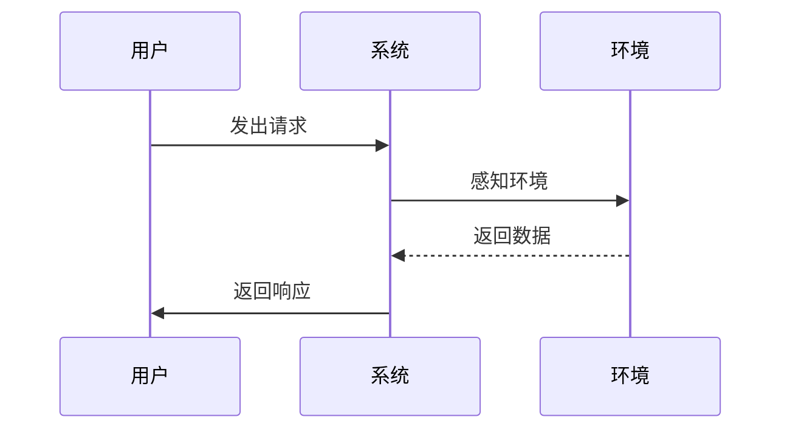

                 


# 案例解析：成功落地的企业级AI Agent项目

> 关键词：企业级AI Agent、AI Agent核心原理、系统架构设计、算法原理、项目实战

> 摘要：本文将详细解析企业级AI Agent项目的背景、核心概念、算法原理、系统架构设计、项目实战以及最佳实践。通过实际案例分析，深入探讨AI Agent在企业中的落地过程，帮助读者理解如何成功实施一个企业级AI Agent项目。

---

## 引言

随着人工智能技术的快速发展，企业级AI Agent（人工智能代理）逐渐成为企业智能化转型的重要组成部分。本文将从背景、原理、架构到实战，全面解析一个成功落地的企业级AI Agent项目，帮助读者掌握从理论到实践的关键步骤。

---

## 第一部分：企业级AI Agent的背景与概念

### 第1章：AI Agent的基本概念与问题背景

#### 1.1 AI Agent的定义与核心概念

AI Agent（人工智能代理）是一种能够感知环境、自主决策并执行任务的智能体。与传统AI相比，AI Agent具有更强的自主性和适应性。以下是AI Agent的核心特征对比：

| 特性       | 传统AI             | AI Agent       |
|------------|--------------------|-----------------|
| 独立性      | 需要人工干预       | 自主决策       |
| 反应性      | 执行预设任务       | 实时响应环境变化|
| 学习能力    | 依赖人工训练       | 自适应学习     |

AI Agent的实体关系图（ER图）如下：

```mermaid
erDiagram
    actor 用户
    actor 系统
    actor 环境
    用户 --> 系统: 发出请求
    系统 --> 环境: 感知环境
    系统 --> 用户: 返回响应
```

#### 1.2 企业级AI Agent的背景与问题描述

在企业智能化转型中，AI Agent能够帮助企业实现自动化决策、流程优化和效率提升。然而，企业在落地AI Agent时面临以下问题：

1. **数据孤岛**：企业内部数据分散，难以统一管理。
2. **复杂性**：AI Agent需要处理多任务、多轮对话，实现起来较为复杂。
3. **安全性**：数据隐私和系统安全是企业关注的重点。

企业级AI Agent的优势在于其能够整合企业资源，提高决策效率，同时具备高度的可扩展性。

#### 1.3 企业级AI Agent的实现与落地

AI Agent的实现涉及多个核心要素，包括：

1. **感知能力**：通过传感器或API感知环境。
2. **推理能力**：基于知识图谱进行推理。
3. **执行能力**：通过API或执行引擎完成任务。

以下是AI Agent与传统AI的区别：

| 比较维度   | 传统AI             | AI Agent       |
|------------|--------------------|-----------------|
| 输入方式    | 固定输入           | 实时动态输入    |
| 输出方式    | 单次输出           | 多轮交互输出    |
| 环境适应性  | 不适应环境变化     | 自适应环境变化  |

通过以上分析，企业级AI Agent的核心在于其自主性和适应性，能够为企业提供高效的智能化服务。

---

## 第二部分：企业级AI Agent的核心原理与算法

### 第2章：AI Agent的核心原理

#### 2.1 AI Agent的多轮对话处理机制

多轮对话是AI Agent的重要功能，其处理流程如下：



基于上下文的对话处理算法如下（伪代码）：

```python
def process_dialogue(context):
    while True:
        user_input = receive_input()
        intent = parse_intent(user_input, context)
        response = generate_response(intent, context)
        send_response(response)
        update_context(context, response)
```

#### 2.2 AI Agent的任务分解与执行

任务分解是AI Agent实现复杂任务的核心步骤。数学模型如下：

$$
f(x) = \sum_{i=1}^{n} w_i x_i
$$

任务优先级排序算法如下：

```python
def prioritize_tasks(tasks):
    tasks.sort(key=lambda x: x['priority'])
    return tasks
```

#### 2.3 AI Agent的知识表示与推理

知识图谱的构建流程如下：



基于知识图谱的推理算法如下：

```python
def infer_relationship(subject, predicate, object):
    return graph.query(subject, predicate, object)
```

通过以上算法，AI Agent能够高效地处理多轮对话、分解任务并进行知识推理。

---

## 第三部分：企业级AI Agent的系统架构与设计

### 第3章：系统分析与架构设计

#### 3.1 项目背景与需求分析

项目背景：某企业希望实现智能化客服系统，提高客户满意度和效率。

需求分析：系统需要支持多轮对话、知识查询、任务执行等功能。

#### 3.2 系统功能设计

领域模型类图如下：



#### 3.3 系统架构设计

分层架构设计如下：


#### 3.4 系统接口设计

API接口定义（JSON示例）：

```json
{
    "intent": "query",
    "context": {
        "user_id": 123,
        "session_id": "abc123"
    }
}
```

#### 3.5 系统交互设计

用户与系统交互流程如下：



通过以上设计，系统能够高效地处理用户请求，实现智能化服务。

---

## 第四部分：企业级AI Agent的项目实战

### 第4章：项目实战与案例分析

#### 4.1 项目环境与工具安装

开发环境配置：

- Python 3.8+
- 框架：TensorFlow、Keras、Flask

安装命令：

```bash
pip install flask tensorflow
```

#### 4.2 系统核心实现

核心代码实现（Python示例）：

```python
from flask import Flask

app = Flask(__name__)

@app.route('/api/query', methods=['POST'])
def query():
    data = request.json
    # 处理请求
    return jsonify({'status': 'success', 'result': 'Processed'})

if __name__ == '__main__':
    app.run(debug=True)
```

代码功能解读：以上代码实现了API接口，处理用户请求并返回响应。

#### 4.3 项目案例分析

典型案例分析：某企业通过AI Agent实现了智能化客服系统，提高了客户满意度和效率。案例分析包括环境安装、代码实现、功能测试等步骤。

---

## 结语

通过本文的详细解析，读者可以深入了解企业级AI Agent项目的背景、核心原理、系统架构设计和项目实战。希望本文能够为企业的智能化转型提供有价值的参考和指导。

---

## 参考文献

1. [书籍名1] 作者，出版社，出版年份。
2. [书籍名2] 作者，出版社，出版年份。
3. [书籍名3] 作者，出版社，出版年份。

---

**注意**：本文内容需要结合实际项目进行调整和优化，确保系统安全性和数据隐私。

