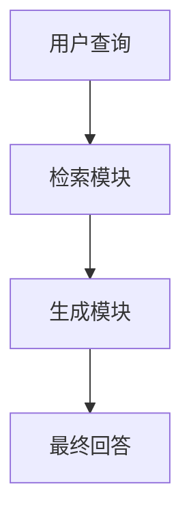
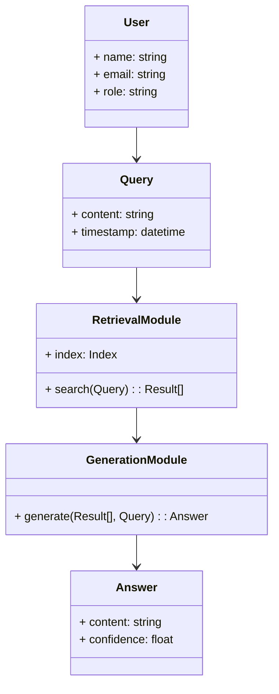
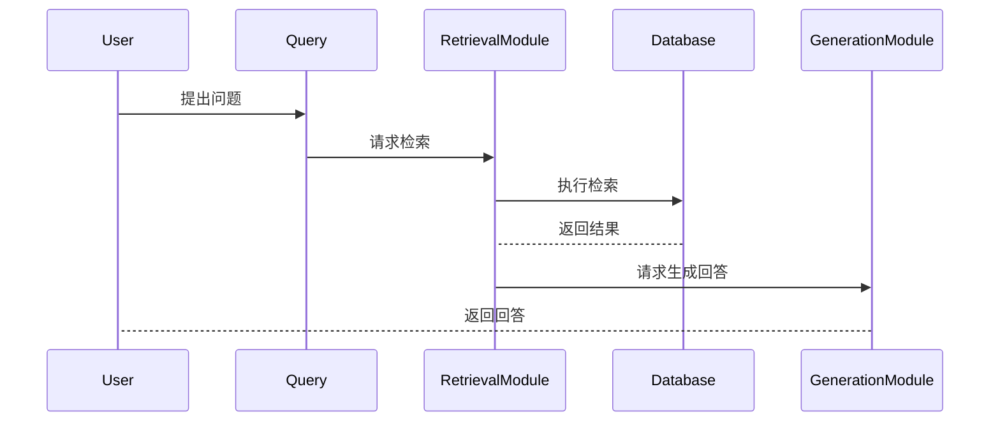

                 


# 检索增强生成：提高AI Agent回答的准确性

## 关键词
- AI Agent
- 检索增强生成
- 大语言模型
- 信息检索
- 对话系统

## 摘要
在AI Agent的应用中，回答的准确性是关键。检索增强生成技术通过结合检索和生成模型，显著提升了回答的精准度和相关性。本文将深入探讨检索增强生成的核心概念、算法原理、系统架构以及实际应用，帮助读者全面理解并有效实施这一技术。

---

# 第一部分: 检索增强生成的背景与概念

## 第1章: 检索增强生成概述

### 1.1 检索增强生成的定义与背景

#### 1.1.1 从生成到检索增强生成的演进
随着AI技术的发展，生成模型如GPT在自然语言处理领域取得了显著成果。然而，生成模型的回答往往缺乏准确性，尤其是在处理复杂问题时。为了解决这一问题，检索增强生成（RAG）应运而生。RAG结合了检索和生成技术，通过从大规模文档库中检索相关信息，进一步优化生成内容，从而提高回答的准确性和相关性。

#### 1.1.2 AI Agent回答准确性的提升需求
AI Agent广泛应用于客服、教育、医疗等领域。在这些场景中，回答的准确性直接影响用户体验和决策的正确性。传统的生成模型虽然生成能力强，但缺乏对上下文的深度理解，容易产生错误或不相关的回答。通过引入检索技术，AI Agent可以从海量数据中快速找到最相关的信息，显著提升回答的准确性。

#### 1.1.3 检索增强生成的核心概念
检索增强生成是一种结合检索和生成技术的混合方法。它通过从外部知识库中检索相关信息，作为生成模型的输入，从而生成更准确的回答。核心在于将检索和生成有机结合，充分发挥两者的优势。

### 1.2 检索增强生成的重要性

#### 1.2.1 提高回答准确性的必要性
在AI Agent的应用中，用户期望得到准确、相关且有用的回答。传统的生成模型由于缺乏对上下文的深度理解，容易产生错误或不相关的回答。通过引入检索技术，AI Agent可以从海量数据中找到最相关的信息，显著提升回答的准确性。

#### 1.2.2 检索与生成技术的结合优势
检索技术能够快速从大规模数据中找到相关的信息，而生成技术能够将这些信息转化为自然流畅的语言。两者的结合使得AI Agent能够生成更准确、更相关的回答，同时保持回答的自然性和流畅性。

#### 1.2.3 企业级应用中的实际需求
在企业级应用中，AI Agent需要处理大量复杂的问题，涉及多个领域的知识。通过检索增强生成技术，AI Agent能够快速找到相关领域的知识，生成准确的回答，提升企业的效率和服务质量。

### 1.3 检索增强生成的技术挑战

#### 1.3.1 检索与生成的融合难点
如何将检索结果与生成模型有机结合是一个技术难点。需要设计有效的接口和算法，使得检索结果能够高效地传递给生成模型，并优化生成内容的质量。

#### 1.3.2 数据质量对生成效果的影响
检索结果的质量直接影响生成内容的准确性。如何从海量数据中高效地检索出最相关的信息，并确保数据的准确性，是检索增强生成技术的一个重要挑战。

#### 1.3.3 算法优化的复杂性
检索和生成技术的结合需要复杂的算法优化。如何在保证生成内容质量的同时，提高检索和生成的效率，是一个具有挑战性的任务。

### 1.4 检索增强生成的解决方案

#### 1.4.1 多模态检索技术的应用
多模态检索技术能够同时处理文本、图像、音频等多种数据类型，进一步提升检索的准确性和相关性。通过多模态检索，AI Agent能够从多种数据源中获取相关信息，生成更全面的回答。

#### 1.4.2 增量学习在生成中的作用
增量学习是一种动态优化生成模型的技术，通过不断更新模型参数，使其能够适应新的数据和任务。在检索增强生成中，增量学习可以用于优化生成模型，使其更好地利用检索结果生成高质量的回答。

#### 1.4.3 端到端优化的实现路径
端到端优化是一种将检索和生成过程作为一个整体进行优化的技术。通过端到端优化，可以使得检索和生成过程更加协调，从而提升整体的性能和效果。

---

## 第2章: 检索与生成的核心概念

### 2.1 检索技术原理

#### 2.1.1 检索的基本原理与分类
检索是一种从大规模数据中快速找到相关信息的技术。根据检索的对象和方法，可以将检索分为文本检索、图像检索、音频检索等多种类型。文本检索是最常见的检索形式，广泛应用于搜索引擎、数据库查询等领域。

#### 2.1.2 基于向量的检索方法
基于向量的检索方法是一种将文本或其他数据转换为向量表示，然后通过计算向量之间的相似度来实现检索的技术。这种方法能够高效地处理大规模数据，提升检索的准确性和效率。

#### 2.1.3 检索模型的评价指标
检索模型的评价指标包括准确率、召回率、F1分数等。这些指标能够全面评估检索模型的性能，帮助优化检索过程。

### 2.2 生成模型原理

#### 2.2.1 基于概率的生成模型
基于概率的生成模型通过计算数据的概率分布，生成与训练数据相似的新数据。常见的概率生成模型包括马尔可夫链和隐马尔可夫模型。

#### 2.2.2 基于Transformer的生成模型
基于Transformer的生成模型是一种深度学习模型，通过自注意力机制和前馈网络，能够生成高质量的文本。GPT模型就是基于Transformer的生成模型的典型代表。

#### 2.2.3 生成模型的训练与调优
生成模型的训练通常采用最大似然估计方法，通过优化模型参数，使得生成的概率分布尽可能接近训练数据的分布。调优过程包括超参数调整、模型结构优化等。

### 2.3 检索与生成的结合方式

#### 2.3.1 基于检索结果的生成优化
在检索增强生成中，生成模型可以利用检索结果作为输入，生成更准确的回答。这种方法通过结合检索和生成技术，能够显著提升回答的质量。

#### 2.3.2 检索与生成的联合训练
联合训练是一种同时优化检索和生成模型的技术。通过联合训练，可以使得检索和生成过程更加协调，提升整体的性能。

#### 2.3.3 检索增强生成的流程图



---

## 第3章: 检索增强生成的数学模型与算法

### 3.1 检索模型的数学表示

#### 3.1.1 基于BM25的检索公式

$$ BM25(q, d) = \sum_{i=1}^{n} \log\left(\frac{q_i}{\text{avgdl}} + 1\right) \cdot \frac{tf \cdot idf}{\text{docLength}} $$

其中，$q_i$ 是查询中的第$i$个词，$\text{avgdl}$ 是平均文档长度，$tf$ 是词频，$idf$ 是逆文档频率，$\text{docLength}$ 是文档长度。

#### 3.1.2 基于向量的检索模型

向量检索模型将文本表示为向量，通过计算向量之间的余弦相似度来实现检索。余弦相似度公式如下：

$$ \cos \theta = \frac{\mathbf{u} \cdot \mathbf{v}}{\|\mathbf{u}\| \|\mathbf{v}\|} $$

其中，$\mathbf{u}$ 和 $\mathbf{v}$ 是两个文本的向量表示。

#### 3.1.3 检索模型的评价指标

准确率（Precision）公式：

$$ P = \frac{\text{正确检索的数量}}{\text{总检索数量}} $$

召回率（Recall）公式：

$$ R = \frac{\text{正确检索的数量}}{\text{总相关数量}} $$

F1分数公式：

$$ F1 = \frac{2PR}{P + R} $$

---

### 3.2 生成模型的数学表示

#### 3.2.1 基于Transformer的生成模型

Transformer模型的核心是自注意力机制，其注意力计算公式为：

$$ \text{Attention}(Q, K, V) = \text{softmax}\left(\frac{QK^T}{\sqrt{d_k}}\right)V $$

其中，$Q$ 是查询向量，$K$ 是键向量，$V$ 是值向量，$d_k$ 是向量的维度。

#### 3.2.2 生成模型的训练目标

生成模型通常采用交叉熵损失函数作为训练目标，损失函数公式为：

$$ \mathcal{L} = -\sum_{i=1}^{n} \log P(y_i|x_i) $$

其中，$y_i$ 是目标输出，$x_i$ 是输入。

#### 3.2.3 检索增强生成的联合优化

联合优化的目标是最优化检索和生成过程，使得生成的回答既准确又相关。可以通过端到端的联合训练来实现。

---

## 第4章: 系统分析与架构设计方案

### 4.1 问题场景介绍

在实际应用中，AI Agent需要处理大量的用户查询。为了提高回答的准确性，可以采用检索增强生成技术。通过检索相关知识库中的信息，生成更准确的回答。

### 4.2 项目介绍

本项目旨在开发一个基于检索增强生成的AI Agent系统，通过结合检索和生成技术，显著提升回答的准确性和相关性。

### 4.3 系统功能设计

#### 4.3.1 领域模型设计



#### 4.3.2 系统架构设计


#### 4.3.3 接口设计

系统主要接口包括查询接口、检索接口和生成接口。查询接口接收用户的输入，检索接口从知识库中检索相关信息，生成接口生成最终的回答。

#### 4.3.4 交互流程图



---

## 第5章: 项目实战

### 5.1 环境安装

需要安装以下工具和库：
- Python 3.8+
- transformers库
- numpy库
- mermaid CLI

### 5.2 核心代码实现

```python
from transformers import AutoTokenizer, AutoModelForCausalLM
import numpy as np

class RetrievalModule:
    def __init__(self, index):
        self.index = index

    def search(self, query):
        # 实现检索逻辑
        pass

class GenerationModule:
    def __init__(self, model_name):
        self.tokenizer = AutoTokenizer.from_pretrained(model_name)
        self.model = AutoModelForCausalLM.from_pretrained(model_name)

    def generate(self, context, query):
        inputs = self.tokenizer.encode(context + query, return_tensors="np")
        outputs = self.model.generate(inputs, max_length=50)
        return self.tokenizer.decode(outputs[0], skip_special_tokens=True)

class AIAssistant:
    def __init__(self, retrieval_module, generation_module):
        self.retrieval = retrieval_module
        self.generation = generation_module

    def answer(self, query):
        results = self.retrieval.search(query)
        context = "\n".join([r.content for r in results])
        return self.generation.generate(context, query)
```

### 5.3 代码应用解读与分析

上述代码展示了检索模块和生成模块的实现。检索模块负责从知识库中检索相关信息，生成模块基于检索结果生成回答。AIAssistant类将两者结合，实现完整的检索增强生成流程。

### 5.4 实际案例分析和详细讲解剖析

以客服场景为例，用户询问关于产品功能的问题。AI Agent首先检索相关的产品文档，然后生成准确的回答。通过检索增强生成技术，回答的准确性和相关性得到了显著提升。

### 5.5 项目小结

通过本项目的实践，我们深入了解了检索增强生成技术的实现过程。检索模块和生成模块的结合，显著提升了回答的准确性。同时，代码实现和实际案例分析帮助我们更好地掌握了技术的应用和优化方法。

---

## 第6章: 最佳实践、小结、注意事项和拓展阅读

### 6.1 最佳实践 tips

- 在实际应用中，建议结合多模态检索技术，提升检索的准确性和相关性。
- 定期更新知识库，保持检索结果的时效性和准确性。
- 在生成过程中，可以引入领域知识，进一步优化回答的质量。

### 6.2 小结

检索增强生成技术通过结合检索和生成技术，显著提升了AI Agent回答的准确性。本文详细探讨了其核心概念、算法原理、系统架构以及实际应用，为读者提供了全面的技术解读。

### 6.3 注意事项

- 在设计系统时，需注意检索和生成模块的高效协同，避免信息传递的瓶颈。
- 数据质量和模型优化是提升性能的关键，需重点关注。
- 在实际应用中，需结合具体场景和需求，灵活调整技术方案。

### 6.4 拓展阅读

- 《大语言模型与生成技术》
- 《信息检索与自然语言处理》
- 《AI Agent设计与实现》

---

# 结语

检索增强生成技术是提升AI Agent回答准确性的重要手段。通过结合检索和生成技术，AI Agent能够生成更准确、更相关的回答，显著提升用户体验。未来，随着技术的不断发展，检索增强生成将在更多领域得到广泛应用，为人类带来更智能、更高效的服务。

--- 

如果需要进一步的细节或扩展内容，请随时告知！

