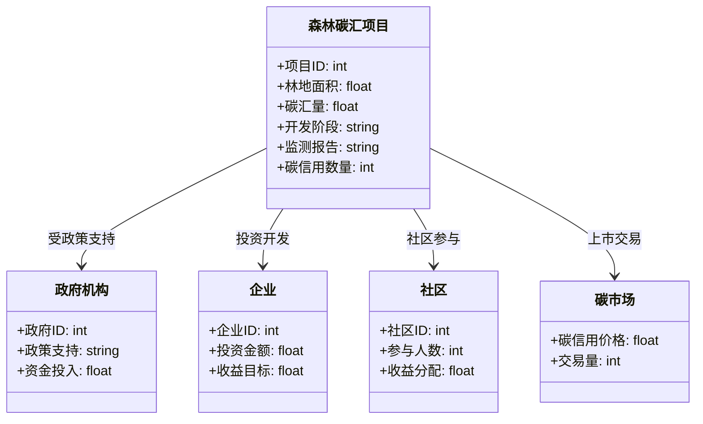
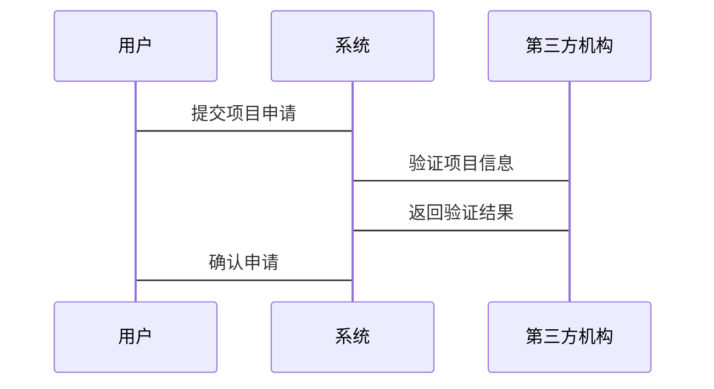

                 


# 森林碳汇项目的投资模式与回报分析

## 关键词：
森林碳汇、碳中和、投资模式、经济回报、环境效益、社会效益、碳信用

## 摘要：
本文深入分析了森林碳汇项目的投资模式与回报情况，探讨了不同投资模式的优劣势及其对项目成功的影响。通过数学模型和实际案例，详细评估了项目的经济、环境和社会效益，为投资者提供了科学的决策依据。文章还提供了系统的架构设计和项目实战案例，帮助读者全面理解森林碳汇项目的实施过程。

---

## 第一部分：森林碳汇项目的背景与概念

### 第1章：森林碳汇项目的背景与意义

#### 1.1 碳中和目标与森林碳汇的重要性
- **1.1.1 碳中和目标的全球共识**  
  全球气候变化问题日益严峻，实现碳中和已成为国际社会的共同目标。森林碳汇作为减少碳排放的重要手段，受到广泛关注。
  
- **1.1.2 森林碳汇在碳中和中的作用**  
  森林碳汇通过吸收二氧化碳，帮助实现碳中和目标，是应对气候变化的重要手段之一。

- **1.1.3 森林碳汇项目的发展趋势**  
  随着碳市场的成熟，森林碳汇项目的需求不断增加，成为投资热点。

#### 1.2 森林碳汇的定义与特点
- **1.2.1 森林碳汇的定义**  
  森林碳汇是指通过植树造林、森林保护等措施，吸收和储存二氧化碳的过程。

- **1.2.2 森林碳汇的核心特点**  
  - 可持续性：长期吸收二氧化碳。  
  - 可测量性：可通过科学方法量化碳汇量。  
  - 多重效益：兼具生态和经济效益。

- **1.2.3 森林碳汇与碳交易的关系**  
  森林碳汇产生的碳信用可进入碳市场交易，为项目带来经济回报。

#### 1.3 森林碳汇项目的背景与意义
- **1.3.1 全球碳市场的现状**  
  碳市场逐渐成熟，碳信用价格波动较大，但总体呈上升趋势。

- **1.3.2 森林碳汇项目的经济价值**  
  通过碳信用交易，项目可获得可观的经济收益。

- **1.3.3 森林碳汇的社会价值**  
  森林碳汇有助于改善生态环境，促进可持续发展。

---

## 第二部分：森林碳汇项目的核心概念与分析框架

### 第2章：森林碳汇的核心概念与分析框架

#### 2.1 森林碳汇的核心概念
- **2.1.1 碳汇的定义与分类**  
  碳汇包括森林、湿地等多种形式，森林碳汇是最常用的类型之一。

- **2.1.2 森林碳汇的生态功能**  
  森林碳汇不仅能吸收二氧化碳，还能维护生物多样性，改善局部气候。

- **2.1.3 森林碳汇的经济属性**  
  森林碳汇产生的碳信用具有市场价值，可作为资产进行交易。

#### 2.2 森林碳汇项目的分析框架
- **2.2.1 项目生命周期分析**  
  森林碳汇项目通常包括规划、实施、监测和维护四个阶段。

- **2.2.2 项目风险分析**  
  风险包括自然风险（如火灾、病虫害）和市场风险（如碳信用价格波动）。

- **2.2.3 项目收益分析**  
  收益来自碳信用销售收入，以及其他可能的生态补偿收入。

#### 2.3 森林碳汇项目的边界与外延
- **2.3.1 项目实施边界**  
  项目实施区域通常为特定的林地，需明确地理和时间范围。

- **2.3.2 项目影响范围**  
  森林碳汇的影响包括减少碳排放、改善生态和促进地方经济发展。

- **2.3.3 项目与其他碳汇形式的对比**  
  森林碳汇与湿地碳汇相比，吸收能力更强，但对环境的要求更高。

---

## 第三部分：森林碳汇项目的投资模式分析

### 第3章：森林碳汇项目的投资模式

#### 3.1 森林碳汇项目的主要投资模式
- **3.1.1 政府主导型模式**  
  政府提供资金和政策支持，项目由政府机构主导实施。

- **3.1.2 企业主导型模式**  
  企业作为投资主体，主导项目的开发和运营。

- **3.1.3 社区合作型模式**  
  项目由社区主导，政府和企业提供支持，强调社区参与和利益共享。

#### 3.2 各种投资模式的优劣势对比
- **3.2.1 政府主导型模式的优劣势**  
  - 优势：资金充足，政策支持。  
  - 劣势：决策流程长，灵活性低。

- **3.2.2 企业主导型模式的优劣势**  
  - 优势：效率高，市场化程度高。  
  - 劣势：风险较大，需自负盈亏。

- **3.2.3 社区合作型模式的优劣势**  
  - 优势：社区参与度高，可持续性强。  
  - 劣势：协调难度大，管理复杂。

#### 3.3 投资模式的选择与优化
- **3.3.1 投资模式选择的影响因素**  
  包括资金来源、项目规模、风险承受能力和当地政策环境。

- **3.3.2 投资模式的优化策略**  
  根据项目特点和目标选择最优模式，或结合多种模式优势进行创新。

- **3.3.3 投资模式的案例分析**  
  以某国的社区主导型碳汇项目为例，分析其成功经验和面临的挑战。

---

## 第四部分：森林碳汇项目的回报分析

### 第4章：森林碳汇项目的回报分析

#### 4.1 森林碳汇项目的经济回报分析
- **4.1.1 碳信用的市场价格波动**  
  碳信用价格受市场需求、政策变化等多种因素影响，具有一定的波动性。

- **4.1.2 碳信用的收益计算方法**  
  收益=碳信用数量×碳价，需考虑开发和维护成本。

- **4.1.3 碳信用的经济价值评估**  
  使用净现值（NPV）和内部收益率（IRR）等指标评估项目经济回报。

#### 4.2 森林碳汇项目的环境与社会效益分析
- **4.2.1 环境效益的量化**  
  通过监测和评估，确定项目减少的碳排放量。

- **4.2.2 社会效益的实现**  
  项目可为当地居民提供就业机会，促进社区经济发展。

- **4.2.3 社会效益的案例分析**  
  以某社区主导型项目为例，分析其在促进社区发展和提高居民收入方面的作用。

#### 4.3 森林碳汇项目的综合回报分析
- **4.3.1 经济、环境和社会效益的综合评估**  
  结合定量和定性分析，全面评估项目的综合回报。

- **4.3.2 投资回报的不确定性与风险管理**  
  通过情景分析和风险对冲策略，降低投资风险。

---

## 第五部分：系统分析与架构设计

### 第5章：系统分析与架构设计

#### 5.1 问题场景介绍
- 森林碳汇项目涉及多方面的利益相关者，包括政府、企业、社区和环境组织，需要一个高效的系统来管理项目开发、监测和交易。

#### 5.2 系统功能设计
- **5.2.1 领域模型设计**  
  使用Mermaid类图展示系统中的实体及其关系。



- **5.2.2 系统架构设计**  
  使用Mermaid架构图展示系统的整体架构。


- **5.2.3 系统接口设计**  
  定义API接口，用于数据交互和功能调用。

- **5.2.4 系统交互设计**  
  使用Mermaid序列图展示系统的主要交互流程。



---

## 第六部分：项目实战

### 第6章：项目实战

#### 6.1 环境安装
- 安装必要的开发工具和库，如Python、Pandas、Matplotlib等。

#### 6.2 系统核心实现源代码
- 碳信用价格预测模型的实现：

```python
import pandas as pd
import matplotlib.pyplot as plt
from sklearn.linear_model import LinearRegression

# 加载数据
data = pd.read_csv('carbon_credit_price.csv')

# 数据可视化
plt.plot(data['year'], data['price'], label='Carbon Credit Price')
plt.xlabel('Year')
plt.ylabel('Price ($/tCO2)')
plt.title('Carbon Credit Price Trend')
plt.legend()
plt.show()

# 构建线性回归模型
model = LinearRegression()
model.fit(data[['year']], data['price'])

# 预测未来价格
future_years = [2024, 2025, 2026]
future_prices = model.predict(future_years)
print(f'预测价格：{future_prices}')
```

#### 6.3 代码应用解读与分析
- 上述代码展示了如何使用线性回归模型预测碳信用价格，帮助投资者做出决策。

#### 6.4 实际案例分析
- 以某国的社区主导型碳汇项目为例，分析其开发过程、投资模式和回报情况。

#### 6.5 项目小结
- 总结项目实施的关键成功因素，如政府支持、社区参与和有效的项目管理。

---

## 第七部分：总结与建议

### 第7章：总结与建议

#### 7.1 总结
- 森林碳汇项目具有重要的生态和经济价值，是实现碳中和目标的重要手段。
- 不同投资模式有其优劣势，选择合适的模式对项目成功至关重要。

#### 7.2 投资建议
- 投资者应综合考虑经济、环境和社会效益，选择适合的投资模式。
- 加强风险管理，关注政策变化和市场波动。

#### 7.3 未来展望
- 随着技术进步和市场发展，森林碳汇项目将更加多样化和高效化。
- 数字化技术的应用将提升项目管理效率和透明度。

#### 7.4 最佳实践 tips
- 保持与当地政府和相关机构的良好沟通。
- 注重社区参与和利益共享，确保项目可持续性。

---

## 第八部分：参考文献与拓展阅读

### 参考文献
- 全球碳计划（Global Carbon Project）报告
- 碳交易网（Carbon Trade Xchange）相关研究
- 国际森林碳汇倡议（International Forest Carbon Initiative）文献

### 拓展阅读
- 碳中和目标与可持续发展
- 数字化技术在碳汇项目中的应用
- 全球碳市场的最新动态

---

## 附录：术语解释与缩写词表

- **碳信用（Carbon Credit）**：一种可交易的证书，证明减少了特定量的二氧化碳排放。
- **碳中和（Carbon Neutrality）**：通过减少碳排放和碳汇活动，使净碳排放量为零。
- **净现值（Net Present Value, NPV）**：将未来收益和成本按现值计算，评估项目经济价值的指标。

---

通过以上结构，我们可以全面、系统地分析森林碳汇项目的投资模式与回报，为投资者提供科学的决策依据。

