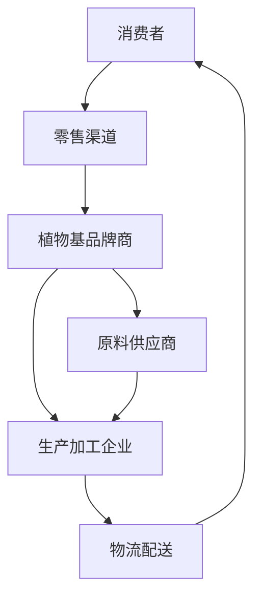
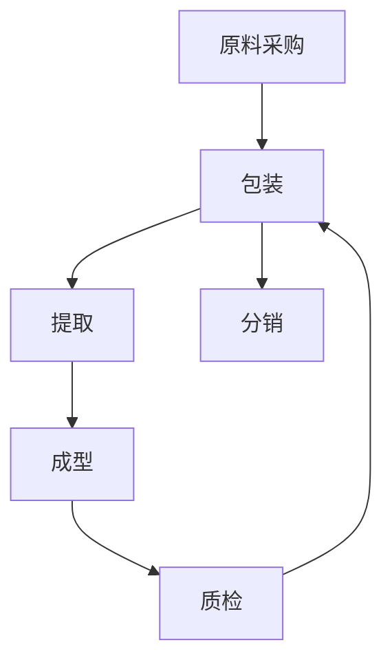

                 


# 植物基肉类替代品市场的增长与投资机会

## 关键词：植物基肉类替代品、市场增长、投资机会、可持续发展、食品技术

## 摘要：本文探讨了植物基肉类替代品市场的增长趋势及其背后的投资机会。通过分析市场背景、核心概念、技术原理、系统架构以及实际案例，本文为读者提供了深入的见解，帮助投资者和企业抓住这一领域的机遇。

---

## 第一部分：背景介绍

### 第1章：植物基肉类替代品的定义与背景

#### 1.1 问题背景
- **现代肉类消费的环境问题**：传统肉类生产导致温室气体排放、水资源消耗和土地退化。
- **动物养殖对环境的影响**：畜牧业是全球第二大温室气体排放源，占全球水足迹的三分之一。
- **消费者健康意识的提升**：高肉饮食与慢性疾病（如心脏病、糖尿病）相关，消费者转向更健康的食品选择。

#### 1.2 问题描述
- **植物基肉类替代品的定义**：通过植物蛋白、脂肪和其他成分模拟真实肉类的产品，如植物基汉堡、香肠等。
- **当前市场的主要问题**：消费者对产品真实性和口味的质疑，生产成本高，市场接受度仍需提升。
- **市场增长的驱动因素**：健康饮食趋势、环保意识增强、技术进步。

#### 1.3 问题解决
- **植物基替代品的技术突破**：通过精准提取和调配植物蛋白，模拟肉类口感和质地。
- **市场需求的增长**：消费者对健康、环保食品的需求推动市场扩大。
- **可持续发展的解决方案**：减少环境影响，支持可持续发展目标。

#### 1.4 边界与外延
- **与传统肉类的区分**：植物基替代品不含动物成分，但需满足营养和口感需求。
- **市场的地理分布**：欧美市场成熟，亚洲市场增长迅速。
- **相关产业的关联性**：影响农业、食品加工、零售等多个行业。

#### 1.5 核心要素组成
- **关键原料分析**：豌豆蛋白、大豆蛋白、椰子油等。
- **生产工艺特点**：高温灭菌、酶解处理、脂肪模拟技术。
- **市场推广策略**：品牌营销、健康标签认证、消费者教育。

---

## 第二部分：核心概念与联系

### 第2章：核心概念的原理与联系

#### 2.1 消费者需求分析
- **健康饮食的趋势**：消费者寻求低脂、高蛋白的食品。
- **环保意识的影响**：消费者支持环保产品，愿意为可持续产品支付溢价。
- **价格敏感性分析**：价格接近传统肉类时更易被接受。

#### 2.2 技术驱动因素
- **植物蛋白提取技术**：利用酶解法提取高纯度蛋白质，如豌豆蛋白。
- **脂肪替代技术**：使用植物油模拟动物脂肪的口感。
- **口感优化技术**：通过结构设计和调味提升消费者体验。

#### 2.3 政策与法规支持
- **各国政策对比**：欧盟推动可持续食品，美国支持植物基产品认证。
- **行业标准的制定**：如美国FDA对植物基产品的 labeling guidelines。
- **法规对市场的影响**：明确法规促进市场规范发展。

#### 2.4 核心概念属性对比表
| 属性       | 消费者需求 | 技术驱动 | 政策支持 |
|------------|------------|----------|----------|
| 关注点       | 健康、环保 | 口感、营养 | 标准化、认证 |
| 主要挑战     | 价格、认知 | 技术瓶颈 | 法规模糊 |
| 解决方案     | 教育推广 | 技术创新 | 政策引导 |

#### 2.5 产业链实体关系图


---

## 第三部分：市场分析与技术原理

### 第3章：市场分析

#### 3.1 市场规模
- **全球市场规模**：预计2023年达到500亿美元，年复合增长率15%。
- **区域分布**：北美市场最大，欧洲和亚洲增长迅速。

#### 3.2 增长驱动力
- **健康趋势**：消费者转向植物基饮食。
- **技术创新**：新型原料和工艺提升产品竞争力。
- **政策支持**：各国政府推动可持续食品。

#### 3.3 消费者行为
- **年轻群体主导**：Z世代和千禧一代更关注健康和环保。
- **价格敏感性**：价格接近传统肉类时更易被接受。

### 第4章：技术分析

#### 4.1 关键技术
- **蛋白质提取**：通过酶解和超滤技术提取高纯度植物蛋白。
- **脂肪模拟**：使用植物油和纤维素结构模拟动物脂肪。
- **口感优化**：调配调味料和结构设计提升消费者体验。

#### 4.2 生产流程


---

## 第四部分：投资策略与案例分析

### 第5章：投资策略

#### 5.1 投资机会
- **新兴市场**：亚洲和拉丁美洲增长潜力大。
- **技术创新**：投资新型原料和工艺改进。
- **品牌建设**：加强消费者教育和品牌推广。

#### 5.2 投资风险
- **技术风险**：产品口感和营养仍需改进。
- **市场风险**：消费者接受度有限。
- **竞争风险**：行业竞争加剧。

#### 5.3 成功案例
- **Beyond Meat**：通过创新技术和营销成为行业领导者。
- **Impossible Foods**：利用专利技术提升产品竞争力。

---

## 第五部分：系统架构与项目实战

### 第6章：系统架构

#### 6.1 企业系统架构


#### 6.2 系统功能设计
- **供应链管理**：优化原料采购和物流。
- **生产监控**：实时监控生产过程，确保产品质量。
- **消费者互动**：通过社交媒体和电商平台与消费者互动。

---

## 第六部分：项目实战与总结

### 第7章：项目实战

#### 7.1 环境安装
- **开发环境**：Python 3.8+, Mermaid CLI, VS Code。

#### 7.2 核心代码实现
```python
def plant_based_recipe(ingredients):
    for ingredient in ingredients:
        if ingredient == "pea_protein":
            print("使用豌豆蛋白作为主要蛋白质来源")
        elif ingredient == "coconut_oil":
            print("使用椰子油模拟脂肪口感")
    return "植物基产品配方完成"
```

#### 7.3 案例分析
- **案例一**：成功开发植物基汉堡，口感接近真实牛肉。
- **案例二**：通过社交媒体营销提升品牌认知度。

### 第8章：结论与建议

#### 8.1 总结
- 植物基肉类替代品市场潜力巨大，技术进步和消费者需求推动增长。
- 投资者应关注技术创新和新兴市场。

#### 8.2 投资建议
- 选择技术领先、市场定位清晰的品牌。
- 关注政策变化和行业趋势。

#### 8.3 注意事项
- 产品口感和营养仍是关键挑战。
- 需加强消费者教育和品牌建设。

#### 8.4 未来展望
- 技术创新将推动产品升级。
- 全球市场整合和合作将加速行业增长。

---

通过以上分析，植物基肉类替代品市场展现出巨大的增长潜力，投资者和企业应抓住这一趋势，结合技术创新和市场洞察，抢占未来食品市场的先机。

