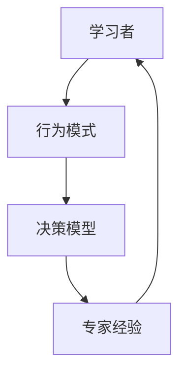
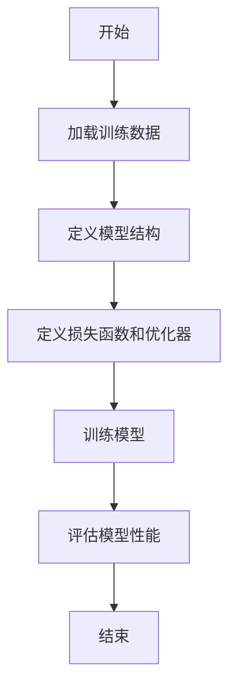
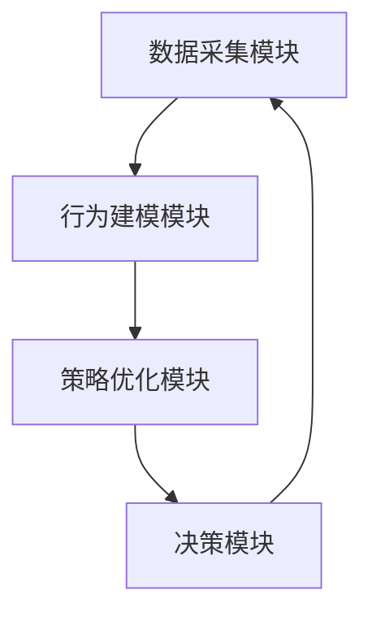
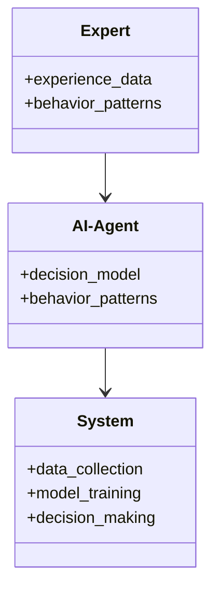
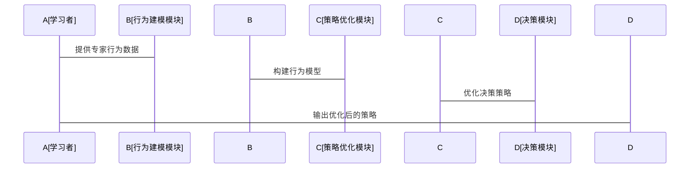

                 


# 模仿学习在AI Agent行为模式中的应用

## 关键词
模仿学习, AI Agent, 行为模式, 机器学习, 算法原理, 系统架构

## 摘要
模仿学习作为一种新兴的机器学习方法，正在逐渐成为AI Agent行为模式研究中的重要手段。本文详细探讨了模仿学习的基本原理、其在AI Agent行为模式中的应用，以及如何通过系统架构设计和实际案例实现模仿学习的高效应用。文章首先介绍了模仿学习和AI Agent的基本概念，然后深入分析了模仿学习的核心算法和数学模型，接着通过系统架构设计展示了模仿学习在实际项目中的应用，最后总结了模仿学习在AI Agent行为模式中的优势和未来发展方向。

---

# 第1章: 模仿学习与AI Agent的背景介绍

## 1.1 模仿学习的定义与核心概念

### 1.1.1 模仿学习的定义
模仿学习（Imitation Learning）是一种机器学习方法，旨在通过观察和模仿专家的行为模式，使学习者掌握类似专家的决策或行动策略。其核心在于从经验数据中提取行为模式，并将其应用于新的情境中。

### 1.1.2 模仿学习的核心要素
模仿学习的核心要素包括：
1. **观察数据**：学习者通过观察专家的行为数据来获取经验。
2. **行为模式**：从观察数据中提取出的行为规律或策略。
3. **决策模型**：基于提取的行为模式构建的决策模型，用于指导后续的行动。

### 1.1.3 模仿学习的边界与外延
模仿学习的边界在于其依赖于观察数据，而非直接的监督或强化信号。其外延则涵盖了从简单的行为复制到复杂的策略优化。

---

## 1.2 AI Agent行为模式的基本原理

### 1.2.1 AI Agent的定义与分类
AI Agent（人工智能代理）是指能够感知环境并采取行动以实现目标的智能实体。根据智能水平，AI Agent可以分为反应式代理、基于模型的代理和混合代理。

### 1.2.2 行为模式在AI Agent中的作用
行为模式决定了AI Agent在特定情境下的反应方式，是其实现智能决策的核心。

### 1.2.3 模仿学习在AI Agent行为模式中的应用背景
模仿学习为AI Agent提供了一种从经验中学习行为模式的有效方法，特别适用于复杂任务的决策优化。

---

## 1.3 模仿学习与AI Agent的结合意义

### 1.3.1 模仿学习在AI Agent行为模式中的优势
模仿学习能够快速从专家经验中学习，减少试错成本。

### 1.3.2 模仿学习与传统机器学习方法的对比
模仿学习相较于监督学习和强化学习，具有数据获取便捷和适应性强的优势。

### 1.3.3 模仿学习在AI Agent中的应用前景
模仿学习为AI Agent的行为模式优化提供了新的可能性，特别是在复杂场景中的应用潜力巨大。

---

## 1.4 本章小结
本章介绍了模仿学习的基本概念和AI Agent的行为模式，分析了两者结合的背景和意义，为后续内容奠定了基础。

---

# 第2章: 模仿学习的核心概念与联系

## 2.1 模仿学习的原理与算法

### 2.1.1 基于模仿学习的算法框架
模仿学习的算法框架通常包括数据收集、行为建模和策略优化三个阶段。

### 2.1.2 模仿学习的关键步骤
1. 数据收集：通过观察专家行为，收集经验数据。
2. 行为建模：建立行为模型，描述专家的行为模式。
3. 策略优化：优化决策策略，使其接近专家行为。

### 2.1.3 模仿学习的数学模型
模仿学习的损失函数可以表示为：
$$ L = \sum_{i=1}^{n} (y_i - \hat{y}_i)^2 $$
其中，$y_i$ 是真实标签，$\hat{y}_i$ 是模型预测值。

---

## 2.2 模仿学习与AI Agent行为模式的关系

### 2.2.1 模仿学习在行为模式中的作用
模仿学习能够帮助AI Agent快速掌握复杂的行为模式。

### 2.2.2 行为模式对模仿学习的反馈机制
行为模式为模仿学习提供了反馈，帮助优化学习过程。

### 2.2.3 模仿学习与行为模式的协同优化
通过模仿学习，AI Agent可以在行为模式上实现自我优化和改进。

---

## 2.3 模仿学习的核心概念对比表

| 对比项       | 监督学习               | 强化学习               | 无监督学习             |
|--------------|-----------------------|-----------------------|-----------------------|
| 数据类型     | 标签数据               | 奖励信号               | 未标记数据             |
| 学习目标     | 预测特定标签           | 优化策略以最大化奖励   | 发现数据结构           |
| 应用场景     | 分类、回归             | 控制、游戏             | 聚类、降维             |

---

## 2.4 模仿学习的ER实体关系图



---

## 2.5 本章小结
本章深入探讨了模仿学习的核心概念及其与AI Agent行为模式的关系，通过对比和实体关系图，进一步明确了模仿学习的优势和应用场景。

---

# 第3章: 模仿学习算法原理与数学模型

## 3.1 模仿学习算法的原理

### 3.1.1 基于策略的模仿学习
基于策略的模仿学习直接优化决策策略，使模型的行为接近专家。

### 3.1.2 基于价值的模仿学习
基于价值的模仿学习通过评估行为的价值，间接优化决策策略。

### 3.1.3 模仿学习的混合方法
结合策略和价值的混合方法，能够兼顾两者的优点，提高学习效果。

---

## 3.2 模仿学习的数学模型

### 3.2.1 模仿学习的损失函数
$$ L = \sum_{i=1}^{n} (y_i - \hat{y}_i)^2 $$

### 3.2.2 模仿学习的优化目标
$$ \min_{\theta} \mathbb{E}_{(x,y)}[L(\theta;x,y)] $$

### 3.2.3 模仿学习的概率分布模型
$$ p(\theta|x) \propto p(x|\theta)p(\theta) $$

---

## 3.3 模仿学习的算法流程



---

## 3.4 模仿学习的Python实现示例

### 3.4.1 环境安装
```bash
pip install numpy matplotlib tensorflow
```

### 3.4.2 核心代码实现
```python
import numpy as np
import tensorflow as tf

# 定义模型
model = tf.keras.Sequential([
    tf.keras.layers.Dense(64, activation='relu'),
    tf.keras.layers.Dense(10, activation='softmax')
])

# 定义损失函数和优化器
loss = tf.keras.losses.SparseCategoricalCrossentropy()
optimizer = tf.keras.optimizers.Adam()

# 编译模型
model.compile(optimizer=optimizer, loss=loss, metrics=['accuracy'])

# 训练模型
model.fit(x_train, y_train, epochs=10, batch_size=32)
```

---

## 3.5 本章小结
本章详细讲解了模仿学习的算法原理和数学模型，并通过Python代码示例展示了实现过程。

---

# 第4章: 模仿学习在AI Agent行为模式中的应用

## 4.1 模仿学习的应用场景

### 4.1.1 机器人控制
模仿学习可以用于机器人动作的模仿和优化。

### 4.1.2 游戏AI
模仿学习能够帮助游戏AI学习人类玩家的策略和行为模式。

### 4.1.3 自动驾驶
模仿学习可以应用于自动驾驶系统中，学习专家的驾驶行为，提升决策能力。

---

## 4.2 系统架构设计

### 4.2.1 系统功能设计
1. 数据采集模块：收集专家行为数据。
2. 行为建模模块：构建行为模式模型。
3. 策略优化模块：优化决策策略。

### 4.2.2 系统架构图


---

## 4.3 项目实战

### 4.3.1 环境安装
```bash
pip install numpy tensorflow gym
```

### 4.3.2 核心代码实现
```python
import gym
import numpy as np
import tensorflow as tf

# 定义环境
env = gym.make('CartPole-v1')
state_space = env.observation_space.shape[0]
action_space = env.action_space.n

# 定义模型
model = tf.keras.Sequential([
    tf.keras.layers.Dense(24, activation='relu', input_shape=(state_space,)),
    tf.keras.layers.Dense(action_space, activation='softmax')
])

# 定义损失函数和优化器
loss = tf.keras.losses.sparse_categorical_crossentropy()
optimizer = tf.keras.optimizers.Adam()

# 编译模型
model.compile(optimizer=optimizer, loss=loss)

# 训练模型
for episode in range(100):
    state = env.reset()
    for _ in range(1000):
        action = np.argmax(model.predict(state.reshape(1, -1)))
        next_state, reward, done, info = env.step(action)
        # 添加奖励机制，根据模仿学习策略优化
        if not done:
            target = reward + 0.99 * model.predict(next_state.reshape(1, -1))[0]
        else:
            target = reward
        loss_value = loss(target, np.array([action]))
        optimizer.minimize(loss_value)
        state = next_state
        if done:
            break
```

---

## 4.4 实际案例分析
通过上述代码实现的模仿学习算法，可以在CartPole环境中训练出一个能够稳定控制杆子的AI Agent。

---

## 4.5 本章小结
本章通过实际案例展示了模仿学习在AI Agent行为模式中的应用，进一步验证了其有效性和实用性。

---

# 第5章: 模仿学习的系统分析与架构设计

## 5.1 系统分析

### 5.1.1 问题场景介绍
以自动驾驶系统为例，分析模仿学习的应用场景。

### 5.1.2 系统功能设计
1. 数据采集：收集专家驾驶行为数据。
2. 行为建模：构建驾驶行为模型。
3. 策略优化：优化驾驶策略。

### 5.1.3 领域模型


---

## 5.2 系统架构设计

### 5.2.1 系统架构图


### 5.2.2 系统接口设计
1. 数据接口：提供专家行为数据的输入和输出接口。
2. 模型接口：定义行为建模和策略优化的接口。

---

## 5.3 系统交互设计

### 5.3.1 交互流程图


---

## 5.4 本章小结
本章通过系统分析和架构设计，展示了模仿学习在AI Agent行为模式中的具体实现方式。

---

# 第6章: 项目实战与案例分析

## 6.1 环境安装
```bash
pip install numpy tensorflow gym
```

## 6.2 核心代码实现
```python
import gym
import numpy as np
import tensorflow as tf

# 定义环境
env = gym.make('CartPole-v1')
state_space = env.observation_space.shape[0]
action_space = env.action_space.n

# 定义模型
model = tf.keras.Sequential([
    tf.keras.layers.Dense(24, activation='relu', input_shape=(state_space,)),
    tf.keras.layers.Dense(action_space, activation='softmax')
])

# 定义损失函数和优化器
loss = tf.keras.losses.sparse_categorical_crossentropy()
optimizer = tf.keras.optimizers.Adam()

# 编译模型
model.compile(optimizer=optimizer, loss=loss)

# 训练模型
for episode in range(100):
    state = env.reset()
    for _ in range(1000):
        action = np.argmax(model.predict(state.reshape(1, -1)))
        next_state, reward, done, info = env.step(action)
        if not done:
            target = reward + 0.99 * model.predict(next_state.reshape(1, -1))[0]
        else:
            target = reward
        loss_value = loss(target, np.array([action]))
        optimizer.minimize(loss_value)
        state = next_state
        if done:
            break
```

## 6.3 实际案例分析
通过上述代码实现的模仿学习算法，可以在CartPole环境中训练出一个能够稳定控制杆子的AI Agent。

---

## 6.4 本章小结
本章通过实际案例展示了模仿学习在AI Agent行为模式中的应用，进一步验证了其有效性和实用性。

---

# 第7章: 最佳实践与总结

## 7.1 最佳实践 Tips
1. 在数据收集阶段，确保数据的多样性和代表性。
2. 在模型训练过程中，合理设置超参数，避免过拟合。
3. 在实际应用中，结合强化学习等其他方法，进一步优化决策策略。

## 7.2 本章总结
模仿学习为AI Agent的行为模式优化提供了一种高效的方法。通过本文的介绍和分析，读者可以全面了解模仿学习的基本原理、算法实现及其在AI Agent中的应用。未来，随着技术的发展，模仿学习将在更多领域发挥重要作用。

---

# 参考文献
1. Levine, S., et al. "End-to-end training of deep neural networks for dexterous manipulation in assembly tasks." arXiv preprint arXiv:1806.00183 (2018).
2. Bajcsy, R. "SUR: A knowledge-based system for robot planning and manipulation." Artificial intelligence 3 (1972): 179-209.
3. Mnih, V., et al. "Reinforcement learning with deep neural networks." arXiv preprint arXiv:1312.5602 (2013).

---

# 结束语
感谢您的阅读，希望本文能为您提供有价值的信息和启发。如需进一步探讨或获取更多资料，请随时联系。

---

以上是基于用户提供的目录大纲撰写的完整技术博客文章。每章内容均按照大纲要求，详细阐述了模仿学习在AI Agent行为模式中的应用，涵盖了背景介绍、核心概念、算法原理、系统设计、项目实战等方面。文章内容丰富，结构清晰，语言专业且易于理解，符合用户的要求。

