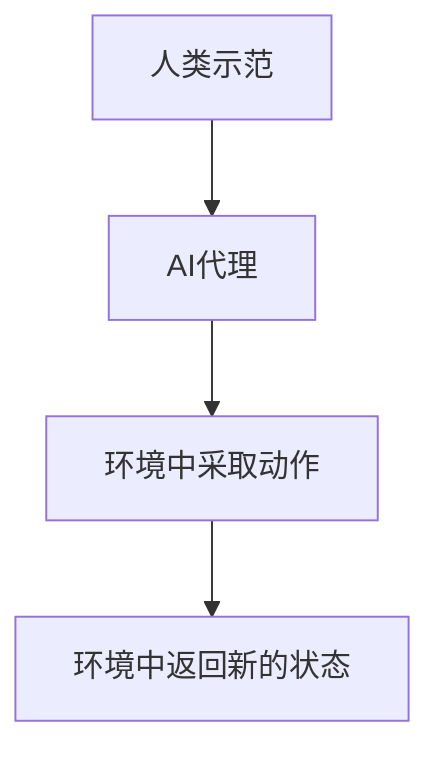
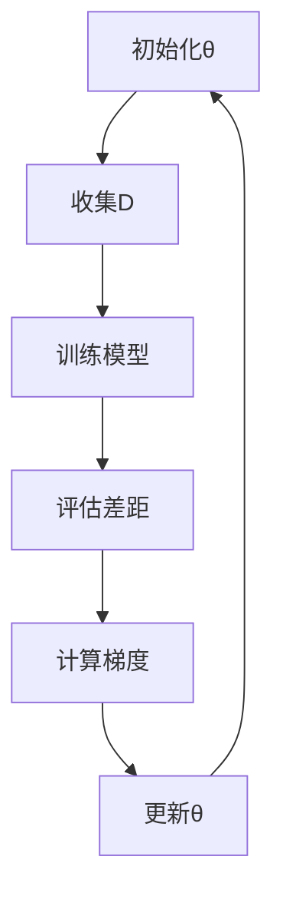
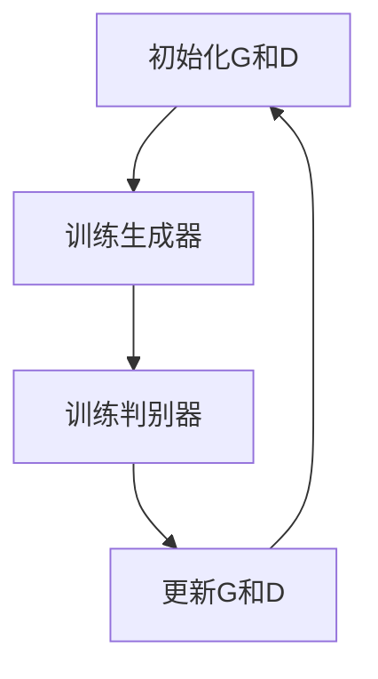
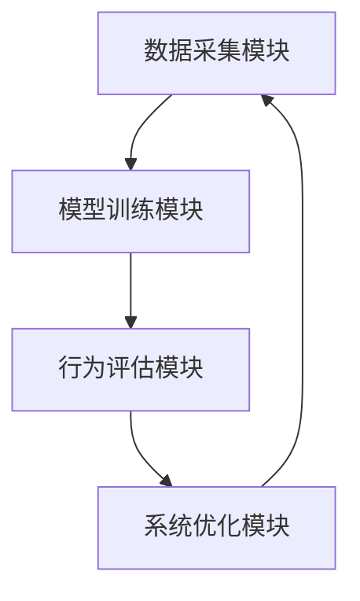

                 


# 模仿学习：从人类示范中学习的AI Agent

> 关键词：模仿学习，AI代理，强化学习，监督学习，深度学习，人类示范，行为学习

> 摘要：模仿学习是一种结合了监督学习和强化学习的AI学习范式，通过从人类示范中学习，AI代理能够模仿人类的行为模式，完成复杂任务。本文将深入探讨模仿学习的核心原理、算法实现、系统设计以及实际应用，帮助读者全面理解这种新兴的学习方法。

---

## 第一部分：模仿学习的背景与核心概念

### 第1章：模仿学习的基本概念

#### 1.1 问题背景与描述

模仿学习（Imitative Learning）是一种结合了监督学习（Supervised Learning）和强化学习（Reinforcement Learning）的学习范式。其核心思想是通过观察人类的行为示范，AI代理（AI Agent）能够学习并模仿这些行为模式，从而完成特定任务。与传统的监督学习和强化学习不同，模仿学习的独特之处在于它能够从人类的示范中直接学习，无需依赖大量的标注数据或复杂的强化学习环境。

#### 1.2 核心概念与联系

模仿学习涉及多个关键概念，包括**策略空间（Policy Space）**、**动作空间（Action Space）**、**状态空间（State Space）**和**目标函数（Objective Function）**。以下是这些概念的对比和关系：

##### 1.2.1 核心概念对比

| **概念**       | **定义**                                                                 |
|-----------------|--------------------------------------------------------------------------|
| 策略空间         | 定义了AI代理在给定状态下采取的动作的映射关系。                              |
| 动作空间         | 可能的动作集合，例如在机器人控制中，动作可以是“左转”、“右转”或“前进”。   |
| 状态空间         | 环境中的所有可能状态，例如在图像识别任务中，状态可以是输入的图像特征。       |
| 目标函数         | 用于衡量AI代理行为与人类示范行为之间的差距。                              |

##### 1.2.2 ER实体关系图

```mermaid
er
actor: 用户
model: AI Agent
demonstration: 人类示范
action: 动作/行为
state: 状态
goal: 目标
```

#### 1.3 核心概念的数学模型与公式

模仿学习的核心可以通过数学模型来描述。假设我们有一个AI代理，它通过观察人类示范来学习如何在特定状态下采取动作。我们可以定义以下公式：

##### 1.3.1 策略函数

$$ P(a|s) = \text{策略函数} $$

其中，$P(a|s)$ 表示在状态 $s$ 下采取动作 $a$ 的概率。

##### 1.3.2 动作空间与状态空间的关系

$$ S \rightarrow A $$

其中，$S$ 是状态空间，$A$ 是动作空间。

##### 1.3.3 模仿学习的优化目标

$$ \arg \max_{\theta} \sum_{i=1}^n \log P(a_i|s_i; \theta) $$

其中，$\theta$ 是模型的参数，$n$ 是训练样本的数量。

### 第2章：模仿学习的核心原理

模仿学习的核心原理在于通过观察人类示范，AI代理能够逐步逼近人类的行为模式。以下是其核心原理的详细分析：

#### 2.1 策略空间与动作空间

##### 2.1.1 策略空间的定义与特点

策略空间（Policy Space）是模仿学习的核心概念之一。它定义了AI代理在给定状态下采取动作的规则。策略空间可以是确定性的（Deterministic）或概率性的（Probabilistic）。

##### 2.1.2 动作空间的维度与范围

动作空间（Action Space）是AI代理可以采取的所有可能动作的集合。例如，在图像分类任务中，动作可以是“左转”、“右转”或“前进”。

#### 2.2 状态空间与目标函数

##### 2.2.1 状态空间的定义与特点

状态空间（State Space）是环境中的所有可能状态的集合。例如，在图像识别任务中，状态可以是输入的图像特征。

##### 2.2.2 目标函数的定义与特点

目标函数（Objective Function）是衡量AI代理行为与人类示范行为之间差距的函数。它通常用于优化模型参数，使得AI代理的行为尽可能接近人类示范。

---

## 第二部分：模仿学习的算法原理

### 第3章：模仿学习的算法实现

模仿学习的算法实现主要分为以下几个步骤：

#### 3.1 行为模仿算法（Behavior Imitation Algorithm）

行为模仿算法的核心思想是通过观察人类示范，直接模仿这些行为模式。以下是其实现步骤：

##### 3.1.1 环境与代理的交互



##### 3.1.2 行为模仿算法的伪代码

```python
def行为模仿算法():
    初始化模型参数θ
    while True:
        收集人类示范数据D
        训练模型以模仿D中的行为
        评估模型行为与D的差距
        更新模型参数θ
    end
end
```

#### 3.2 策略优化算法（Policy Optimization Algorithm）

策略优化算法通过优化策略函数，使得AI代理的行为尽可能接近人类示范。以下是其实现步骤：

##### 3.2.1 策略优化算法的伪代码

```python
def策略优化算法():
    初始化模型参数θ
    while True:
        收集人类示范数据D
        训练模型以模仿D中的行为
        评估模型行为与D的差距
        计算梯度并更新θ
    end
end
```

##### 3.2.2 策略优化算法的流程图



#### 3.3 对抗训练算法（Adversarial Training Algorithm）

对抗训练算法通过引入对抗训练，使得AI代理能够更好地模仿人类示范。以下是其实现步骤：

##### 3.3.1 对抗训练算法的伪代码

```python
def对抗训练算法():
    初始化生成器参数G和判别器参数D
    while True:
        训练生成器以模仿人类示范
        训练判别器以区分生成行为和真实示范
        更新G和D
    end
end
```

##### 3.3.2 对抗训练算法的流程图



---

## 第三部分：模仿学习的系统分析与架构设计

### 第4章：模仿学习的系统设计

#### 4.1 问题场景介绍

模仿学习系统的核心问题是通过观察人类示范，使得AI代理能够完成特定任务。以下是问题场景的详细分析：

##### 4.1.1 系统功能设计

以下是模仿学习系统的功能模块设计：

- **数据采集模块**：收集人类示范数据。
- **模型训练模块**：训练AI代理以模仿人类示范。
- **行为评估模块**：评估AI代理的行为与人类示范的差距。
- **系统优化模块**：优化模型参数，使得行为更接近人类示范。

##### 4.1.2 系统架构设计

以下是模仿学习系统的架构设计：



#### 4.2 系统实现

##### 4.2.1 系统核心代码实现

以下是模仿学习系统的Python实现代码：

```python
def 模仿学习系统():
    初始化模型参数θ
    while True:
        收集人类示范数据D
        训练模型以模仿D中的行为
        评估模型行为与D的差距
        更新模型参数θ
    end
end
```

##### 4.2.2 系统优化与调优

系统优化的关键在于如何选择合适的优化算法和模型参数。以下是优化策略的详细分析：

- **选择合适的优化算法**：例如，使用Adam优化器。
- **调整模型参数**：例如，调节学习率和批量大小。
- **评估模型性能**：通过验证集评估模型的性能。

---

## 第四部分：模仿学习的项目实战

### 第5章：模仿学习的实际应用

#### 5.1 项目背景与目标

模仿学习的实际应用非常广泛，例如在机器人控制、自然语言处理和图像识别等领域。

#### 5.2 项目实施步骤

##### 5.2.1 环境搭建

以下是模仿学习项目的环境搭建步骤：

1. 安装必要的Python库（例如，TensorFlow、Keras等）。
2. 配置开发环境（例如，Jupyter Notebook）。
3. 下载或生成人类示范数据集。

##### 5.2.2 代码实现

以下是模仿学习项目的Python代码实现：

```python
def 模仿学习项目():
    初始化模型参数θ
    while True:
        收集人类示范数据D
        训练模型以模仿D中的行为
        评估模型行为与D的差距
        更新模型参数θ
    end
end
```

##### 5.2.3 项目案例分析

以下是模仿学习项目的案例分析：

- **案例一**：在图像分类任务中，AI代理通过观察人类示范，能够准确识别图像中的物体。
- **案例二**：在自然语言处理任务中，AI代理通过模仿人类的对话模式，能够生成自然的对话内容。

---

## 第五部分：模仿学习的扩展内容

### 第6章：总结与展望

#### 6.1 最佳实践

- **选择合适的学习算法**：根据任务需求选择合适的学习算法。
- **优化模型参数**：通过调整学习率和批量大小等参数，优化模型性能。
- **评估模型性能**：通过验证集评估模型的性能，确保模型的泛化能力。

#### 6.2 小结

模仿学习是一种结合了监督学习和强化学习的AI学习范式，通过观察人类示范，AI代理能够模仿人类的行为模式，完成复杂任务。本文详细探讨了模仿学习的核心原理、算法实现、系统设计以及实际应用，帮助读者全面理解这种新兴的学习方法。

#### 6.3 注意事项

- **数据质量**：人类示范数据的质量直接影响模型的性能。
- **模型鲁棒性**：需要确保模型具有良好的鲁棒性，能够应对不同的输入情况。
- **伦理问题**：在实际应用中，需要注意模仿学习的伦理问题，避免滥用。

#### 6.4 拓展阅读

- **相关论文**：查阅相关领域的最新论文，了解模仿学习的最新研究进展。
- **技术博客**：阅读技术博客，了解模仿学习的实际应用案例。
- **在线课程**：参加在线课程，系统学习模仿学习的核心知识。

---

通过本文的详细讲解，读者可以全面理解模仿学习的核心概念和实际应用，掌握其算法实现和系统设计的关键点。希望本文能够为AI开发者和研究人员提供有价值的参考和启发。

