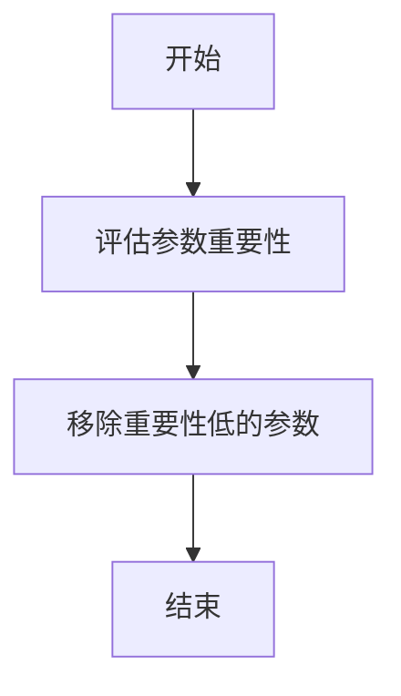
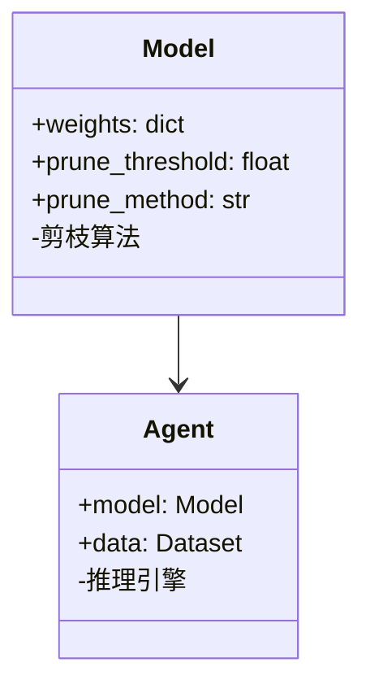

                 


# 模型剪枝：精简AI Agent的参数规模

## 关键词：模型剪枝，AI Agent，参数规模，算法原理，系统架构

## 摘要：模型剪枝是一种有效的技术，用于减少AI Agent的参数规模，提升性能和推理效率。本文将深入探讨模型剪枝的核心概念、算法原理、系统架构设计以及实战应用，帮助读者全面理解并掌握这一技术。

---

# 第一部分：模型剪枝概述

## 第1章：模型剪枝的概念与背景

### 1.1 什么是模型剪枝
模型剪枝是一种通过移除或合并模型中冗余的参数或结构，以减少模型复杂度的技术。这种技术在AI Agent中尤为重要，因为它可以显著降低计算资源消耗，同时保持甚至提升模型性能。

### 1.2 模型剪枝的背景与意义
随着AI技术的快速发展，模型的参数规模越来越大，导致计算资源消耗过高，推理速度变慢。模型剪枝通过减少参数数量，解决了这些问题，同时保持模型性能。

### 1.3 模型剪枝的目标与应用场景
模型剪枝的目标是通过精简参数规模，降低计算成本，提升推理效率。应用场景包括图像识别、自然语言处理和推荐系统等。

---

## 第2章：模型剪枝的核心概念

### 2.1 参数剪枝与结构剪枝
参数剪枝通过移除冗余权重来减少参数数量，而结构剪枝则通过移除冗余节点或边来简化网络结构。

### 2.2 模型压缩与模型剪枝的区别
模型压缩通过量化或低秩分解等技术减少参数存储空间，而模型剪枝直接移除冗余参数或结构。

### 2.3 模型剪枝的衡量指标
包括参数减少率、模型准确率下降幅度和推理速度提升幅度等。

---

# 第二部分：模型剪枝的算法原理

## 第3章：参数剪枝算法

### 3.1 贪心剪枝算法
通过评估每个参数的重要性，逐步移除对模型影响最小的参数。



### 3.2 基于梯度的剪枝算法
利用梯度信息识别冗余参数，进行剪枝。

```python
def greedy_prune(weights, threshold):
    pruned_weights = {}
    for layer in weights:
        if abs(weights[layer]) > threshold:
            pruned_weights[layer] = weights[layer]
    return pruned_weights
```

## 第4章：结构剪枝算法

### 4.1 基于节点重要性的结构剪枝
通过评估节点的重要性，移除冗余节点。

### 4.2 基于边重要性的结构剪枝
通过评估边的重要性，移除冗余边。

### 4.3 动态结构剪枝
根据输入数据动态调整网络结构。

---

# 第三部分：模型剪枝的系统架构设计

## 第5章：AI Agent系统的架构设计

### 5.1 系统功能设计
包括参数剪枝、结构剪枝和剪枝后模型优化等功能。



### 5.2 接口设计
定义API接口，用于剪枝操作和模型优化。

### 5.3 序列图设计
展示系统模块之间的协作关系。

---

# 第四部分：模型剪枝的实战应用

## 第6章：图像分类任务中的模型剪枝

### 6.1 环境搭建
安装必要的库，如TensorFlow和Keras。

### 6.2 模型实现
定义模型结构，进行训练和剪枝。

```python
def model_prune(model, threshold=0.1):
    pruned_model = copy.deepcopy(model)
    for layer in pruned_model.layers:
        weights = layer.get_weights()
        pruned_weights = [w * (w > threshold) for w in weights]
        layer.set_weights(pruned_weights)
    return pruned_model
```

### 6.3 结果分析
比较剪枝前后的模型性能和推理速度。

---

# 第五部分：模型剪枝的最佳实践

## 第7章：模型剪枝的优化技巧

### 7.1 参数选择
合理选择剪枝阈值，避免过度剪枝。

### 7.2 模型选择
选择适合剪枝的模型架构，如深度较浅的网络。

### 7.3 剪枝后优化
对剪枝后的模型进行微调，恢复性能。

---

## 总结
模型剪枝是一种有效的技术，可以显著减少AI Agent的参数规模，提升性能和推理效率。通过理解其核心概念、算法原理和实战应用，读者可以更好地掌握这一技术，并在实际项目中应用。

