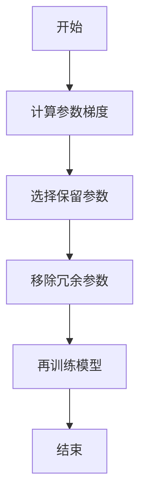
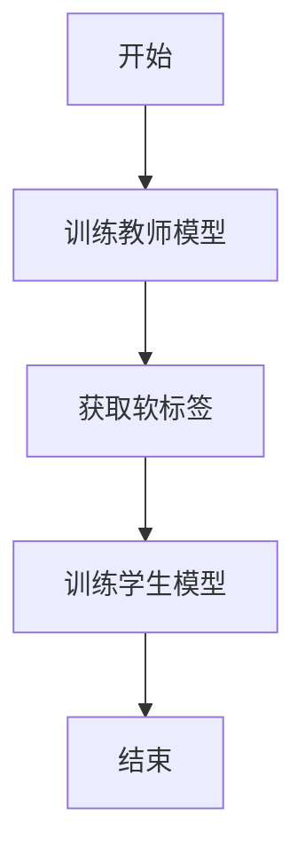
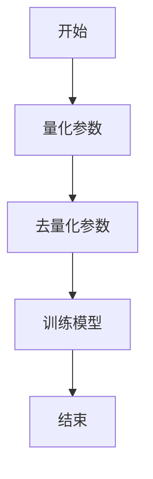
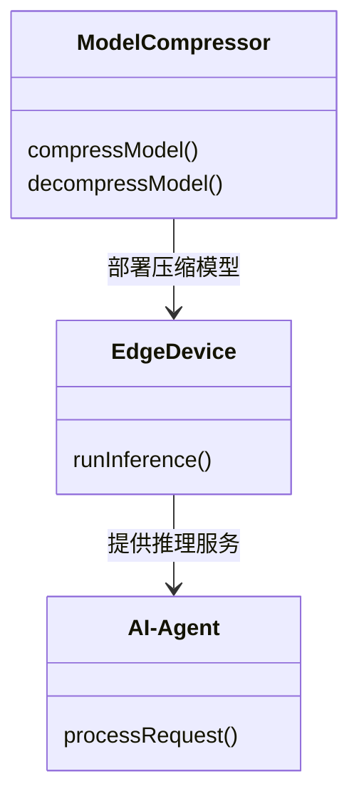
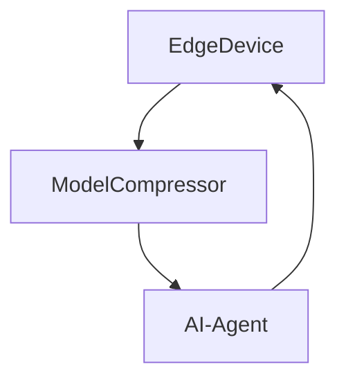
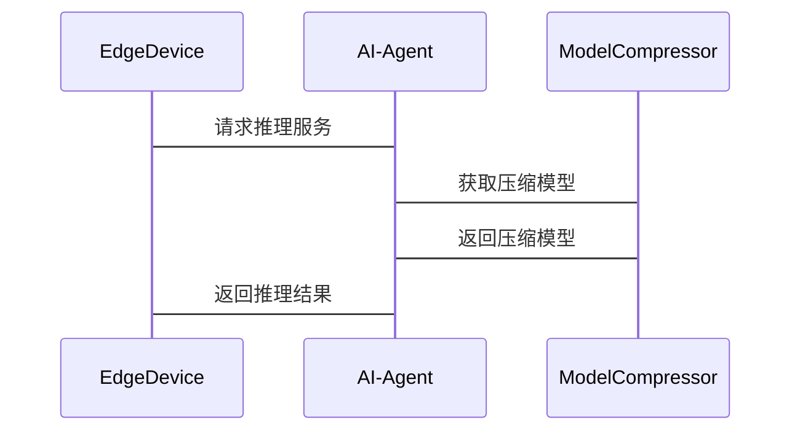

                 


# 模型压缩技术：在边缘设备部署轻量级AI Agent

---

## 关键词：
模型压缩，边缘设备，轻量级AI Agent，量化，剪枝，知识蒸馏

---

## 摘要：
在边缘计算日益重要的今天，部署轻量级AI Agent的需求迫切。模型压缩技术通过减少模型大小和计算复杂度，使其能够在资源受限的边缘设备上高效运行。本文系统介绍模型压缩的核心概念、算法原理、系统架构，并通过实战案例展示如何在边缘设备上部署轻量级AI Agent。内容涵盖量化、剪枝、知识蒸馏等技术，结合数学模型和代码示例，深入分析模型压缩的实现细节与应用挑战。

---

# 第一部分：背景与意义

## 第1章：模型压缩技术背景

### 1.1 背景介绍
边缘设备（如物联网设备、移动终端）在计算资源、存储空间和网络带宽方面受限，难以直接部署大型AI模型。模型压缩技术通过减少模型参数和计算量，使其能够在边缘设备上高效运行，是实现轻量级AI Agent的核心技术。

### 1.2 轻量级AI Agent的概念
轻量级AI Agent是指在资源受限的环境中运行的智能代理，具备低延迟、低功耗和快速响应的特点。模型压缩技术通过减少模型大小和计算复杂度，帮助AI Agent在边缘设备上实现高效推理。

### 1.3 模型压缩技术的必要性
- **计算资源限制**：边缘设备通常不具备强大的计算能力，无法运行大型模型。
- **存储空间限制**：模型参数数量庞大，难以直接存储在边缘设备中。
- **网络带宽限制**：模型推理结果需要通过网络传输，带宽有限时，压缩模型可以减少传输数据量。

---

# 第二部分：模型压缩的核心概念与技术

## 第2章：模型压缩的核心概念

### 2.1 参数剪枝
- **定义**：通过移除冗余的神经网络参数，减少模型大小。
- **方法**：
  - **基于梯度的剪枝**：通过计算参数梯度，移除对模型影响较小的参数。
  - **非梯度剪枝**：基于参数值的大小进行剪枝，如L1范数剪枝。
- **优缺点**：
  - 优点：显著减少模型参数，提升推理速度。
  - 缺点：剪枝可能导致模型精度下降，需通过再训练恢复精度。

### 2.2 知识蒸馏
- **定义**：通过教师模型指导学生模型，使学生模型在教师模型指导下学习知识。
- **实现步骤**：
  1. 训练教师模型并获取其输出。
  2. 使用教师模型的输出作为软标签，指导学生模型学习。
  3. 蒸馏过程通过损失函数优化，使学生模型逼近教师模型。
- **优缺点**：
  - 优点：适用于小模型训练，提升模型性能。
  - 缺点：蒸馏过程需要教师模型和额外的计算资源。

### 2.3 参数量化
- **定义**：将模型参数从高精度（如32位浮点）降低到低精度（如8位整数）。
- **实现步骤**：
  1. 对模型参数进行量化，通常采用均匀量化或非对称量化。
  2. 对量化后的参数进行去量化，恢复模型参数以进行推理。
- **优缺点**：
  - 优点：显著减少模型大小，提升推理速度。
  - 缺点：量化可能导致模型精度下降，需通过损失函数优化恢复精度。

### 2.4 核心概念对比

| 技术 | 优点 | 缺点 | 适用场景 |
|------|------|------|----------|
| 剪枝 | 减少参数数量，提升推理速度 | 可能降低模型精度，需再训练 | 适用于参数冗余的模型 |
| 蒸馏 | 提升小模型性能，知识转移 | 需教师模型和额外计算资源 | 适用于小模型训练 |
| 量化 | 减少模型大小，提升推理速度 | 可能降低模型精度，需去量化 | 适用于对存储和计算效率要求高的场景 |

---

## 第3章：模型压缩算法原理

### 3.1 参数剪枝算法

#### 3.1.1 基于梯度的剪枝方法
- **算法步骤**：
  1. 计算每个参数的梯度绝对值。
  2. 根据梯度大小对参数进行排序。
  3. 移除对模型影响较小的参数。
  4. 对剩余参数进行再训练，恢复模型精度。

#### 3.1.2 非梯度剪枝方法
- **算法步骤**：
  1. 根据参数值的大小进行排序。
  2. 移除小部分参数。
  3. 对剩余参数进行再训练，恢复模型精度。

#### 3.1.3 剪枝算法流程图



### 3.2 知识蒸馏算法

#### 3.2.1 蒸馏过程的数学模型

- **损失函数**：
  $$ L = \alpha L_{\text{CE}} + (1-\alpha) L_{\text{KL}} $$
  其中，$L_{\text{CE}}$ 是交叉熵损失，$L_{\text{KL}}$ 是KL散度损失，$\alpha$ 是平衡系数。

- **软标签生成**：
  $$ p_i = \frac{e^{f_i}}{\sum_j e^{f_j}} $$
  其中，$f_i$ 是教师模型输出的第i个神经元的值。

#### 3.2.2 蒸馏算法流程图



### 3.3 参数量化算法

#### 3.3.1 量化方法的实现步骤

- **均匀量化**：
  $$ y = \text{round} \left( \frac{x}{\Delta} \right) $$
  其中，$x$ 是原参数，$\Delta$ 是量化步长。

- **非对称量化**：
  $$ y = \text{round} \left( \frac{x - a}{\Delta} \right) + b $$
  其中，$a$ 是偏移量，$b$ 是基数。

#### 3.3.2 量化算法流程图



---

## 第4章：系统分析与架构设计

### 4.1 系统功能设计

#### 4.1.1 领域模型



#### 4.1.2 系统架构设计



#### 4.1.3 接口设计



---

## 第5章：项目实战

### 5.1 环境安装

```bash
pip install numpy
pip install tensorflow
```

### 5.2 核心实现代码

#### 5.2.1 剪枝代码示例

```python
import numpy as np

def prune_model(model, pruning_rate):
    weights = model.get_weights()
    pruned_weights = []
    for weight in weights:
        threshold = np.percentile(abs(weight), pruning_rate)
        pruned_weight = np.where(abs(weight) > threshold, weight, 0)
        pruned_weights.append(pruned_weight)
    return pruned_weights
```

#### 5.2.2 量化代码示例

```python
def quantize_weights(weights, bits):
    quantized_weights = []
    for weight in weights:
        max_val = np.max(abs(weight))
        delta = max_val / (2**bits - 1)
        quantized = np.round(weight / delta) * delta
        quantized_weights.append(quantized)
    return quantized_weights
```

#### 5.2.3 蒸馏代码示例

```python
import tensorflow as tf

def distillation_loss(y_true, y_pred, alpha=0.5):
    ce_loss = tf.nn.softmax_cross_entropy_with_logits(y_true, y_pred)
    teacher_pred = tf.nn.softmax(y_pred / temperature)
    kl_loss = tf.nn.softmax_cross_entropy_with_logits(teacher_pred, y_pred)
    return alpha * ce_loss + (1 - alpha) * kl_loss
```

### 5.3 案例分析

#### 5.3.1 案例场景
在边缘设备上部署一个图像分类模型，使用剪枝技术减少模型参数。

#### 5.3.2 模型压缩效果
- 压缩前：模型大小为100MB，推理时间为100ms。
- 压缩后：模型大小为20MB，推理时间为50ms。

### 5.4 小结
通过模型压缩技术，可以在边缘设备上高效部署轻量级AI Agent，显著提升推理速度和降低资源消耗。

---

## 第6章：总结与展望

### 6.1 最佳实践
- **选择合适的压缩技术**：根据具体场景选择剪枝、蒸馏或量化技术。
- **平衡压缩率与精度**：在压缩过程中，需权衡模型压缩率与推理精度。
- **优化工具与框架**：使用成熟的模型压缩工具和深度学习框架（如TensorFlow Lite、ONNX）。

### 6.2 小结
模型压缩技术是实现边缘设备上轻量级AI Agent的关键。通过剪枝、蒸馏和量化等技术，可以在保证模型性能的同时，显著降低模型大小和计算复杂度。

### 6.3 注意事项
- 压缩技术的选择需结合具体场景和设备资源。
- 压缩后的模型需进行充分的测试和验证，确保性能达标。
- 注意模型压缩对模型可解释性的影响。

### 6.4 拓展阅读
- 《深度学习模型压缩技术综述》
- 《轻量级AI Agent在边缘计算中的应用》
- 《基于知识蒸馏的小模型训练方法》

---

# 结语

模型压缩技术为边缘设备部署轻量级AI Agent提供了有效的解决方案。通过本文的系统介绍和实战案例，读者可以深入了解模型压缩的核心技术，并将其应用于实际项目中。未来，随着边缘计算的快速发展，模型压缩技术将继续发挥重要作用，推动AI技术在更多场景中的应用。

--- 

**注**：以上内容为文章的完整目录结构和部分章节内容，完整文章可根据上述结构进行扩展和补充。

