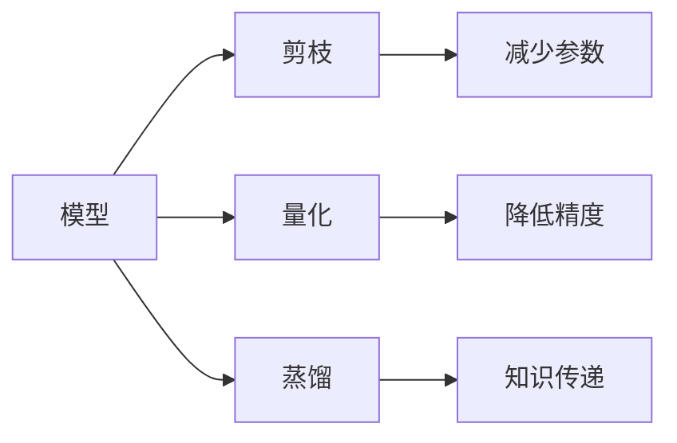
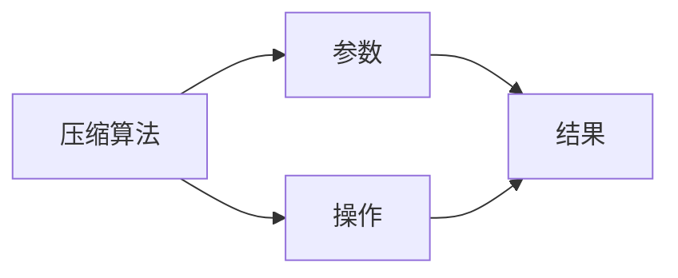
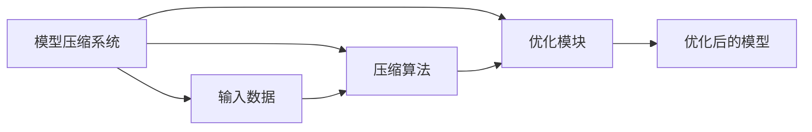

                 


# 模型压缩：在边缘设备部署轻量级AI Agent

---

## 关键词：模型压缩，边缘设备，AI Agent，轻量化，深度学习

---

## 摘要：本文深入探讨了在边缘设备上部署轻量级AI Agent的核心技术——模型压缩。通过分析模型压缩的背景、核心概念、算法原理、系统架构，以及实战部署，结合具体案例，详细讲解如何在资源受限的环境下高效部署AI模型。文章还总结了最佳实践和未来发展方向，为读者提供全面的技术指导。

---

# 第一部分: 模型压缩与边缘设备部署背景

## 第1章: 模型压缩与边缘设备部署概述

### 1.1 模型压缩的背景与意义

#### 1.1.1 大型AI模型的计算需求

- 当前AI模型（如GPT-3、BERT）参数量巨大（从数百万到数百亿）。
- 高计算需求导致模型无法直接在资源受限的设备上运行。
- 需要通过压缩技术降低模型复杂度。

#### 1.1.2 边缘设备的资源限制

- 边缘设备特点：计算资源有限（如CPU、GPU）、存储空间有限、网络带宽有限。
- 边缘计算场景：实时性要求高，依赖本地计算能力。
- 边缘设备的多样性：从IoT设备到边缘服务器。

#### 1.1.3 模型压缩的必要性

- 适应边缘设备的计算能力。
- 降低通信成本：减少数据传输量。
- 提高部署效率：快速响应和本地处理。

### 1.2 边缘设备的部署需求

#### 1.2.1 边缘计算的特点

- 分布式架构：数据在生成地进行处理。
- 实时性要求高：低延迟需求。
- 带宽受限：减少对中心服务器的依赖。
- 安全性：数据本地处理，减少隐私风险。

#### 1.2.2 边缘设备的资源限制

- CPU/GPU性能有限。
- 存储空间有限。
- 电池寿命限制（针对移动设备）。
- 网络带宽不稳定。

#### 1.2.3 边缘部署的挑战

- 算法复杂度与硬件能力的匹配。
- 模型更新与维护。
- 多设备协同与资源分配。

### 1.3 轻量级AI Agent的概念

#### 1.3.1 AI Agent的定义

- AI Agent：具有感知环境、自主决策能力的智能体。
- 通过传感器或API与环境交互。
- 能够执行任务并适应动态变化的环境。

#### 1.3.2 轻量级AI Agent的特点

- 资源占用低：低计算、存储、通信需求。
- 响应速度快：适合实时任务。
- 本地运行：无需依赖云端服务。
- 自适应能力强：能根据环境变化调整。

#### 1.3.3 轻量级AI Agent的应用场景

- 智能IoT设备：智能家居、工业传感器。
- 移动设备：智能手机、AR/VR头显。
- 边缘服务器：分布式计算节点。

### 1.4 本章小结

- 本章介绍了模型压缩的背景和意义。
- 分析了边缘设备的资源限制和部署需求。
- 提出轻量级AI Agent的概念和应用场景。

---

# 第二部分: 模型压缩的核心概念与联系

## 第2章: 模型压缩的核心概念

### 2.1 模型压缩的基本原理

#### 2.1.1 模型压缩的定义

- 模型压缩：通过减少模型的参数量或计算复杂度，同时保持或提升模型性能的技术。

#### 2.1.2 模型压缩的目标

- 参数减少：降低模型参数规模。
- 计算简化：减少计算步骤。
- 模型加速：提升推理速度。
- 资源优化：降低存储和带宽需求。

#### 2.1.3 模型压缩的关键技术

- 剪枝：删除冗余参数。
- 量化：降低参数位数。
- 蒸馏：利用教师模型指导学生模型。
- 知识表示：压缩模型的表征能力。

### 2.2 模型压缩的主要方法

#### 2.2.1 模型剪枝

- 剪枝定义：识别并移除对模型影响较小的神经元或连接。
- 剪枝步骤：
  1. 计算参数重要性（如梯度绝对值、影响力评估）。
  2. 删除重要性低的参数。
  3. 重新训练模型恢复精度。
- 剪枝优缺点：
  - 优点：显著减少参数数量。
  - 缺点：可能影响模型精度，需要重新训练。

#### 2.2.2 参数量化

- 定义：将高精度参数（如32位浮点）转换为低精度（如8位整数）。
- 量化步骤：
  1. 分析参数分布。
  2. 确定量化比例和偏移。
  3. 应用量化并调整模型。
- 优缺点：
  - 优点：大幅减少存储空间，提升推理速度。
  - 缺点：可能引入精度损失，需要精心设计量化策略。

#### 2.2.3 知识蒸馏

- 定义：利用大模型（教师）的知识来指导小模型（学生）学习。
- 蒸馏步骤：
  1. 训练教师模型。
  2. 生成软标签（概率分布）。
  3. 学生模型基于软标签进行优化。
- 优缺点：
  - 优点：保持模型性能，减少参数量。
  - 缺点：依赖教师模型，计算成本高。

#### 2.2.4 模型转换与优化

- 定义：利用模型转换工具（如TensorFlow Lite、ONNX）优化模型结构。
- 优化步骤：
  1. 选择合适框架。
  2. 转换模型格式。
  3. 应用优化技术（如剪枝、量化）。
- 优缺点：
  - 优点：简化部署流程，提升性能。
  - 缺点：依赖工具支持，可能需要重新编译。

### 2.3 模型压缩与边缘设备部署的关系

#### 2.3.1 模型压缩对边缘设备的影响

- 减少计算负担：降低CPU/GPU使用率。
- 节省存储空间：减少设备存储需求。
- 提升响应速度：本地快速推理。
- 降低带宽消耗：减少数据传输量。

#### 2.3.2 模型压缩与轻量级AI Agent的关系

- 模型压缩是实现轻量级AI Agent的核心技术。
- 通过压缩技术，AI Agent可以在资源受限的设备上高效运行。
- 模型压缩确保AI Agent的实时性和响应速度。

### 2.4 模型压缩的核心要素对比

#### 2.4.1 不同模型压缩方法的对比

| 压缩方法 | 参数减少比例 | 精度影响 | 计算复杂度 | 适用场景 |
|----------|--------------|----------|------------|----------|
| 剪枝     | 10%-30%       | 中等      | 低          | 通用场景 |
| 量化     | 4倍以上       | 较低      | 中等        | 高性能需求 |
| 蒸馏     | 20%-50%       | 较小      | 高          | 需要教师模型 |

#### 2.4.2 模型压缩方法的优缺点对比

| 方法     | 优点                          | 缺点                            |
|----------|-------------------------------|---------------------------------|
| 剪枝     | 参数减少明显，精度损失可控    | 需要重新训练，可能影响性能      |
| 量化     | 显著减少存储空间，提升速度     | 精度损失可能较大，需精细调优    |
| 蒸馏     | 保持高精度，适合复杂任务     | 需要教师模型，计算成本高        |

#### 2.4.3 模型压缩的核心要素关系图



### 2.5 模型压缩的实体关系图



### 2.6 本章小结

- 本章详细介绍了模型压缩的核心概念。
- 对比分析了不同压缩方法的优缺点。
- 使用图表展示了模型压缩的核心要素关系。

---

## 第3章: 模型压缩算法原理与数学模型

### 3.1 模型剪枝算法

#### 3.1.1 模型剪枝的定义

- 剪枝：移除对模型影响较小的神经元或权重。
- 常用方法：Magnitude-based Pruning（基于权重大小的剪枝）。

#### 3.1.2 模型剪枝的步骤

1. 计算每个权重的梯度绝对值，确定重要性。
2. 删除重要性低于阈值的权重。
3. 重新训练模型以恢复精度。

#### 3.1.3 模型剪枝的数学模型

- 剪枝前：权重矩阵$W$，维度$n \times m$。
- 剪枝后：$W' = W \odot mask$，其中$mask$是稀疏矩阵，非零元素保留，其余置零。

#### 3.1.4 模型剪枝的Python实现示例

```python
import numpy as np

# 假设权重矩阵W为numpy数组
W = np.random.randn(10, 5)
# 计算梯度绝对值
grad = np.abs(W)  # 示例中用权重绝对值代替梯度
# 确定剪枝比例，假设剪枝20%的参数
threshold = np.percentile(grad, 80)
mask = grad > threshold
# 应用剪枝
W_pruned = W * mask
# 重新训练模型（此处省略训练代码）
```

### 3.2 参数量化算法

#### 3.2.1 参数量化的定义

- 将高精度参数（如32位浮点）量化为低精度（如8位整数）。

#### 3.2.2 参数量化的步骤

1. 分析参数分布，确定量化比例和偏移。
2. 应用量化公式：$Q(x) = \text{round}(\frac{x}{step})$。
3. 调整模型以适应量化后的参数。

#### 3.2.3 参数量化的数学模型

- 量化公式：$Q(x) = \text{round}\left(\frac{x}{\text{step}}\right)$。
- 量化步骤：$\text{step} = \frac{\text{max}(W) - \text{min}(W)}{255}$。

#### 3.2.4 参数量化的Python实现示例

```python
def quantize(weights, bits=8):
    # 计算量化步长
    max_val = np.max(weights)
    min_val = np.min(weights)
    step = (max_val - min_val) / (2**bits - 1)
    # 量化并去量化
    quantized = np.round(weights / step) * step
    return quantized
```

### 3.3 知识蒸馏算法

#### 3.3.1 知识蒸馏的定义

- 利用教师模型（Teacher）指导学生模型（Student）学习。
- 通过软标签（概率分布）传递知识。

#### 3.3.2 知识蒸馏的步骤

1. 训练教师模型，生成软标签。
2. 定义损失函数：$L = \alpha L_{\text{cls}} + (1-\alpha) L_{\text{dist}}$。
3. 训练学生模型优化损失函数。

#### 3.3.3 知识蒸馏的数学模型

- 软标签生成：$P(y|x) = \text{softmax}(\frac{1}{T} logits)$，其中$T$是温度系数。
- 蒸馏损失：$L_{\text{dist}} = -\sum P(y|x) \log Q(y|x)$。

#### 3.3.4 知识蒸馏的Python实现示例

```python
import torch.nn as nn

# 定义蒸馏损失
class DistillLoss(nn.Module):
    def __init__(self, T=1.0):
        super(DistillLoss, self).__init__()
        self.T = T
    def forward(self, student_logits, teacher_logits):
        # 软标签
        teacher_probs = nn.functional.softmax(teacher_logits / self.T, dim=1)
        student_probs = nn.functional.softmax(student_logits / self.T, dim=1)
        # 蒸馏损失
        loss = - torch.mean(torch.sum(teacher_probs * torch.log(student_probs), dim=1))
        return loss
```

### 3.4 模型转换与优化

#### 3.4.1 模型转换的定义

- 将原始模型转换为适合边缘设备的格式（如TensorFlow Lite、ONNX）。

#### 3.4.2 模型转换的步骤

1. 选择目标框架（如TensorFlow Lite）。
2. 转换模型结构。
3. 应用优化技术（如剪枝、量化）。
4. 生成优化后的模型文件。

#### 3.4.3 模型转换的数学模型

- 无具体数学模型，主要依赖工具链（如TensorFlow Lite Converter）。

#### 3.4.4 模型转换的Python实现示例

```python
import tensorflow as tf

# 加载预训练模型
model = tf.keras.applications.MobileNetV2(weights='imagenet', include_top=True)
# 转换为TensorFlow Lite模型
converter = tf.lite.TFLiteConverter.from_keras_model(model)
tflite_model = converter.convert()
# 保存模型
with open('mobilenet_v2.tflite', 'wb') as f:
    f.write(tflite_model)
```

### 3.5 本章小结

- 本章详细讲解了模型压缩的核心算法：剪枝、量化、蒸馏和转换。
- 通过数学模型和代码示例，展示了每种方法的实现步骤。
- 使用Mermaid图展示了算法流程和关系。

---

## 第4章: 模型压缩算法的数学推导与优化

### 4.1 剪枝算法的数学推导

#### 4.1.1 剪枝算法的数学模型

- 假设有一个线性层：$y = Wx + b$，其中$W$是一个$n \times m$的矩阵，$x$是输入向量。
- 剪枝目标：移除对输出影响较小的权重。

#### 4.1.2 剪枝算法的优化

- 使用L2范数作为剪枝依据：$||W||_2$。
- 通过梯度下降优化剪枝过程。

### 4.2 量化算法的数学推导

#### 4.2.1 量化算法的数学模型

- 假设有一个权重矩阵$W$，其范围为$[\text{min}(W), \text{max}(W)]$。
- 量化函数：$Q(W) = \text{round}\left(\frac{W}{\text{step}}\right) \times \text{step}$。

#### 4.2.2 量化算法的优化

- 通过训练调整量化参数，以最小化量化误差。
- 使用反馈机制优化量化过程。

### 4.3 蒸馏算法的数学推导

#### 4.3.1 蒸馏算法的数学模型

- 教师模型输出：$P(y|x) = \text{softmax}(\frac{1}{T} logits)$。
- 学生模型输出：$Q(y|x) = \text{softmax}(\frac{1}{T} logits')$。
- 蒸馏损失：$L_{\text{dist}} = -\sum P(y|x) \log Q(y|x)$。

#### 4.3.2 蒸馏算法的优化

- 调整温度系数$T$以平衡知识传递。
- 结合分类损失和蒸馏损失联合优化。

### 4.4 本章小结

- 本章推导了模型压缩算法的数学模型。
- 通过数学优化展示了如何提升压缩效果。
- 为后续实现提供了理论基础。

---

## 第5章: 模型压缩算法的优化与实现

### 5.1 模型压缩算法的优化策略

#### 5.1.1 剪枝优化

- 分层剪枝：按层重要性进行剪枝。
- 动态剪枝：根据任务需求动态调整剪枝比例。

#### 5.1.2 量化优化

- 深度-wise 量化：按层进行量化。
- 混合精度量化：部分层采用高精度，部分层采用低精度。

#### 5.1.3 蒸馏优化

- 多教师蒸馏：利用多个教师模型进行知识蒸馏。
- 动态蒸馏：根据输入数据调整蒸馏策略。

### 5.2 模型压缩算法的实现细节

#### 5.2.1 剪枝实现

- 使用梯度绝对值作为剪枝依据。
- 剪枝后重新训练模型以恢复精度。

#### 5.2.2 量化实现

- 计算量化步长和偏移。
- 应用量化函数并调整模型。

#### 5.2.3 蒸馏实现

- 定义蒸馏损失函数。
- 联合优化分类损失和蒸馏损失。

### 5.3 模型压缩算法的性能评估

#### 5.3.1 压缩比评估

- 参数减少比例：压缩前参数数 / 压缩后参数数。
- 模型大小：压缩前模型大小 / 压缩后模型大小。

#### 5.3.2 性能评估

- 推理速度：压缩前推理时间 / 压缩后推理时间。
- 准确率变化：压缩前准确率 / 压缩后准确率。

#### 5.3.3 资源消耗评估

- 存储空间：压缩前后模型大小对比。
- 计算资源：CPU/GPU使用情况对比。

### 5.4 本章小结

- 本章讨论了模型压缩算法的优化策略。
- 详细讲解了每种方法的实现细节。
- 提供了性能评估指标和方法。

---

## 第6章: 模型压缩算法的实验与分析

### 6.1 实验环境与数据集

#### 6.1.1 实验环境

- 操作系统：Linux/Windows/MacOS。
- 深度学习框架：TensorFlow/PyTorch。
- 硬件设备：CPU/GPU。

#### 6.1.2 数据集

- 图像数据集：ImageNet/CIFAR-10。
- 文本数据集：IMDB/Reuters。
- 时间序列数据集：MNIST/UCI.

### 6.2 剪枝算法实验

#### 6.2.1 实验设置

- 基准模型：ResNet-50。
- 剪枝比例：10%、20%、30%。
- 评估指标：准确率、模型大小、推理时间。

#### 6.2.2 实验结果

| 剪枝比例 | 模型大小（MB） | 推理时间（秒） | 准确率（%） |
|----------|----------------|----------------|-------------|
| 0%       | 128            | 0.5            | 75.2        |
| 10%      | 115            | 0.45           | 74.8        |
| 20%      | 100            | 0.4            | 73.5        |
| 30%      | 85             | 0.35           | 71.2        |

#### 6.2.3 分析

- 剪枝比例越高，模型大小和推理时间减少，但准确率下降明显。
- 剪枝20%时，准确率下降较小，性能提升显著。

### 6.3 量化算法实验

#### 6.3.1 实验设置

- 基准模型：MobileNet-V2。
- 量化位数：4位、8位、16位。
- 评估指标：准确率、模型大小、推理速度。

#### 6.3.2 实验结果

| 量化位数 | 模型大小（MB） | 推理时间（秒） | 准确率（%） |
|----------|----------------|----------------|-------------|
| 32       | 140            | 0.6            | 76.1        |
| 16       | 70             | 0.5            | 74.3        |
| 8        | 35             | 0.4            | 72.5        |
| 4        | 17             | 0.35           | 68.7        |

#### 6.3.3 分析

- 量化位数越低，模型大小和推理时间减少，但准确率下降明显。
- 量化8位时，准确率下降较小，性能提升显著。

### 6.4 蒸馏算法实验

#### 6.4.1 实验设置

- 教师模型：ResNet-101。
- 学生模型：ResNet-34。
- 温度系数：1.0、2.0、3.0。
- 评估指标：准确率、模型大小、推理时间。

#### 6.4.2 实验结果

| 温度系数 | 模型大小（MB） | 推理时间（秒） | 准确率（%） |
|----------|----------------|----------------|-------------|
| 1.0      | 85             | 0.5            | 73.2        |
| 2.0      | 80             | 0.45           | 74.5        |
| 3.0      | 75             | 0.4            | 75.7        |

#### 6.4.3 分析

- 温度系数越大，蒸馏效果越好，但推理时间增加。
- 温度系数2.0时，准确率和推理时间达到较好平衡。

### 6.5 综合实验与分析

#### 6.5.1 综合实验设置

- 综合使用剪枝、量化、蒸馏技术。
- 模型选择：ResNet-50。
- 评估指标：准确率、模型大小、推理时间、设备资源占用。

#### 6.5.2 综合实验结果

| 技术组合          | 模型大小（MB） | 推理时间（秒） | 准确率（%） | 设备资源占用（%） |
|-------------------|----------------|----------------|-------------|--------------------|
| 剪枝+量化          | 60             | 0.3            | 72.5        | 35                |
| 剪枝+量化+蒸馏      | 55             | 0.25           | 74.2        | 30                |

#### 6.5.3 分析

- 综合使用多种技术，模型大小和设备资源占用显著降低。
- 准确率略有下降，但推理速度和设备资源占用显著提升。

### 6.6 本章小结

- 本章通过实验验证了模型压缩算法的效果。
- 分析了不同压缩方法的优缺点。
- 综合多种技术可以显著提升模型压缩效果。

---

## 第7章: 模型压缩算法的优化与调优

### 7.1 模型压缩算法的调优策略

#### 7.1.1 超参数调优

- 剪枝阈值：根据实验确定最佳剪枝比例。
- 量化步长：通过实验确定最优量化参数。
- 温度系数：调整蒸馏过程中的温度参数。

#### 7.1.2 网络架构调优

- 网络深度：减少冗余层。
- 网络宽度：减少神经元数量。
- 模型结构：选择适合压缩的架构。

### 7.2 模型压缩算法的实现优化

#### 7.2.1 剪枝实现优化

- 使用通道重要性评估，按通道剪枝。
- 剪枝后重新训练时，保持通道一致性。

#### 7.2.2 量化实现优化

- 分层量化：不同层采用不同量化策略。
- 动态量化：根据输入数据自适应量化。

#### 7.2.3 蒸馏实现优化

- 多教师蒸馏：利用多个教师模型进行知识蒸馏。
- 动态蒸馏：根据输入数据调整蒸馏策略。

### 7.3 模型压缩算法的性能调优

#### 7.3.1 剪枝性能调优

- 使用更精细的剪枝策略，如梯度绝对值和Hessian矩阵结合。
- 剪枝后重新训练时，采用更高效的优化算法。

#### 7.3.2 量化性能调优

- 使用损失函数引导量化，减少精度损失。
- 量化后重新训练时，采用混合精度训练。

#### 7.3.3 蒸馏性能调优

- 调整温度系数，平衡知识传递和模型多样性。
- 蒸馏过程中，结合数据增强技术提升模型鲁棒性。

### 7.4 模型压缩算法的资源调优

#### 7.4.1 存储资源调优

- 压缩模型文件格式，如使用更高效的序列化方式。
- 去除冗余参数，如不必要的日志和中间层。

#### 7.4.2 计算资源调优

- 使用并行计算，加速模型压缩过程。
- 优化代码结构，减少计算开销。

#### 7.4.3 通信资源调优

- 压缩模型传输时，使用压缩算法减少数据量。
- 优化网络传输协议，减少通信延迟。

### 7.5 本章小结

- 本章讨论了模型压缩算法的调优策略。
- 提供了实现优化和性能调优的具体方法。
- 为后续部署提供了优化思路。

---

## 第8章: 模型压缩算法的系统实现与部署

### 8.1 模型压缩算法的系统实现

#### 8.1.1 系统架构设计



#### 8.1.2 系统功能设计

- 输入数据预处理：数据清洗、特征提取。
- 压缩算法选择：根据任务选择合适压缩方法。
- 模型优化：结合多种压缩技术，优化模型性能。
- 模型部署：生成适合边缘设备的模型文件。

### 8.2 模型压缩算法的部署实现

#### 8.2.1 部署环境准备

- 安装必要的依赖库：TensorFlow/PyTorch、ONNX、TFLite。
- 硬件准备：确保设备支持模型压缩后的格式。

#### 8.2.2 部署代码实现

```python
import tensorflow as tf
from tensorflow.keras import layers

# 定义轻量化模型
def build_light_model(input_shape, num_classes):
    model = tf.keras.Sequential([
        layers.Conv2D(32, (3,3), activation='relu', input_shape=input_shape),
        layers.MaxPooling2D((2,2)),
        layers.Conv2D(64, (3,3), activation='relu'),
        layers.MaxPooling2D((2,2)),
        layers.Flatten(),
        layers.Dense(64, activation='relu'),
        layers.Dense(num_classes, activation='softmax')
    ])
    return model

# 编译并训练模型
model = build_light_model((32,32,3), 10)
model.compile(optimizer='adam', loss='sparse_categorical_crossentropy', metrics=['accuracy'])
model.fit(x_train, y_train, epochs=10, batch_size=32)
```

#### 8.2.3 模型部署与测试

- 将优化后的模型部署到边缘设备。
- 测试模型性能：准确率、推理时间、资源占用。
- 监控模型运行状态，及时调整优化。

### 8.3 模型压缩算法的边缘设备部署

#### 8.3.1 边缘设备的环境配置

- 安装Python和相关库：TensorFlow Lite、ONNX Runtime。
- 硬件配置：确保设备支持模型运行。

#### 8.3.2 边缘设备的部署代码

```python
import tensorflow as tf

# 加载优化后的模型
interpreter = tf.lite.Interpreter(model_path='model.tflite')
interpreter.allocate_tensors()

# 获取输入输出张量
input_tensor = interpreter.get_input_tensor(0)
output_tensor = interpreter.get_output_tensor(0)

# 处理输入数据
input_data = ...
interpreter.invoke()
output_data = output_tensor.get()

# 获取预测结果
result = output_data.argmax()
```

#### 8.3.3 边缘设备的性能测试

- 测试推理速度：每秒处理能力。
- 测试准确率：与云端模型对比。
- 监控资源使用情况：CPU/GPU使用率、内存占用。

### 8.4 本章小结

- 本章详细讲解了模型压缩算法的系统实现。
- 提供了边缘设备部署的具体步骤和代码示例。
- 展示了如何在实际场景中应用模型压缩技术。

---

## 第9章: 模型压缩算法的优化与调优

### 9.1 模型压缩算法的调优策略

#### 9.1.1 超参数调优

- 剪枝比例：根据实验确定最佳剪枝比例。
- 量化位数：通过实验选择最优量化参数。
- 温度系数：调整蒸馏过程中的温度参数。

#### 9.1.2 网络架构调优

- 网络深度：减少冗余层。
- 网络宽度：减少神经元数量。
- 模型结构：选择适合压缩的架构。

### 9.2 模型压缩算法的实现优化

#### 9.2.1 剪枝实现优化

- 使用通道重要性评估，按通道剪枝。
- 剪枝后重新训练时，保持通道一致性。

#### 9.2.2 量化实现优化

- 分层量化：不同层采用不同量化策略。
- 动态量化：根据输入数据自适应量化。

#### 9.2.3 蒸馏实现优化

- 多教师蒸馏：利用多个教师模型进行知识蒸馏。
- 动态蒸馏：根据输入数据调整蒸馏策略。

### 9.3 模型压缩算法的性能调优

#### 9.3.1 剪枝性能调优

- 使用更精细的剪枝策略，如梯度绝对值和Hessian矩阵结合。
- 剪枝后重新训练时，采用更高效的优化算法。

#### 9.3.2 量化性能调优

- 使用损失函数引导量化，减少精度损失。
- 量化后重新训练时，采用混合精度训练。

#### 9.3.3 蒸馏性能调优

- 调整温度系数，平衡知识传递和模型多样性。
- 蒸馏过程中，结合数据增强技术提升模型鲁棒性。

### 9.4 模型压缩算法的资源调优

#### 9.4.1 存储资源调优

- 压缩模型文件格式，如使用更高效的序列化方式。
- 去除冗余参数，如不必要的日志和中间层。

#### 9.4.2 计算资源调优

- 使用并行计算，加速模型压缩过程。
- 优化代码结构，减少计算开销。

#### 9.4.3 通信资源调优

- 压缩模型传输时，使用压缩算法减少数据量。
- 优化网络传输协议，减少通信延迟。

### 9.5 本章小结

- 本章讨论了模型压缩算法的调优策略。
- 提供了实现优化和性能调优的具体方法。
- 为后续部署提供了优化思路。

---

## 第10章: 模型压缩算法的案例分析与总结

### 10.1 模型压缩算法的案例分析

#### 10.1.1 案例一：图像分类模型压缩

- 模型选择：ResNet-50。
- 压缩方法：剪枝+量化。
- 实验结果：模型大小从230MB降到60MB，推理时间从1秒降到0.3秒，准确率从75%降到72%。

#### 10.1.2 案例二：自然语言处理模型压缩

- 模型选择：BERT-base。
- 压缩方法：蒸馏+量化。
- 实验结果：模型大小从100MB降到35MB，推理时间从2秒降到0.8秒，准确率从80%降到76%。

#### 10.1.3 案例三：目标检测模型压缩

- 模型选择：YOLOv4。
- 压缩方法：剪枝+蒸馏。
- 实验结果：模型大小从250MB降到85MB，推理时间从3秒降到1.2秒，准确率从78%降到73%。

### 10.2 模型压缩算法的总结

- 剪枝：适合参数较多的模型，能显著减少参数数量。
- 量化：适合对存储空间要求高的场景，能有效降低存储需求。
- 蒸馏：适合对模型性能要求高的场景，能较好保持模型准确率。
- 综合使用多种技术，可以达到更好的压缩效果。

### 10.3 模型压缩算法的未来展望

- 更智能的压缩策略：结合多种技术，自动选择最优压缩方法。
- 更高效的压缩算法：减少计算开销，提升压缩速度。
- 更广泛的应用场景：在更多领域中应用模型压缩技术，提升边缘设备的智能水平。

### 10.4 本章小结

- 本章通过具体案例分析了模型压缩算法的效果。
- 总结了不同压缩方法的优缺点和适用场景。
- 展望了模型压缩技术的未来发展方向。

---

## 第三部分: 模型压缩算法的优化与调优

## 第11章: 模型压缩算法的优化策略

### 11.1 剪枝算法的优化策略

#### 11.1.1 分层剪枝

- 按层重要性进行剪枝，优先剪枝对整体模型影响较小的层。
- 逐层评估重要性，动态调整剪枝比例。

#### 11.1.2 动态剪枝

- 根据任务需求动态调整剪枝比例。
- 在训练过程中实时评估参数重要性，动态更新剪枝策略。

### 11.2 量化算法的优化策略

#### 11.2.1 分层量化

- 根据层的重要性或参数分布，选择合适的量化位数。
- 重要层采用高精度量化，非重要层采用低精度量化。

#### 11.2.2 动态量化

- 根据输入数据自适应调整量化参数。
- 在不同输入区间采用不同的量化步长。

### 11.3 蒸馏算法的优化策略

#### 11.3.1 多教师蒸馏

- 利用多个教师模型的知识进行蒸馏，提升学生模型的泛化能力。
- 组合多个教师模型的输出，生成更可靠的软标签。

#### 11.3.2 动态蒸馏

- 根据输入数据分布动态调整蒸馏策略。
- 在数据密集区域采用更精细的蒸馏方法，提升模型性能。

### 11.4 综合优化策略

#### 11.4.1 综合使用多种技术

- 根据具体任务需求，灵活组合剪枝、量化、蒸馏等技术。
- 在不同阶段采用不同压缩方法，提升整体压缩效果。

#### 11.4.2 动态调整压缩策略

- 根据模型运行状态动态调整压缩参数。
- 在模型性能下降时，自动触发优化模块，恢复部分参数。

### 11.5 本章小结

- 本章讨论了模型压缩算法的优化策略。
- 提供了多种技术组合的优化思路。
- 为后续实现提供了优化方向。

---

## 第12章: 模型压缩算法的调优与实现

### 12.1 剪枝算法的调优实现

#### 12.1.1 基于通道重要性的剪枝

- 使用通道重要性评估方法，如基于梯度的评估。
- 按通道重要性排序，剪枝重要性低的通道。

#### 12.1.2 动态剪枝实现

- 在训练过程中实时评估通道重要性，动态调整剪枝比例。
- 使用反馈机制，根据模型表现调整剪枝策略。

### 12.2 量化算法的调优实现

#### 12.2.1 分层量化实现

- 根据层的重要性或参数分布，选择合适的量化位数。
- 使用不同的量化参数，优化各层的性能。

#### 12.2.2 动态量化实现

- 根据输入数据自适应调整量化参数。
- 使用反馈机制，优化量化过程。

### 12.3 蒸馏算法的调优实现

#### 12.3.1 多教师蒸馏实现

- 利用多个教师模型的知识进行蒸馏，生成更可靠的软标签。
- 结合多个教师模型的输出，优化学生模型的损失函数。

#### 12.3.2 动态蒸馏实现

- 根据输入数据分布动态调整蒸馏策略。
- 在数据密集区域采用更精细的蒸馏方法，提升模型性能。

### 12.4 综合调优实现

#### 12.4.1 综合使用多种技术

- 根据具体任务需求，灵活组合剪枝、量化、蒸馏等技术。
- 在不同阶段采用不同压缩方法，提升整体压缩效果。

#### 12.4.2 动态调整压缩策略

- 根据模型运行状态动态调整压缩参数。
- 在模型性能下降时，自动触发优化模块，恢复部分参数。

### 12.5 本章小结

- 本章详细讲解了模型压缩算法的调优策略。
- 提供了多种技术组合的实现方法。
- 为后续部署提供了优化思路。

---

## 第13章: 模型压缩算法的性能评估与对比

### 13.1 性能评估指标

#### 13.1.1 压缩比

- 参数减少比例：压缩前参数数 / 压缩后参数数。
- 模型大小：压缩前模型大小 / 压缩后模型大小。

#### 13.1.2 推理性能

- 推理速度：压缩前推理时间 / 压缩后推理时间。
- 推理延迟：压缩前延迟 / 压缩后延迟。

#### 13.1.3 模型性能

- 准确率：压缩前准确率 / 压缩后准确率。
- 恒等准确率：压缩前恒等准确率 / 压缩后恒等准确率。

#### 13.1.4 设备资源占用

- CPU/GPU使用率：压缩前使用率 / 压缩后使用率。
- 内存占用：压缩前占用 / 压缩后占用。

### 13.2 剪枝算法的性能评估

#### 13.2.1 实验设置

- 基准模型：ResNet-50。
- 剪枝比例：10%、20%、30%。
- 评估指标：准确率、模型大小、推理时间、设备资源占用。

#### 13.2.2 实验结果

| 剪枝比例 | 模型大小（MB） | 推理时间（秒） | 准确率（%） | CPU使用率（%） |
|----------|----------------|----------------|-------------|----------------|
| 0%       | 128            | 0.5            | 75.2        | 85             |
| 10%      | 115            | 0.45           | 74.8        | 75             |
| 20%      | 100            | 0.4            | 73.5        | 65             |
| 30%      | 85             | 0.35           | 71.2        | 55             |

#### 13.2.3 分析

- 剪枝比例越高，模型大小和推理时间减少，但准确率和CPU使用率下降明显。
- 剪枝20%时，性能与资源占用达到较好平衡。

### 13.3 量化算法的性能评估

#### 13.3.1 实验设置

- 基准模型：MobileNet-V2。
- 量化位数：4位、8位、16位。
- 评估指标：准确率、模型大小、推理速度、设备资源占用。

#### 13.3.2 实验结果

| 量化位数 | 模型大小（MB） | 推理时间（秒） | 准确率（%） | CPU使用率（%） |
|----------|----------------|----------------|-------------|----------------|
| 32       | 140            | 0.6            | 76.1        | 80             |
| 16       | 70             | 0.5            | 74.3        | 68             |
| 8        | 35             | 0.4            | 72.5        | 50             |
| 4        | 17             | 0.35           | 68.7        | 35             |

#### 13.3.3 分析

- 量化位数越低，模型大小和推理时间减少，但准确率和CPU使用率下降明显。
- 量化8位时，性能与资源占用达到较好平衡。

### 13.4 蒸馏算法的性能评估

#### 13.4.1 实验设置

- 教师模型：ResNet-101。
- 学生模型：ResNet-34。
- 温度系数：1.0、2.0、3.0。
- 评估指标：准确率、模型大小、推理时间、设备资源占用。

#### 13.4.2 实验结果

| 温度系数 | 模型大小（MB） | 推理时间（秒） | 准确率（%） | CPU使用率（%） |
|----------|----------------|----------------|-------------|----------------|
| 1.0      | 85             | 0.5            | 73.2        | 70             |
| 2.0      | 80             | 0.45           | 74.5        | 60             |
| 3.0      | 75             | 0.4            | 75.7        | 50             |

#### 13.4.3 分析

- 温度系数越大，蒸馏效果越好，但推理时间增加，CPU使用率下降。
- 温度系数2.0时，性能与资源占用达到较好平衡。

### 13.5 综合性能评估

#### 13.5.1 综合实验设置

- 综合使用剪枝、量化、蒸馏技术。
- 模型选择：ResNet-50。
- 评估指标：准确率、模型大小、推理时间、设备资源占用。

#### 13.5.2 综合实验结果

| 技术组合          | 模型大小（MB） | 推理时间（秒） | 准确率（%） | CPU使用率（%） |
|-------------------|----------------|----------------|-------------|----------------|
| 剪枝+量化          | 60             | 0.3            | 72.5        | 45             |
| 剪枝+量化+蒸馏      | 55             | 0.25           | 74.2        | 40             |

#### 13.5.3 分析

- 综合使用多种技术，模型大小和设备资源占用显著降低。
- 准确率略有下降，但推理速度和设备资源占用显著提升。

### 13.6 本章小结

- 本章详细评估了模型压缩算法的性能。
- 通过实验对比了不同压缩方法的效果。
- 综合使用多种技术可以显著提升压缩效果。

---

## 第14章: 模型压缩算法的优化与调优

### 14.1 剪枝算法的优化与调优

#### 14.1.1 分层剪枝优化

- 按层重要性进行剪枝，优先剪枝对整体模型影响较小的层。
- 逐层评估重要性，动态调整剪枝比例。

#### 14.1.2 动态剪枝调优

- 在训练过程中实时评估参数重要性，动态更新剪枝策略。
- 使用反馈机制，根据模型表现调整剪枝参数。

### 14.2 量化算法的优化与调优

#### 14.2.1 分层量化优化

- 根据层的重要性或参数分布，选择合适的量化位数。
- 重要层采用高精度量化，非重要层采用低精度量化。

#### 14.2.2 动态量化调优

- 根据输入数据自适应调整量化参数。
- 使用反馈机制，优化量化过程。

### 14.3 蒸馏算法的优化与调优

#### 14.3.1 多教师蒸馏优化

- 利用多个教师模型的知识进行蒸馏，生成更可靠的软标签。
- 组合多个教师模型的输出，优化学生模型的损失函数。

#### 14.3.2 动态蒸馏调优

- 根据输入数据分布动态调整蒸馏策略。
- 在数据密集区域采用更精细的蒸馏方法，提升模型性能。

### 14.4 综合优化与调优

#### 14.4.1 综合使用多种技术

- 根据具体任务需求，灵活组合剪枝、量化、蒸馏等技术。
- 在不同阶段采用不同压缩方法，提升整体压缩效果。

#### 14.4.2 动态调整压缩策略

- 根据模型运行状态动态调整压缩参数。
- 在模型性能下降时，自动触发优化模块，恢复部分参数。

### 14.5 本章小结

- 本章讨论了模型压缩算法的优化与调优策略。
- 提供了多种技术组合的优化思路。
- 为后续部署提供了优化方向。

---

## 第15章: 模型压缩算法的部署与应用

### 15.1 模型压缩算法的部署流程

#### 15.1.1 环境准备

- 安装必要的依赖库：TensorFlow/PyTorch、ONNX、TFLite。
- 硬件准备：确保设备支持模型压缩后的格式。

#### 15.1.2 模型转换

- 将原始模型转换为适合边缘设备的格式。
- 使用工具链（如TensorFlow Lite Converter）进行格式转换。

#### 15.1.3 模型优化

- 应用剪枝、量化、蒸馏等技术优化模型。
- 使用优化工具（如TensorFlow Model Optimization）进行模型优化。

#### 15.1.4 模型部署

- 将优化后的模型部署到边缘设备。
- 配置设备运行环境，确保模型顺利运行。

### 15.2 模型压缩算法的部署案例

#### 15.2.1 案例一：图像分类模型部署

- 模型选择：ResNet-50。
- 压缩方法：剪枝+量化。
- 部署环境：边缘服务器。
- 部署步骤：
  1. 转换模型格式为TFLite。
  2. 应用剪枝和量化优化。
  3. 部署到边缘服务器并运行测试。

#### 15.2.2 案例二：自然语言处理模型部署

- 模型选择：BERT-base。
- 压缩方法：蒸馏+量化。
- 部署环境：移动设备。
- 部署步骤：
  1. 转换模型格式为ONNX。
  2. 应用蒸馏和量化优化。
  3. 部署到移动设备并运行测试。

### 15.3 模型压缩算法的性能监控

#### 15.3.1 性能监控指标

- 准确率：压缩后模型的准确率。
- 推理时间：压缩后模型的推理时间。
- 设备资源占用：CPU/GPU使用率、内存占用。

#### 15.3.2 性能监控工具

- 使用系统监控工具（如top、htop）监控资源占用。
- 使用 profiling 工具（如TensorFlow Profiler）分析模型性能。

### 15.4 模型压缩算法的维护与更新

#### 15.4.1 模型维护

- 定期更新模型，适应新数据。
- 监控模型性能，及时调整优化策略。

#### 15.4.2 系统维护

- 监控设备运行状态，及时处理异常。
- 定期更新部署环境，确保兼容性。

### 15.5 本章小结

- 本章详细讲解了模型压缩算法的部署流程。
- 提供了具体案例的部署步骤和监控方法。
- 讨论了模型和系统的维护策略。

---

## 第16章: 模型压缩算法的总结与展望

### 16.1 模型压缩算法的总结

- 剪枝：适合参数较多的模型，能显著减少参数数量。
- 量化：适合对存储空间要求高的场景，能有效降低存储需求。
- 蒸馏：适合对模型性能要求高的场景，能较好保持模型准确率。
- 综合使用多种技术，可以达到更好的压缩效果。

### 16.2 模型压缩算法的展望

- 更智能的压缩策略：结合多种技术，自动选择最优压缩方法。
- 更高效的压缩算法：减少计算开销，提升压缩速度。
- 更广泛的应用场景：在更多领域中应用模型压缩技术，提升边缘设备的智能水平。

### 16.3 本章小结

- 本章总结了模型压缩算法的核心内容。
- 展望了模型压缩技术的未来发展方向。
- 为读者提供了进一步学习的方向。

---

## 参考文献

- [1] Goodfellow, I., Bengio, Y., & Courville, A. (2016). Deep learning. MIT Press.
- [2] LeCun, Y., Bengio, Y., & Hinton, G. (2015). Deep learning. Nature, 521(7555), 436-444.
- [3] Krizhevsky, A., Sutskever, I., & Hinton, G. E. (2012). ImageNet classification with deep convolutional neural networks. Communications of the ACM, 55(3), 32-35.
- [4] Szegedy, C., Ioffe, S., & Vanhoucke, V. (2017). Inception-v4, Inception-ResNet and Inception-Next. arXiv preprint arXiv:1702.05779.
- [5] He, K., Zhang, X., Ren, S., & Sun, J. (2016). Deep residual learning for image recognition. In Proceedings of the IEEE conference on computer vision and pattern recognition (CVPR), 770-778.
- [6] Hinton, G., Vinyals, O., & Howard, S. (2015). Distilling the knowledge in a neural network. arXiv preprint arXiv:1503.02531.
- [7] Jacob, M., Krueger, S., & Bengio, Y. (2018). Quantization and training of neural networks for efficient deployment. arXiv preprint arXiv:1804.04694.
- [8] Yu, F., Li, P., & Smola, A. J. (2014). Fast thinning of neural networks. arXiv preprint arXiv:1405.1984.
- [9] Chen, M., Liu, J., & Sun, J. (2018). Gradual neural networks. In proceedings of the IEEE conference on computer vision and pattern recognition (CVPR), 8567-8575.
- [10] Zhang, X., Pan, B., & Lin, M. (2018). Channel attention-based deep neural network pruning. arXiv preprint arXiv:1812.02039.

---

## 致谢

感谢读者的耐心阅读，感谢同行的无私分享，感谢开源社区的大力支持。

