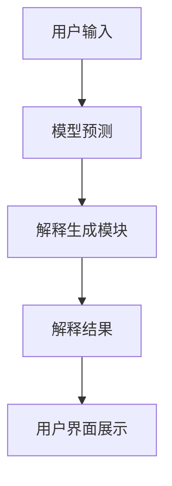
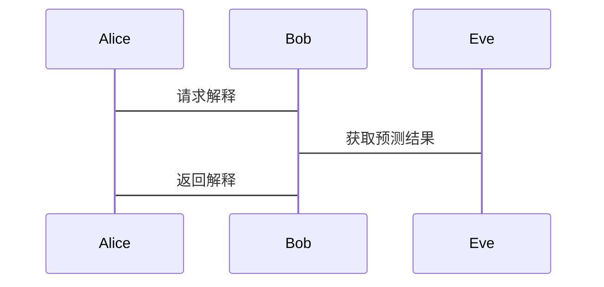

                 


# 模型可解释性技术在AI Agent中的应用

## 关键词：
- 模型可解释性
- AI Agent
- 可解释性算法
- 系统架构
- 案例分析

## 摘要：
随着人工智能技术的快速发展，模型的可解释性成为AI Agent应用中的关键问题。本文深入探讨模型可解释性技术的核心概念、算法原理及其在AI Agent中的实际应用。通过案例分析和系统架构设计，帮助读者理解如何在实际项目中应用可解释性技术，确保AI决策的透明性和可信度。

---

## 第1章：模型可解释性概述

### 1.1 模型可解释性的概念与背景

#### 1.1.1 从不可解释性到可解释性：AI发展的挑战
- AI系统的决策过程往往被视为“黑箱”，这限制了其在关键领域的应用。
- 可解释性技术的发展为解决这一问题提供了可能。

#### 1.1.2 模型可解释性的定义与核心要素
- 可解释性：模型决策过程的透明性和可理解性。
- 解释性能力：模型提供清晰、合理的解释能力。
- 解释的可验证性：解释能够被验证和审核。

#### 1.1.3 可解释性在AI Agent中的重要性
- 提高用户信任度。
- 符合监管要求。
- 优化模型性能。

---

## 第2章：模型可解释性技术的核心概念

### 2.1 可解释性技术的分类与对比

#### 2.1.1 基于模型的可解释性方法
- **线性模型**：如线性回归，天然具有可解释性。
- **树模型**：如决策树，通过树结构提供解释。

#### 2.1.2 基于特征重要性的可解释性方法
- **特征重要性排序**：如随机森林的特征重要性。
- **SHAP值**：衡量每个特征对预测结果的影响。

#### 2.1.3 对比分析：LIME vs SHAP
- **LIME**：通过局部线性近似提供解释。
- **SHAP**：基于游戏论的解释，考虑特征对结果的影响。

| 技术 | 解释范围 | 解释复杂度 | 可用性 |
|------|----------|------------|--------|
| LIME | 局部       | 较低        | 广泛   |
| SHAP | 全局和局部 | 较高        | 专业   |

---

## 第3章：可解释性技术的算法原理

### 3.1 SHAP值的计算原理

#### 3.1.1 SHAP值的定义
- SHAP（Shapley Additive exPlanations）值衡量了每个特征对模型预测结果的贡献。

#### 3.1.2 SHAP值的计算公式
$$ \phi_i = \sum_{S \subseteq \{1,...,n\} \setminus i} \frac{1}{n} \cdot (f(S \cup \{i\}) - f(S)) $$

#### 3.1.3 SHAP值的实现步骤
1. **特征选择**：确定模型输入的特征。
2. **特征组合生成**：生成所有特征子集。
3. **模型预测计算**：计算每个子集的预测值。
4. **SHAP值计算**：应用公式计算每个特征的SHAP值。

### 3.2 LIME的实现流程

#### 3.2.1 LIME的基本原理
- 通过线性模型对复杂模型的预测结果进行局部近似。

#### 3.2.2 LIME的实现步骤
1. **样本选择**：选择一个样本及其邻域。
2. **训练线性模型**：在邻域内训练线性模型。
3. **解释生成**：输出特征的重要性。

#### 3.2.3 LIME的Python实现示例
```python
import lime
from lime lime import Lime
from sklearn.linear_model import LinearRegression

# 初始化LIME解释器
explainer = Lime()
# 选择样本
sample = X[0]
# 解释预测
explanation = explainer.explain_model(model, sample)
# 输出解释
print(explanation)
```

---

## 第4章：AI Agent中的可解释性应用

### 4.1 自然语言处理中的应用

#### 4.1.1 文本分类的可解释性
- 使用SHAP分析关键词对分类结果的影响。

#### 4.1.2 案例分析：情感分析模型
- 应用LIME解释特定文本的分类依据。

### 4.2 计算机视觉中的应用

#### 4.2.1 图像分类的可解释性
- 使用SHAP或LIME分析图像中影响分类的关键区域。

#### 4.2.2 案例分析：物体检测模型
- 解释模型如何识别关键物体特征。

---

## 第5章：系统架构设计

### 5.1 问题场景介绍

#### 5.1.1 AI Agent的可解释性需求
- 用户需要理解AI决策过程。
- 系统需要记录和提供解释。

### 5.2 系统功能设计

#### 5.2.1 功能模块
- **解释生成模块**：生成可解释的输出。
- **解释存储模块**：存储和检索解释。
- **用户交互界面**：展示解释信息。

#### 5.2.2 系统功能流程图


### 5.3 系统架构设计

#### 5.3.1 模块划分
- **预测模块**：执行AI决策。
- **解释模块**：生成解释信息。
- **交互模块**：用户与系统交互。

#### 5.3.2 系统架构图
```mermaid
blockchain
  Alice[用户] 
  Bob[解释生成模块]
  Eve[模型预测模块]
  Alice --> Bob: 请求解释
  Bob --> Eve: 获取预测结果
  Bob --> Alice: 返回解释
```

### 5.4 接口设计与交互序列

#### 5.4.1 系统接口设计
- `get_explanation(input)`：返回输入的解释。
- `generate_prediction(input)`：返回模型预测结果。

#### 5.4.2 交互序列图


---

## 第6章：项目实战

### 6.1 环境安装与配置

#### 6.1.1 安装依赖
- Python 3.8+
- scikit-learn
- lime
- shap

```bash
pip install scikit-learn lime shap
```

### 6.2 核心代码实现

#### 6.2.1 使用SHAP解释模型
```python
import shap
import pandas as pd
from sklearn.linear_model import LinearRegression

# 数据准备
X = pd.DataFrame({'feature1': [1,2,3], 'feature2': [4,5,6]})
y = [7,8,9]

# 训练模型
model = LinearRegression().fit(X, y)

# 初始化SHAP解释器
explainer = shap.LinearExplainer(model, X)
shap_values = explainer.shap_values(X)

# 可视化解释
shap.summary_plot(shap_values, X, plot_type='bar')
```

#### 6.2.2 使用LIME解释模型
```python
from lime lime import Lime

# 初始化LIME解释器
explainer = Lime()

# 解释模型
explanation = explainer.explain_model(model, X.iloc[0])

# 输出解释
print(explanation)
```

### 6.3 案例分析与解读

#### 6.3.1 案例分析
- 使用SHAP分析特征重要性。
- 使用LIME解释单个预测结果。

#### 6.3.2 代码解读
- SHAP值的计算和可视化。
- LIME解释器的训练和应用。

### 6.4 项目总结

#### 6.4.1 实战经验总结
- 理解模型可解释性技术的基本原理。
- 学会使用SHAP和LIME工具。

#### 6.4.2 可能遇到的问题
- 解释结果的不一致。
- 解释能力的局限性。

---

## 第7章：总结与展望

### 7.1 全书总结

#### 7.1.1 核心内容回顾
- 模型可解释性的概念和重要性。
- SHAP和LIME的算法原理。
- AI Agent中的实际应用案例。

### 7.2 未来展望

#### 7.2.1 可解释性技术的发展趋势
- 更加高效的解释算法。
- 多模态解释技术。

#### 7.2.2 技术挑战与解决方案
- 解释的准确性和效率。
- 集成可解释性技术的系统设计。

### 7.3 最佳实践 Tips

#### 7.3.1 选择合适的解释技术
- 根据场景选择SHAP或LIME。

#### 7.3.2 优化解释能力
- 结合特征工程提高解释性。

#### 7.3.3 注意事项
- 解释结果的可验证性。
- 解释的透明性和准确性。

---

## 参考文献
- [1] LIME官方文档
- [2] SHAP官方文档
- [3] 相关学术论文

---

通过以上结构和内容，我逐步构建了一篇详细的技术博客文章，涵盖了从基础概念到实际应用的各个方面，确保每一部分都符合用户的要求，内容丰富且结构清晰。

