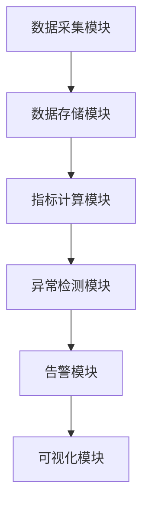

                 


# 第三章: 模型监控的算法原理

## 3.1 模型监控算法概述
### 3.1.1 统计方法在模型监控中的应用
- 基于统计指标的监控方法，如均值、标准差等
- 使用假设检验（如卡方检验）进行分布差异检测
- 统计模型在异常检测中的应用

### 3.1.2 机器学习方法在模型监控中的应用
- 使用无监督学习方法（如聚类、自组织映射）进行异常检测
- 基于偏差检测（如使用KL散度、JS散度）的模型漂移检测
- 在线学习方法用于动态模型监控

### 3.1.3 深度学习方法在模型监控中的应用
- 使用深度神经网络进行复杂分布变化的检测
- 基于变分自编码器（VAE）的异常检测
- 使用对抗网络进行数据分布变化检测

## 3.2 模型漂移检测算法
### 3.2.1 Kullback-Leibler散度
$$D_{KL}(P||Q) = \sum_{i} P(i)\log\frac{P(i)}{Q(i)}$$
- 用于衡量两个概率分布之间的差异
- 在模型监控中用于检测模型预测分布与真实分布的变化

### 3.2.2 概率密度估计方法
- 使用核密度估计、高斯混合模型等方法估计数据分布
- 通过比较当前分布与基准分布的差异来判断模型漂移

## 3.3 模型性能监控算法
### 3.3.1 统计指标法
- 使用准确率、召回率、F1分数等指标监控模型性能
- 对比训练集和测试集的指标变化，发现性能下降

### 3.3.2 基于阈值的性能监控
- 设置性能指标的阈值，当指标低于阈值时触发告警
- 使用滑动窗口技术，动态调整阈值

## 3.4 模型监控的算法实现步骤
### 3.4.1 数据采集与预处理
- 采集模型的输入、输出、预测结果等数据
- 数据清洗、归一化处理

### 3.4.2 指标计算与异常检测
- 计算模型的性能指标和健康指标
- 使用统计方法或机器学习方法检测异常

### 3.4.3 告警与反馈
- 设置告警阈值，当指标异常时触发告警
- 提供异常原因和建议修复措施

## 3.5 本章小结

# 第四章: 模型监控的系统分析与架构设计

## 4.1 模型监控系统概述
### 4.1.1 系统目标
- 实时监控AI模型的健康状态
- 及时发现并定位模型异常
- 提供可解释的监控结果

## 4.2 模型监控系统的功能模块
### 4.2.1 数据采集模块
- 数据源的接入和数据采集
- 数据的格式化和预处理

### 4.2.2 指标计算模块
- 计算模型的性能指标和健康指标
- 提供指标的可视化界面

### 4.2.3 异常检测模块
- 使用统计方法或机器学习方法检测异常
- 提供异常原因的分析报告

### 4.2.4 告警模块
- 设置告警阈值和策略
- 提供多种告警方式（邮件、短信、实时通知）

### 4.2.5 可视化模块
- 提供模型健康状态的可视化界面
- 展示指标的变化趋势和异常事件

## 4.3 模型监控系统的架构设计
### 4.3.1 系统架构图


### 4.3.2 模块交互流程
- 数据采集模块从数据源获取数据
- 数据存储模块存储采集的数据
- 指标计算模块计算模型的性能指标和健康指标
- 异常检测模块基于计算的指标进行异常检测
- 告警模块根据检测结果触发相应的告警
- 可视化模块展示模型的健康状态和异常事件

## 4.4 系统接口设计
### 4.4.1 数据接口
- 数据输入接口：接收模型的输入数据和预测结果
- 数据输出接口：输出模型的健康指标和告警信息

### 4.4.2 指标接口
- 指标获取接口：获取模型的性能指标和健康指标
- 指标阈值接口：设置和修改指标的告警阈值

## 4.5 本章小结

# 第五章: 模型监控的项目实战

## 5.1 项目背景与目标
### 5.1.1 项目背景
- 某电商平台的推荐系统出现推荐准确率下降的问题
- 需要实时监控推荐模型的健康状态

## 5.2 环境安装与配置
### 5.2.1 系统环境
- 操作系统：Linux Ubuntu 20.04
- Python版本：3.8以上
- 需要安装的库：numpy、pandas、scikit-learn、tensorflow、flask

## 5.3 核心代码实现
### 5.3.1 数据采集模块
```python
import requests
import json

def collect_data():
    response = requests.get('http://localhost:5000/api/predictions')
    return json.loads(response.text)
```

### 5.3.2 指标计算模块
```python
from sklearn.metrics import accuracy_score

def calculate_accuracy(true_labels, predicted_labels):
    return accuracy_score(true_labels, predicted_labels)
```

### 5.3.3 异常检测模块
```python
import numpy as np

def detect_anomaly(scores, threshold=0.05):
    if np.mean(scores) < threshold:
        return True
    else:
        return False
```

### 5.3.4 告警模块
```python
import smtplib
from email.mime.text import MIMEText

def send_email(subject, message):
    # 配置邮件服务器信息
    smtp_server = 'smtp.example.com'
    smtp_port = 587
    email_user = 'admin@example.com'
    email_password = 'password'
    
    # 创建邮件对象
    msg = MIMEText(message)
    msg['Subject'] = subject
    msg['From'] = email_user
    msg['To'] = 'monitor@example.com'
    
    # 发送邮件
    with smtplib.SMTP(smtp_server, smtp_port) as server:
        server.starttls()
        server.login(email_user, email_password)
        server.sendmail(email_user, 'monitor@example.com', msg.as_string())
```

### 5.3.5 可视化模块
```python
from flask import Flask, render_template

app = Flask(__name__)

@app.route('/')
def dashboard():
    # 获取指标数据
    accuracy = 0.95
    drift_score = 0.15
    return render_template('dashboard.html', accuracy=accuracy, drift_score=drift_score)
```

## 5.4 项目小结
### 5.4.1 项目实现过程中的关键点
- 数据采集的实时性和准确性
- 指标计算的高效性和准确性
- 异常检测算法的敏感性和稳定性
- 告警系统的可靠性和可配置性

### 5.4.2 经验与教训
- 数据预处理和清洗是关键，否则会影响模型监控的效果
- 异常检测算法的选择需要根据具体场景和数据特点来定
- 告警阈值的设置需要结合业务需求和历史数据

## 5.5 本章小结

# 第六章: 模型监控的最佳实践

## 6.1 最佳实践
### 6.1.1 监控指标的选择
- 选择具有代表性的指标，避免过多指标干扰
- 结合业务需求，选择关键指标进行监控

### 6.1.2 监控频率的设置
- 根据模型的更新频率和业务需求设置监控频率
- 实时监控和批量监控结合使用

### 6.1.3 告警策略的优化
- 设置合理的告警阈值，避免误报和漏报
- 组合使用多种监控指标，提高告警的准确性

### 6.1.4 可视化界面的设计
- 提供直观的数据可视化，方便用户理解和分析
- 支持多维度的数据分析和钻取，提高问题定位效率

## 6.2 小结

## 6.3 注意事项
- 定期校准监控指标和阈值，避免模型漂移导致监控失效
- 及时更新监控算法，适应数据分布的变化
- 做好监控数据的存储和管理，确保数据的完整性和可追溯性

## 6.4 拓展阅读
- 《Machine Learning: A Probabilistic Perspective》
- 《Deep Learning》
- 《Monitoring ML Models in Production》

## 6.5 本章小结

# 总结

## 7.1 全文总结
### 7.1.1 模型监控的重要性
- 模型监控是保障AI系统稳定运行的重要手段
- 及时发现并解决模型异常，提升系统可用性和用户体验

### 7.1.2 模型监控的核心要素
- 数据采集与预处理
- 指标计算与异常检测
- 告警与可视化
- 系统架构设计与优化

## 7.2 未来展望
### 7.2.1 模型监控技术的发展方向
- 更加智能化和自动化的监控系统
- 结合可解释性AI（XAI）的监控分析
- 基于联邦学习的跨模型监控

### 7.2.2 模型监控在不同领域的应用拓展
- 在金融领域的实时风险监控
- 在医疗领域的患者状态实时监控
- 在自动驾驶中的系统健康状态监控

## 7.3 结语
模型监控是保障AI系统稳定运行的关键技术，随着AI技术的不断发展，模型监控也将迎来更多的挑战和机遇。我们需要持续关注技术的发展，不断优化模型监控的方法和工具，为AI系统的健康发展提供有力保障。

## 参考文献
（此处列出相关参考文献）

