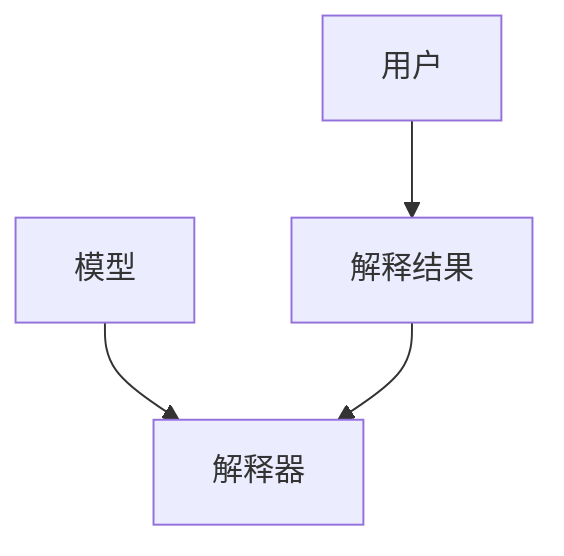
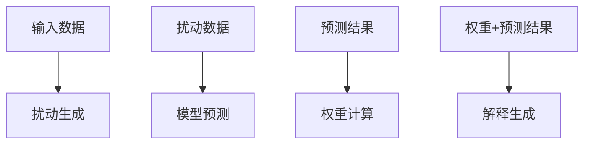
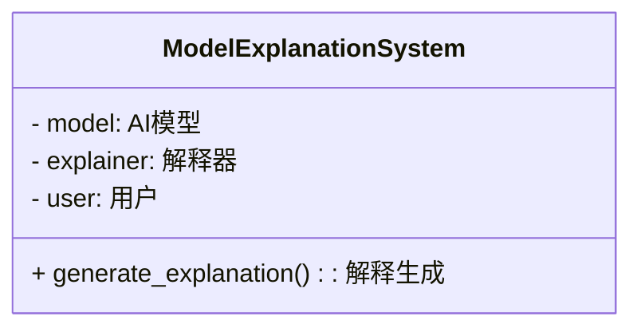
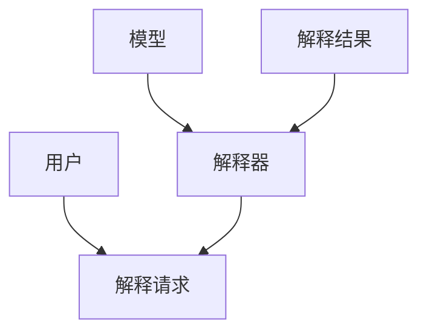
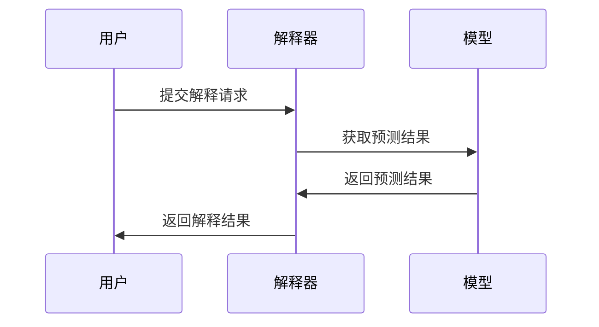

                 


# 模型解释：增加AI Agent的透明度

**关键词**：模型解释、AI Agent、可解释性AI、透明度、解释性系统、用户信任

**摘要**：本文探讨模型解释性在AI Agent中的重要性，分析其实现方法和应用场景，通过详细的技术分析和实例，展示如何增加AI系统的透明度，提升用户信任。

---

# 第1章：问题背景与问题描述

## 1.1 人工智能与AI Agent的演进

### 1.1.1 人工智能的发展历程

人工智能从早期的专家系统到现在的深度学习，经历了多次变革。AI Agent作为智能系统的核心，广泛应用于各个领域。

### 1.1.2 AI Agent的基本概念与分类

AI Agent通过环境交互完成目标，分为简单反射型、基于模型的反应型、目标驱动型和实用驱动型。

### 1.1.3 当前AI Agent应用的现状与挑战

AI Agent在金融、医疗等领域广泛应用，但模型解释性不足成为主要挑战。

---

## 1.2 模型解释性的定义与重要性

### 1.2.1 什么是模型解释性

模型解释性指模型决策过程的可解释程度，是用户信任的基础。

### 1.2.2 模型解释性在AI Agent中的作用

解释性帮助用户理解AI决策，增强信任，确保合规性。

### 1.2.3 解释性对用户信任与合规性的影响

缺乏解释性导致用户不信任，影响AI系统的广泛应用。

---

## 1.3 问题解决与边界定义

### 1.3.1 模型解释性问题的边界与外延

解释性关注决策过程，不涉及模型预测结果。

### 1.3.2 解释性与可解释性AI的关系

解释性是可解释性AI的重要组成部分。

### 1.3.3 解释性在不同场景中的实现差异

不同领域对解释性的需求不同，实现方法也各异。

---

## 1.4 核心概念与组成要素

### 1.4.1 解释性系统的组成要素

包括输入数据、解释器、解释结果等。

### 1.4.2 解释性与模型复杂度的关系

模型复杂度越高，解释性越难。

### 1.4.3 解释性与用户认知水平的匹配

解释性需与用户认知能力相匹配。

---

# 第2章：核心概念与联系

## 2.1 模型解释性原理

### 2.1.1 解释性生成的原理概述

通过扰动数据或特征重要性分析生成解释。

### 2.1.2 解释性与模型可解释性的区别

解释性是可解释性AI的一个方面。

### 2.1.3 解释性与模型透明度的关系

透明度是解释性的基础。

---

## 2.2 核心概念对比分析

### 2.2.1 不同解释性方法的特征对比

方法包括LIME、SHAP等，各有优缺点。

### 2.2.2 解释性与可解释性的对比表格

| 对比维度 | 解释性 | 可解释性AI |
|----------|--------|-----------|
| 范围     | 局部   | 全局     |
| 方法     | LIME   | SHAP      |

### 2.2.3 实体关系图



---

# 第3章：解释性模型算法原理

## 3.1 常见解释性算法概述

### 3.1.1 LIME算法

通过扰动数据点，加权预测结果生成解释。

### 3.1.2 SHAP值

基于博弈论，分配特征对预测的影响权重。

### 3.1.3 梯度上升规则

通过梯度上升优化特征重要性。

---

## 3.2 LIME算法原理

### 3.2.1 LIME算法的流程图



### 3.2.2 LIME算法的Python实现

```python
def lime_explanation(model, instance, k=10):
    # 生成扰动数据
    perturbed_data = generate_perturbations(instance, k)
    # 预测结果
    predictions = model.predict(perturbed_data)
    # 计算权重
    weights = calculate_weights(perturbed_data, instance)
    # 解释生成
    explanation = generate_explanation(weights, predictions)
    return explanation
```

---

## 3.3 SHAP值的数学公式

$$ SHAP_{i,j} = \phi_{i,j} = \frac{1}{2^{m}}} \sum_{S \subseteq j} (|S| + 1 - 2|S|) \cdot f(S) $$

---

## 3.4 梯度上升规则的Python实现

```python
def gradient_ascent_explanation(model, instance):
    # 初始化
    explanation = np.zeros_like(instance)
    # 迭代优化
    for _ in range(iterations):
        gradient = compute_gradient(model, instance, explanation)
        explanation += learning_rate * gradient
    return explanation
```

---

# 第4章：系统分析与架构设计

## 4.1 应用场景介绍

AI Agent在医疗诊断中的应用，如预测患者病情。

## 4.2 系统功能设计

### 4.2.1 领域模型类图



---

## 4.3 系统架构设计

### 4.3.1 系统架构图



---

## 4.4 系统接口设计

### 4.4.1 接口设计

- 输入：用户请求
- 输出：解释结果

---

## 4.5 系统交互流程



---

# 第5章：项目实战

## 5.1 环境安装

安装Python库：`pip install lime shap`

## 5.2 系统核心实现

### 5.2.1 核心功能实现

```python
import lime
import shap

def explain_model(model, instance):
    # 使用LIME解释模型
    explainer = lime.LimeExplainer()
    explanation = explainer.explain_instance(model, instance)
    return explanation
```

---

## 5.3 代码应用解读

解释器通过扰动数据和模型预测生成解释结果，帮助用户理解模型决策。

---

## 5.4 实际案例分析

以医疗诊断为例，展示解释性结果，帮助医生理解AI诊断依据。

---

## 5.5 项目小结

通过代码实现解释性系统，展示AI Agent的透明度提升。

---

# 第6章：最佳实践

## 6.1 小结

模型解释性是AI Agent透明度的关键，需综合考虑算法和系统设计。

## 6.2 注意事项

- 解释性需简洁易懂
- 选择合适的解释方法
- 考虑用户认知水平

## 6.3 未来趋势

模型解释性将更加重要，推动AI系统的广泛应用。

## 6.4 扩展阅读

推荐书籍和论文，深入学习模型解释性。

---

# 结语

模型解释性是AI Agent透明度的关键，通过本文的分析，读者可以理解如何实现模型解释性，提升AI系统的可信度。

---

**THE END**

