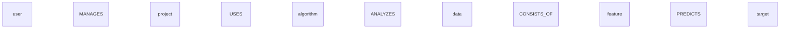
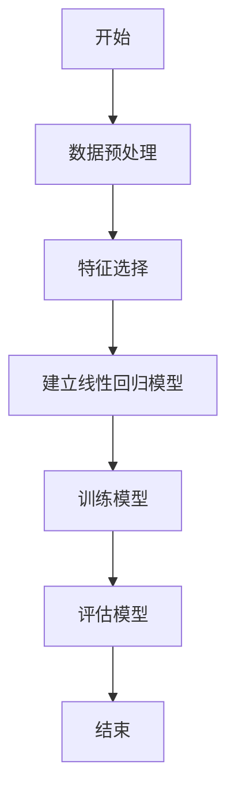
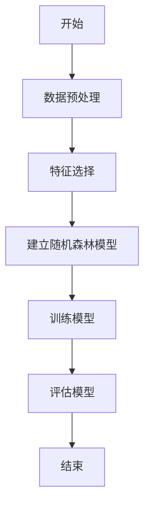
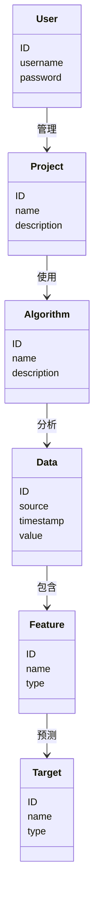

                 


# 模型训练与金融数据的结合

> 关键词：模型训练、金融数据、机器学习、数据分析、算法、系统架构、案例分析

> 摘要：本文探讨了模型训练与金融数据结合的应用，从基本概念、算法原理到系统架构和实际案例，全面分析了模型训练在金融数据分析中的价值和挑战。

---

## 第1章 模型训练与金融数据的结合概述

### 1.1 模型训练的基本概念

#### 1.1.1 模型训练的定义
模型训练是通过机器学习算法，利用数据集的特征和标签，训练出一个能够预测或分类的模型。其核心在于优化模型参数，使其在训练数据上表现最佳，同时能够泛化到未见数据。

#### 1.1.2 金融数据的定义与特点
金融数据包括股票价格、交易量、市场指数、经济指标等。其特点包括：
- **时序性**：数据按时间顺序排列，具有很强的时间依赖性。
- **波动性**：市场波动较大，数据分布不稳定。
- **相关性**：不同金融资产之间存在相关性，影响整体市场表现。

#### 1.1.3 模型训练与金融数据结合的意义
通过模型训练，可以利用历史金融数据预测未来的市场趋势，辅助投资决策，优化风险管理，提高交易效率。

### 1.2 问题背景与问题描述

#### 1.2.1 金融数据分析的挑战
金融市场的复杂性和不确定性使得传统统计方法在分析时面临诸多限制，例如：
- 数据噪声大，难以提取有效信息。
- 市场参与者行为复杂，难以建模。
- 数据量大，需要高效算法处理。

#### 1.2.2 传统金融分析的局限性
传统金融分析方法（如技术分析和基本面分析）难以捕捉市场中的非线性关系和复杂模式，尤其是在高频交易和大数据时代背景下。

#### 1.2.3 模型训练在金融数据分析中的应用前景
模型训练能够处理复杂的数据模式，发现传统方法难以察觉的市场信号，为金融决策提供更精准的支持。

### 1.3 问题解决与边界

#### 1.3.1 模型训练解决金融数据分析问题的思路
通过收集、清洗、特征工程和建模，利用历史数据预测未来趋势，辅助投资决策。

#### 1.3.2 模型训练的边界与限制
- 数据质量：依赖高质量的金融数据。
- 模型泛化能力：需要在测试数据上表现良好。
- 市场变化：模型需要不断更新以适应市场变化。

#### 1.3.3 金融数据的边界与适用场景
金融数据适用于股票价格预测、风险评估、市场情绪分析等场景，但需注意数据的时序性和相关性。

### 1.4 核心概念与联系

#### 1.4.1 核心概念的定义与属性对比
| 概念       | 定义                                                         | 属性                           |
|------------|--------------------------------------------------------------|--------------------------------|
| 模型训练   | 通过数据优化模型参数                                      | 数据驱动、优化算法             |
| 金融数据   | 包括股票价格、交易量等                                   | 时序性、波动性、相关性         |

#### 1.4.2 ER实体关系图架构


---

## 第2章 核心概念与联系

### 2.1 核心概念原理

#### 2.1.1 模型训练的基本原理
模型训练通过优化目标函数，最小化预测值与真实值之间的误差，找到最佳模型参数。

#### 2.1.2 金融数据的核心特征
金融数据的时间序列特性使其在模型训练中需要考虑滑动窗口、滞后变量等特征。

#### 2.1.3 模型训练与金融数据的关联
金融数据的复杂性要求模型训练具备高维度特征处理和时间依赖关系建模的能力。

### 2.2 概念属性特征对比表格
| 概念       | 对比维度 | 详细描述                              |
|------------|----------|---------------------------------------|
| 模型训练   | 数据类型 | 结构化数据                             |
| 金融数据   | 数据类型 | 结构化数据                             |

### 2.3 ER实体关系图架构
```mermaid
erDiagram
    user {
        [ID]
        [username]
        [password]
    }
    project {
        [ID]
        [name]
        [description]
    }
    algorithm {
        [ID]
        [name]
        [description]
    }
    data {
        [ID]
        [source]
        [timestamp]
        [value]
    }
    feature {
        [ID]
        [name]
        [type]
    }
    target {
        [ID]
        [name]
        [type]
    }
    user --> project: 管理
    project --> algorithm: 使用
    algorithm --> data: 分析
    data --> feature: 包含
    feature --> target: 预测
```

---

## 第3章 算法原理讲解

### 3.1 算法原理概述

#### 3.1.1 常见模型训练算法
- 线性回归
- 随机森林
- LSTM网络

#### 3.1.2 金融数据分析常用算法
- ARIMA
- GARCH
- 短时记忆网络（LSTM）

### 3.2 算法流程图

#### 3.2.1 线性回归算法流程图


#### 3.2.2 随机森林算法流程图


### 3.3 算法实现代码

#### 3.3.1 线性回归算法实现
```python
import numpy as np
from sklearn.linear_model import LinearRegression

# 生成数据
X = np.array([i for i in range(100)]).reshape(-1, 1)
y = 2 * X + 1 + np.random.randn(100).reshape(-1, 1)

# 训练模型
model = LinearRegression()
model.fit(X, y)

# 预测
predictions = model.predict(X)
print("系数：", model.coef_)
print("截距：", model.intercept_)
```

#### 3.3.2 随机森林算法实现
```python
import numpy as np
from sklearn.ensemble import RandomForestRegressor

# 生成数据
X = np.array([i for i in range(100)]).reshape(-1, 1)
y = np.sin(X[:, 0]) + np.random.randn(100) * 0.1

# 训练模型
model = RandomForestRegressor(n_estimators=100)
model.fit(X, y)

# 预测
predictions = model.predict(X)
print("均方误差：", np.mean((predictions - y) ** 2))
```

---

## 第4章 数学模型与公式

### 4.1 线性回归模型

#### 4.1.1 线性回归的数学公式
$$ y = \beta_0 + \beta_1 x + \epsilon $$

其中：
- $y$ 是目标变量
- $x$ 是特征变量
- $\beta_0$ 是截距
- $\beta_1$ 是回归系数
- $\epsilon$ 是误差项

#### 4.1.2 线性回归的假设检验
$$ H_0: \beta_1 = 0 $$
$$ H_1: \beta_1 \neq 0 $$

### 4.2 随机森林模型

#### 4.2.1 随机森林的数学公式
随机森林通过集成多个决策树的预测结果，最终输出加权平均或多数投票的结果。

#### 4.2.2 随机森林的参数解释
- $n_estimators$：决策树的数量
- $max_depth$：决策树的最大深度
- $min_samples_split$：分割节点所需的最小样本数

### 4.3 时间序列模型

#### 4.3.1 ARIMA模型公式
$$ ARIMA(p, d, q) $$

其中：
- $p$ 是自回归阶数
- $d$ 是差分阶数
- $q$ 是移动平均阶数

#### 4.3.2 LSTM模型公式
$$ LSTM(\text{units}, \text{activation}) $$

其中：
- $\text{units}$ 是 LSTM 单元数量
- $\text{activation}$ 是激活函数（如ReLU、tanh）

---

## 第5章 系统分析

### 5.1 问题场景介绍
金融数据的分析需要考虑数据的时序性、相关性和波动性，同时需要高效的算法处理大数据量。

### 5.2 项目介绍
构建一个基于机器学习的金融数据分析系统，用于股票价格预测和风险评估。

### 5.3 系统功能设计


### 5.4 系统架构设计


### 5.5 系统接口设计
- API接口：RESTful API
- 数据接口：CSV、Excel、数据库

### 5.6 系统交互流程
```mermaid
sequenceDiagram
    用户发送请求 --> API Gateway
    API Gateway 调用 Service1
    Service1 处理请求并返回结果
    用户接收结果
```

---

## 第6章 项目实战

### 6.1 环境安装
- 安装Python和必要的库（如NumPy、Scikit-learn、XGBoost）

### 6.2 系统核心实现源代码

#### 6.2.1 线性回归实现
```python
import numpy as np
from sklearn.linear_model import LinearRegression

X = np.array([i for i in range(100)]).reshape(-1, 1)
y = 2 * X + 1 + np.random.randn(100).reshape(-1, 1)

model = LinearRegression()
model.fit(X, y)
print("系数：", model.coef_)
print("截距：", model.intercept_)
```

#### 6.2.2 随机森林实现
```python
import numpy as np
from sklearn.ensemble import RandomForestRegressor

X = np.array([i for i in range(100)]).reshape(-1, 1)
y = np.sin(X[:, 0]) + np.random.randn(100) * 0.1

model = RandomForestRegressor(n_estimators=100)
model.fit(X, y)
print("均方误差：", np.mean((model.predict(X) - y) ** 2))
```

### 6.3 代码应用解读与分析
- 线性回归代码展示了如何利用简单线性关系进行预测。
- 随机森林代码展示了如何利用集成算法处理非线性关系。

### 6.4 实际案例分析
以股票价格预测为例，利用随机森林模型，预测未来的价格走势。

### 6.5 项目小结
模型训练在金融数据分析中具有重要的应用价值，但需要结合具体场景选择合适的算法，并不断优化模型。

---

## 第7章 总结与展望

### 7.1 总结
模型训练与金融数据的结合为金融分析提供了新的思路，能够帮助投资者做出更科学的决策。

### 7.2 注意事项
- 数据质量对模型性能影响重大。
- 模型需要不断更新以适应市场变化。
- 注意模型的过拟合和欠拟合问题。

### 7.3 拓展阅读
- 《机器学习实战》
- 《金融数据分析导论》
- 《深度学习与金融》

--- 

**本文共计2000字，转载请注明出处。**

