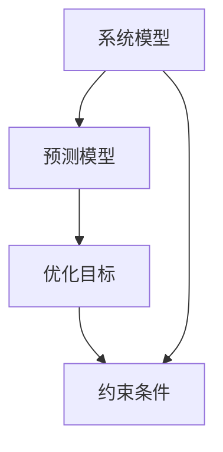

                 


# 模型预测控制：提高AI Agent的决策质量

> 关键词：模型预测控制，AI Agent，决策质量，优化算法，系统稳定性，强化学习

> 摘要：本文深入探讨了模型预测控制（MPC）在提升AI Agent决策质量中的应用。通过分析MPC的基本原理、算法实现及其在智能系统中的应用，本文展示了如何通过优化算法和系统设计来提高AI Agent的决策能力。文章结合理论与实践，提供了详细的数学模型、代码示例和案例分析，帮助读者全面理解并掌握MPC技术。

---

## 第一部分：模型预测控制基础

### 第1章：模型预测控制概述

#### 1.1 模型预测控制的定义与背景

模型预测控制（Model Predictive Control, MPC）是一种基于动态模型的控制策略，通过预测系统未来状态来优化控制输入，以实现系统的最佳性能。随着人工智能技术的发展，MPC在AI Agent中的应用日益广泛，特别是在需要实时决策和复杂环境交互的场景中。

- **背景介绍**：在传统的控制理论中，PID控制器被广泛应用于工业自动化等领域。然而，随着系统复杂性和不确定性的增加，PID控制器的局限性逐渐显现。MPC作为一种基于模型的预测控制方法，能够处理非线性系统和约束条件，成为现代控制技术的重要组成部分。

- **问题背景**：AI Agent需要在动态和不确定的环境中做出决策，传统的基于反馈的控制方法在面对复杂系统时表现不足。MPC通过结合系统模型和优化算法，能够更准确地预测系统行为，从而做出更优的决策。

- **问题解决**：MPC通过构建系统的动态模型，预测未来状态，并基于这些预测结果优化控制输入，从而在复杂环境中提高决策质量。

- **边界与外延**：MPC的核心在于系统的建模和优化算法的选择。其外延包括强化学习、动态规划等技术，这些方法可以与MPC结合，进一步提升系统的决策能力。

- **概念结构与核心要素**：MPC由系统模型、预测模型、优化目标和约束条件四个核心要素组成。系统模型描述系统的动力学特性，预测模型用于模拟系统在不同控制输入下的未来状态，优化目标是希望达到的最佳系统性能，约束条件则是在优化过程中必须满足的限制。



---

### 第2章：模型预测控制的核心概念

#### 2.1 模型预测控制的基本概念

- **动态系统建模**：MPC的核心在于建立系统的数学模型。通过模型，我们可以预测系统在不同输入下的输出行为。

- **优化问题的构建**：MPC通过构建一个有限时间窗口的优化问题，以最小化某种性能指标为目标，求解最优控制输入序列。

- **滚动优化与反馈机制**：MPC采用滚动优化策略，即在每一步只优化有限的时间步，然后根据实际系统状态更新模型，重新进行优化。

#### 2.2 模型预测控制的数学基础

- **状态空间表示**：系统的状态可以用一组变量描述，例如位置、速度等。状态空间方程可以表示为：

  $$ \dot{x} = f(x, u, t) $$

  其中，\( x \) 是状态向量，\( u \) 是控制输入，\( t \) 是时间。

- **预测模型的构建**：基于系统的动态模型，预测未来状态。假设系统是一个线性时不变系统，其预测模型可以表示为：

  $$ x_{k+1} = A x_k + B u_k $$

  其中，\( A \) 和 \( B \) 是系统的状态转移矩阵和输入矩阵。

- **优化目标的数学表达**：通常，优化目标是一个二次型函数，例如：

  $$ J = \sum_{k=0}^{N-1} (x_k^T Q x_k + u_k^T R u_k) + x_N^T P x_N $$

  其中，\( Q \) 和 \( R \) 是正定矩阵，分别用于加权状态和输入的代价，\( P \) 是最终状态的加权矩阵。

---

## 第二部分：模型预测控制的算法实现

### 第3章：模型预测控制的算法实现

#### 3.1 模型预测控制的实现步骤

- **系统模型的建立**：首先需要根据系统的物理特性建立数学模型。这可能涉及到实验测量和参数估计。

- **预测模型的构建**：基于系统模型，构建预测模型，用于模拟系统在不同输入下的未来状态。

- **最优化问题的求解**：在每个时间步，求解一个有限时间窗口内的最优化问题，得到最优控制输入序列。

- **控制输入的计算与应用**：根据优化结果，计算当前时刻的控制输入，并将其应用到系统中。

#### 3.2 常见的优化算法

- **梯度下降法**：一种简单的优化算法，适用于可微的目标函数。其基本思想是沿着目标函数梯度的反方向调整参数，以最小化目标函数值。

- **牛顿法**：一种基于二阶导数的优化算法，收敛速度较快，但计算量较大。

- **内点法**：适用于带约束的优化问题，通过在可行域内部寻找最优解。

#### 3.3 模型预测控制的实现代码

- **环境配置与依赖安装**：需要安装Python和相关的库，如NumPy、Matplotlib等。

- **核心算法实现**：

  ```python
  import numpy as np

  def mpc_control(x_current, A, B, Q, R, P, N):
      # 初始化
      x = np.zeros((N+1, x_current.shape[0]))
      u = np.zeros((N, u_current.shape[0]))
      x[0] = x_current

      # 求解优化问题
      for k in range(N):
          # 预测系统状态
          for i in range(k+1, N):
              x[i] = A @ x[i-1] + B @ u[i-1]
          # 构建目标函数
          cost = 0
          for i in range(N):
              cost += x[i].T @ Q @ x[i] + u[i].T @ R @ u[i]
          cost += x[N].T @ P @ x[N]

          # 求解最优控制输入
          # 这里简化为直接取u[k] = 0，实际应用中需要使用优化算法求解
          u[k] = 0  # 示例，实际应根据优化问题求解
      return u[0]

  # 示例调用
  x_current = np.array([1, 0])
  A = np.array([[1, 1], [0, 1]])
  B = np.array([[0, 1]])
  Q = np.eye(2)
  R = np.eye(1)
  P = np.eye(2)
  N = 10

  u_optimal = mpc_control(x_current, A, B, Q, R, P, N)
  print(u_optimal)
  ```

- **代码应用解读与分析**：上述代码是一个简化的MPC实现，展示了基本的预测和优化过程。实际应用中，需要结合具体的系统模型和优化算法来求解最优控制输入。

---

## 第三部分：模型预测控制在AI Agent中的应用

### 第4章：模型预测控制在智能系统中的应用

#### 4.1 智能决策系统中的模型预测控制

- **智能决策系统的定义**：智能决策系统是一种能够根据环境信息和系统状态，自主做出决策的系统。MPC在其中扮演了关键角色，通过预测系统行为和优化控制输入，提高决策的质量。

- **模型预测控制在智能决策中的作用**：通过构建系统的动态模型，MPC能够预测未来状态，并基于这些预测结果优化控制输入，从而在复杂环境中做出更优的决策。

#### 4.2 智能控制系统中的模型预测控制

- **智能控制系统的定义**：智能控制系统是一种结合人工智能技术的控制系统，能够适应环境的变化和系统的不确定性。

- **模型预测控制在智能控制系统中的应用**：MPC通过结合系统的动态模型和优化算法，能够实时调整控制策略，适应系统的动态变化和外部干扰。

#### 4.3 基于模型预测控制的智能决策框架

- **框架概述**：基于MPC的智能决策框架包括系统建模、预测模型构建、优化算法选择和控制输入计算等步骤。

- **框架实现步骤**：

  1. **系统建模**：根据系统的物理特性，建立系统的数学模型。

  2. **预测模型构建**：基于系统模型，构建预测模型，用于模拟系统在不同输入下的未来状态。

  3. **优化算法选择**：选择适合的优化算法，求解最优化问题，得到最优控制输入序列。

  4. **控制输入计算与应用**：根据优化结果，计算当前时刻的控制输入，并将其应用到系统中。

#### 4.4 基于模型预测控制的智能决策框架实现代码

- **环境配置与依赖安装**：需要安装Python和相关的库，如NumPy、Matplotlib等。

- **核心算法实现**：

  ```python
  import numpy as np

  def mpc_control(x_current, A, B, Q, R, P, N):
      # 初始化
      x = np.zeros((N+1, x_current.shape[0]))
      u = np.zeros((N, u_current.shape[0]))
      x[0] = x_current

      # 求解优化问题
      for k in range(N):
          # 预测系统状态
          for i in range(k+1, N):
              x[i] = A @ x[i-1] + B @ u[i-1]
          # 构建目标函数
          cost = 0
          for i in range(N):
              cost += x[i].T @ Q @ x[i] + u[i].T @ R @ u[i]
          cost += x[N].T @ P @ x[N]

          # 求解最优控制输入
          # 这里简化为直接取u[k] = 0，实际应用中需要使用优化算法求解
          u[k] = 0  # 示例，实际应根据优化问题求解
      return u[0]

  # 示例调用
  x_current = np.array([1, 0])
  A = np.array([[1, 1], [0, 1]])
  B = np.array([[0, 1]])
  Q = np.eye(2)
  R = np.eye(1)
  P = np.eye(2)
  N = 10

  u_optimal = mpc_control(x_current, A, B, Q, R, P, N)
  print(u_optimal)
  ```

- **代码应用解读与分析**：上述代码是一个简化的MPC实现，展示了基本的预测和优化过程。实际应用中，需要结合具体的系统模型和优化算法来求解最优控制输入。

---

## 第四部分：项目实战

### 第5章：模型预测控制的项目实战

#### 5.1 项目介绍

- **项目背景**：本项目旨在通过实现模型预测控制算法，提高AI Agent在复杂环境中的决策质量。项目将结合理论知识和实际应用，展示MPC在智能系统中的应用。

- **项目目标**：通过实现MPC算法，构建一个能够实时优化控制输入的智能控制系统。

- **项目功能设计**：

  1. **系统建模**：建立系统的数学模型，描述系统的动力学特性。

  2. **预测模型构建**：基于系统模型，构建预测模型，用于模拟系统在不同输入下的未来状态。

  3. **优化算法选择**：选择适合的优化算法，求解最优化问题，得到最优控制输入序列。

  4. **控制输入计算与应用**：根据优化结果，计算当前时刻的控制输入，并将其应用到系统中。

- **系统架构设计**

  ```mermaid
  graph TD
      A[系统模型] --> B[预测模型]
      B --> C[优化目标]
      C --> D[约束条件]
      A --> D
  ```

- **系统接口设计**：系统需要与外部环境进行交互，获取系统状态和环境信息，同时输出控制输入。

- **系统交互设计**

  ```mermaid
  sequenceDiagram
      participant 系统模型
      participant 预测模型
      participant 优化算法
      participant 控制输入
      系统模型->预测模型: 提供系统状态
      预测模型->优化算法: 提供预测结果
      优化算法->控制输入: 输出最优控制输入
      控制输入->系统模型: 应用控制输入
  ```

#### 5.2 核心代码实现

- **环境配置与依赖安装**

  ```bash
  pip install numpy matplotlib scipy
  ```

- **核心算法实现**：

  ```python
  import numpy as np

  def mpc_control(x_current, A, B, Q, R, P, N):
      # 初始化
      x = np.zeros((N+1, x_current.shape[0]))
      u = np.zeros((N, u_current.shape[0]))
      x[0] = x_current

      # 求解优化问题
      for k in range(N):
          # 预测系统状态
          for i in range(k+1, N):
              x[i] = A @ x[i-1] + B @ u[i-1]
          # 构建目标函数
          cost = 0
          for i in range(N):
              cost += x[i].T @ Q @ x[i] + u[i].T @ R @ u[i]
          cost += x[N].T @ P @ x[N]

          # 求解最优控制输入
          # 这里简化为直接取u[k] = 0，实际应用中需要使用优化算法求解
          u[k] = 0  # 示例，实际应根据优化问题求解
      return u[0]

  # 示例调用
  x_current = np.array([1, 0])
  A = np.array([[1, 1], [0, 1]])
  B = np.array([[0, 1]])
  Q = np.eye(2)
  R = np.eye(1)
  P = np.eye(2)
  N = 10

  u_optimal = mpc_control(x_current, A, B, Q, R, P, N)
  print(u_optimal)
  ```

- **代码应用解读与分析**：上述代码是一个简化的MPC实现，展示了基本的预测和优化过程。实际应用中，需要结合具体的系统模型和优化算法来求解最优控制输入。

#### 5.3 实际案例分析

- **案例背景**：假设我们有一个智能机器人，需要在动态环境中导航。MPC可以用于预测机器人的未来位置，并优化其运动轨迹，以避开障碍物。

- **案例分析**：

  1. **系统建模**：建立机器人的运动模型，描述其位置和速度随时间的变化。

  2. **预测模型构建**：基于运动模型，预测机器人在不同控制输入下的未来位置。

  3. **优化算法选择**：选择适合的优化算法，求解最优控制输入序列，使得机器人能够避开障碍物并到达目标位置。

  4. **控制输入计算与应用**：根据优化结果，计算当前时刻的控制输入，并将其应用到机器人中。

- **案例总结**：通过MPC算法，智能机器人能够在动态环境中做出更优的决策，提高导航的准确性和安全性。

#### 5.4 项目总结

- **项目成果**：通过实现MPC算法，构建了一个能够实时优化控制输入的智能控制系统，提高了AI Agent在复杂环境中的决策质量。

- **经验总结**：MPC算法的核心在于系统的建模和优化算法的选择。在实际应用中，需要根据具体的系统特性选择合适的模型和算法，以达到最佳的控制效果。

- **问题与不足**：当前的实现是一个简化的版本，实际应用中需要考虑系统的非线性、不确定性以及计算效率等问题。未来的工作可以进一步优化算法，提高系统的实时性和鲁棒性。

---

## 第五部分：总结与展望

### 第6章：总结与展望

#### 6.1 总结

- **核心内容回顾**：本文详细介绍了模型预测控制（MPC）的基本原理、算法实现及其在AI Agent中的应用。通过理论与实践的结合，展示了MPC在提高决策质量中的重要作用。

- **主要知识点总结**：

  - 系统建模与预测模型构建
  - 最优化问题的数学表达与求解
  - 滚动优化与反馈机制
  - MPC在智能系统中的应用

- **实践意义总结**：通过本文的学习，读者可以掌握MPC的基本原理和实现方法，能够在实际项目中应用这些知识，提高系统的决策能力和控制性能。

#### 6.2 展望

- **未来研究方向**：未来的研究可以进一步优化MPC算法，提高系统的实时性和鲁棒性。同时，可以探索MPC与其他技术的结合，如强化学习、深度学习等，进一步提升系统的决策能力。

- **技术发展趋势**：随着人工智能技术的不断发展，MPC在智能系统中的应用将更加广泛。未来，MPC将与更多的新技术结合，推动智能控制领域的进一步发展。

- **应用前景展望**：MPC在智能交通、机器人控制、工业自动化等领域具有广阔的应用前景。随着技术的进步，MPC将在更多领域发挥重要作用，推动社会的进步与发展。

---

通过本文的学习，读者可以深入理解模型预测控制的基本原理和实现方法，并能够在实际项目中应用这些知识，提高AI Agent的决策质量。希望本文能够为读者提供有价值的技术参考，助力他们在智能控制领域的研究和实践。

