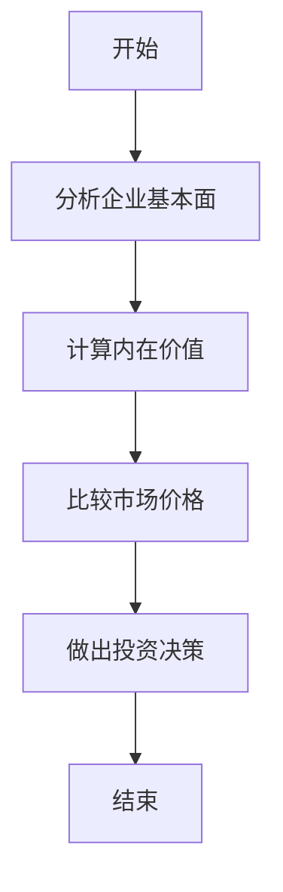
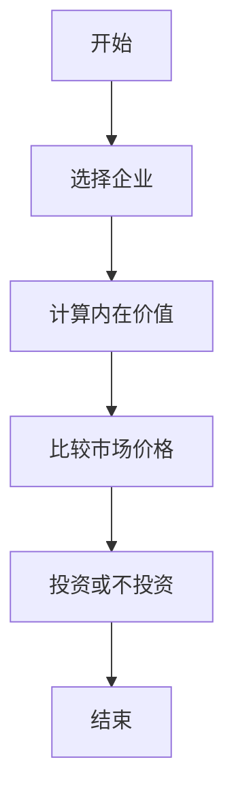
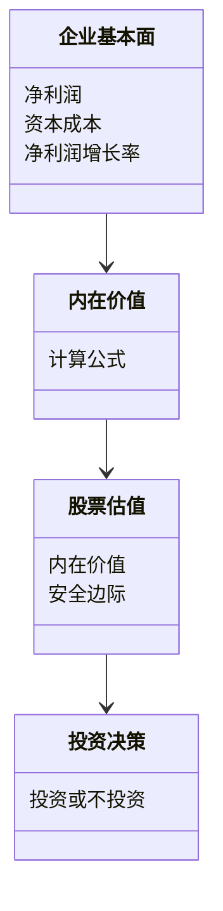
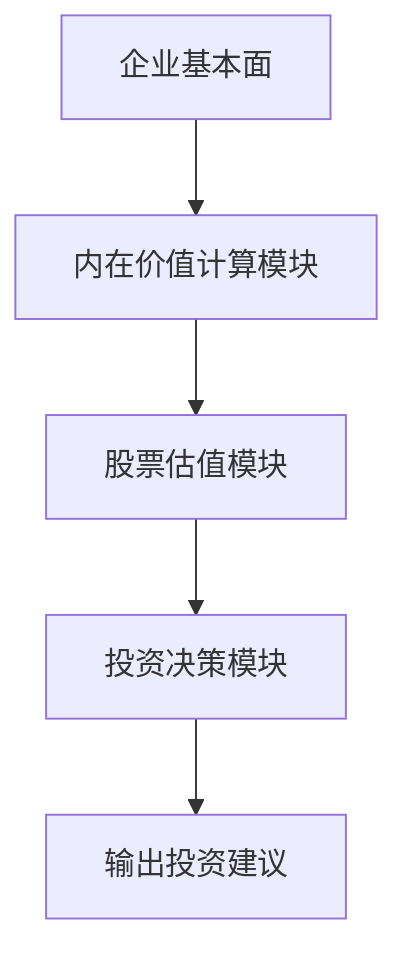
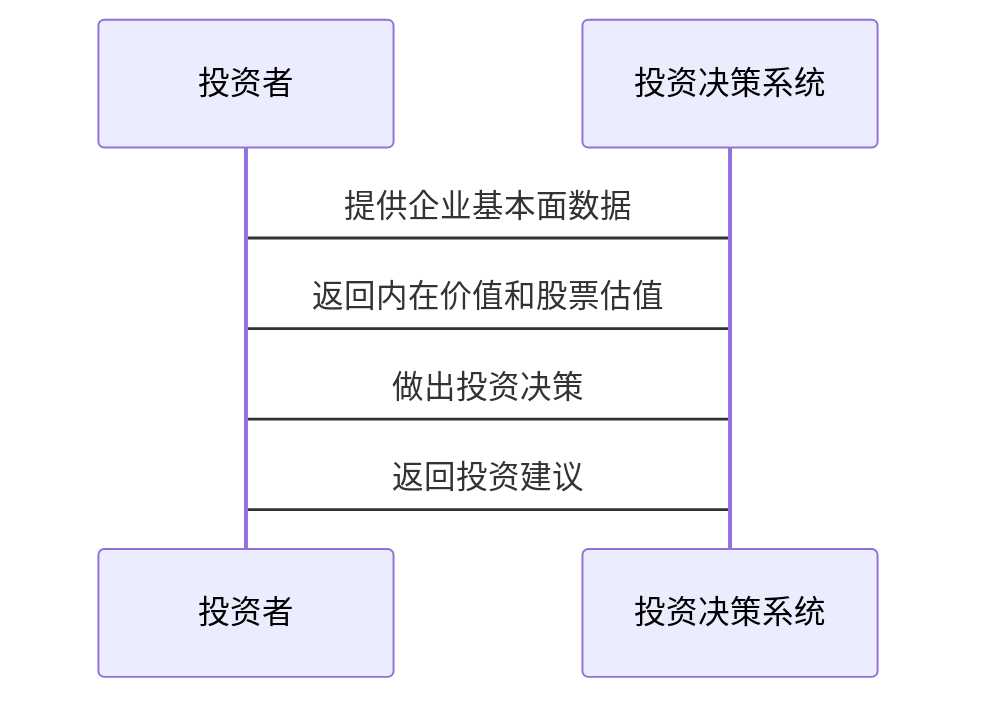

                 


# 沃伦·巴菲特的'太阳能'投资理念：长期持有的力量

---

## 关键词
沃伦·巴菲特，太阳能投资理念，长期持有，价值投资，投资策略，股票估值，投资哲学

---

## 摘要
本文深入探讨了沃伦·巴菲特的“太阳能”投资理念，结合长期持有的力量，分析其背后的哲学、策略和数学模型。文章从背景介绍、核心概念、算法原理、数学模型、系统分析、项目实战到总结，全面解析了巴菲特的投资智慧，并通过实际案例和系统设计，展示了如何将这一理念应用于实际投资中。文章内容丰富，逻辑清晰，适合投资者和技术爱好者阅读。

---

## 第一部分：沃伦·巴菲特“太阳能”投资理念的背景与核心概念

### 第1章：沃伦·巴菲特投资理念概述

#### 1.1 巴菲特投资理念的起源与发展
##### 1.1.1 巴菲特的投资哲学
沃伦·巴菲特是全球最著名的投资者之一，他的投资哲学以价值投资为核心，强调寻找那些具有持续竞争优势、良好管理和合理估值的企业。他提出的“太阳能”投资理念，是其长期持有策略的集中体现。这一理念的核心在于，通过长期持有优质资产，利用复利效应实现财富的稳步增长。

##### 1.1.2 “太阳能”投资理念的提出背景
“太阳能”投资理念的提出，源于巴菲特对能源行业的关注。他认为，太阳能作为可再生能源的代表，具有长期增长的潜力。通过长期持有优质太阳能企业的股票，投资者可以在行业增长中获益，同时利用复利效应放大收益。

##### 1.1.3 长期持有策略的核心思想
长期持有策略是巴菲特投资理念的核心。他认为，短期市场的波动不可预测，而优质企业的长期价值是可以通过持续增长实现的。通过长期持有，投资者可以避免频繁交易带来的成本和风险，同时享受企业的成长带来的收益。

#### 1.2 “太阳能”投资理念的关键特征
##### 1.2.1 选择企业的标准
- 企业具有持续的竞争优势。
- 企业具有良好的管理团队。
- 企业估值合理，具有安全边际。

##### 1.2.2 长期持有中的风险管理
- 通过分散投资降低风险。
- 通过对企业基本面的深入分析，选择具有长期增长潜力的企业。
- 避免盲目跟风，坚持价值投资。

##### 1.2.3 复利效应的数学模型
复利效应的数学模型可以用以下公式表示：
$$
FV = PV \times (1 + r)^n
$$
其中，$FV$ 是未来价值，$PV$ 是现值，$r$ 是年化收益率，$n$ 是投资期限。

---

### 第2章：长期持有的力量

#### 2.1 长期投资的哲学基础
##### 2.1.1 时间的价值
时间是价值投资的核心因素。通过长期持有优质资产，投资者可以利用复利效应，实现财富的指数级增长。

##### 2.1.2 复利效应的数学模型
复利效应的数学模型可以进一步分解为：
$$
r = \frac{FV}{PV} - 1
$$
其中，$r$ 是年化收益率，$FV$ 是未来价值，$PV$ 是现值。

##### 2.1.3 长期投资的风险与收益平衡
长期投资的风险在于市场的波动，但通过选择优质企业，可以降低风险。收益则通过企业的持续增长和复利效应实现。

#### 2.2 巴菲特长期持有的策略
##### 2.2.1 选择优秀企业的标准
- 企业具有持续的竞争优势。
- 企业具有良好的管理团队。
- 企业估值合理，具有安全边际。

##### 2.2.2 长期持有中的风险管理
- 通过分散投资降低风险。
- 通过对企业基本面的深入分析，选择具有长期增长潜力的企业。
- 避免盲目跟风，坚持价值投资。

##### 2.2.3 长期持有与市场波动的应对策略
- 长期持有需要耐心，避免短期市场的波动干扰。
- 通过对企业基本面的深入分析，选择具有长期增长潜力的企业。
- 避免频繁交易，降低交易成本。

---

### 第3章：“太阳能”投资理念的数学模型与算法原理

#### 3.1 太阳能投资模型的构建
##### 3.1.1 投资价值的评估公式
太阳能投资模型的核心在于评估企业的内在价值。内在价值可以用以下公式表示：
$$
\text{内在价值} = \frac{\text{净利润}}{\text{资本成本} - \text{增长率}}
$$
其中，净利润是企业的盈利能力，资本成本是投资者要求的最低回报率，增长率是企业的净利润增长率。

##### 3.1.2 内在价值的计算方法
通过分析企业的财务数据，计算其净利润、资本成本和增长率，从而得出企业的内在价值。如果企业的内在价值高于当前股价，则具有投资价值。

##### 3.1.3 股票估值的数学模型
股票估值的数学模型可以表示为：
$$
\text{股票估值} = \text{内在价值} \times \text{安全边际}
$$
其中，安全边际是企业在市场上的交易价格与其内在价值之间的差距，用于降低投资风险。

#### 3.2 算法原理的详细讲解
##### 3.2.1 价值评估的流程图（mermaid）


##### 3.2.2 投资决策的逻辑图（mermaid）


##### 3.2.3 代码实现（Python）
```python
def calculate_intrinsic_value(net_profit, growth_rate, cost_of_capital):
    return net_profit / (cost_of_capital - growth_rate)

net_profit = 1000000  # 净利润
growth_rate = 0.05      # 净利润增长率
cost_of_capital = 0.10  # 资本成本

intrinsic_value = calculate_intrinsic_value(net_profit, growth_rate, cost_of_capital)
print(f"内在价值：{intrinsic_value}")
```

---

### 第4章：系统分析与架构设计方案

#### 4.1 问题场景介绍
本文将构建一个基于“太阳能”投资理念的投资决策支持系统，帮助投资者分析企业的内在价值，并做出投资决策。

#### 4.2 项目介绍
##### 4.2.1 项目目标
- 分析企业的基本面数据。
- 计算企业的内在价值。
- 比较市场价格与内在价值，做出投资决策。

#### 4.3 系统功能设计
##### 4.3.1 领域模型（mermaid 类图）


#### 4.4 系统架构设计
##### 4.4.1 系统架构图（mermaid 架构图）


#### 4.5 系统接口设计
##### 4.5.1 输入接口
- 企业基本面数据：净利润、资本成本、净利润增长率。

##### 4.5.2 输出接口
- 内在价值
- 股票估值
- 投资建议。

#### 4.6 系统交互设计（mermaid 序列图）


---

### 第5章：项目实战

#### 5.1 环境安装
##### 5.1.1 安装 Python
```bash
python --version
pip install numpy pandas
```

#### 5.2 系统核心实现源代码
##### 5.2.1 计算内在价值的代码
```python
import pandas as pd

def calculate_intrinsic_value(net_profit, growth_rate, cost_of_capital):
    return net_profit / (cost_of_capital - growth_rate)

# 示例数据
net_profit = 1000000  # 净利润
growth_rate = 0.05      # 净利润增长率
cost_of_capital = 0.10  # 资本成本

intrinsic_value = calculate_intrinsic_value(net_profit, growth_rate, cost_of_capital)
print(f"内在价值：{intrinsic_value}")
```

##### 5.2.2 计算股票估值的代码
```python
import pandas as pd

def calculate_stock_valuation(intrinsic_value, safety_margin):
    return intrinsic_value * safety_margin

safety_margin = 0.20  # 安全边际
stock_valuation = calculate_stock_valuation(intrinsic_value, safety_margin)
print(f"股票估值：{stock_valuation}")
```

#### 5.3 实际案例分析
##### 5.3.1 案例分析
以一家太阳能企业为例，假设其净利润为1000万元，资本成本为10%，净利润增长率为5%。计算其内在价值和股票估值：
$$
\text{内在价值} = \frac{1000}{0.10 - 0.05} = 20000 \text{万元}
$$
$$
\text{股票估值} = 20000 \times 0.20 = 4000 \text{万元}
$$
如果企业的市场价格低于4000万元，则具有投资价值。

#### 5.4 项目小结
通过实际案例分析，我们可以看到，“太阳能”投资理念的核心在于通过长期持有优质企业，利用复利效应实现财富增长。

---

## 第六部分：总结与展望

### 6.1 最佳实践 tips
- 选择具有持续竞争优势的企业。
- 长期持有，避免频繁交易。
- 保持耐心，坚持价值投资。

### 6.2 小结
通过本文的分析，我们可以看到，“太阳能”投资理念的核心在于长期持有优质企业，利用复利效应实现财富增长。这一理念不仅适用于太阳能行业，也适用于其他行业。

### 6.3 注意事项
- 投资需谨慎，切勿盲目跟风。
- 保持对市场的关注，及时调整投资策略。
- 避免过度依赖数学模型，注重对企业基本面的分析。

### 6.4 拓展阅读
- 巴菲特的《巴菲特写给股东的信》。
- 《价值投资入门：如何选择优质企业》。

---

## 附录

### 附录 A：术语解释
- **内在价值**：企业的实际价值，与市场价格无关。
- **复利效应**：投资收益的滚雪球效应。
- **安全边际**：市场价格与内在价值之间的差距。

### 附录 B：代码解释
- **calculate_intrinsic_value**：计算企业的内在价值。
- **calculate_stock_valuation**：计算股票的估值。

---

通过本文的详细讲解，读者可以深入理解沃伦·巴菲特的“太阳能”投资理念，并将其应用于实际投资中。无论是从理论分析还是实际操作，长期持有优质企业的策略都是实现财富增长的重要方法。

