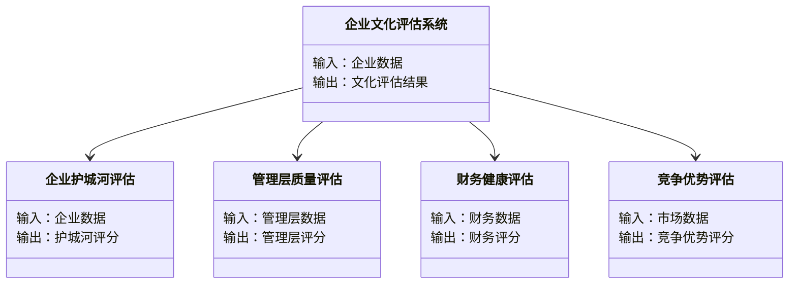
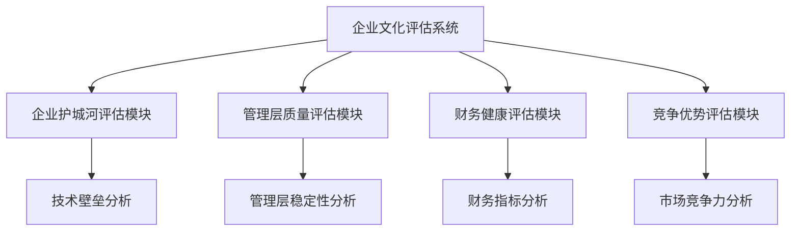

                 


# 《沃伦·巴菲特的企业文化评估框架》

## 关键词：企业文化评估、巴菲特、企业护城河、管理层质量、财务健康、竞争优势、系统架构

## 摘要：  
本文系统地介绍了沃伦·巴菲特的企业文化评估框架，从核心概念到实际应用，详细分析了如何通过企业护城河、管理层质量、财务健康和竞争优势等关键要素来评估企业文化。文章结合了理论与实践，提供了丰富的案例分析和系统架构设计，帮助读者全面理解和应用巴菲特的企业文化评估方法。

---

## 第1章: 企业文化评估的核心概念

### 1.1 企业文化评估的背景与意义  
#### 1.1.1 企业文化评估的背景  
- 巴菲特认为，企业文化是企业长期成功的核心驱动力。  
- 在投资决策中，巴菲特特别关注企业的管理团队、商业模式和文化基因。  
- 企业文化的强弱直接影响企业的可持续发展能力。  

#### 1.1.2 企业文化评估的重要性  
- 企业文化决定了企业的战略选择和执行能力。  
- 良好的企业文化能够提升员工的凝聚力和创造力。  
- 企业文化评估是投资者评估企业长期价值的重要工具。  

#### 1.1.3 巴菲特对企业文化的独特见解  
- 巴菲特强调，企业文化的核心是企业的“护城河”。  
- 企业护城河包括技术优势、品牌影响力、成本优势和客户忠诚度等方面。  
- 企业文化评估的目的是识别那些具有持续竞争优势的企业。  

### 1.2 巴菲特企业文化评估框架的核心要素  
#### 1.2.1 企业护城河的定义与特征  
- **企业护城河**：指企业在行业中形成的独特优势，使其能够抵御竞争对手的侵蚀。  
- **特征**：技术壁垒、成本优势、品牌影响力、客户忠诚度。  

#### 1.2.2 管理层质量的关键指标  
- **管理层质量**：包括管理层的专业能力、决策能力和忠诚度。  
- **关键指标**：管理层的历史业绩、团队稳定性、分红政策的持续性。  

#### 1.2.3 财务健康状况的评估维度  
- **财务健康状况**：企业的财务状况直接影响其抗风险能力和长期发展。  
- **评估维度**：资产负债率、净利润率、现金流、负债结构。  

#### 1.2.4 企业竞争优势的分析维度  
- **竞争优势**：企业在市场上相对于竞争对手的核心优势。  
- **分析维度**：产品差异化、成本优势、技术创新、市场进入壁垒。  

#### 1.2.5 企业文化和价值观的核心要素  
- **企业文化和价值观**：企业的文化决定了其行为方式和战略选择。  
- **核心要素**：企业使命、愿景、价值观、员工激励机制。  

### 1.3 企业文化评估框架的边界与外延  
#### 1.3.1 企业文化评估的适用范围  
- 适用于企业战略规划、投资决策、风险管理等领域。  

#### 1.3.2 企业文化评估的局限性  
- 企业文化评估需要结合定量和定性分析，具有一定的主观性。  
- 企业文化的动态变化可能影响评估结果的准确性。  

#### 1.3.3 企业文化评估与其他管理工具的关系  
- 企业文化评估是企业战略管理、风险管理等工具的重要组成部分。  

---

## 第2章: 巴菲特企业文化评估框架的核心概念与联系  

### 2.1 核心概念原理  
#### 2.1.1 企业护城河的构建逻辑  
- 企业护城河是企业长期竞争优势的核心来源。  
- 技术创新、品牌建设和成本控制是构建护城河的关键路径。  

#### 2.1.2 管理层质量的评估标准  
- 管理层的专业能力和决策风格直接影响企业的战略选择。  
- 管理层的稳定性是企业长期发展的关键保障。  

#### 2.1.3 财务健康状况的分析方法  
- 通过财务报表分析企业的盈利能力、资产负债状况和现金流情况。  
- 重点关注企业的ROE（净资产收益率）和现金流健康状况。  

#### 2.1.4 企业竞争优势的动态变化  
- 企业竞争优势会受到市场环境和技术变革的影响。  
- 需要定期评估企业的竞争优势，并根据变化调整战略。  

#### 2.1.5 企业文化和价值观的核心要素  
- 企业文化的强弱直接影响员工的凝聚力和创造力。  
- 企业价值观是企业行为的指导原则，决定企业的长期发展方向。  

### 2.2 核心概念属性特征对比表格  

| 核心概念 | 特征维度 | 描述 |
|----------|----------|------|
| 企业护城河 | 技术壁垒 | 企业的技术优势 |
|          | 市场地位 | 企业的市场占有率 |
|          | 成本优势 | 企业的成本控制能力 |
| 管理层质量 | 专业能力 | 管理层的专业背景和能力 |
|          | 企业忠诚度 | 管理层对企业的忠诚度 |
| 财务健康状况 | 净利润率 | 企业的盈利能力 |
|          | 资产负债率 | 企业的财务杠杆 |
|          | 现金流 | 企业的流动性 |
| 企业竞争优势 | 产品差异化 | 产品的独特性 |
|          | 成本优势 | 企业的成本控制 |
|          | 技术创新 | 企业的研发能力 |
| 企业文化和价值观 | 企业使命 | 企业的长期目标 |
|          | 愿景 | 企业的未来发展方向 |
|          | 价值观 | 企业的核心价值观 |

---

## 第3章: 巴菲特企业文化评估框架的系统分析与架构设计  

### 3.1 系统分析  
#### 3.1.1 问题场景介绍  
- 企业需要通过评估文化基因，构建长期竞争优势。  

#### 3.1.2 项目介绍  
- 项目目标：通过分析企业护城河、管理层质量、财务健康和竞争优势，构建企业文化评估框架。  
- 项目范围：包括企业战略、管理、财务和文化等多个方面。  

### 3.2 系统功能设计  



### 3.3 系统架构设计  



---

## 第4章: 巴菲特企业文化评估框架的项目实战  

### 4.1 项目背景与目标  
- 通过实际案例分析，验证巴菲特企业文化评估框架的有效性。  

### 4.2 核心实现源代码  
```python
def calculate_roe(net_profit, equity):
    return net_profit / equity

def calculate_cash_flow(cash_from_operations, cash_from_financing, cash_from_investing):
    return cash_from_operations + cash_from_financing + cash_from_investing

def assess_management_quality(management_team_stability, management_dividend_policy):
    if management_team_stability > 0.8 and management_dividend_policy == "consistent":
        return "high_quality"
    else:
        return "low_quality"

def main():
    net_profit = 10000000
    equity = 50000000
    cash_from_operations = 20000000
    cash_from_financing = -10000000
    cash_from_investing = 5000000
    management_team_stability = 0.9
    management_dividend_policy = "consistent"

    roe = calculate_roe(net_profit, equity)
    cash_flow = calculate_cash_flow(cash_from_operations, cash_from_financing, cash_from_investing)
    management_quality = assess_management_quality(management_team_stability, management_dividend_policy)

    print(f"ROE: {roe}")
    print(f"Cash Flow: {cash_flow}")
    print(f"Management Quality: {management_quality}")

if __name__ == "__main__":
    main()
```

### 4.3 代码解读与分析  
- `calculate_roe`：计算净资产收益率，评估企业的盈利能力。  
- `calculate_cash_flow`：计算企业现金流，评估企业的流动性。  
- `assess_management_quality`：评估管理层的稳定性和分红政策，判断管理层质量。  

### 4.4 实际案例分析  
- 以苹果公司为例，分析其企业护城河、管理层质量、财务健康和竞争优势。  

### 4.5 项目小结  
- 巴菲特企业文化评估框架在实际项目中的应用价值。  

---

## 第5章: 巴菲特企业文化评估框架的最佳实践与注意事项  

### 5.1 最佳实践 tips  
- 在企业文化评估中，定量分析与定性分析相结合。  
- 定期更新企业评估数据，确保评估结果的准确性。  

### 5.2 小结  
- 巴菲特企业文化评估框架是企业战略管理和投资决策的重要工具。  

### 5.3 注意事项  
- 企业文化评估需要结合企业的实际情况，避免过于僵化。  
- 评估过程中需要注意数据的准确性和分析的客观性。  

### 5.4 拓展阅读  
- 推荐阅读巴菲特的《聪明的投资者》和相关的企业管理书籍。  

---

## 总结  
本文系统地介绍了沃伦·巴菲特的企业文化评估框架，从核心概念到实际应用，详细分析了如何通过企业护城河、管理层质量、财务健康和竞争优势等关键要素来评估企业文化。文章结合了理论与实践，提供了丰富的案例分析和系统架构设计，帮助读者全面理解和应用巴菲特的企业文化评估方法。

