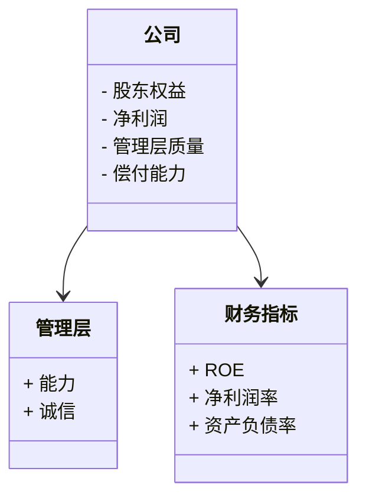
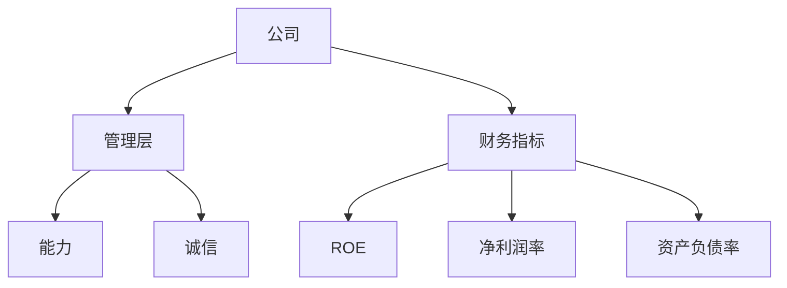
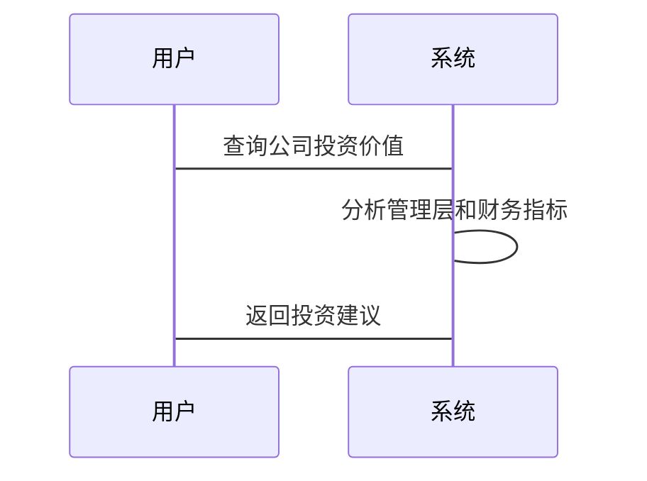

                 


# 《沃伦·巴菲特的保险业投资逻辑》

> 关键词：沃伦·巴菲特，保险投资，价值投资，保险业，内在价值

> 摘要：本文深入探讨了沃伦·巴菲特在保险业投资中的独特逻辑，分析了他如何通过价值投资原则选择保险公司，评估其内在价值，并结合实际案例阐述其投资策略。文章从背景介绍、核心概念、系统分析到项目实战，全面解析巴菲特的保险投资智慧，为读者提供深刻的投资启示。

---

## 第一部分：背景介绍

### 第1章：巴菲特投资哲学概述

#### 1.1 巴菲特的生平与投资理念

- **1.1.1 巴菲特的早期经历与投资起步**
  - 巴菲特早年展现出对股票和投资的浓厚兴趣，15岁时就开始研究股票市场。
  - 他在哥伦比亚大学学习期间，师从本杰明·格雷厄姆，学习了价值投资的基本原理。

- **1.1.2 巴菲特的核心投资理念：价值投资**
  - 价值投资的核心是寻找市场价低于内在价值的股票。
  - 巴菲特强调安全边际，即买入价格远低于内在价值，以降低风险。

- **1.1.3 巴菲特的价值投资五要素**
  - **质量**：公司具备强大的竞争优势。
  - **价格**：买入价格低于内在价值。
  - **管理层**：管理层诚实、有能力。
  - **财务健康**：公司财务稳健，负债低。
  - **长期前景**：公司具备长期增长潜力。

#### 1.2 保险业的基本概念与运作模式

- **1.2.1 保险业的定义与分类**
  - 保险是指通过分担风险来提供经济保障的合同。
  - 主要分类包括人寿保险、财产保险、健康保险等。

- **1.2.2 保险公司的主要业务模式**
  - **承保业务**：收取保费，承担风险。
  - **投资业务**：利用保费收入进行投资，获取收益。

- **1.2.3 保险业的财务特征与风险**
  - 财务杠杆高，风险较大。
  - 受经济周期影响显著。

#### 1.3 巴菲特与保险业的关联

- **1.3.1 巴菲特首次投资保险业的案例**
  - 1985年，巴菲特投资国民保险，但因管理层问题退出。
  - 这次教训使他意识到管理层质量的重要性。

- **1.3.2 巴菲特对保险业的长期关注与研究**
  - 保险公司的浮存金（浮游资金）是其独特的竞争优势。
  - 浮存金的低成本特性使其成为保险公司投资的重要来源。

- **1.3.3 巴菲特保险投资的成功与失败案例分析**
  - 成功案例：伯克希尔哈撒韦，通过收购保险公司获得浮存金。
  - 失败案例：美国运通，因管理层决策失误导致亏损。

---

## 第二部分：巴菲特保险业投资的核心逻辑

### 第2章：巴菲特的保险业投资逻辑

#### 2.1 巴菲特保险投资的核心理念

- **2.1.1 保险公司的内在价值评估**
  - 内在价值是未来现金流的现值。
  - 巴菲特注重公司的盈利能力、财务健康和管理层质量。

- **2.1.2 保险公司的财务稳定性与盈利能力**
  - 重点分析ROE（净资产收益率）和ROA（资产回报率）。
  - 高ROE表明公司高效利用资产。

- **2.1.3 保险公司的管理层质量与治理结构**
  - 管理层诚实、有能力是投资的前提。
  - 公司治理结构透明，避免利益输送。

#### 2.2 巴菲特保险投资的关键指标分析

- **2.2.1 净利润率与投资回报率（ROE）**
  - 净利润率反映公司盈利能力。
  - ROE衡量股东权益的回报效率。

- **2.2.2 资产负债率与偿付能力**
  - 低资产负债率表明公司财务稳健。
  - 偿付能力是保险公司履行赔付责任的能力。

- **2.2.3 股东权益与每股收益（EPS）**
  - 股东权益反映公司净资产。
  - EPS是衡量公司盈利能力的重要指标。

#### 2.3 巴菲特保险投资的独特视角

- **2.3.1 保险公司的“浮存金”概念**
  - 浮存金是保险公司收取保费后的暂时资金，用于投资。
  - 低成本资金为保险公司创造额外收益。

- **2.3.2 保险公司的承保利润与投资收益的平衡**
  - 承保利润稳定，投资收益增强整体收益。
  - 平衡两者，确保公司稳健发展。

- **2.3.3 保险公司的长期可持续发展能力**
  - 公司具备强大的竞争优势。
  - 管理层致力于长期发展，而非短期利益。

---

## 第三部分：系统分析与架构设计方案

### 第3章：保险业投资的系统分析

#### 3.1 问题场景介绍

- 投资者希望评估保险公司是否值得投资。
- 需要分析公司财务状况、管理层质量、市场地位等。

#### 3.2 系统功能设计

- **领域模型**：用Mermaid类图展示公司、管理层、财务指标等实体关系。



#### 3.3 系统架构设计

- **架构图**：展示公司、管理层、财务指标之间的关系。



#### 3.4 系统接口设计

- 输入：公司财务数据、管理层信息。
- 输出：投资建议（值得投资或不值得）。

#### 3.5 系统交互设计

- **序列图**：展示用户输入查询，系统分析并返回结果。



---

## 第四部分：项目实战

### 第4章：保险业投资的项目实战

#### 4.1 环境安装

- 安装Python和必要的库（pandas, numpy）。

#### 4.2 核心代码实现

- 计算ROE和净利率，评估管理层质量。

```python
import pandas as pd

def calculate_roe(company_data):
    return company_data['净利润'] / company_data['股东权益']

def assess_management(management_data):
    if management_data['管理层能力'] > 80 and management_data['管理层诚信'] > 80:
        return '优秀'
    else:
        return '一般'

# 示例数据
data = {
    '公司': ['AIG', '伯克希尔'],
    '股东权益': [100, 200],
    '净利润': [20, 40],
    '管理层能力': [90, 85],
    '管理层诚信': [95, 80]
}

df = pd.DataFrame(data)

# 计算ROE
df['ROE'] = df.apply(lambda x: x['净利润'] / x['股东权益'], axis=1)
df['管理层评估'] = df.apply(lambda x: assess_management({'管理层能力': x['管理层能力'], '管理层诚信': x['管理层诚信']}), axis=1)

print(df)
```

#### 4.3 案例分析与解读

- **案例1：伯克希尔哈撒韦**
  - 高ROE，优秀管理层，值得投资。

- **案例2：AIG**
  - 管理层诚信问题，不值得投资。

#### 4.4 项目小结

- 投资者应结合财务指标和管理层质量，全面评估保险公司。
- 巴菲特的成功在于长期关注公司价值，而非短期收益。

---

## 第五部分：总结与拓展

### 第5章：总结与拓展阅读

#### 5.1 小结

- 巴菲特的保险投资逻辑强调内在价值、财务稳健和优秀管理层。
- 投资者应结合这些因素，做出明智决策。

#### 5.2 注意事项

- 避免短期波动影响判断。
- 重视管理层的诚信与能力。

#### 5.3 拓展阅读

- 《巴菲特致股东的信》
- 《价值投资实战策略》

---

通过以上分析，我们可以看到巴菲特在保险业投资中的深刻洞察和独特逻辑。他的价值投资理念不仅帮助他在保险业取得了成功，也为投资者提供了宝贵的启示。

