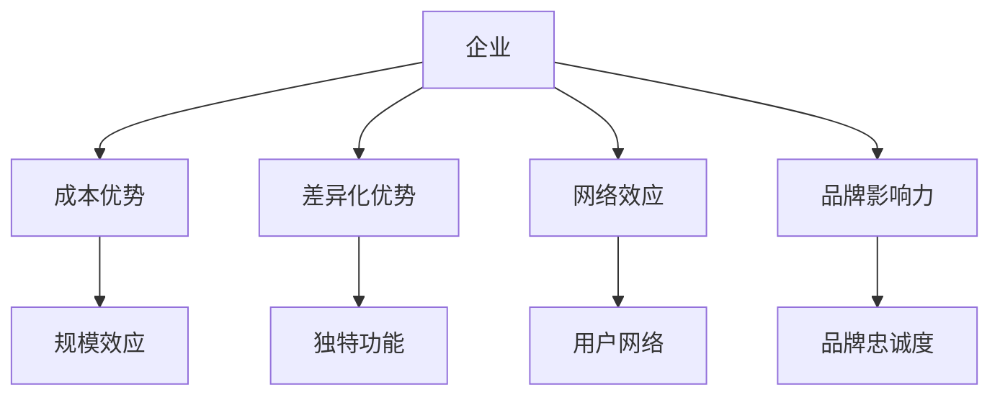
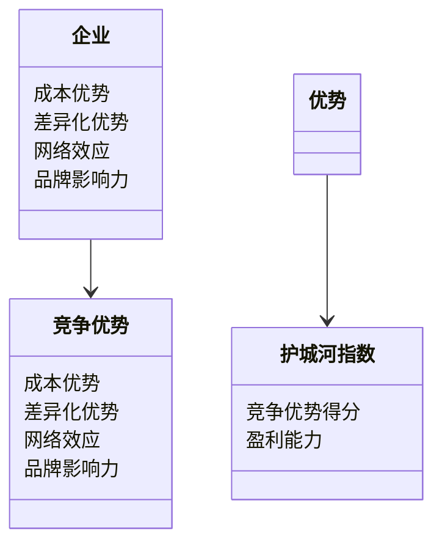

                 

# 沃伦·巴菲特的经济护城河深度分析

## 关键词：经济护城河、巴菲特、投资策略、企业价值、竞争优势

## 摘要：沃伦·巴菲特的经济护城河理论是投资领域的重要概念，它帮助企业建立可持续的竞争优势，确保长期盈利能力。本文将深入分析经济护城河的构成要素、构建方法及其在企业战略中的应用，为企业管理者和投资者提供实用的见解。

---

## 第一部分：经济护城河的背景与核心概念

### 第1章：经济护城河的定义与分类

#### 1.1 投资的本质与目标
- 投资的核心是创造价值，而非简单的资产增值。
- 巴菲特的投资理念：寻找具有持续竞争优势的企业。

#### 1.2 经济护城河的定义
- 经济护城河：企业通过某种竞争优势（如成本优势、差异化优势等）建立的长期盈利能力的保障。
- 护城河的宽度决定企业的竞争优势强度。

#### 1.3 护城河的分类
| 类型       | 特点描述                         |
|------------|----------------------------------|
| 成本优势   | 低成本生产或运营，降低竞争压力 |
| 差异化优势 | 提供独特的产品或服务，吸引客户 |
| 网络效应   | 用户数量的增加带来价值提升     |
| 品牌影响力 | 强大的品牌认知度，吸引忠诚客户   |

#### 1.4 护城河的动态性
- 竞争对手的模仿和市场的变化会削弱护城河的宽度。
- 企业需要持续创新和优化，保持护城河的有效性。

---

### 第2章：经济护城河的核心要素与相互关系

#### 2.1 成本优势的实现路径
- 规模效应：通过扩大生产规模降低单位成本。
- 技术创新：通过技术进步降低生产成本。

#### 2.2 差异化优势的构建方法
- 提供独特的功能或服务，满足特定客户需求。
- 品质保证：通过高质量的产品建立品牌忠诚度。

#### 2.3 网络效应的实现机制
- 用户越多，平台价值越大，吸引更多的用户加入。
- 例如：社交媒体平台通过网络效应形成强大的护城河。

#### 2.4 品牌影响力的强化策略
- 品牌知名度：通过广告、营销等方式提升品牌认知度。
- 品牌忠诚度：通过优质服务和客户关系管理增强客户粘性。

#### 2.5 经济护城河的系统架构

---

## 第三部分：经济护城河的构建与维护

### 第3章：构建经济护城河的策略

#### 3.1 投资者视角：寻找具有强大护城河的企业
- 识别企业的竞争优势：评估企业的成本优势、差异化优势等。
- 关注企业的长期盈利能力：选择ROE（净资产收益率）持续较高的企业。

#### 3.2 企业管理者视角：建立可持续的竞争优势
- 坚持长期主义：避免短期盈利压力，专注于长期竞争优势的构建。
- 持续创新：通过技术创新和管理优化保持竞争优势。

#### 3.3 护城河的数学模型
- 经济护城河指数（假设）：通过多个指标综合评估企业的护城河强度。
  $$ \text{护城河指数} = \frac{\text{竞争优势得分} \times \text{盈利能力}}{\text{行业平均值}} $$
- 示例：计算某企业的护城河指数，判断其相对于行业平均水平的竞争优势。

#### 3.4 系统架构设计

---

### 第4章：案例分析与实战应用

#### 4.1 美国运通的网络效应
- 美国运通通过庞大的支付网络和用户群体，形成强大的网络效应。
- 用户越多，支付网络的价值越大，竞争对手难以复制这种优势。

#### 4.2 可口可乐的品牌影响力
- 可口可乐通过强大的品牌影响力和全球分销网络，建立持久的竞争优势。
- 品牌忠诚度和分销网络的结合，使其在全球市场中占据主导地位。

#### 4.3 案例分析的启示
- 企业应根据自身特点选择适合的护城河构建策略。
- 网络效应和品牌影响力通常是护城河的重要组成部分。

---

## 第四部分：总结与展望

### 第5章：总结与最佳实践

#### 5.1 本章总结
- 经济护城河是企业长期竞争优势的核心，投资者和企业管理者都应重视其构建和维护。
- 不同的企业可能需要不同的护城河策略，关键在于找到适合自身特点的优势。

#### 5.2 最佳实践
- **投资者**：定期评估投资企业的护城河强度，避免短期波动影响判断。
- **企业管理者**：持续优化企业竞争优势，关注技术创新和品牌建设。
- **长期视角**：护城河的构建需要时间，企业应避免追求短期利益。

#### 5.3 小结
沃伦·巴菲特的经济护城河理论为企业提供了重要的投资和管理启示，通过建立和维护强大的竞争优势，企业可以在激烈的市场竞争中立于不败之地。

---

## 关键词：经济护城河、巴菲特、投资策略、企业价值、竞争优势

## 总结：本文通过分析沃伦·巴菲特的经济护城河理论，探讨了其在企业投资和管理中的应用。从定义到构建策略，再到实际案例，系统地阐述了如何通过护城河建立持久的竞争优势。对于投资者和企业管理者来说，理解并运用这一理论将有助于实现长期价值增长。

