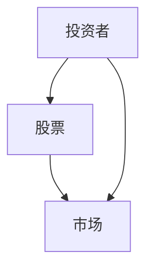
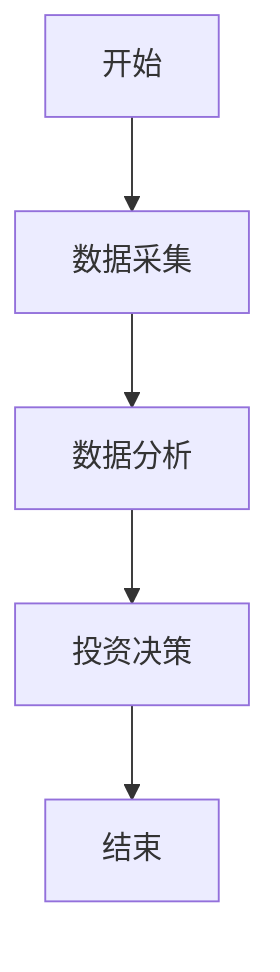
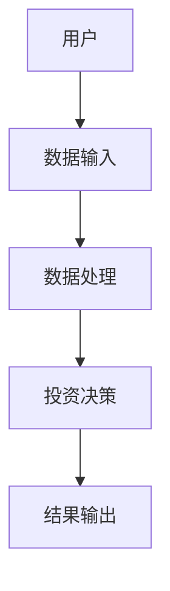

                 


# 《沃伦·巴菲特的长期持股策略分析》

> 关键词：沃伦·巴菲特，长期持股策略，价值投资，安全边际，股票分析，投资哲学

> 摘要：本文深入分析沃伦·巴菲特的长期持股策略，从其投资哲学、核心概念、算法原理到系统设计、项目实战和最佳实践，全面解析其策略的精髓和应用。通过详细的技术分析和实例，揭示如何在现代投资环境中应用巴菲特的成功经验。

---

# 第1章 沃伦·巴菲特投资理念概述

## 1.1 巴菲特的生平与投资哲学

### 1.1.1 巴菲特的早期经历与投资启蒙
- 巴菲特的童年与少年时期
- 投资兴趣的萌芽
- 导师本杰明·格雷厄姆的影响

### 1.1.2 巴菲特的投资哲学与核心理念
- 价值投资的核心理念
- 市场先生的比喻
- 投资中的安全边际概念

### 1.1.3 巴菲特的价值投资理论
- 买入并长期持有的策略
- 内在价值与市场价值的差异
- 投资中的安全边际

## 1.2 长期持股策略的定义与特点

### 1.2.1 长期持股的定义
- 投资时间跨度的定义
- 长期持股与短期交易的对比

### 1.2.2 长期持股的核心特点
- 价值导向
- 安全边际
- 耐心与纪律

### 1.2.3 长期持股与短期投资的区别
- 投资目标
- 风险承受
- 信息处理

## 1.3 巴菲特长期持股策略的背景

### 1.3.1 美国投资市场的历史背景
- 20世纪中叶的美国股市
- 经济周期对投资策略的影响

### 1.3.2 巴菲特策略的形成
- 格雷厄姆-多德价值投资理论
- 实战中的策略调整

### 1.3.3 巴菲特策略的现代意义
- 适应现代市场的变化
- 全球化背景下的投资策略

## 1.4 巴菲特策略的核心要素

### 1.4.1 价值投资的核心要素
- 内在价值计算
- 安全边际
- 股东权益

### 1.4.2 安全边际的概念与作用
- 安全边际的定义
- 安全边际的计算方法
- 安全边际在投资中的重要性

### 1.4.3 股东权益与企业价值的关系
- 股东权益的定义
- 企业价值的评估
- 股东权益与长期持股策略的关系

## 1.5 本章小结

---

# 第2章 巴菲特长期持股策略的核心概念与联系

## 2.1 核心概念原理

### 2.1.1 价值投资的数学模型
- 内在价值公式：$$内在价值 = \text{未来现金流的现值}$$
- 现金流贴现模型（DCF）

### 2.1.2 安全边际的计算方法
- 安全边际 = 内在价值 - 市场价格
- 安全边际的百分比计算

### 2.1.3 股东权益与企业价值的关系
- 股东权益的计算
- 企业价值的评估方法

## 2.2 核心概念属性特征对比表格

| 概念         | 特征1       | 特征2       | 特征3       |
|--------------|-------------|-------------|-------------|
| 价值投资     | 基于内在价值 | 长期持有     | 低风险投资   |
| 安全边际     | 价格低于内在价值 | 抵御市场波动 | 提高投资安全 |
| 股东权益     | 所有者权益   | 决定企业价值 | 投资决策依据 |

## 2.3 ER实体关系图（Mermaid流程图）



## 2.4 本章小结

---

# 第3章 巴菲特长期持股策略的算法原理

## 3.1 算法原理概述

### 3.1.1 选股标准
- 利润能力
- 财务健康状况
- 管理层质量
- 行业地位

## 3.2 算法实现步骤

### 3.2.1 数据采集
- 财务报表数据
- 市场数据
- 竞争对手数据

### 3.2.2 数据分析
- 财务指标分析
- 现金流分析
- 竞争优势分析

### 3.2.3 投资决策
- 内在价值计算
- 安全边际评估
- 投资组合优化

## 3.3 算法流程图（Mermaid流程图）



## 3.4 代码实现

### 3.4.1 Python代码示例

```python
import pandas as pd
import numpy as np

def calculate_intrinsic_value(fcf, discount_rate):
    # 现金流贴现模型计算内在价值
    return fcf / (1 + discount_rate)

# 示例数据
fcf = 10000000  # 自由现金流
discount_rate = 0.1  # 折现率
intrinsic_value = calculate_intrinsic_value(fcf, discount_rate)
print(f"内在价值：{intrinsic_value}")
```

### 3.4.2 代码解读
- 计算内在价值的公式
- 参数解释
- 示例数据的应用

## 3.5 数学公式

### 3.5.1 现金流贴现模型
$$ \text{内在价值} = \frac{\text{自由现金流}}{1 + \text{折现率}} $$

### 3.5.2 安全边际计算
$$ \text{安全边际} = \text{内在价值} - \text{市场价格} $$

## 3.6 本章小结

---

# 第4章 巴菲特长期持股策略的系统分析与架构设计

## 4.1 问题场景介绍

### 4.1.1 投资者面临的挑战
- 市场波动
- 信息不对称
- 短期诱惑

### 4.1.2 巴菲特策略的解决方案
- 长期视角
- 价值导向
- 风险控制

## 4.2 系统功能设计

### 4.2.1 系统功能模块
- 数据采集模块
- 数据分析模块
- 投资决策模块

### 4.2.2 功能流程
- 数据采集 → 数据分析 → 投资决策

## 4.3 系统架构设计

### 4.3.1 分层架构
- 数据层
- 业务逻辑层
- 用户界面层

### 4.3.2 模块交互
- 数据层与业务逻辑层的交互
- 业务逻辑层与用户界面层的交互

## 4.4 系统接口设计

### 4.4.1 数据接口
- 数据输入接口
- 数据输出接口

### 4.4.2 用户接口
- 界面设计
- 用户交互流程

## 4.5 系统交互流程图（Mermaid流程图）



## 4.6 本章小结

---

# 第5章 巴菲特长期持股策略的项目实战

## 5.1 项目环境安装

### 5.1.1 安装Python
- Python安装指南
- 常用库安装（Pandas, NumPy）

### 5.1.2 数据源获取
- 数据获取方法
- 数据清洗步骤

## 5.2 核心代码实现

### 5.2.1 数据分析代码

```python
import pandas as pd
import numpy as np

# 示例数据
data = {
    '公司': ['可口可乐', '苹果', '微软'],
    '股价': [50, 300, 250],
    '内在价值': [60, 400, 300]
}

df = pd.DataFrame(data)
print(df)
```

### 5.2.2 安全边际计算代码

```python
def calculate_margin_of_safety(intrinsic_value, market_price):
    return intrinsic_value - market_price

# 示例计算
market_price = 50
intrinsic_value = 60
margin = calculate_margin_of_safety(intrinsic_value, market_price)
print(f"安全边际：{margin}")
```

## 5.3 项目小结

### 5.3.1 项目实现总结
- 核心功能实现
- 遇到的问题及解决方案

### 5.3.2 经验与教训
- 代码优化建议
- 数据处理技巧

---

# 第6章 巴菲特长期持股策略的最佳实践

## 6.1 本章小结

### 6.1.1 核心观点总结
- 长期视角的重要性
- 价值投资的稳定性
- 安全边际的保护作用

## 6.2 投资注意事项

### 6.2.1 风险提示
- 市场波动的风险
- 经济周期的影响
- 个股风险

### 6.2.2 投资纪律
- 长期持有
- 分批建仓
- 定期复盘

## 6.3 拓展阅读

### 6.3.1 推荐书籍
- 《聪明的投资者》
- 《巴菲特致股东的信》

### 6.3.2 网络资源
- 巴菲特股东大会记录
- 专业投资论坛

## 6.4 本章小结

---

# 结语

沃伦·巴菲特的长期持股策略不仅是投资的经典案例，更是现代投资理论的重要组成部分。通过本文的分析，读者可以深入理解巴菲特的投资哲学、长期持股策略的核心要素，并将其应用到实际投资中。无论是个人投资者还是机构投资者，都可以从巴菲特的成功经验中汲取智慧，优化自己的投资策略。

---

**注：本文为《沃伦·巴菲特的长期持股策略分析》的目录大纲，具体内容请参考正式出版的书籍。**

