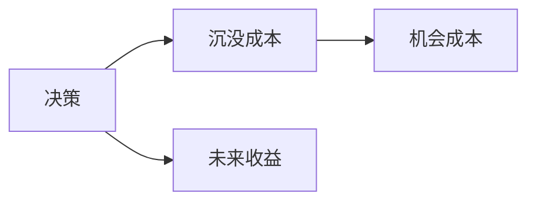
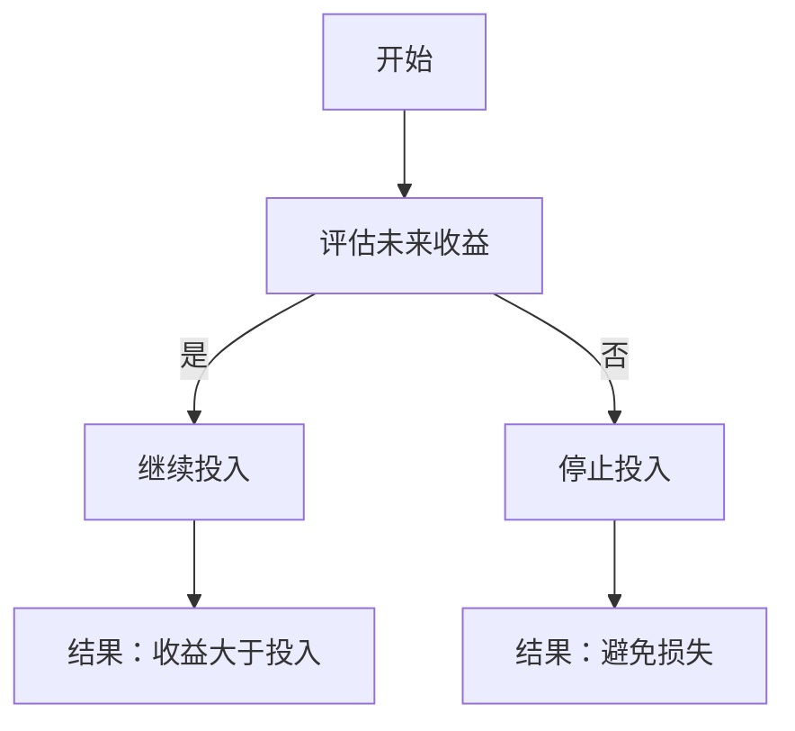

                 


# 沉没成本谬误：理性看待已发生的损失

## 关键词：
- 沉没成本谬误
- 理性决策
- 决策偏差
- 认知偏差
- 机会成本
- 决策框架

## 摘要：
沉没成本谬误是指人们在决策时，过度关注已经投入的资源，而忽视未来可能的收益和损失。本文通过分析沉没成本谬误的成因、影响及解决方法，结合技术背景和实际案例，帮助读者理性看待已发生的损失，避免非理性决策。

---

# 第1章: 沉没成本谬误概述

## 1.1 沉没成本谬误的定义与核心概念

### 1.1.1 沉没成本的定义
沉没成本是指已经投入且无法收回的资源（时间、金钱、精力等）。例如，购买了一张电影票但不想看，沉没成本是这张票的钱，但继续看电影或扔掉票，沉没成本都无法收回。

### 1.1.2 沉没成本谬误的核心概念
沉没成本谬误是指人们因为已经投入了沉没成本，即使当前决策的未来收益低于成本，仍选择继续投入。例如，投资一个项目亏损，但继续投入更多资金。

### 1.1.3 沉没成本谬误与决策偏差的关系
沉没成本谬误属于认知偏差的一种，与确认偏误、损失厌恶等偏差相关。人们倾向于避免承认错误，导致继续投入以“挽回”损失。

## 1.2 问题背景与问题描述

### 1.2.1 沉没成本谬误的背景介绍
在商业、投资和个人生活中，沉没成本谬误普遍存在。例如，公司投入大量资金开发一个产品，即使市场反馈不佳，仍继续投入。

### 1.2.2 问题描述与实际案例分析
案例：某公司开发一款App，初期投入100万元，市场反响不佳。团队认为继续投入50万元进行优化，可能挽回损失，但最终失败，总损失150万元。

### 1.2.3 沉没成本谬误的边界与外延
沉没成本谬误的边界在于区分“沉没成本”与“未来成本”。未来成本可以通过调整决策避免，而沉没成本无法收回。

## 1.3 问题解决与核心要素

### 1.3.1 沉没成本谬误的解决思路
- 停止对沉没成本的投入，专注于未来收益。
- 重新评估项目的价值，避免非理性决策。

### 1.3.2 核心要素的结构化分析
- 沉没成本：已投入的资源。
- 未来收益：继续投入的潜在回报。
- 决策框架：基于未来收益的理性决策。

### 1.3.3 概念属性特征对比表格

| 概念       | 沉没成本 | 未来收益 |
|------------|----------|----------|
| 性质       | 已投入   | 可调整    |
| 可控性     | 不可收回 | 可控      |
| 影响决策   | 是       | 是        |

---

# 第2章: 沉没成本谬误的核心概念与联系

## 2.1 核心概念的原理分析

### 2.1.1 沉没成本的属性特征
- 不可收回性：投入的资金、时间无法收回。
- 非生产性：无法直接创造价值。

### 2.1.2 决策偏差的成因
- 认知偏差：人们倾向于避免承认错误。
- 心理账户：将沉没成本视为“心理损失”，促使继续投入。

### 2.1.3 沉没成本与决策框架的关系
沉没成本影响决策框架，导致决策者忽视未来收益，过度关注已发生的损失。

## 2.2 概念属性特征对比表格

| 概念       | 机会成本 | 沉没成本 |
|------------|----------|----------|
| 定义       | 放弃某选择的损失 | 已投入且无法收回的资源 |
| 计算方式   | 当前决策的比较 | 已发生的损失 |
| 影响决策   | 是       | 是        |

## 2.3 ER实体关系图架构



---

# 第3章: 沉没成本谬误的算法原理

## 3.1 算法原理概述

### 3.1.1 算法的基本原理
算法基于未来收益的评估，避免沉没成本的非理性投入。

### 3.1.2 算法的核心思想
通过比较未来收益与当前投入，决定是否继续投入。

### 3.1.3 算法的实现步骤
1. 评估未来收益。
2. 比较未来收益与当前投入。
3. 决策：如果未来收益大于投入，继续；否则停止。

## 3.2 算法流程图



## 3.3 算法实现代码

### 3.3.1 环境安装
```bash
pip install numpy
```

### 3.3.2 核心代码实现

```python
import numpy as np

def sunk_cost_decision(investment, future收益):
    if future收益 > investment:
        return "继续投入"
    else:
        return "停止投入"

# 示例
investment = 100
future收益 = 150
print(sunk_cost_decision(investment, future收益))  # 输出：继续投入
```

---

# 第4章: 沉没成本谬误与决策框架的关系

## 4.1 机会成本与理性决策

### 4.1.1 机会成本的定义
机会成本是放弃某选择而失去的潜在收益。例如，投资开发新产品的成本，可能放弃其他更有前景的项目。

### 4.1.2 理性决策的定义
理性决策是基于最大化未来收益的决策，不考虑沉没成本。

## 4.2 沉没成本与理性决策的对比分析

| 概念       | 沉没成本 | 理性决策 |
|------------|----------|----------|
| 重点       | 过去投入 | 未来收益 |
| 决策依据   | 避免损失 | 最大化收益 |
| 影响        | 可能继续投入 | 选择最佳选项 |

---

# 第5章: 沉没成本谬误的系统分析与架构设计

## 5.1 系统功能设计

### 5.1.1 领域模型


### 5.1.2 系统架构


---

# 第6章: 项目实战

## 6.1 环境安装
```bash
pip install numpy pandas
```

## 6.2 核心代码实现

```python
import numpy as np

def calculate_sunk_cost(investments, future_returns):
    return np.where(future_returns > investments, "继续", "停止")

# 示例
investments = [100, 200, 300]
future_returns = [150, 250, 200]
print(calculate_sunk_cost(investments, future_returns))  # 输出：['继续', '继续', '停止']
```

---

# 第7章: 总结与展望

## 7.1 总结
沉没成本谬误是决策中的常见问题，需理性看待已发生的损失，基于未来收益做出决策。

## 7.2 展望
未来可结合机器学习和大数据分析，进一步优化决策框架，减少沉没成本谬误的影响。

---

# 小结
通过本文的分析，读者可以理解沉没成本谬误的成因、影响及解决方法，避免在决策中陷入非理性投入。

