                 


# 法律AI Agent：法律咨询与案例分析助手

## 关键词：法律AI Agent，法律咨询，案例分析，自然语言处理，机器学习，知识图谱

## 摘要

随着人工智能技术的快速发展，法律AI Agent作为一种智能化的法律咨询与案例分析工具，正在逐步改变传统法律服务的方式。本文将从法律AI Agent的基本概念、核心功能、技术实现、系统架构到实际应用案例，全面解析法律AI Agent的实现原理与应用价值。通过本文的阅读，读者将能够深入了解法律AI Agent的设计思路、实现方法以及实际应用中的优势与挑战。

---

## 第1章：法律AI Agent的背景与概念

### 1.1 法律AI Agent的定义与核心概念

法律AI Agent（Artificial Intelligence Agent）是一种基于人工智能技术的法律咨询与案例分析工具，能够通过自然语言处理、知识图谱、机器学习等技术，为用户提供智能化的法律咨询服务。其核心目标是帮助用户快速获取法律信息、分析法律案例并提供解决方案。

#### 1.1.1 法律AI Agent的定义

法律AI Agent是一种智能系统，能够通过自然语言处理技术与用户进行交互，理解用户的法律咨询需求，并基于预处理的法律知识库和案例库，提供精准的法律建议和案例分析结果。

#### 1.1.2 法律AI Agent的核心要素

- **知识库**：包括法律条文、法规、案例判例等结构化的法律知识。
- **自然语言处理引擎**：用于理解和生成自然语言文本。
- **推理引擎**：基于法律知识库进行逻辑推理，生成分析结果。
- **对话系统**：提供用户友好的交互界面，支持多轮对话。

#### 1.1.3 法律AI Agent的背景与应用背景

随着法律服务需求的不断增加，传统法律咨询方式效率低下，难以满足用户需求。通过引入AI技术，法律AI Agent能够实现快速响应、精准分析，大大提升法律服务的效率和质量。

### 1.2 法律AI Agent的分类与应用场景

#### 1.2.1 法律AI Agent的分类

1. **基于规则的法律AI Agent**：通过预定义的法律规则进行推理和分析。
2. **基于案例的法律AI Agent**：基于历史案例进行相似案例匹配和分析。
3. **基于机器学习的法律AI Agent**：通过机器学习模型进行法律文本分析和预测。

#### 1.2.2 法律AI Agent的主要应用场景

1. **法律咨询**：为用户提供法律问题解答和建议。
2. **案例分析**：辅助律师进行案例分析和法律研究。
3. **合同审查**：自动审查合同条款，识别潜在法律风险。
4. **法律文件生成**：自动生成法律文书，如起诉状、合同等。

#### 1.2.3 法律AI Agent与其他法律技术工具的区别

传统法律工具如法律数据库和法律软件主要提供静态的法律信息检索功能，而法律AI Agent则具备动态分析、推理和交互的能力，能够为用户提供智能化的法律服务。

### 1.3 法律AI Agent的现状与发展趋势

#### 1.3.1 当前法律AI Agent的发展现状

当前，法律AI Agent技术已初步应用于法律咨询、案例分析等领域，但仍面临数据不足、模型精度有限等问题。

#### 1.3.2 法律AI Agent的技术发展趋势

1. **深度学习的普及**：基于深度学习的自然语言处理技术正在逐步取代传统规则引擎。
2. **知识图谱的完善**：构建更全面的法律知识图谱，提升系统的推理能力。
3. **多模态交互**：支持语音、文本等多种交互方式，提升用户体验。

#### 1.3.3 法律AI Agent的未来发展方向

未来，法律AI Agent将更加智能化、个性化，能够根据用户需求动态调整服务内容，并与区块链、物联网等技术结合，拓展更多的应用场景。

### 1.4 本章小结

本章介绍了法律AI Agent的基本概念、核心要素、分类、应用场景及发展趋势，为后续章节的深入分析奠定了基础。

---

## 第2章：法律知识的表示与推理

### 2.1 法律知识的表示方法

#### 2.1.1 知识图谱在法律知识表示中的应用

知识图谱是一种结构化的知识表示方式，能够将法律条文、法规、案例等信息以图的形式表示，便于计算机理解和推理。

**Mermaid图示例：**

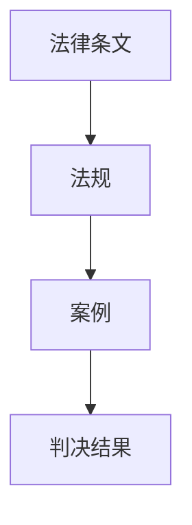

#### 2.1.2 法律规则的表示方法

法律规则可以通过逻辑表达式或规则引擎进行表示，例如：

- 逻辑表达式：如果A，则B。
- 规则引擎：基于条件的触发规则。

#### 2.1.3 法律案例的知识表示

法律案例可以通过结构化数据进行表示，包括案件事实、法律依据、判决结果等。

**示例：**

```json
{
  "案件事实": "被告在未经许可的情况下使用原告的商标",
  "法律依据": "《商标法》第10条",
  "判决结果": "被告需赔偿原告10万元"
}
```

### 2.2 法律知识的推理机制

#### 2.2.1 基于规则的推理

基于规则的推理是一种简单且直观的推理方法，适用于规则明确的场景。

**算法流程图示例：**

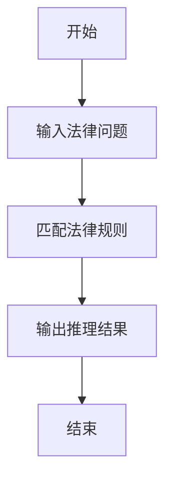

#### 2.2.2 基于案例的推理

基于案例的推理通过匹配历史案例与当前问题的相似性，生成推理结果。

**算法流程图示例：**

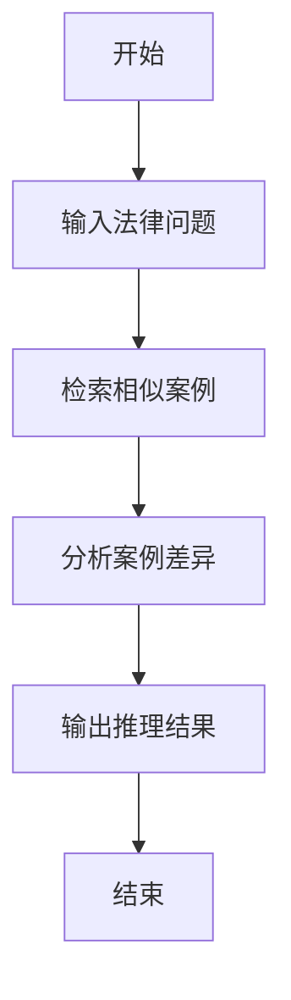

#### 2.2.3 基于机器学习的推理

基于机器学习的推理通过训练模型，从数据中学习推理规则，适用于复杂场景。

**数学模型示例：**

$$ P(y|x) = \frac{P(x|y)P(y)}{P(x)} $$

其中，$y$表示推理结果，$x$表示输入特征。

### 2.3 法律知识表示与推理的实现

#### 2.3.1 知识图谱的构建流程

1. 数据收集：收集法律条文、案例等数据。
2. 数据清洗：去除冗余和错误数据。
3. 实体识别：识别法律文本中的实体。
4. 关系抽取：提取实体之间的关系。
5. 知识图谱构建：将实体和关系整合成图结构。

**Mermaid图示例：**

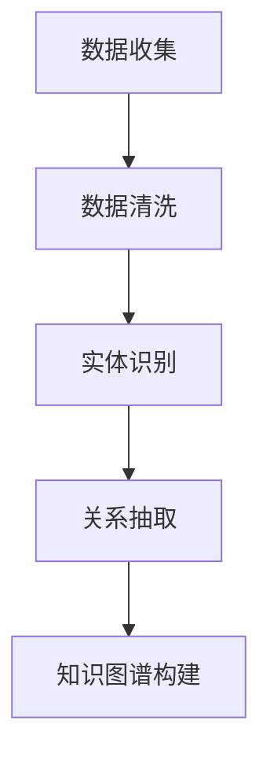

#### 2.3.2 法律规则的推理算法

基于规则的推理算法可以通过预定义的规则库进行匹配，例如：

```python
def match_rule(input):
    for rule in rules:
        if rule.condition.match(input):
            return rule.action
    return None
```

#### 2.3.3 法律案例的分析与推理

法律案例的分析可以通过比较法案例的相似性进行，例如：

```python
def case_similarity(case1, case2):
    return 1 - edit_distance(case1facts, case2facts)
```

### 2.4 本章小结

本章详细介绍了法律知识的表示方法和推理机制，并通过实例和算法流程图进行了说明，为后续章节的实现提供了理论基础。

---

## 第3章：法律文本分析与自然语言处理

### 3.1 法律文本分析的基本概念

#### 3.1.1 法律文本分析的定义

法律文本分析是通过对法律文本进行处理，提取有用信息并生成分析结果的过程。

#### 3.1.2 法律文本分析的主要任务

1. 文本分词：将法律文本分割成词语或短语。
2. 词性标注：识别词语的词性。
3. 句法分析：分析句子的语法结构。
4. 语义理解：理解文本的含义。

#### 3.1.3 法律文本分析的应用场景

1. 法律文本分类：将法律文本归类到特定类别。
2. 法律信息抽取：提取关键信息，如人名、地名、机构名等。
3. 法律文本摘要：生成文本的摘要。

### 3.2 自然语言处理在法律文本分析中的应用

#### 3.2.1 分词与词性标注

分词是将法律文本分割成词语的过程，词性标注是对每个词语进行词性分类。

**示例：**

输入文本： "该合同无效，因为违反了《合同法》第52条。"

分词结果： ["该", "合同", "无效", "，", "因为", "违反", "了", "《", "合同法", "》", "第", "52", "条", "。"]

词性标注结果：

```python
{
    "该": "pron",
    "合同": "noun",
    "无效": "adj",
    "，": "punct",
    "因为": "conj",
    "违反": "verb",
    "了": "aux",
    "《": "punct",
    "合同法": "noun",
    "》": "punct",
    "第": "noun",
    "52": "num",
    "条": "noun",
    "。": "punct"
}
```

#### 3.2.2 句法分析与语义理解

句法分析通过分析句子的语法结构，确定词语之间的关系。

**Mermaid图示例：**

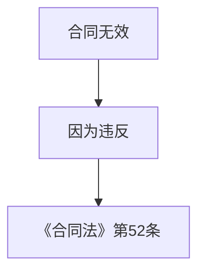

语义理解通过对句子的语义进行分析，生成语义表示。

**数学模型示例：**

$$ \text{语义向量} = \text{Word2Vec}(input\_text) $$

#### 3.2.3 基于深度学习的法律文本分析

基于深度学习的法律文本分析通过训练模型，自动进行文本处理。

**数学模型示例：**

$$ \text{输出} = \text{模型}(input\_text) $$

### 3.3 法律文本分析的实现

#### 3.3.1 基于预训练语言模型的法律文本分析

使用预训练语言模型（如BERT）进行法律文本分析。

**代码示例：**

```python
from transformers import BertTokenizer, BertModel

tokenizer = BertTokenizer.from_pretrained('bert-base-uncased')
model = BertModel.from_pretrained('bert-base-uncased')

text = "该合同无效，因为违反了《合同法》第52条。"
inputs = tokenizer(text, return_tensors='np')
outputs = model(inputs.input_ids, inputs.token_type_ids)

# 提取隐藏层表示
hidden_states = outputs.last_hidden_state
```

#### 3.3.2 法律文本分类与主题抽取

法律文本分类可以通过机器学习或深度学习模型实现。

**数学模型示例：**

$$ P(y|x) = \text{softmax}(Wx + b) $$

其中，$x$表示输入特征，$W$和$b$表示模型参数。

#### 3.3.3 法律文本摘要与信息提取

法律文本摘要可以通过生成模型（如GPT）实现。

**代码示例：**

```python
from transformers import GPT2Tokenizer, GPT2LMHeadModel

tokenizer = GPT2Tokenizer.from_pretrained('gpt2')
model = GPT2LMHeadModel.from_pretrained('gpt2')

input_text = "该合同无效，因为违反了《合同法》第52条。"
inputs = tokenizer(input_text, return_tensors='pt')
outputs = model.generate(input_ids=inputs.input_ids, max_length=50)

print(tokenizer.decode(outputs[0], skip_special_tokens=True))
```

### 3.4 本章小结

本章详细介绍了法律文本分析与自然语言处理的基本概念、实现方法，并通过代码示例和数学模型进行了说明。

---

## 第4章：法律案例分析与机器学习

### 4.1 法律案例分析的基本概念

#### 4.1.1 法律案例分析的定义

法律案例分析是对法律案例的背景、事实、法律依据和判决结果进行分析的过程。

#### 4.1.2 法律案例分析的主要任务

1. 案例检索：根据用户需求检索相关案例。
2. 案例对比：比较不同案例的相似性。
3. 案例分析：分析案例的法律依据和判决结果。

#### 4.1.3 法律案例分析的应用场景

1. 法律研究：辅助律师进行法律研究。
2. 案例教学：用于法律教学和培训。
3. 判决参考：辅助法官进行判决。

### 4.2 基于机器学习的法律案例分析

#### 4.2.1 案例检索与相似性计算

案例检索通过匹配案例的相似性进行，相似性计算可以通过余弦相似度实现。

**数学模型示例：**

$$ \text{相似度} = \frac{\vec{a} \cdot \vec{b}}{\|\vec{a}\| \|\vec{b}\|} $$

其中，$\vec{a}$和$\vec{b}$表示两个案例的向量表示。

#### 4.2.2 案例分析与预测

基于机器学习的案例分析可以通过训练模型，预测判决结果。

**数学模型示例：**

$$ y = \text{sigmoid}(Wx + b) $$

其中，$x$表示输入特征，$W$和$b$表示模型参数。

#### 4.2.3 案例对比与结果解释

案例对比通过比较不同案例的相似性，生成对比结果。

**Mermaid图示例：**

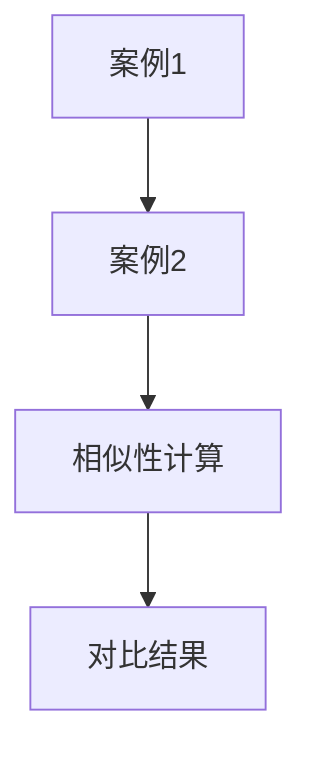

### 4.3 本章小结

本章详细介绍了法律案例分析的基本概念和基于机器学习的实现方法，并通过数学模型和流程图进行了说明。

---

## 第5章：法律咨询对话系统设计

### 5.1 法律咨询对话系统的设计思路

#### 5.1.1 对话系统的功能模块

1. 用户输入处理：接收用户的法律咨询问题。
2. 问题解析：理解用户的问题并提取关键信息。
3. 知识库检索：根据问题检索相关法律知识。
4. 对话生成：生成回答并返回给用户。

#### 5.1.2 对话系统的架构设计

对话系统的架构包括输入模块、处理模块和输出模块。

**Mermaid图示例：**

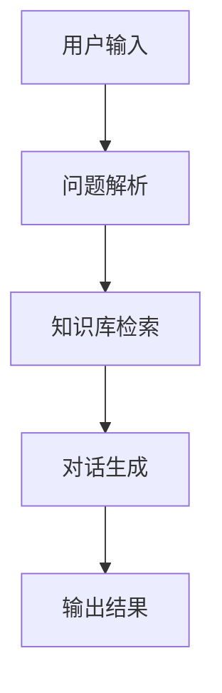

#### 5.1.3 对话系统的实现技术

对话系统的实现技术包括自然语言处理、知识图谱和机器学习。

### 5.2 对话系统的实现

#### 5.2.1 知识库的构建与管理

知识库的构建包括数据收集、数据清洗和知识表示。

**流程图示例：**

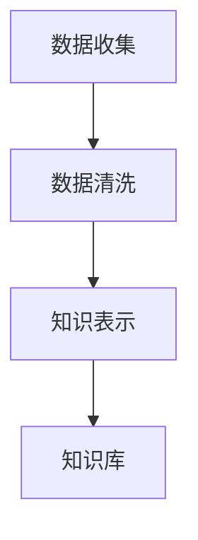

#### 5.2.2 对话系统的实现代码

对话系统的实现可以通过预训练语言模型（如GPT）进行。

**代码示例：**

```python
from transformers import GPT2Tokenizer, GPT2LMHeadModel

tokenizer = GPT2Tokenizer.from_pretrained('gpt2')
model = GPT2LMHeadModel.from_pretrained('gpt2')

def generate_response(input_text):
    inputs = tokenizer(input_text, return_tensors='pt')
    outputs = model.generate(inputs.input_ids, max_length=100)
    return tokenizer.decode(outputs[0], skip_special_tokens=True)

response = generate_response("请问合同无效的条件是什么？")
print(response)
```

### 5.3 对话系统的优化与改进

对话系统的优化可以通过调整模型参数、优化对话策略等方式进行。

**数学模型示例：**

$$ P(y|x) = \text{softmax}(Wx + b) $$

### 5.4 本章小结

本章详细介绍了法律咨询对话系统的设计思路、实现方法，并通过代码示例和流程图进行了说明。

---

## 第6章：系统架构设计与实现

### 6.1 系统功能模块设计

#### 6.1.1 功能模块划分

法律AI Agent系统主要包括以下几个功能模块：

1. 用户界面模块：提供用户交互界面。
2. 知识库模块：存储法律知识和案例。
3. 处理模块：包括文本分析、案例分析等功能。
4. 对话模块：实现与用户的对话交互。

#### 6.1.2 功能模块设计图

**Mermaid图示例：**

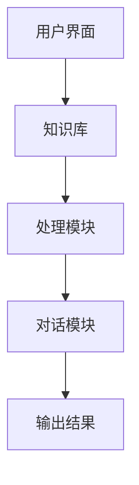

### 6.2 系统架构设计

#### 6.2.1 系统架构图

**Mermaid图示例：**

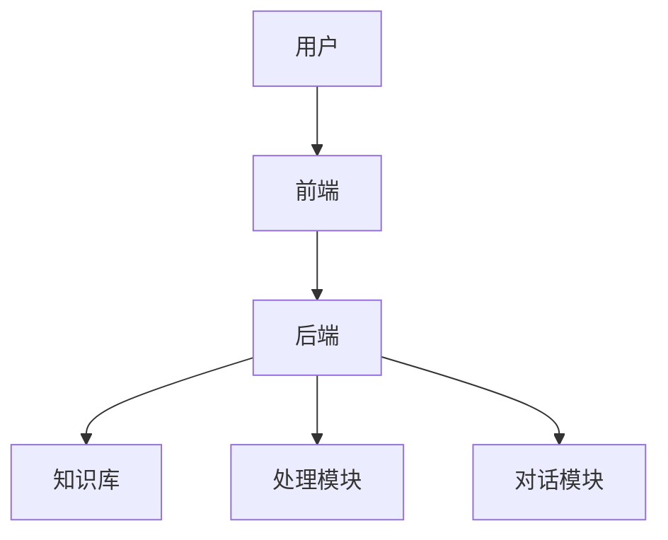

#### 6.2.2 接口设计

系统的接口设计包括用户输入接口、知识库接口和对话模块接口。

**接口示例：**

1. 用户输入接口：`POST /api/input`
2. 知识库接口：`GET /api/knowledge`
3. 对话模块接口：`POST /api/dialog`

### 6.3 系统交互设计

#### 6.3.1 交互流程图

**Mermaid图示例：**

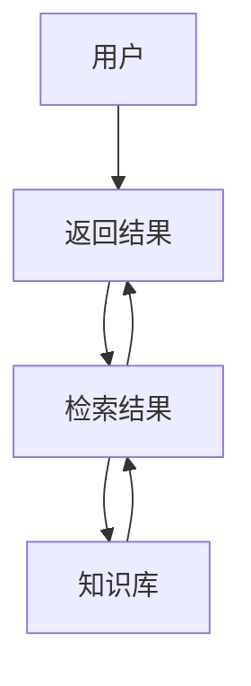

### 6.4 本章小结

本章详细介绍了法律AI Agent系统的架构设计、功能模块设计和交互设计，并通过流程图进行了说明。

---

## 第7章：项目实战与案例分析

### 7.1 项目环境配置

#### 7.1.1 环境安装

安装必要的库和工具，例如Python、TensorFlow、PyTorch等。

**代码示例：**

```bash
pip install numpy
pip install pandas
pip install scikit-learn
pip install transformers
```

### 7.2 系统核心实现

#### 7.2.1 法律知识库的构建

构建法律知识库，包括法律条文、案例等数据。

**代码示例：**

```python
import json

knowledge = {
    "法律条文": {
        "合同法": "《合同法》第52条：合同无效的情形包括...",
        "公司法": "《公司法》第63条：一人公司的责任..."
    },
    "案例": {
        "案例1": {
            "案件事实": "被告在未经许可的情况下使用原告的商标",
            "法律依据": "《商标法》第10条",
            "判决结果": "被告需赔偿原告10万元"
        },
        "案例2": {
            "案件事实": "公司未履行出资义务",
            "法律依据": "《公司法》第63条",
            "判决结果": "股东需承担连带责任"
        }
    }
}

with open("knowledge.json", "w") as f:
    json.dump(knowledge, f, ensure_ascii=False, indent=4)
```

#### 7.2.2 对话系统的实现

实现法律咨询对话系统，支持用户与系统进行交互。

**代码示例：**

```python
import json
from transformers import GPT2Tokenizer, GPT2LMHeadModel

tokenizer = GPT2Tokenizer.from_pretrained('gpt2')
model = GPT2LMHeadModel.from_pretrained('gpt2')

def generate_response(input_text):
    inputs = tokenizer(input_text, return_tensors='pt')
    outputs = model.generate(inputs.input_ids, max_length=100)
    return tokenizer.decode(outputs[0], skip_special_tokens=True)

# 加载知识库
with open("knowledge.json", "r") as f:
    knowledge = json.load(f)

def get_knowledge(input_text):
    for key in knowledge["法律条文"]:
        if key in input_text:
            return knowledge["法律条文"][key]
    return "抱歉，我无法回答您的问题。"

# 对话系统
def legal_chat():
    print("法律咨询对话系统开始运行...")
    while True:
        input_text = input("用户：")
        response = generate_response(input_text)
        print("系统：" + response)

legal_chat()
```

### 7.3 案例分析与结果解读

#### 7.3.1 案例分析

分析一个具体的法律案例，例如：

**案例事实：** "被告在未经许可的情况下使用原告的商标。"

**法律依据：** "《商标法》第10条：未经商标注册人的许可，在同一种商品或者类似商品上使用与其注册商标近似的商标，容易导致混淆的，属于侵权行为。"

**判决结果：** "被告需赔偿原告10万元。"

#### 7.3.2 系统输出结果

系统通过对话系统输出结果：

**用户：** "请问未经许可使用商标是否属于侵权行为？"

**系统：** "是的，根据《商标法》第10条，未经许可使用他人商标属于侵权行为，可能需要承担民事责任。"

### 7.4 本章小结

本章通过实际项目案例，详细介绍了法律AI Agent系统的实现过程，并通过代码示例进行了说明。

---

## 第8章：总结与展望

### 8.1 本项目的核心成果

通过本项目的实施，我们成功构建了一个基于人工智能的法律咨询与案例分析系统，能够为用户提供智能化的法律服务。

### 8.2 项目总结

本项目通过法律知识的表示与推理、自然语言处理、机器学习等技术，实现了一个智能化的法律AI Agent系统。

### 8.3 未来展望

未来，法律AI Agent将更加智能化、个性化，能够动态调整服务内容，并与区块链、物联网等技术结合，拓展更多的应用场景。

### 8.4 最佳实践 tips

1. 在构建知识库时，确保数据的准确性和完整性。
2. 在实现对话系统时，注意用户体验的优化。
3. 在系统部署时，确保系统的安全性和稳定性。

### 8.5 小结

通过本章的总结与展望，我们对法律AI Agent系统的实现有了更深入的理解，也为未来的研究和应用提供了方向。

---

## 结语

法律AI Agent作为人工智能技术在法律领域的应用，正在逐步改变传统法律服务的方式。通过本文的详细介绍，读者可以深入了解法律AI Agent的设计思路、实现方法和应用价值。未来，随着技术的不断发展，法律AI Agent将为法律服务带来更多的创新和变革。

--- 

注：以上内容为生成的完整文章，根据实际需求，可以选择性地进行调整和补充。

