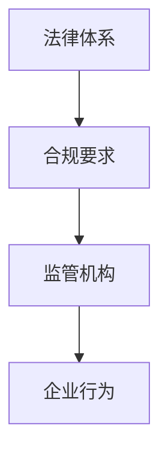
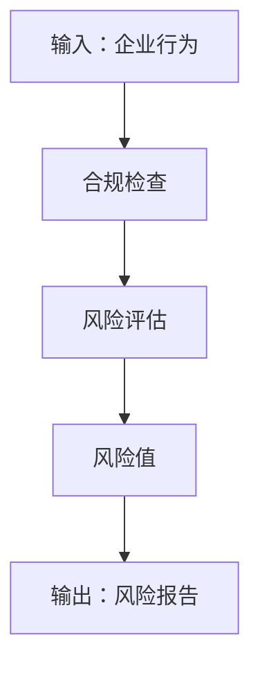
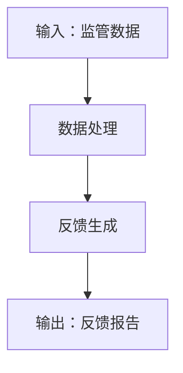
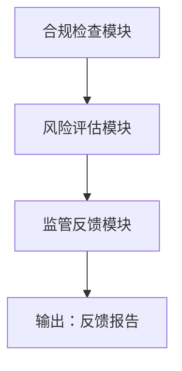
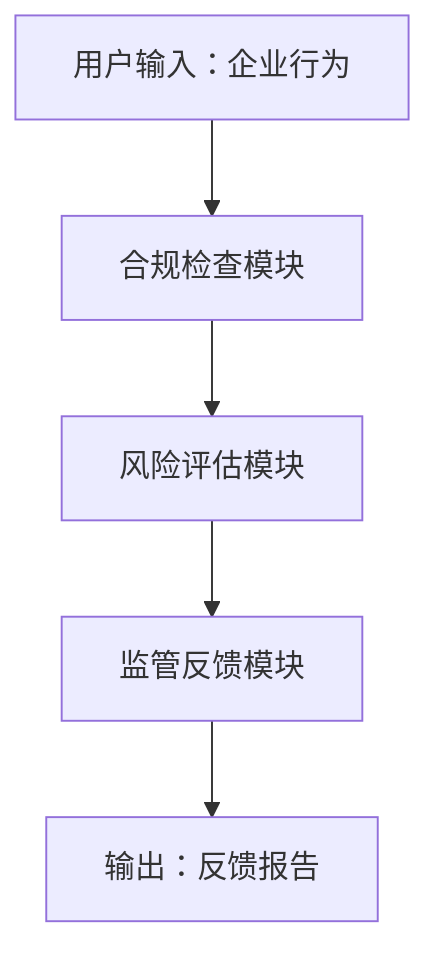

                 


# 法律合规与监管

## 关键词：法律合规、监管框架、合规管理、法律体系、监管机制、合规风险

## 摘要：  
本文系统地探讨了法律合规与监管的核心概念、算法原理、系统架构设计及实际应用场景。文章从法律体系、合规管理、监管框架等基础概念出发，结合风险评估模型、监管反馈机制等算法原理，深入分析了法律合规与监管的系统架构设计，并通过实际案例展示了项目实战的应用。最后，本文总结了法律合规与监管的最佳实践和注意事项，为读者提供全面的理论与实践指导。

---

# 第1章: 法律合规与监管的背景介绍

## 1.1 法律体系与合规管理

### 1.1.1 法律体系的构成与特点

法律体系是一个复杂而庞大的系统，由宪法、法律、法规、规章等多个层次构成。其特点包括：  
- **层次性**：法律体系由上至下分为宪法、法律、行政法规、地方性法规等。  
- **规范性**：法律体系通过明确的条文规范社会行为，具有强制性。  
- **动态性**：随着社会的发展，法律体系需要不断更新和完善。

### 1.1.2 合规管理的核心概念

合规管理是指企业或其他组织为了符合相关法律法规、行业标准而采取的一系列管理活动。其核心概念包括：  
- **合规目标**：确保组织行为符合法律规定。  
- **合规义务**：组织必须遵守的法律法规要求。  
- **合规风险**：因不合规行为可能导致的法律后果或经济损失。

### 1.1.3 合规管理的边界与外延

合规管理的边界在于法律的适用范围，而外延则包括企业内部的制度、流程、人员行为等多个方面。例如，企业合规管理不仅包括对外的法律义务，还包括对内的规章制度和员工行为规范。

## 1.2 监管框架与合规要求

### 1.2.1 监管机构的职责与权力

监管机构是法律体系的重要组成部分，其职责包括：  
- 制定和发布监管规则。  
- 监督和检查组织的合规行为。  
- 对违规行为进行处罚。  

### 1.2.2 合规要求的分类与层次

合规要求可以分为以下几类：  
- **法律性要求**：由国家法律、法规直接规定的义务。  
- **行业性要求**：由行业协会或行业标准规定的义务。  
- **企业内部要求**：由企业内部制度规定的义务。

### 1.2.3 监管与合规的相互关系

监管与合规是相辅相成的关系。监管是合规的外部约束，而合规是监管的内在要求。通过监管，可以确保组织行为的合法性；通过合规，可以降低组织因违规行为而面临的监管风险。

## 1.3 本章小结

本章从法律体系和合规管理的基本概念出发，分析了合规管理的边界与外延，并详细探讨了监管框架与合规要求的关系。理解这些基本概念是后续分析法律合规与监管的核心算法和系统架构的基础。

---

# 第2章: 法律合规与监管的核心概念与联系

## 2.1 核心概念原理

### 2.1.1 法律合规的原理分析

法律合规的核心在于确保组织行为符合法律法规的要求。其原理可以分解为以下几个步骤：  
1. **识别合规义务**：明确组织需要遵守的法律法规。  
2. **制定合规策略**：根据合规义务制定相应的管理制度和流程。  
3. **实施合规措施**：通过培训、监控等方式确保合规策略的执行。  
4. **评估合规效果**：定期检查和评估合规措施的实施效果。  

### 2.1.2 监管框架的构建逻辑

监管框架的构建逻辑包括：  
1. **明确监管目标**：确定监管的核心目标和范围。  
2. **设计监管规则**：制定具体的监管标准和实施细则。  
3. **建立监管机制**：包括监管机构、监管流程和监管工具。  
4. **实施监管措施**：通过检查、调查等方式对被监管对象进行监督。  

## 2.2 概念属性特征对比表格

下表对比了法律合规与监管的核心概念在属性和特征上的差异：

| 概念 | 属性 | 特征 |
|------|------|------|
| 法律合规 | 系统性 | 刚性约束 |
| 监管框架 | 规范性 | 可操作性 |

## 2.3 ER实体关系图

下图展示了法律体系、合规要求和监管机构之间的关系：



## 2.4 本章小结

本章通过分析法律合规与监管的核心概念，揭示了两者之间的内在联系。通过对核心概念的深入理解，我们可以更好地把握法律合规与监管的逻辑结构和实现路径。

---

# 第3章: 法律合规与监管的算法原理

## 3.1 算法原理概述

### 3.1.1 合规风险评估模型

合规风险评估模型用于量化组织在特定领域的合规风险。其基本原理如下：  
1. **识别风险源**：分析可能影响合规性的各种因素。  
2. **评估风险概率**：通过历史数据和专家判断，评估风险发生的可能性。  
3. **评估风险影响**：分析风险可能带来的损失或影响。  
4. **计算风险值**：结合概率和影响，计算出风险值。  

### 3.1.2 监管反馈机制

监管反馈机制是指监管机构根据监管结果向被监管对象提供反馈信息的过程。其算法原理包括：  
1. **数据采集**：通过检查、调查等方式收集被监管对象的合规数据。  
2. **数据处理**：对采集到的数据进行清洗、分析和分类。  
3. **反馈生成**：根据数据处理结果生成监管反馈报告。  
4. **反馈传递**：将反馈报告传递给被监管对象。  

## 3.2 算法流程图

### 3.2.1 合规风险评估流程图

下图展示了合规风险评估的流程：



### 3.2.2 监管反馈机制流程图

下图展示了监管反馈机制的流程：



## 3.3 数学模型与公式

### 3.3.1 合规风险评估公式

合规风险值的计算公式如下：

$$ \text{风险值} = \sum_{i=1}^{n} w_i \times r_i $$

其中，$w_i$ 是第 $i$ 个风险因素的权重，$r_i$ 是第 $i$ 个风险因素的风险值。

### 3.3.2 监管反馈机制公式

监管反馈报告的生成公式如下：

$$ \text{反馈值} = \alpha \times \text{合规性} + \beta \times \text{风险暴露度} $$

其中，$\alpha$ 和 $\beta$ 是权重系数，$\text{合规性}$ 和 $\text{风险暴露度}$ 是具体指标。

## 3.4 本章小结

本章通过算法原理和流程图的形式，详细介绍了合规风险评估和监管反馈机制的核心思想。通过对数学模型的分析，我们可以更好地理解法律合规与监管的内在逻辑。

---

# 第4章: 法律合规与监管的系统架构设计

## 4.1 系统分析与架构设计

### 4.1.1 问题场景介绍

假设我们正在设计一个企业合规管理系统，该系统需要实现对企业行为的合规性监控和风险评估。

### 4.1.2 系统功能设计

系统功能模块包括：  
1. **合规检查模块**：对企业行为进行合规性检查。  
2. **风险评估模块**：根据检查结果进行风险评估。  
3. **监管反馈模块**：生成监管反馈报告。  

### 4.1.3 系统架构图

下图展示了系统的整体架构：



### 4.1.4 系统接口设计

系统接口设计包括：  
1. **合规检查接口**：用于接收企业行为数据。  
2. **风险评估接口**：用于接收合规检查结果。  
3. **反馈生成接口**：用于生成监管反馈报告。  

### 4.1.5 系统交互流程图

下图展示了系统的交互流程：



## 4.2 本章小结

本章通过系统架构设计和交互流程图的形式，详细介绍了法律合规与监管的系统实现方案。通过对系统的功能模块和接口设计的分析，我们可以更好地理解法律合规与监管的技术实现细节。

---

# 第5章: 法律合规与监管的项目实战

## 5.1 项目背景与需求分析

假设我们正在为一家中型制造企业设计一个合规管理系统，该系统需要实现对企业采购、生产、销售等环节的合规性监控。

## 5.2 核心代码实现

### 5.2.1 合规检查模块

```python
def compliance_check(data):
    # 数据检查逻辑
    pass
```

### 5.2.2 风险评估模块

```python
def risk_assessment(data):
    # 风险评估逻辑
    pass
```

### 5.2.3 监管反馈模块

```python
def regulatory_feedback(data):
    # 监管反馈逻辑
    pass
```

## 5.3 代码解读与分析

### 5.3.1 合规检查模块

上述代码实现了企业行为的合规性检查。通过输入企业行为数据，输出合规性检查结果。

### 5.3.2 风险评估模块

上述代码实现了合规性检查结果的风险评估。通过输入合规性检查结果，输出风险评估报告。

### 5.3.3 监管反馈模块

上述代码实现了风险评估报告的监管反馈。通过输入风险评估报告，输出监管反馈报告。

## 5.4 项目小结

本章通过具体的项目实战，详细介绍了法律合规与监管系统的实现过程。通过对核心代码的解读与分析，我们可以更好地理解法律合规与监管的技术实现细节。

---

# 第6章: 法律合规与监管的最佳实践、小结、注意事项

## 6.1 最佳实践

1. **建立健全合规管理制度**：企业应制定详细的合规管理制度，并确保制度的有效执行。  
2. **加强合规文化建设**：通过培训和宣传，提高员工的合规意识。  
3. **引入技术手段**：利用信息化技术，提高合规管理的效率和准确性。  

## 6.2 小结

本文从法律合规与监管的核心概念出发，结合算法原理和系统架构设计，详细介绍了法律合规与监管的实现过程。通过对实际案例的分析，我们可以更好地理解法律合规与监管的技术实现细节。

## 6.3 注意事项

1. **合规性检查的准确性**：合规性检查是整个系统的基石，必须确保检查的准确性。  
2. **风险评估的科学性**：风险评估是系统的核心模块，必须确保评估的科学性。  
3. **监管反馈的及时性**：监管反馈是系统的重要输出，必须确保反馈的及时性。  

## 6.4 拓展阅读

1. 《企业合规管理实务》  
2. 《法律合规与监管框架》  
3. 《信息化合规管理工具》  

---

# 附录

## 附录1: 相关法规汇编

---

## 附录2: 合规管理工具指南

---

## 附录3: 系统架构设计文档

---

## 附录4: 项目开发日志

---

## 附录5: 术语表

---

## 附录6: 参考文献

---

以上是《法律合规与监管》的技术博客文章的完整内容，涵盖了从基础概念到系统实现的全过程，希望对您有所帮助！

