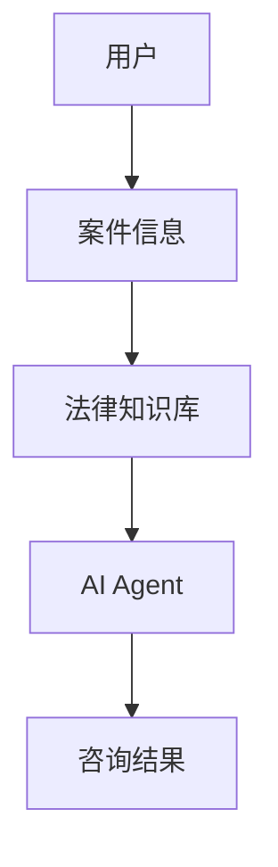
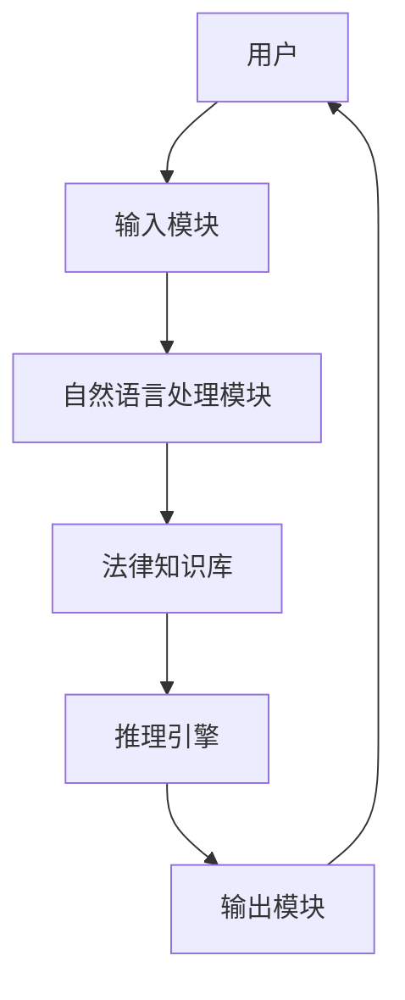
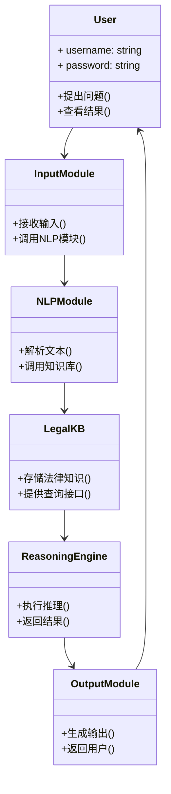

                 


# 《法律咨询领域的AI Agent辅助系统》

## 关键词：AI Agent、法律咨询、自然语言处理、法律知识库、系统架构

## 摘要：  
本文系统探讨了AI Agent在法律咨询领域的应用，从背景、核心概念、算法原理、系统架构到项目实战，全面解析了AI Agent辅助系统的构建与优化。通过详细的技术分析和实际案例，展示了如何利用AI技术提升法律咨询的效率与准确性。

---

# 第1章: 法律咨询领域的AI Agent辅助系统背景

## 1.1 AI Agent的基本概念与原理

### 1.1.1 AI Agent的定义  
AI Agent（人工智能代理）是指能够感知环境、自主决策并执行任务的智能实体。在法律咨询领域，AI Agent通常表现为一种基于自然语言处理（NLP）和知识库的智能问答系统，能够辅助律师或用户提供法律建议、案件分析和文档生成等服务。

### 1.1.2 AI Agent的核心原理  
AI Agent的核心原理包括：  
1. **感知**：通过自然语言处理技术，识别用户输入的法律问题或需求。  
2. **推理**：基于法律知识库和逻辑推理，生成解决方案。  
3. **执行**：将推理结果以自然语言形式输出，或执行特定任务（如生成合同）。  

### 1.1.3 法律咨询领域的特殊性与需求  
法律咨询领域具有以下特点：  
- **专业性**：法律知识复杂且更新频繁，需要精准的知识库支持。  
- **情境性**：用户的问题往往与具体案件相关，需要结合上下文进行推理。  
- **严谨性**：法律咨询的结果直接影响用户的权益，要求AI Agent具有高度的准确性和可靠性。  

---

## 1.2 法律咨询领域的智能化需求  

### 1.2.1 法律咨询的复杂性与多样性  
法律咨询涉及合同法、刑法、民法等多个领域，每个领域都有其独特的规则和案例。传统的法律咨询依赖于律师的个人经验和知识储备，但这种方式效率低下且成本高昂。

### 1.2.2 传统法律咨询的局限性  
- **效率低**：律师需要花费大量时间查阅法律文献和案例。  
- **资源有限**：中小律师事务所往往缺乏足够的法律知识库和专业人才。  
- **成本高**：高端法律咨询服务价格昂贵，限制了普通用户的使用。  

### 1.2.3 AI Agent在法律咨询中的潜在价值  
AI Agent可以通过以下方式解决上述问题：  
- **快速检索**：基于强大的法律知识库，快速定位相关法律条文和案例。  
- **智能分析**：利用自然语言处理技术，分析用户的问题并生成初步解决方案。  
- **辅助决策**：为律师提供数据支持，帮助其做出更准确的判断。  

---

## 1.3 AI Agent在法律咨询中的应用现状  

### 1.3.1 国内外研究现状  
目前，国内外关于AI Agent在法律咨询领域的研究主要集中在以下方面：  
- 基于NLP的法律问答系统。  
- 基于知识图谱的法律推理技术。  
- 法律合同自动审查与生成系统。  

### 1.3.2 当前存在的问题与挑战  
- **数据不足**：高质量的法律知识库构建需要大量标注数据，且更新成本高。  
- **模型准确度**：AI Agent在处理复杂法律问题时，容易出现推理错误。  
- **法律伦理**：AI Agent的决策可能涉及法律伦理问题，需要明确责任归属。  

### 1.3.3 未来发展趋势  
- **知识图谱的深度应用**：通过构建大规模法律知识图谱，提升AI Agent的推理能力。  
- **多模态交互**：结合语音识别、图像识别等技术，提供更丰富的交互方式。  
- **人机协作**：AI Agent作为辅助工具，与律师协同工作，而非完全替代人类。  

---

# 第2章: 法律咨询领域的AI Agent核心概念与联系

## 2.1 法律咨询领域的核心概念  

### 2.1.1 法律咨询的实体与关系  
在法律咨询领域，主要涉及以下实体：  
- **用户**：提出法律问题的个人或企业。  
- **案件信息**：用户提供的案件相关文本（如合同、判决书等）。  
- **法律知识库**：包含法律法规、案例判例和法律术语的数据库。  

### 2.1.2 法律咨询的场景与任务  
常见的法律咨询场景包括：  
- 合同审查与生成。  
- 刑法案件分析。  
- 民法纠纷调解。  

### 2.1.3 法律咨询的数据与知识库  
法律知识库是AI Agent的核心资源，通常包括：  
- 法律法规文本。  
- 判例法数据库。  
- 法律术语词典。  

---

## 2.2 AI Agent的核心概念与属性  

### 2.2.1 AI Agent的属性特征对比表  

| 属性       | 传统法律咨询 | AI Agent辅助法律咨询 |
|------------|--------------|------------------------|
| 效率       | 低           | 高                     |
| 成本       | 高           | 低                     |
| 准确性     | 取决于律师经验 | 取决于知识库和算法     |
| 可扩展性   | 有限         | 强                     |

### 2.2.2 法律咨询领域AI Agent的实体关系图  


---

## 2.3 法律咨询领域AI Agent的系统架构  

### 2.3.1 系统整体架构图  


---

# 第3章: 法律咨询领域AI Agent的算法原理

## 3.1 自然语言处理算法  

### 3.1.1 Transformer模型的基本原理  
Transformer模型由Google于2018年提出，广泛应用于NLP任务。其核心思想是引入注意力机制（Attention），通过全局上下文信息生成更准确的文本表示。

### 3.1.2 注意力机制的数学模型  
注意力机制的计算公式如下：  
$$
\text{Attention}(Q, K, V) = \text{softmax}\left(\frac{QK^T}{\sqrt{d_k}}\right)V
$$  
其中，$Q$、$K$、$V$分别为查询（Query）、键（Key）、值（Value），$d_k$为键的维度。

---

## 3.2 法律知识库的构建与应用  

### 3.2.1 法律知识库的构建流程  
1. 数据收集：整理法律法规、判例法和法律术语。  
2. 数据标注：对法律文本进行分词、实体识别和关系抽取。  
3. 知识图谱构建：将法律知识转化为可计算的图结构。  

### 3.2.2 法律知识库的应用场景  
- 合同审查：识别合同中的法律风险点。  
- 案例分析：基于类似案例生成法律建议。  

---

## 3.3 基于知识图谱的推理算法  

### 3.3.1 知识图谱的表示学习  
知识图谱中的实体和关系可以通过向量表示，常用的方法包括：  
- Word2Vec：用于词向量生成。  
- KGEmbedding：用于知识图谱的嵌入学习。  

### 3.3.2 基于知识图谱的推理流程  
1. **问题解析**：将用户的问题转化为查询条件。  
2. **路径规划**：在知识图谱中找到相关实体和关系路径。  
3. **推理与验证**：根据路径结果生成最终答案并进行验证。  

---

## 3.4 法律咨询中NLP模型的优化策略  

### 3.4.1 数据增强技术  
通过数据增强技术（如同义词替换、数据扩增）提升模型的泛化能力。  

### 3.4.2 模型调优策略  
- 调整模型超参数（如学习率、批量大小）。  
- 引入领域特定的预训练模型（如LegalBERT）。  

---

# 第4章: 法律咨询领域AI Agent的系统分析与架构设计

## 4.1 系统分析  

### 4.1.1 问题场景介绍  
以合同审查为例，用户上传一份合同，系统需要识别合同中的法律风险点并生成审查报告。  

---

## 4.2 系统架构设计  

### 4.2.1 系统功能设计  


---

## 4.3 项目实战  

### 4.3.1 环境安装  
需要安装以下工具：  
- Python 3.8+  
- Transformers库（`pip install transformers`）  
- Mermaid CLI（用于绘制图表）  

---

## 4.3.2 系统核心代码实现  

### 合同审查模块  

```python
from transformers import AutoTokenizer, AutoModelForMaskedLM
import torch

class ContractReviewer:
    def __init__(self, model_name="bert-base"):
        self.tokenizer = AutoTokenizer.from_pretrained(model_name)
        self.model = AutoModelForMaskedLM.from_pretrained(model_name)
        
    def review(self, text):
        inputs = self.tokenizer.encode_plus(
            text, max_length=512, truncation=True, padding='max_length', return_tensors='pt'
        )
        with torch.no_grad():
            outputs = self.model(**inputs)
        # 解析输出并生成审查报告
        # ...
        return report
```

---

## 4.3.3 案例分析  

### 案例：合同条款审查  

用户上传一份租赁合同，系统识别出以下风险点：  
- 合同缺少违约金条款。  
- 租赁期限模糊，可能引发争议。  

---

## 4.3.4 系统小结  
通过上述案例分析，我们可以看到AI Agent在法律咨询中的巨大潜力，但仍需在数据质量、模型准确性和用户交互方面进一步优化。

---

# 第5章: 法律咨询领域AI Agent的最佳实践与未来展望

## 5.1 最佳实践  

### 5.1.1 数据质量控制  
- 确保法律知识库的完整性和准确性。  
- 定期更新知识库内容。  

### 5.1.2 模型优化策略  
- 引入领域特定的预训练模型。  
- 使用主动学习技术优化模型性能。  

---

## 5.2 小结  

通过本文的系统分析与实践，我们深入探讨了AI Agent在法律咨询领域的应用，从理论到实践，全面解析了其构建与优化的关键点。

---

## 5.3 注意事项  

- **数据隐私**：处理法律数据时需遵守相关隐私保护法规。  
- **责任划分**：明确AI Agent与人类律师的责任边界。  
- **用户体验**：设计直观易用的用户界面，减少用户的学习成本。  

---

## 5.4 拓展阅读  

- 《Legal NLP: Theory and Practice》  
- 《Knowledge Graphs for Legal Reasoning》  

---

通过本文的系统分析与实践，我们深入探讨了AI Agent在法律咨询领域的应用，从理论到实践，全面解析了其构建与优化的关键点。希望本文能为相关领域的研究者和实践者提供有价值的参考。

