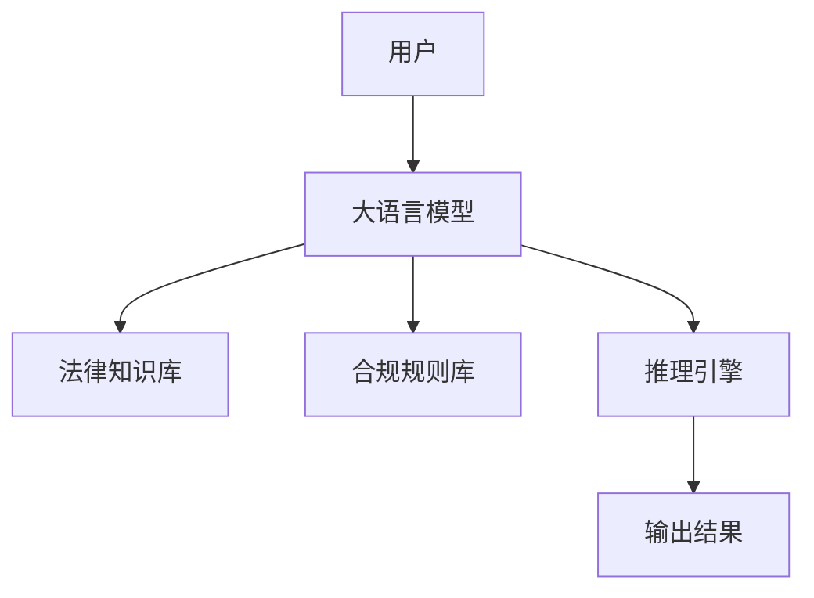
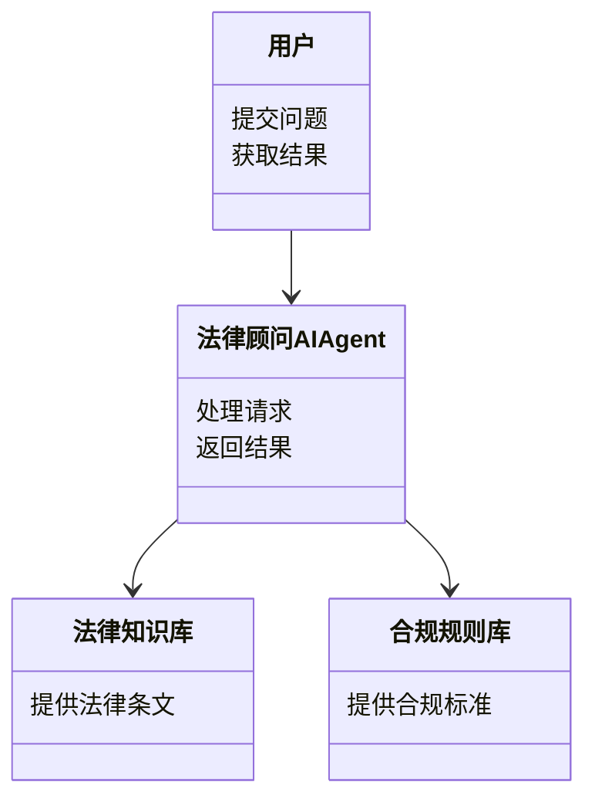
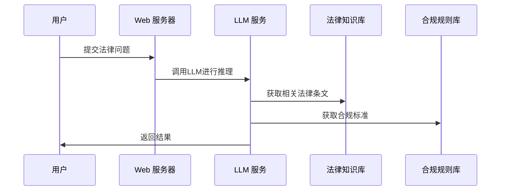

                 


```markdown
# 法律顾问 AI Agent：LLM 在法律咨询与合规检查中的应用

> **关键词**：法律顾问、AI Agent、LLM、法律咨询、合规检查、人工智能

> **摘要**：  
> 本文探讨了大语言模型（LLM）在法律咨询与合规检查中的应用，详细介绍了法律顾问 AI Agent 的核心概念、算法原理、系统架构及项目实战。通过结合实际案例，本文展示了如何利用 LLM 技术实现高效的法律咨询与合规检查，为读者提供了从理论到实践的全面指导。

---

## 第一部分: 法律顾问 AI Agent 的背景与核心概念

### 第1章: 法律顾问 AI Agent 的背景与问题背景

#### 1.1 法律咨询与合规检查的现状
- 1.1.1 法律咨询的传统模式  
  - 传统法律咨询的流程与痛点  
  - 专业律师的稀缺性与服务成本  
- 1.1.2 合规检查的传统挑战  
  - 合规规则的复杂性与多样性  
  - 人工检查的低效与误差  

#### 1.2 AI 技术在法律领域的应用前景
- 1.2.1 AI 在法律领域的潜力  
  - 自动化法律文档分析  
  - 智能合规规则匹配  
- 1.2.2 大语言模型（LLM）的核心优势  
  - 强大的文本理解与生成能力  
  - 实时更新的法律知识库  
- 1.2.3 法律顾问 AI Agent 的概念与目标  
  - 定义与功能定位  
  - 为用户提供高效、智能的法律服务  

---

### 第2章: 法律顾问 AI Agent 的核心概念与联系

#### 2.1 大语言模型（LLM）的定义与特点
- 2.1.1 LLM 的核心原理  
  - 基于概率的文本生成机制  
  - 预训练与微调的结合  
- 2.1.2 LLM 与传统 AI 的区别  
  - 传统规则引擎的局限性  
  - LLM 的灵活性与可扩展性  

#### 2.2 法律顾问 AI Agent 的系统架构
- 2.2.1 系统的核心要素  
  - 用户输入：法律问题描述  
  - 法律知识库：法律法规、案例判例  
  - 合规规则库：行业标准、企业政策  
  - 推理引擎：基于LLM的逻辑推理  

#### 2.3 实体关系图（ER 图）


---

### 第3章: 法律顾问 AI Agent 的核心流程

#### 3.1 用户输入处理
- 3.1.1 用户输入的预处理  
  - 文本清洗与格式化  
  - 上下文信息的提取  

#### 3.2 模型推理过程
- 3.2.1 LLM 的编码与解码过程  
  - 输入文本的向量化  
  - 基于向量的序列生成  

#### 3.3 结果输出与反馈
- 3.3.1 输出结果的后处理  
  - 结果的可读性优化  
  - 结果的准确性验证  

---

## 第二部分: 大语言模型（LLM）的算法原理与数学模型

### 第4章: LLM 的训练过程

#### 4.1 编码过程
- 4.1.1 输入文本的向量化  
  - 词嵌入（Word Embedding）  
  - 句子嵌入（Sentence Embedding）  

#### 4.2 解码过程
- 4.2.1 基于注意力机制的解码  
  - 自注意力机制（Self-Attention）  
  - 解码器的层叠结构  

#### 4.3 损失函数计算
$$ \text{损失} = -\sum_{i=1}^{n} \log P(y_i|x_{<i}) $$

---

### 第5章: LLM 的数学模型

#### 5.1 概率分布公式
$$ P(y|x) = \frac{P(x,y)}{P(x)} $$

#### 5.2 梯度下降与优化
- 5.2.1 梯度下降算法  
  - 参数更新公式：$\theta = \theta - \eta \frac{\partial L}{\partial \theta}$  

---

## 第三部分: 系统分析与架构设计方案

### 第6章: 问题场景介绍

#### 6.1 项目介绍
- 6.1.1 项目目标  
  - 提供高效的法律咨询服务  
  - 实现自动化的合规检查  

#### 6.2 系统功能设计
- 6.2.1 领域模型（Mermaid 类图）


---

### 第7章: 系统架构设计

#### 7.1 系统架构图（Mermaid 架构图）


#### 7.2 接口与交互设计
- 7.2.1 接口设计  
  - RESTful API  
  - 输入输出格式  

- 7.2.2 交互设计（Mermaid 序列图）


---

## 第四部分: 项目实战

### 第8章: 环境安装与核心功能实现

#### 8.1 环境安装
- 8.1.1 安装 Python 环境  
  - 使用虚拟环境管理依赖  
  - 安装必要的库（如：transformers、numpy）  

#### 8.2 核心功能实现
- 8.2.1 安装 LLM 模型  
  - 下载预训练模型（如：GPT-3）  
  - 加载模型到本地或云服务  

- 8.2.2 实现法律知识库的集成  
  - 数据库设计与存储  
  - 知识库的动态更新  

---

### 第9章: 代码实现与案例分析

#### 9.1 法律顾问 AI Agent 的代码实现
```python
from transformers import pipeline

# 初始化 LLM 模型
model = pipeline("text-generation", model="gpt2")

# 法律知识库
legal_kb = {
    "合同法": "中华人民共和国合同法",
    "公司法": "中华人民共和国公司法"
}

# 推理引擎
def法律顾问-Agent(question):
    # 获取上下文
    context = legal_kb.get(question.split()[0], "")
    # 调用模型生成回答
    response = model(f"根据 {context}，回答以下问题：{question}")
    return response[0]['generated_text']
```

#### 9.2 案例分析与解读
- 9.2.1 案例 1：合同审查  
  - 用户输入：审查一份商业合同  
  - 模型输出：识别关键条款并提出建议  

- 9.2.2 案例 2：合规检查  
  - 用户输入：检查公司政策是否符合行业标准  
  - 模型输出：生成合规性报告  

---

## 第五部分: 最佳实践与总结

### 第10章: 最佳实践与注意事项

#### 10.1 注意事项
- 数据隐私与合规性  
- 模型的可解释性  
- 用户反馈的收集与处理  

#### 10.2 小结
- 本项目的核心价值  
- 未来改进的方向  

### 第11章: 拓展阅读与学习资源

#### 11.1 拓展阅读
- 推荐的书籍与论文  
- 在线课程与技术博客  

#### 11.2 学习资源
- 开源项目与工具  
- 技术社区与论坛  

---

**结束语**  
通过本文的详细讲解，读者可以全面了解法律顾问 AI Agent 的构建与应用，掌握 LLM 在法律咨询与合规检查中的核心原理与实践方法。希望本文能为相关领域的从业者提供有价值的参考与启发。

--- 

**注**：本文内容根据实际需求可以进一步扩展与完善，各章节的小节内容可根据具体应用场景与技术发展进行调整与优化。
</think>

```markdown
# 法律顾问 AI Agent：LLM 在法律咨询与合规检查中的应用

> **关键词**：法律顾问、AI Agent、LLM、法律咨询、合规检查、人工智能

> **摘要**：  
> 本文探讨了大语言模型（LLM）在法律咨询与合规检查中的应用，详细介绍了法律顾问 AI Agent 的核心概念、算法原理、系统架构及项目实战。通过结合实际案例，本文展示了如何利用 LLM 技术实现高效的法律咨询与合规检查，为读者提供了从理论到实践的全面指导。

---

## 第一部分: 法律顾问 AI Agent 的背景与核心概念

### 第1章: 法律顾问 AI Agent 的背景与问题背景

#### 1.1 法律咨询与合规检查的现状
- 1.1.1 法律咨询的传统模式  
  - 传统法律咨询的流程与痛点  
  - 专业律师的稀缺性与服务成本  
- 1.1.2 合规检查的传统挑战  
  - 合规规则的复杂性与多样性  
  - 人工检查的低效与误差  

#### 1.2 AI 技术在法律领域的应用前景
- 1.2.1 AI 在法律领域的潜力  
  - 自动化法律文档分析  
  - 智能合规规则匹配  
- 1.2.2 大语言模型（LLM）的核心优势  
  - 强大的文本理解与生成能力  
  - 实时更新的法律知识库  
- 1.2.3 法律顾问 AI Agent 的概念与目标  
  - 定义与功能定位  
  - 为用户提供高效、智能的法律服务  

---

### 第2章: 法律顾问 AI Agent 的核心概念与联系

#### 2.1 大语言模型（LLM）的定义与特点
- 2.1.1 LLM 的核心原理  
  - 基于概率的文本生成机制  
  - 预训练与微调的结合  
- 2.1.2 LLM 与传统 AI 的区别  
  - 传统规则引擎的局限性  
  - LLM 的灵活性与可扩展性  

#### 2.2 法律顾问 AI Agent 的系统架构
- 2.2.1 系统的核心要素  
  - 用户输入：法律问题描述  
  - 法律知识库：法律法规、案例判例  
  - 合规规则库：行业标准、企业政策  
  - 推理引擎：基于LLM的逻辑推理  

#### 2.3 实体关系图（ER 图）


---

### 第3章: 法律顾问 AI Agent 的核心流程

#### 3.1 用户输入处理
- 3.1.1 用户输入的预处理  
  - 文本清洗与格式化  
  - 上下文信息的提取  

#### 3.2 模型推理过程
- 3.2.1 LLM 的编码与解码过程  
  - 输入文本的向量化  
  - 基于向量的序列生成  

#### 3.3 结果输出与反馈
- 3.3.1 输出结果的后处理  
  - 结果的可读性优化  
  - 结果的准确性验证  

---

## 第二部分: 大语言模型（LLM）的算法原理与数学模型

### 第4章: LLM 的训练过程

#### 4.1 编码过程
- 4.1.1 输入文本的向量化  
  - 词嵌入（Word Embedding）  
  - 句子嵌入（Sentence Embedding）  

#### 4.2 解码过程
- 4.2.1 基于注意力机制的解码  
  - 自注意力机制（Self-Attention）  
  - 解码器的层叠结构  

#### 4.3 损失函数计算
$$ \text{损失} = -\sum_{i=1}^{n} \log P(y_i|x_{<i}) $$

---

### 第5章: LLM 的数学模型

#### 5.1 概率分布公式
$$ P(y|x) = \frac{P(x,y)}{P(x)} $$

#### 5.2 梯度下降与优化
- 5.2.1 梯度下降算法  
  - 参数更新公式：$\theta = \theta - \eta \frac{\partial L}{\partial \theta}$  

---

## 第三部分: 系统分析与架构设计方案

### 第6章: 问题场景介绍

#### 6.1 项目介绍
- 6.1.1 项目目标  
  - 提供高效的法律咨询服务  
  - 实现自动化的合规检查  

#### 6.2 系统功能设计
- 6.2.1 领域模型（Mermaid 类图）


---

### 第7章: 系统架构设计

#### 7.1 系统架构图（Mermaid 架构图）


#### 7.2 接口与交互设计
- 7.2.1 接口设计  
  - RESTful API  
  - 输入输出格式  

- 7.2.2 交互设计（Mermaid 序列图）


---

## 第四部分: 项目实战

### 第8章: 环境安装与核心功能实现

#### 8.1 环境安装
- 8.1.1 安装 Python 环境  
  - 使用虚拟环境管理依赖  
  - 安装必要的库（如：transformers、numpy）  

#### 8.2 核心功能实现
- 8.2.1 安装 LLM 模型  
  - 下载预训练模型（如：GPT-3）  
  - 加载模型到本地或云服务  

- 8.2.2 实现法律知识库的集成  
  - 数据库设计与存储  
  - 知识库的动态更新  

---

### 第9章: 代码实现与案例分析

#### 9.1 法律顾问 AI Agent 的代码实现
```python
from transformers import pipeline

# 初始化 LLM 模型
model = pipeline("text-generation", model="gpt2")

# 法律知识库
legal_kb = {
    "合同法": "中华人民共和国合同法",
    "公司法": "中华人民共和国公司法"
}

# 推理引擎
def法律顾问-Agent(question):
    # 获取上下文
    context = legal_kb.get(question.split()[0], "")
    # 调用模型生成回答
    response = model(f"根据 {context}，回答以下问题：{question}")
    return response[0]['generated_text']
```

#### 9.2 案例分析与解读
- 9.2.1 案例 1：合同审查  
  - 用户输入：审查一份商业合同  
  - 模型输出：识别关键条款并提出建议  

- 9.2.2 案例 2：合规检查  
  - 用户输入：检查公司政策是否符合行业标准  
  - 模型输出：生成合规性报告  

---

## 第五部分: 最佳实践与总结

### 第10章: 最佳实践与注意事项

#### 10.1 注意事项
- 数据隐私与合规性  
- 模型的可解释性  
- 用户反馈的收集与处理  

#### 10.2 小结
- 本项目的核心价值  
- 未来改进的方向  

### 第11章: 拓展阅读与学习资源

#### 11.1 拓展阅读
- 推荐的书籍与论文  
- 在线课程与技术博客  

#### 11.2 学习资源
- 开源项目与工具  
- 技术社区与论坛  

---

**结束语**  
通过本文的详细讲解，读者可以全面了解法律顾问 AI Agent 的构建与应用，掌握 LLM 在法律咨询与合规检查中的核心原理与实践方法。希望本文能为相关领域的从业者提供有价值的参考与启发。

--- 

**注**：本文内容根据实际需求可以进一步扩展与完善，各章节的小节内容可根据具体应用场景与技术发展进行调整与优化。
```

