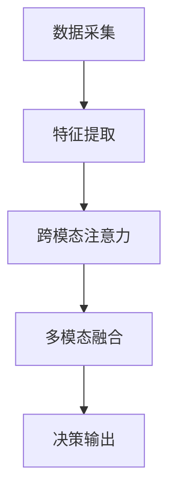
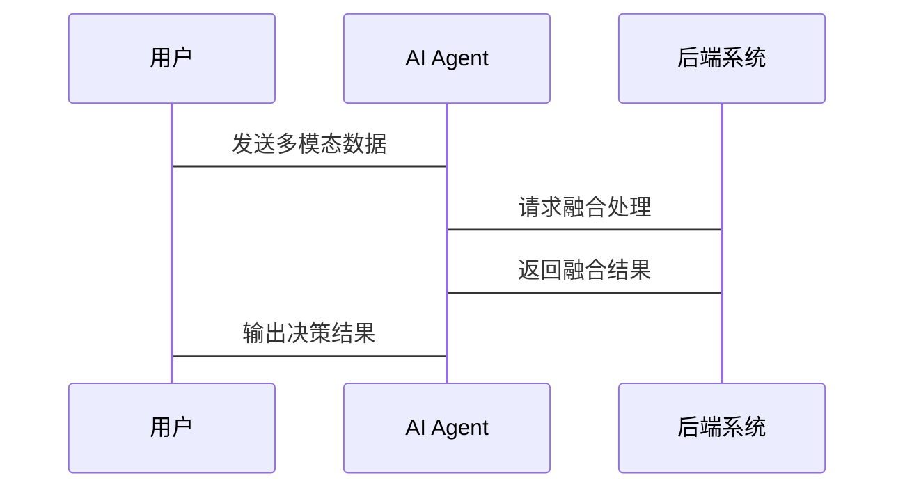

                 


# 注意力机制在AI Agent多模态融合中的应用

> 关键词：注意力机制、多模态融合、AI Agent、Transformer、深度学习

> 摘要：本文深入探讨了注意力机制在AI Agent多模态融合中的应用，从基本概念到算法原理，从系统架构到项目实战，全面解析了注意力机制如何助力多模态数据的高效融合与智能处理。通过详细分析和实际案例，展示了如何在AI Agent中实现高效的多模态融合，为相关研究和实践提供了理论支持和实践指导。

---

## 第一部分：背景介绍

### 第1章：注意力机制的基本概念

#### 1.1 注意力机制的起源与演进

注意力机制起源于自然语言处理领域的Transformer模型，最初用于处理序列数据中的长距离依赖关系。其核心思想是通过引入注意力权重，让模型能够关注输入数据中的重要部分，从而提高模型的表达能力。

- **注意力机制的起源**：注意力机制最早由Vaswani等人提出，用于改进机器翻译任务中的编码器-解码器结构。通过引入自注意力机制，模型能够捕捉到输入序列中不同位置之间的依赖关系。
- **多模态数据的特点**：多模态数据是指来自不同感知渠道的数据，如文本、图像、语音等。这些数据具有异质性、多样性和互补性，如何有效融合多模态数据是AI Agent面临的重要挑战。
- **AI Agent中的注意力机制**：AI Agent需要处理多种模态的数据，并根据任务需求动态分配注意力权重。注意力机制的引入使得AI Agent能够更高效地理解和处理复杂任务。

---

### 第2章：注意力机制与多模态融合的联系

#### 2.1 多模态数据的融合挑战

多模态数据的融合需要解决以下问题：
- 数据异质性：不同模态的数据具有不同的表示形式和特征维度。
- 信息冗余：不同模态数据中可能存在冗余信息，需要去噪和精炼。
- 语义一致性：不同模态数据需要在语义上保持一致，才能实现有效的融合。

#### 2.2 注意力机制在多模态融合中的作用

注意力机制通过以下方式在多模态融合中发挥作用：
- **模态间信息提取**：注意力机制能够从一种模态中提取关键信息，并将其传递到另一种模态。
- **模态间权重分配**：在多模态融合中，注意力机制可以根据任务需求动态分配不同模态的权重。
- **跨模态交互**：通过注意力机制，不同模态的数据可以进行高效的交互和协同。

---

## 第二部分：核心概念与联系

### 第3章：注意力机制的数学模型与属性特征

#### 3.1 注意力机制的数学模型

注意力机制的数学模型主要由以下几个部分组成：
1. **查询（Query）**：表示输入数据的特征向量。
2. **键（Key）**：用于匹配查询中的重要部分。
3. **值（Value）**：根据匹配结果生成的输出向量。

注意力机制的核心公式如下：

$$
\text{Attention}(Q, K, V) = \text{softmax}\left(\frac{QK^T}{\sqrt{d}}\right)V
$$

其中，$Q$ 是查询向量，$K$ 是键向量，$V$ 是值向量，$d$ 是向量的维度。

---

### 第4章：多模态融合中的注意力机制

#### 4.1 跨模态注意力机制

跨模态注意力机制通过在不同模态之间引入注意力权重，实现模态间的信息交互。例如，在文本和图像的融合中，可以通过图像注意力权重生成与文本内容相关的图像特征。

#### 4.2 层次化注意力机制

层次化注意力机制通过分层的方式逐步提取不同粒度的信息，适用于复杂多模态数据的处理。例如，在视频分析中，可以先提取帧级注意力，再生成视频级注意力。

---

## 第三部分：算法原理讲解

### 第5章：注意力机制的算法实现

#### 5.1 点积注意力机制的实现

点积注意力机制的实现步骤如下：

1. 输入查询向量 $Q$ 和键向量 $K$。
2. 计算 $Q$ 和 $K$ 的点积，得到注意力得分。
3. 对注意力得分进行归一化，得到注意力权重。
4. 根据注意力权重和值向量 $V$ 计算最终的注意力输出。

代码示例如下：

```python
import numpy as np

def scaled_dot_product_attention(query, key, value, d_k):
    # 计算点积
    scores = np.dot(query, key.T) / np.sqrt(d_k)
    # 计算注意力权重
    attention_weights = np.softmax(scores, axis=-1)
    # 计算输出
    output = np.dot(attention_weights, value)
    return output
```

---

### 第6章：多模态融合中的注意力机制

#### 6.1 跨模态注意力的实现

跨模态注意力机制的实现步骤如下：

1. 输入文本向量和图像向量。
2. 计算文本向量的注意力权重。
3. 根据注意力权重生成图像特征。
4. 将图像特征与文本特征进行融合，生成最终的融合结果。

代码示例如下：

```python
def cross_modal_attention(text_features, image_features):
    # 计算文本向量的注意力权重
    attention_weights = np.softmax(np.dot(text_features, image_features.T), axis=-1)
    # 根据注意力权重生成图像特征
    image_attention = np.dot(attention_weights, image_features)
    # 融合文本和图像特征
    fused_features = np.concatenate([text_features, image_attention], axis=-1)
    return fused_features
```

---

## 第四部分：系统分析与架构设计方案

### 第7章：AI Agent多模态融合的系统架构

#### 7.1 系统功能设计

AI Agent的多模态融合系统包括以下功能模块：
- 数据采集与预处理
- 多模态特征提取
- 跨模态注意力计算
- 多模态融合与决策

#### 7.2 系统架构设计

系统架构设计如图所示：



---

### 第8章：系统交互设计

系统交互设计如图所示：



---

## 第五部分：项目实战

### 第9章：基于注意力机制的多模态融合系统实现

#### 9.1 项目环境配置

项目环境配置如下：
- Python 3.8+
- NumPy
- TensorFlow或PyTorch
- Jupyter Notebook

#### 9.2 核心代码实现

核心代码实现如下：

```python
import numpy as np

def attention_model():
    # 定义查询、键、值向量
    d_k = 512
    Q = np.random.randn(1, d_k)
    K = np.random.randn(1, d_k)
    V = np.random.randn(1, d_k)
    
    # 计算注意力权重
    scores = np.dot(Q, K.T) / np.sqrt(d_k)
    attention_weights = np.softmax(scores, axis=-1)
    
    # 计算融合结果
    output = np.dot(attention_weights, V)
    return output

# 调用注意力模型
result = attention_model()
print(result)
```

---

## 第六部分：最佳实践与小结

### 第10章：最佳实践与小结

#### 10.1 注意力机制的实现技巧

- 注意力机制的实现需要考虑计算效率和模型性能。
- 在实际应用中，可以采用多头注意力机制来提高模型的表达能力。
- 注意力权重的可视化有助于理解模型的行为。

#### 10.2 项目小结

通过本文的分析与实践，我们深入探讨了注意力机制在AI Agent多模态融合中的应用。从理论到实践，从算法到系统，我们展示了如何利用注意力机制实现高效的多模态数据融合。

---

以上是《注意力机制在AI Agent多模态融合中的应用》的技术博客文章目录和内容概要，涵盖从基础概念到实际应用的各个方面，为读者提供了全面的知识和实践指导。

