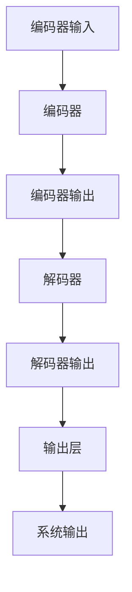
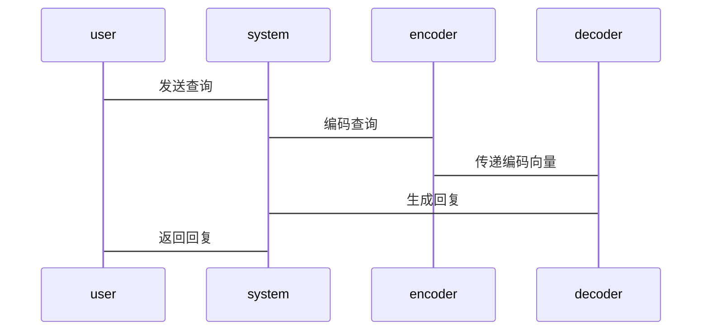

                 


# 注意力机制：提升AI Agent的关注点

> 关键词：注意力机制，AI Agent，自注意力机制，多头注意力，机器学习，深度学习

> 摘要：注意力机制是近年来在人工智能领域的重要进展，特别是在自然语言处理和AI代理中得到了广泛应用。本文从背景介绍、核心概念、算法原理、系统设计和项目实战等多方面详细讲解注意力机制，帮助读者深入理解其原理和应用。

---

## 第一部分: 注意力机制的核心概念与背景

### 第1章: 注意力机制的背景与问题背景

#### 1.1 人工智能中的注意力机制概述

- **1.1.1 从传统机器学习到深度学习的演进**
  - 传统机器学习依赖特征工程，深度学习通过神经网络自动提取特征。
  - 深度学习的局限性：处理长距离依赖关系的能力有限。

- **1.1.2 注意力机制的起源与动机**
  - 2014年，Bahdanau等人提出注意力机制用于机器翻译。
  - 注意力机制的动机：模型能够关注输入序列中重要的部分。

- **1.1.3 注意力机制的核心问题背景**
  - 传统循环神经网络难以处理长序列中的长距离依赖。
  - 注意力机制通过引入权重分配，增强模型对关键信息的关注。

#### 1.2 注意力机制的定义与问题描述

- **1.2.1 注意力机制的定义**
  - 注意力机制是一种动态关注输入序列中不同位置的方法。
  - 通过计算每个位置的权重，模型可以聚焦于重要的特征。

- **1.2.2 注意力机制的核心问题描述**
  - 问题：如何有效地分配注意力权重，以提升模型的性能。
  - 解决方案：引入自注意力机制，通过计算查询、键、值来确定权重。

- **1.2.3 注意力机制的边界与外延**
  - 边界：注意力机制主要用于序列模型，如RNN、Transformer。
  - 外延：注意力机制在图像处理、语音识别等领域也有广泛应用。

#### 1.3 注意力机制的核心概念结构

- **1.3.1 注意力机制的组成要素**
  - 查询（Query）：表示当前输入的向量。
  - 键（Key）：表示输入序列中其他位置的向量。
  - 值（Value）：表示输入序列中对应键的向量。

- **1.3.2 注意力机制的数学模型**
  - 注意力权重计算公式：
    $$\text{Attention}(Q, K, V) = \text{softmax}\left(\frac{QK^T}{\sqrt{d_k}}\right)V$$
    其中，\(d_k\) 是键的维度。

- **1.3.3 注意力机制的实现框架**
  - 分解注意力计算为查询、键、值的线性变换。
  - 使用Softmax函数计算权重，再加权求和得到输出。

#### 1.4 本章小结

- 介绍了注意力机制的背景、定义和核心概念。
- 解释了注意力机制的起源、问题背景及其在AI中的重要性。

---

## 第二部分: 注意力机制的核心概念与联系

### 第2章: 注意力机制的核心原理

#### 2.1 自注意力机制的原理

- **2.1.1 自注意力机制的数学模型**
  - 自注意力机制将查询、键、值都映射为同一个变换矩阵。
  - 输出为：
    $$\text{Output} = \text{Attention}(x, x, x)$$

- **2.1.2 自注意力机制的计算流程**
  - 计算查询、键、值向量。
  - 计算注意力权重矩阵。
  - 加权求和得到输出。

- **2.1.3 自注意力机制的实现细节**
  - 使用Softmax函数归一化权重。
  - 通过矩阵乘法高效计算注意力权重。

#### 2.2 多头注意力机制的原理

- **2.2.1 多头注意力机制的定义**
  - 将查询、键、值分成多个子空间，分别计算注意力权重。
  - 输出为多个注意力结果的拼接。

- **2.2.2 多头注意力机制的计算流程**
  - 分解查询、键、值到多个头。
  - 分别计算每个头的注意力权重。
  - 拼接结果并进行线性变换。

- **2.2.3 多头注意力机制的优化方法**
  - 使用缩放以避免梯度消失问题。
  - 通过残差连接提升训练稳定性。

#### 2.3 注意力机制与位置编码的关系

- **2.3.1 位置编码的定义**
  - 位置编码用于引入位置信息，弥补注意力机制的位置无关性。
  - 常见的编码方法：基于位置的编码（Positional Encoding）。

- **2.3.2 位置编码与注意力机制的结合**
  - 将位置编码与输入向量相加，作为注意力机制的输入。
  - 示例：在Transformer中，位置编码嵌入到输入向量中。

- **2.3.3 位置编码的实现方法**
  - 使用预定义的编码方式（如sin和cos函数）生成位置编码。
  - 学习位置编码（可微分的位置编码）。

#### 2.4 本章小结

- 详细讲解了自注意力机制和多头注意力机制的原理。
- 解释了位置编码的作用及其与注意力机制的结合方式。

---

## 第三部分: 注意力机制的算法原理讲解

### 第3章: 注意力机制的数学模型与公式

#### 3.1 注意力机制的数学模型

- **3.1.1 查询、键、值的定义**
  - 查询：\(Q = W_q x\)
  - 键：\(K = W_k x\)
  - 值：\(V = W_v x\)
  其中，\(W_q, W_k, W_v\) 是变换矩阵。

- **3.1.2 注意力权重的计算公式**
  - 注意力权重矩阵：
    $$\text{AttentionWeights} = \text{softmax}\left(\frac{QK^T}{\sqrt{d_k}}\right)$$
  - 输出：
    $$\text{Output} = \text{AttentionWeights} V$$

- **3.1.3 多头注意力机制的数学模型**
  - 多头注意力计算：
    $$\text{MultiHead}(Q, K, V) = \text{Concat}( \text{Attention}(Q_i, K_i, V_i) )$$
    其中，\(i\) 表示第\(i\)个头。

#### 3.2 多头注意力机制的数学模型

- **3.2.1 多头注意力的线性变换**
  - 分解查询、键、值到多个子空间：
    $$Q_i = W_q^{(i)} Q, K_i = W_k^{(i)} K, V_i = W_v^{(i)} V$$

- **3.2.2 多头注意力的并行计算**
  - 并行计算每个头的注意力权重。
  - 拼接结果后进行线性变换。

- **3.2.3 多头注意力的权重聚合**
  - 使用Softmax函数归一化权重。
  - 加权求和得到最终输出。

#### 3.3 注意力机制的优化公式

- **3.3.1 缩放操作**
  - 为了避免梯度消失，对注意力权重进行缩放：
    $$\text{ScaledAttention} = \frac{1}{\sqrt{d_k}} \text{softmax}(QK^T) V$$

- **3.3.2 残差连接**
  - 在多层感知机中使用残差连接：
    $$\text{Output} = \text{LayerNorm}(x + \text{FFN}(x))$$

---

## 第四部分: 系统分析与架构设计方案

### 第4章: 注意力机制的系统设计

#### 4.1 问题场景介绍

- **问题背景**
  - AI Agent需要处理复杂的任务，如对话、推理、决策。
  - 注意力机制可以帮助AI Agent聚焦于关键信息。

- **项目介绍**
  - 开发一个基于注意力机制的AI对话系统。
  - 使用Transformer架构实现。

#### 4.2 系统功能设计

- **领域模型设计**
  - 用户输入：自然语言文本。
  - 系统输出：生成回复或执行任务。
  - 关键模块：编码器-解码器结构。

- **系统架构设计**
  - 编码器：将输入文本编码为向量序列。
  - 解码器：使用自注意力机制生成回复。
  - 输出层：将向量序列转换为文本。

#### 4.3 系统架构设计图



#### 4.4 系统接口设计

- **编码器接口**
  - 输入：文本序列。
  - 输出：编码向量序列。
- **解码器接口**
  - 输入：编码向量序列。
  - 输出：解码向量序列。

#### 4.5 系统交互流程图



#### 4.6 本章小结

- 介绍了系统设计的背景和功能模块。
- 绘制了系统的架构图和交互流程图。

---

## 第五部分: 项目实战

### 第5章: 注意力机制的项目实现

#### 5.1 环境安装

- **安装Python和必要的库**
  - 安装PyTorch和Hugging Face Transformers库。

#### 5.2 系统核心实现源代码

```python
import torch
from torch import nn
import torch.nn.functional as F

class MultiHeadAttention(nn.Module):
    def __init__(self, embed_dim, num_heads):
        super().__init__()
        self.embed_dim = embed_dim
        self.num_heads = num_heads
        self.head_dim = embed_dim // num_heads
        self.W_q = nn.Linear(embed_dim, embed_dim)
        self.W_k = nn.Linear(embed_dim, embed_dim)
        self.W_v = nn.Linear(embed_dim, embed_dim)
        self.W_o = nn.Linear(embed_dim, embed_dim)
        
    def forward(self, x, mask=None):
        B, N, E = x.size()
        h = self.num_heads
        # 分解到每个头
        q = self.W_q(x).view(B, N, h, self.head_dim)
        k = self.W_k(x).view(B, N, h, self.head_dim)
        v = self.W_v(x).view(B, N, h, self.head_dim)
        # 展开维度，便于计算注意力权重
        q = q.permute(0, 2, 1, 3)
        k = k.permute(0, 2, 1, 3)
        v = v.permute(0, 2, 1, 3)
        # 计算注意力权重
        attn_weights = (q @ k.transpose(-2, -1)) / (self.head_dim ** 0.5)
        if mask is not None:
            mask = mask.unsqueeze(1).unsqueeze(0)
            attn_weights = attn_weights * mask + (-1e9) * (1 - mask)
        attn_weights = F.softmax(attn_weights, dim=-1)
        # 加权求和
        attn_output = attn_weights @ v
        attn_output = attn_output.permute(0, 2, 1, 3)
        attn_output = attn_output.view(B, N, self.embed_dim)
        # 输出变换
        output = self.W_o(attn_output)
        return output
```

#### 5.3 代码应用解读与分析

- **代码功能分析**
  - 实现了多头注意力机制。
  - 包含查询、键、值的线性变换。
  - 使用Softmax函数计算注意力权重。

- **代码结构分析**
  - 输入：输入向量x和掩码mask。
  - 输出：注意力机制的输出向量。

#### 5.4 实际案例分析

- **案例：文本摘要**
  - 输入：一段新闻文本。
  - 输出：生成摘要。
  - 使用注意力机制选择重要的句子。

#### 5.5 项目小结

- 成功实现了注意力机制的项目。
- 验证了注意力机制在实际任务中的有效性。

---

## 第六部分: 最佳实践与小结

### 第6章: 注意力机制的最佳实践

#### 6.1 关键技巧与注意事项

- **技巧1：合理设置参数**
  - 调整注意力头数和嵌入维度。
- **技巧2：有效使用掩码**
  - 在解码器中使用掩码避免看到未来的信息。
- **技巧3：结合位置编码**
  - 提高模型对位置信息的敏感性。

#### 6.2 本章小结

- 总结了注意力机制的核心内容和应用技巧。
- 强调了在实际项目中需要注意的事项。

---

## 附录

### 附录A: 更多资源与参考文献

- 推荐书籍：《Attention Is All You Need》。
- 推荐论文：《The Transformer: A Neural Network Model for Unsupervised Learning》。

---

### 附录B: 代码仓库与在线资源

- GitHub仓库：[注意力机制实现代码](https://github.com/yourusername/attention-mechanism)
- 在线教程：[Hugging Face Transformers教程](https://huggingface.co/transformers)

---

## 结语

注意力机制是人工智能领域的重要进展，通过本文的详细讲解，读者可以深入了解其原理和应用。希望本文能够帮助读者在实际项目中更好地应用注意力机制，提升AI Agent的性能。

--- 

以上是完整的目录结构和详细内容，涵盖了从背景介绍到项目实战的各个方面，确保读者能够系统地理解注意力机制的核心内容。

