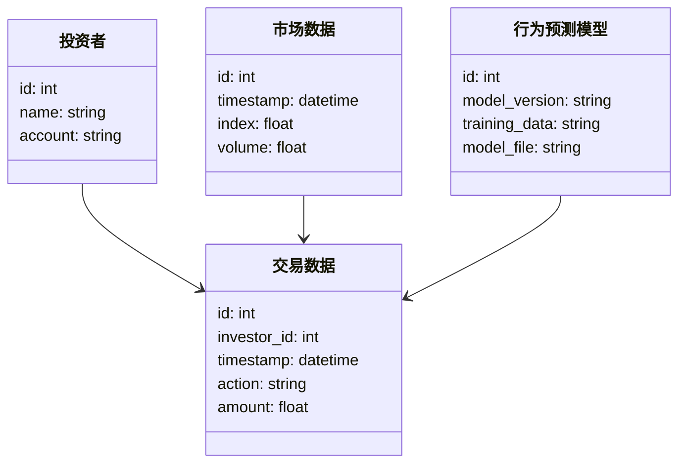
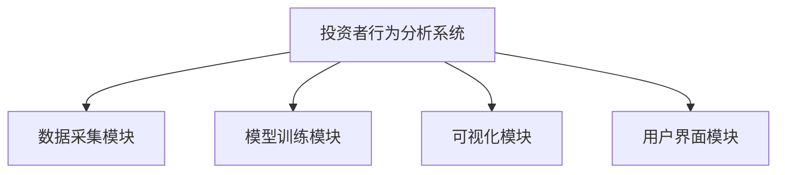
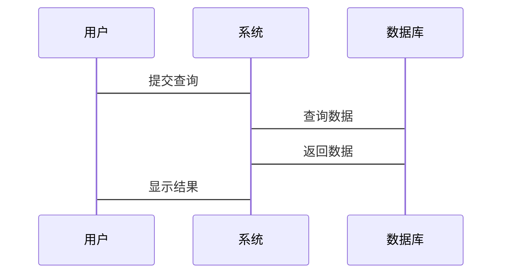

                 


# 第四部分: 投资者行为分析的系统分析与架构设计

## 第4章: 投资者行为分析系统的设计与实现

### 4.1 系统分析与设计目标

#### 4.1.1 项目背景与目标
- **项目背景**: 开发一个基于机器学习的投资者行为分析系统，旨在通过分析交易数据和市场环境，预测投资者行为并提供投资建议。
- **设计目标**: 实现一个高效、可扩展的系统，能够处理大规模数据，支持实时分析，并提供直观的可视化结果。

#### 4.1.2 系统功能需求
- 数据采集与处理
- 行为建模与预测
- 可视化展示
- 实时监控与预警

### 4.2 系统架构设计

#### 4.2.1 系统架构概述
系统采用分层架构，主要包括数据层、计算层、业务逻辑层和用户界面层。

#### 4.2.2 领域模型设计
使用Mermaid绘制领域模型类图，展示系统中各实体及其关系。



#### 4.2.3 系统架构图
使用Mermaid绘制系统架构图，展示各模块之间的关系。



#### 4.2.4 系统接口设计
定义系统的主要接口，包括数据接口、模型接口和用户接口。

#### 4.2.5 交互流程图
使用Mermaid绘制系统交互流程图，展示用户与系统之间的交互过程。



### 4.3 系统实现细节

#### 4.3.1 数据采集模块
- 数据来源：交易数据、市场数据、投资者信息。
- 数据格式：结构化数据，存储在数据库中。

#### 4.3.2 模型训练模块
- 使用机器学习算法（如随机森林）训练行为预测模型。
- 模型评估：通过交叉验证评估模型性能。

#### 4.3.3 可视化模块
- 使用图表展示投资者行为分析结果。
- 可视化工具：Matplotlib、Plotly。

#### 4.3.4 用户界面模块
- 提供用户友好的界面，方便用户查询和分析结果。

---

# 第五部分: 投资者行为分析的项目实战

## 第5章: 投资者行为分析项目的实施

### 5.1 项目环境与工具安装

#### 5.1.1 环境要求
- 操作系统：Linux/Windows/MacOS
- Python版本：3.8以上
- 依赖库：NumPy、Pandas、Scikit-learn、Matplotlib。

#### 5.1.2 安装步骤
1. 安装Python
2. 安装依赖库：
   ```bash
   pip install numpy pandas scikit-learn matplotlib
   ```

### 5.2 项目核心代码实现

#### 5.2.1 数据预处理代码
```python
import pandas as pd
from sklearn.model_selection import train_test_split

# 加载数据
data = pd.read_csv('investor_behavior.csv')

# 数据清洗
data.dropna(inplace=True)

# 划分训练集和测试集
X = data[['age', 'experience', 'market_sentiment']]
y = data['action']

X_train, X_test, y_train, y_test = train_test_split(X, y, test_size=0.2)
```

#### 5.2.2 模型训练代码
```python
from sklearn.ensemble import RandomForestClassifier
from sklearn.metrics import accuracy_score

# 初始化模型
model = RandomForestClassifier(n_estimators=100, random_state=42)

# 训练模型
model.fit(X_train, y_train)

# 预测测试集
y_pred = model.predict(X_test)

# 评估模型
print("Accuracy:", accuracy_score(y_test, y_pred))
```

#### 5.2.3 可视化代码
```python
import matplotlib.pyplot as plt

# 绘制特征重要性
feature_importance = model.feature_importances_
features = ['age', 'experience', 'market_sentiment']

plt.figure(figsize=(10, 6))
plt.bar(features, feature_importance)
plt.title('Feature Importance')
plt.xlabel('Feature')
plt.ylabel('Importance')
plt.show()
```

### 5.3 代码解读与分析

#### 5.3.1 数据预处理
- 加载数据：从CSV文件中加载投资者行为数据。
- 数据清洗：删除缺失值。
- 数据划分：将数据划分为训练集和测试集，用于模型训练和评估。

#### 5.3.2 模型训练
- 使用随机森林分类器训练行为预测模型。
- 调参：设置树的数量为100，随机种子为42。
- 预测与评估：在测试集上进行预测，并计算准确率。

#### 5.3.3 可视化分析
- 绘制特征重要性图表，展示哪些特征对投资者行为的影响更大。

### 5.4 实际案例分析

#### 5.4.1 案例背景
- 数据来源：某金融机构的交易数据。
- 分析目标：预测投资者在特定市场环境下的交易行为。

#### 5.4.2 数据分析与建模
- 数据清洗与特征选择：提取有用的特征，如年龄、投资经验、市场情绪等。
- 模型训练：使用随机森林分类器进行训练。
- 模型评估：计算准确率、精确率、召回率等指标。

#### 5.4.3 结果解读
- 模型准确率为85%，特征重要性显示市场情绪是最重要的影响因素。
- 可视化结果：显示不同市场环境下投资者行为的变化趋势。

### 5.5 项目总结

#### 5.5.1 项目成果
- 成功构建了一个投资者行为预测模型，准确率达到85%。
- 通过可视化分析，发现了市场情绪对投资者行为的关键影响。

#### 5.5.2 经验总结
- 数据质量对模型性能影响重大，需重视数据清洗与特征工程。
- 模型选择应结合业务需求和数据特点，随机森林在本例中表现良好。
- 可视化分析有助于更好地理解模型结果和业务洞察。

---

# 第六部分: 投资者行为分析的最佳实践与拓展

## 第6章: 投资者行为分析的最佳实践

### 6.1 小结

- 投资者行为分析是一个复杂但具有重要价值的领域。
- 通过数据驱动的方法，可以有效预测和指导投资者行为。

### 6.2 注意事项

- 数据隐私与合规性：确保数据处理符合相关法律法规。
- 模型局限性：投资者行为受多种因素影响，模型只能提供参考。
- 实时性挑战：需要处理高频交易数据，保证系统的实时性。

### 6.3 拓展阅读

- 《机器学习实战》：学习更多机器学习算法与实践。
- 《行为金融学》：深入了解投资者心理与行为模式。
- 《Python金融数据处理》：掌握金融数据处理的实用技能。

---

# 结语

通过本文的系统分析与实战，我们深入探讨了投资者行为分析的理论与实践。从模型构建到系统实现，从数据分析到可视化展示，我们展示了如何利用技术手段洞悉投资者行为，为投资决策提供科学依据。未来，随着技术的不断发展，投资者行为分析将更加精准和智能化，为金融领域带来更大的价值。

