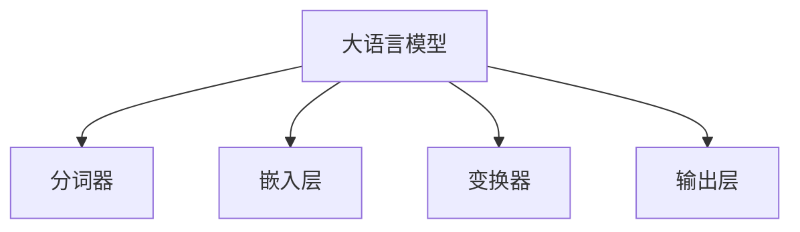
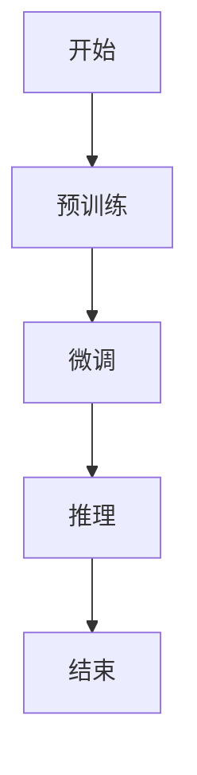
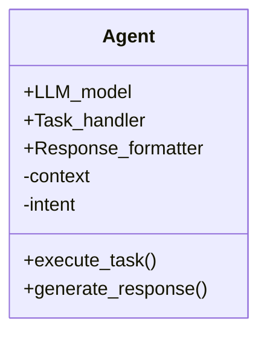
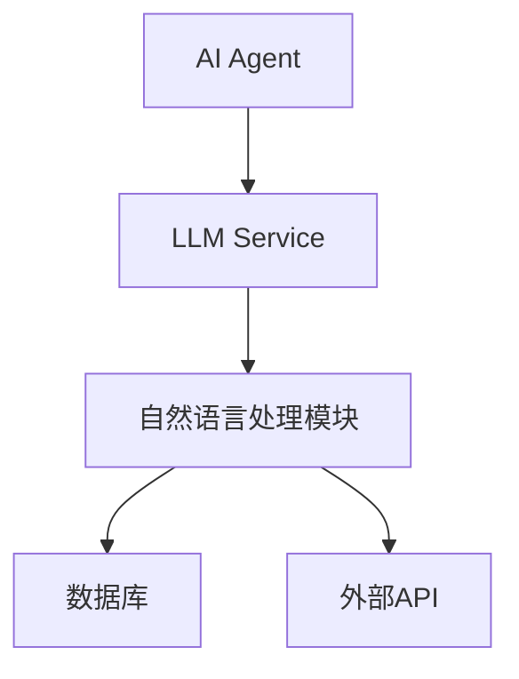

                 


# 深入理解LLM：AI Agent开发的基石

> 关键词：大语言模型、AI Agent、自然语言处理、机器学习、深度学习

> 摘要：本文深入探讨了大语言模型（LLM）在AI Agent开发中的核心作用，从背景介绍、核心概念、算法原理、系统架构到项目实战，全面解析LLM的技术细节及其在AI Agent中的应用。通过理论与实践相结合的方式，帮助读者掌握LLM的基本原理和实际应用，为AI Agent的开发奠定坚实基础。

---

## 第1章: 深入理解大语言模型（LLM）

### 1.1 LLM的基本概念

#### 1.1.1 什么是大语言模型（LLM）
大语言模型（Large Language Model，LLM）是一种基于深度学习的自然语言处理模型，旨在通过大量数据的预训练，学习语言的结构和语义，从而能够生成自然流畅的文本或理解复杂语言指令。

#### 1.1.2 LLM的发展历程
- **早期阶段**：基于规则的NLP方法，如词袋模型和词干提取。
- **深度学习崛起**：引入神经网络，如循环神经网络（RNN）和卷积神经网络（CNN）。
- **预训练模型的兴起**：如BERT、GPT系列模型的出现，推动了LLM的发展。
- **当前阶段**：模型规模越来越大，参数量从 billions 到 trillions，性能显著提升。

#### 1.1.3 LLM与传统NLP模型的区别
| 特性                | 传统NLP模型                          | LLM                          |
|---------------------|--------------------------------------|------------------------------|
| 数据需求            | 小规模标注数据                      | 大规模未标注数据              |
| 模型复杂度          | 较低                                 | 极高                          |
| 任务适应性          | 有限                                | 强大                          |
| 预训练+微调模式      | 少或无                               | 标准化流程                    |

#### 1.1.4 LLM在AI Agent中的作用
AI Agent需要理解用户意图、执行任务、进行对话等，LLM通过生成文本和理解上下文，为这些功能提供了强大的语言处理能力。

---

### 1.2 问题背景与描述

#### 1.2.1 当前AI Agent开发的挑战
- 多任务处理复杂性高。
- 对语言理解的准确性要求高。
- 需要快速响应和上下文记忆。

#### 1.2.2 LLM如何解决这些问题
- 通过预训练和微调，LLM能够处理多种语言任务。
- 强大的上下文理解和生成能力，帮助AI Agent进行流畅对话。
- 快速生成响应，提升用户体验。

#### 1.2.3 LLM的边界与外延
- 边界：专注于语言处理，不直接处理感知或行动。
- 外延：可与视觉、听觉等模态结合，扩展应用范围。

#### 1.2.4 核心概念结构与组成要素
- 输入：文本输入、上下文。
- 输出：生成文本、理解和分析结果。
- 核心模块：编码器、解码器、注意力机制。

---

## 第2章: LLM的核心概念与联系

### 2.1 LLM的原理与特点

#### 2.1.1 预训练与微调的原理
- **预训练**：在大规模通用数据上训练模型，学习语言的基本规律。
- **微调**：在特定任务或领域数据上进行微调，提升任务性能。

#### 2.1.2 LLM的特征对比
| 特性                | 传统模型                          | LLM                          |
|---------------------|----------------------------------|------------------------------|
| 参数量              | 数百万级别                        | 数十亿到万亿级别              |
| 上下文理解能力      | 弱                                 | 强                            |
| 零样本推理能力      | 无或弱                            | 强                            |

#### 2.1.3 LLM与其他AI模型的关系
- **区别**：参数规模更大，任务适应性更强。
- **联系**：构建在传统模型基础之上，结合深度学习技术。

### 2.2 核心概念的ER实体关系图



---

## 第3章: LLM的算法原理

### 3.1 算法流程



### 3.2 算法实现代码

```python
def pre_train(model, data_loader):
    optimizer = torch.optim.Adam(model.parameters(), lr=learning_rate)
    criterion = nn.CrossEntropyLoss()
    model.train()
    for epoch in range(num_epochs):
        for batch in data_loader:
            inputs, labels = batch
            outputs = model(inputs)
            loss = criterion(outputs, labels)
            optimizer.zero_grad()
            loss.backward()
            optimizer.step()
    return model

# 示例：交叉熵损失函数
$$\text{Cross-Entropy Loss} = -\sum_{i=1}^{n} y_i \log(p_i)$$
```

---

## 第4章: 系统分析与架构设计

### 4.1 问题场景介绍
AI Agent需要处理多任务，包括理解用户指令、执行任务、反馈结果。

### 4.2 系统功能设计


### 4.3 系统架构设计


### 4.4 系统接口设计
- 输入接口：文本输入、上下文。
- 输出接口：生成文本、状态反馈。

---

## 第5章: 项目实战

### 5.1 环境安装
安装必要的库：
```bash
pip install torch transformers
```

### 5.2 系统核心实现源代码
```python
from transformers import AutoModelForSeq2Seq, AutoTokenizer

model = AutoModelForSeq2Seq.from_pretrained('facebook/bart-large')
tokenizer = AutoTokenizer.from_pretrained('facebook/bart-large')

def generate_response(prompt):
    inputs = tokenizer.encode(prompt, return_tensors='pt', add_special_tokens=True)
    outputs = model.generate(inputs, max_length=100)
    response = tokenizer.decode(outputs[0], skip_special_tokens=True)
    return response
```

### 5.3 代码应用解读与分析
- 使用预训练的BART模型进行文本生成。
- 输入经过分词和编码，输出生成的响应。

### 5.4 实际案例分析
- 案例：用户输入“帮我预订明天的航班”，系统生成预订请求。

### 5.5 项目小结
通过项目实战，展示了如何将LLM应用于AI Agent开发，强调了模型选择和微调的重要性。

---

## 第6章: 最佳实践

### 6.1 小结
本文深入探讨了LLM在AI Agent开发中的基石作用，从理论到实践全面解析了技术细节。

### 6.2 注意事项
- 数据质量影响模型性能。
- 需要处理模型的计算资源需求。

### 6.3 拓展阅读
- 《Attention Is All You Need》。
- 《BERT: Pre-training of Deep Bidirectional Transformers for NLP》。

---

通过本文的系统分析和实践指导，读者可以全面理解LLM的核心原理和在AI Agent开发中的应用，为实际项目开发提供坚实的技术支持。

