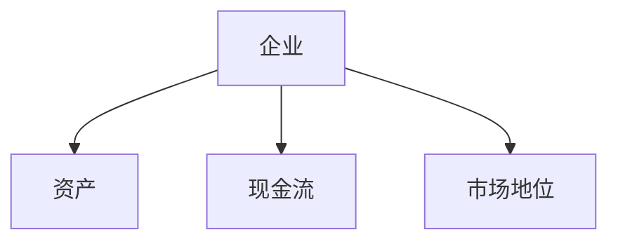
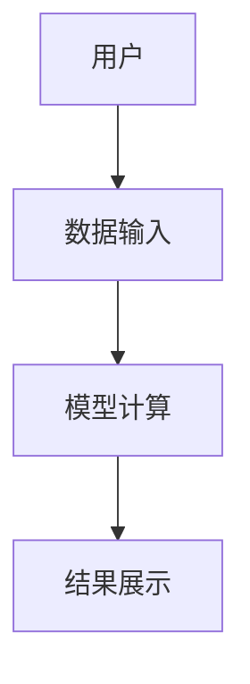

                 


# 深入解析企业估值的计算公式

> 关键词：企业估值，现金流贴现模型，DCF模型，企业价值，财务分析

> 摘要：企业估值是投资决策和企业战略中的关键环节，本文将详细解析企业估值的核心概念、算法原理、系统架构及实战案例，帮助读者掌握企业估值的计算方法。

---

## 第一部分：企业估值背景与基础

### 第1章：企业估值的基本概念与重要性

#### 1.1 什么是企业估值
企业估值是评估企业整体价值的过程，用于判断企业的真实价值，帮助投资者和企业管理者做出决策。

#### 1.2 企业估值的重要性
- 投资决策：评估企业投资回报。
- 并购与融资：确定企业交易价格。
- 价值管理：优化企业运营和战略。

---

## 第二部分：企业估值的核心概念与联系

### 第2章：核心概念解析

#### 2.1 企业价值的构成要素
- 资产价值：企业资产的公允价值。
- 赚现能力：企业经营产生的现金流。
- 市场地位：企业在市场中的竞争力。

#### 2.2 核心概念对比分析
**概念对比表格：**
| 概念       | 定义                                                                 |
|------------|----------------------------------------------------------------------|
| 资产价值    | 企业拥有的资产的公允价值                                                 |
| 赚现能力    | 企业通过经营产生的现金流能力                                           |
| 市场地位    | 企业在市场中的竞争地位和影响力                                         |

#### 2.3 实体关系图


---

## 第三部分：企业估值的算法原理

### 第3章：现金流贴现模型（DCF模型）

#### 3.1 DCF模型概述
DCF模型通过将未来现金流贴现到现值来评估企业价值。

#### 3.2 DCF模型流程图
```mermaid
g
flow
    st
    step 1: 预测未来现金流
    step 2: 计算贴现率
    step 3: 计算现金流的现值
    step 4: 加上残值或终值
    step 5: 总和即为企业估值
```

#### 3.3 DCF模型的Python实现
```python
import numpy as np

def discounted_cash_flow(cash_flows, discount_rate, terminal_value):
    present_value = 0
    for cf in cash_flows:
        present_value += cf / (1 + discount_rate)**i
    present_value += terminal_value / (1 + discount_rate)**len(cash_flows)
    return present_value

# 示例
cash_flows = [100, 200, 300]
discount_rate = 0.1
terminal_value = 500
value = discounted_cash_flow(cash_flows, discount_rate, terminal_value)
print(f"企业估值为: {value}")
```

#### 3.4 数学公式
- 现金流现值公式：
  $$ PV = \sum_{t=1}^{n} \frac{CF_t}{(1 + r)^t} $$
- 终值计算公式：
  $$ TV = \frac{CF_{n+1}}{(1 + r)^{n+1}} $$

---

## 第四部分：企业估值系统分析与架构设计

### 第4章：系统分析与架构设计方案

#### 4.1 问题场景介绍
构建一个企业估值系统，提供多种模型和工具，辅助用户进行估值。

#### 4.2 系统功能设计
- 数据输入模块：接收企业财务数据。
- 模型计算模块：应用DCF模型等进行估值。
- 结果展示模块：输出估值结果和分析报告。

#### 4.3 系统架构图


---

## 第五部分：企业估值项目实战

### 第5章：项目实战

#### 5.1 环境配置
安装Python和必要的库，如numpy和pandas。

#### 5.2 核心代码实现
```python
import pandas as pd

def calculate_terminal_value(last_cash_flow, growth_rate, discount_rate):
    return last_cash_flow * (1 + growth_rate) / (discount_rate - growth_rate)

# 示例数据
data = pd.DataFrame({'现金流': [100, 200, 300]})
growth_rate = 0.05
discount_rate = 0.1
terminal_value = calculate_terminal_value(300, growth_rate, discount_rate)
print(f"终值为: {terminal_value}")
```

#### 5.3 案例分析
以某制造企业为例，详细说明估值过程和结果解读。

---

## 第六部分：企业估值的最佳实践与小结

### 第6章：最佳实践和小结

#### 6.1 最佳实践
- 数据准确性：确保财务数据的准确性。
- 模型选择：根据企业特点选择合适的模型。
- 风险管理：考虑市场波动和经济环境的影响。

#### 6.2 小结
企业估值是投资和管理中的关键工具，掌握DCF模型和其他方法，结合实际案例和系统设计，能够有效提升估值的准确性。

---

通过以上步骤，您可以系统地理解和掌握企业估值的计算方法，并在实际中应用这些知识。

