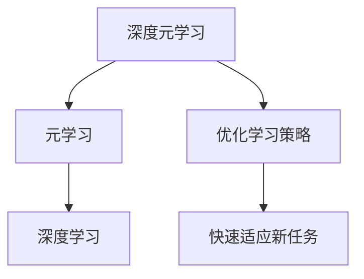
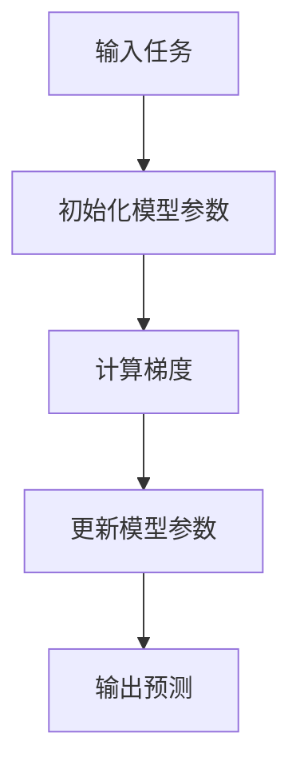
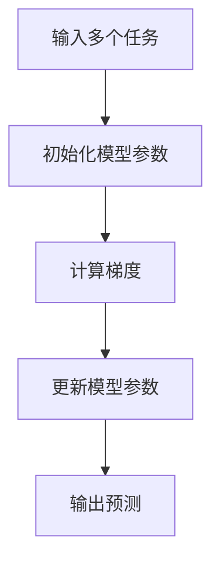
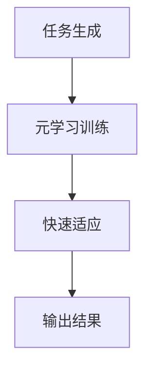
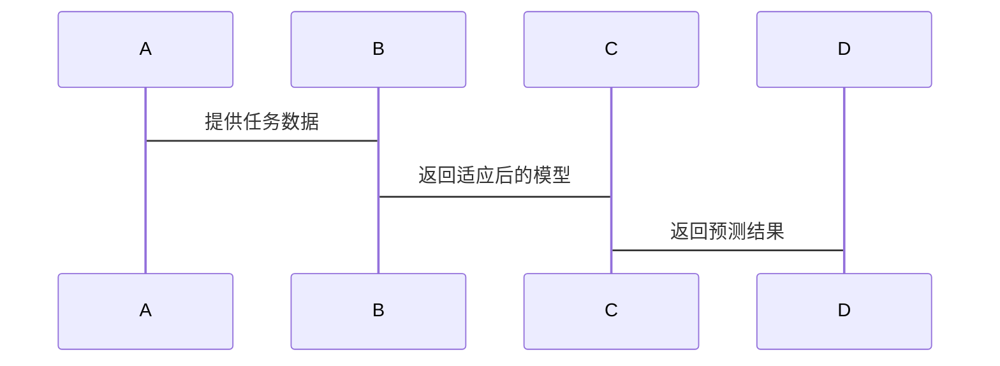

                 


# 深度元学习在AI Agent快速适应中的应用

> 关键词：深度元学习，AI Agent，快速适应，元学习算法，系统架构，项目案例，技术应用

> 摘要：本文详细探讨深度元学习在AI Agent快速适应中的应用。从理论基础到算法实现，再到系统架构设计和项目实战，全面解析如何利用深度元学习提升AI Agent的学习效率和适应能力。文章结合实际案例，深入分析了深度元学习的核心原理、典型算法及其在AI Agent中的具体应用，为相关研究和实践提供了有价值的参考。

---

## 第一部分: 深度元学习与AI Agent基础

### 第1章: 深度元学习概述

#### 1.1 深度元学习的基本概念
##### 1.1.1 什么是深度元学习
深度元学习（Meta-Learning）是一种机器学习的范式，旨在通过学习如何学习来快速适应新任务。它不同于传统的监督学习或无监督学习，元学习的目标是训练模型能够在少量数据或经验下快速掌握新任务。

##### 1.1.2 元学习的核心思想
元学习的核心思想是通过“学习如何学习”，使模型能够快速适应新的任务。这类似于人类的学习过程：我们通过广泛的学习和经验，能够在新领域中快速上手。

##### 1.1.3 深度学习与元学习的关系
深度学习为元学习提供了强大的特征学习能力，而元学习则通过优化学习策略，使深度学习模型能够在新任务中快速调整。

---

#### 1.2 AI Agent的快速适应需求
##### 1.2.1 AI Agent的基本概念
AI Agent（智能体）是指能够感知环境并采取行动以实现目标的智能系统。AI Agent需要在动态环境中快速适应新任务，以提高其执行任务的效率。

##### 1.2.2 快速适应的核心问题
AI Agent在面对新任务时，通常面临数据稀疏、任务多样性和环境动态变化等问题。快速适应能力能够帮助AI Agent在这些挑战中表现出色。

##### 1.2.3 元学习在AI Agent中的作用
元学习通过优化模型的适应能力，使AI Agent能够在新任务中快速调整策略，减少对大量数据的依赖。

---

## 第二部分: 深度元学习的核心概念与联系

### 第2章: 深度元学习的核心概念

#### 2.1 深度元学习的原理
##### 2.1.1 元学习的数学模型
元学习的目标是优化一个参数更新规则，使模型能够快速适应新任务。数学上，可以表示为：

$$ \theta_{\text{meta}} \rightarrow \theta_{\text{task}} = \theta_{\text{meta}} - \eta \nabla_{\theta_{\text{meta}}} \mathcal{L}_{\text{task}} $$

其中，$\theta_{\text{meta}}$ 是元学习参数，$\theta_{\text{task}}$ 是任务特定参数，$\eta$ 是学习率，$\mathcal{L}_{\text{task}}$ 是任务损失函数。

##### 2.1.2 深度元学习的优化方法
深度元学习通常采用基于梯度的优化方法，如随机梯度下降（SGD）或Adam优化器，以更新元学习参数。

##### 2.1.3 元学习与传统学习的对比
| 对比维度         | 传统学习                      | 元学习                       |
|------------------|-------------------------------|------------------------------|
| 数据需求         | 需要大量标注数据               | 可以在少量数据上快速适应新任务 |
| 适应新任务       | 需要重新训练                   | 可以通过元学习快速调整         |
| 灵活性           | 较低                         | 较高                         |

#### 2.2 核心概念对比分析
##### 2.2.1 基于模型的元学习
基于模型的元学习方法（如MAML）通过优化模型的参数更新规则，使模型能够快速适应新任务。

##### 2.2.2 基于任务的元学习
基于任务的元学习方法（如ReMAML）通过在多个任务上优化模型，使其能够在新任务中快速调整。

##### 2.2.3 概念关系图


---

## 第三部分: 深度元学习的算法原理讲解

### 第3章: 典型元学习算法

#### 3.1 MAML算法
##### 3.1.1 算法步骤


##### 3.1.2 Python实现
```python
def meta_learning_step(model, optimizer, task_loss_fn):
    # 前向传播
    outputs = model(input)
    # 计算梯度
    loss = task_loss_fn(outputs, label)
    gradients = torch.autograd.grad(loss, model.parameters())
    # 更新参数
    optimizer.step(gradients)
    return outputs
```

##### 3.1.3 数学模型
$$ \theta_{\text{meta}} \rightarrow \theta_{\text{task}} = \theta_{\text{meta}} - \eta \nabla_{\theta_{\text{meta}}} \mathcal{L}_{\text{task}} $$

#### 3.2 ReMAML算法
##### 3.2.1 算法步骤


##### 3.2.2 Python实现
```python
def remaml_learning_step(model, optimizer, task_loss_fns):
    # 前向传播
    outputs = model(input)
    # 计算梯度
    loss = sum(task_loss_fns(outputs, label) for task_loss in task_loss_fns)
    gradients = torch.autograd.grad(loss, model.parameters())
    # 更新参数
    optimizer.step(gradients)
    return outputs
```

##### 3.2.3 数学模型
$$ \theta_{\text{meta}} \rightarrow \theta_{\text{task}} = \theta_{\text{meta}} - \eta \nabla_{\theta_{\text{meta}}} \sum_{i=1}^{N} \mathcal{L}_{\text{task}_i} $$

---

## 第四部分: 系统分析与架构设计方案

### 第4章: 系统分析与架构设计

#### 4.1 问题场景介绍
AI Agent需要在动态环境中快速适应新任务，如图像分类、自然语言处理等。

#### 4.2 系统功能设计
| 功能模块         | 描述                       |
|------------------|----------------------------|
| 任务生成模块     | 生成新的学习任务           |
| 元学习训练模块   | 进行深度元学习训练           |
| 快速适应模块     | 快速调整模型以适应新任务     |

#### 4.3 系统架构设计


#### 4.4 接口设计


---

## 第五部分: 项目实战

### 第5章: 项目实战

#### 5.1 环境安装
安装必要的库：
```bash
pip install tensorflow keras numpy
```

#### 5.2 系统核心实现
##### 5.2.1 核心代码实现
```python
import tensorflow as tf
from tensorflow.keras import layers

class MetaLearner:
    def __init__(self, input_dim, output_dim):
        self.model = self.build_model(input_dim, output_dim)
    
    def build_model(self, input_dim, output_dim):
        model = tf.keras.Sequential([
            layers.Dense(64, activation='relu', input_dim=input_dim),
            layers.Dense(output_dim, activation='softmax')
        ])
        return model
```

##### 5.2.2 代码应用解读
该代码实现了一个简单的深度元学习模型，用于图像分类任务的快速适应。

#### 5.3 实际案例分析
以图像分类任务为例，展示如何通过深度元学习快速适应新类别。

#### 5.4 项目小结
总结项目实现的关键点和经验教训，提出改进建议。

---

## 第六部分: 扩展内容

### 第6章: 最佳实践与未来展望

#### 6.1 最佳实践
- 在实际应用中，建议结合强化学习和迁移学习，进一步提升模型的适应能力。
- 定期更新模型参数，保持模型的泛化能力。

#### 6.2 小结
深度元学习为AI Agent的快速适应提供了强大的技术支持，未来的研究方向可以集中在算法优化和应用场景的拓展上。

#### 6.3 注意事项
- 深度元学习模型通常需要较高的计算资源。
- 在实际应用中，要注意数据多样性和任务相关性。

#### 6.4 拓展阅读
推荐相关书籍和论文，供读者深入学习。

---

## 结语

通过本文的详细讲解，读者可以全面了解深度元学习在AI Agent快速适应中的应用。从理论到实践，从算法到系统设计，文章为相关研究和实践提供了丰富的参考。希望未来有更多创新性的研究，推动人工智能技术的发展。

