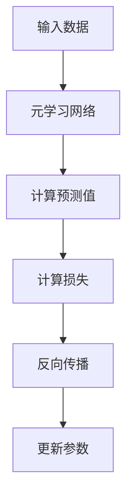
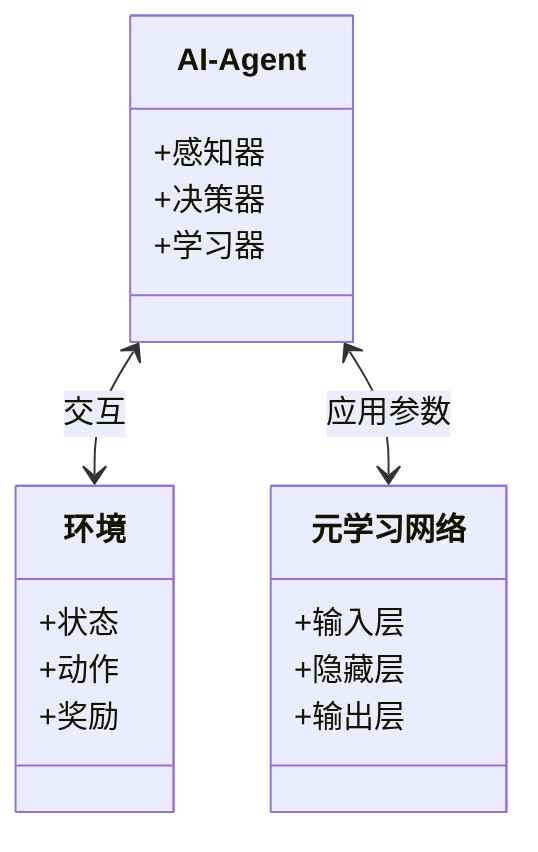
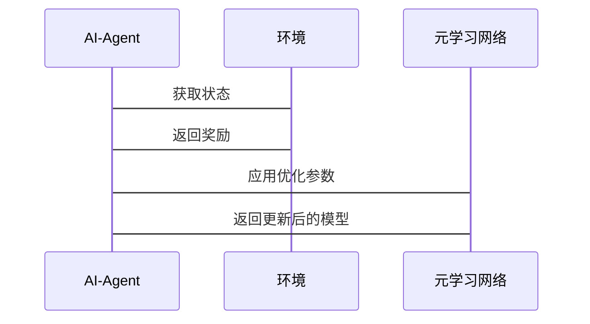

                 


# 深度元学习在AI Agent终身学习中的应用

> 关键词：深度元学习，AI Agent，终身学习，元学习算法，深度学习

> 摘要：深度元学习是一种新兴的机器学习方法，它结合了深度学习和元学习的优势，能够使AI Agent在复杂环境中实现终身学习。本文详细探讨了深度元学习的基本原理、其在AI Agent中的应用以及如何通过深度元学习实现终身学习。通过分析具体的算法和系统设计，本文展示了深度元学习在提升AI Agent学习能力方面的巨大潜力。

---

## 第一部分: 深度元学习与AI Agent的背景介绍

### 第1章: 深度学习与元学习概述

#### 1.1 深度学习的基本概念
深度学习是一种基于人工神经网络的机器学习方法，通过多层非线性变换从数据中学习高层次特征。深度学习的核心算法包括卷积神经网络（CNN）、循环神经网络（RNN）和变换器（Transformer）等。

#### 1.2 元学习的基本概念
元学习（Meta-Learning）是指学习如何学习，即通过在多个任务上训练模型，使其能够快速适应新任务。元学习的核心思想是通过优化模型的参数，使得模型在新任务上的表现得到提升。

#### 1.3 AI Agent的基本概念
AI Agent（智能体）是指能够感知环境并采取行动以实现目标的智能系统。AI Agent可以分为基于规则的Agent和基于学习的Agent，后者通过与环境的交互来学习策略。

---

### 第2章: 终身学习的理论基础

#### 2.1 终身学习的基本概念
终身学习（Lifelong Learning）是指AI Agent在面对不断变化的环境时，能够持续学习新知识、适应新任务，并不断优化自身性能的过程。

#### 2.2 元学习在终身学习中的作用
元学习能够帮助AI Agent快速适应新任务，减少对新任务数据的依赖，从而在终身学习中发挥重要作用。

#### 2.3 深度元学习的核心思想
深度元学习结合了深度学习的特征提取能力和元学习的快速适应能力，使得AI Agent能够在复杂环境中实现高效的学习和推理。

---

## 第二部分: 核心概念与联系

### 第3章: 核心概念的原理与联系

#### 3.1 元学习与终身学习的原理
元学习通过优化模型的参数，使得模型在新任务上的表现得到提升，而终身学习则通过持续学习和适应，使得模型能够在复杂环境中不断优化。

#### 3.2 核心概念的对比分析
| 比较维度 | 元学习 | 终身学习 |
|----------|--------|----------|
| 定义     | 学习如何学习 | 持续学习新知识 |
| 目标     | 快速适应新任务 | 在复杂环境中不断优化 |
| 优势     | 减少新任务数据依赖 | 提高适应性和灵活性 |

#### 3.3 ER实体关系图
```mermaid
erDiagram
    AI-Agent {
        组件: 处理器、记忆模块、行动模块
        功能: 感知环境、决策、学习
    }
    环境 {
        输入: 感知数据
        输出: 状态反馈
    }
    元学习算法 {
        输入: 训练数据
        输出: 优化参数
    }
    终身学习过程 {
        输入: 新任务
        输出: 更新后的模型
    }
    AI-Agent <--> 元学习算法: 应用优化参数
    元学习算法 <--> 终身学习过程: 支持快速适应
```

---

## 第三部分: 算法原理讲解

### 第4章: 深度元学习算法原理

#### 4.1 元学习算法的数学模型
元学习的目标是最小化新任务上的损失，通过优化元学习的参数 $\theta$ 来实现。

$$ \mathcal{L}(\theta) = \sum_{i=1}^{N} \mathcal{L}_i(\theta) $$

其中，$\mathcal{L}_i$ 是第 $i$ 个任务的损失函数。

#### 4.2 深度元学习算法的实现
以下是基于MAML（Meta-Automated Neural Networks）的深度元学习算法的Python实现示例：

```python
import torch

class MetaLearner(torch.nn.Module):
    def __init__(self):
        super().__init__()
        self.meta_network = torch.nn.Sequential(
            torch.nn.Linear(10, 20),
            torch.nn.ReLU(),
            torch.nn.Linear(20, 5)
        )
    
    def forward(self, x, context):
        # 元学习的优化过程
        return self.meta_network(x)

# 示例用法
maml = MetaLearner()
optimizer = torch.optim.Adam(maml.parameters(), lr=0.001)
loss_fn = torch.nn.MSELoss()

for task in tasks:
    x, y = task.dataset.get_data()
    y_pred = maml(x, context)
    loss = loss_fn(y_pred, y)
    optimizer.zero_grad()
    loss.backward()
    optimizer.step()
```

#### 4.3 算法流程图


---

## 第四部分: 系统分析与架构设计

### 第5章: 系统设计与实现

#### 5.1 系统功能设计
AI Agent在终身学习中的系统功能包括：
1. 感知环境并获取数据
2. 应用元学习算法进行快速适应
3. 实现持续学习和优化

#### 5.2 系统架构设计


#### 5.3 接口设计与交互流程


---

## 第五部分: 项目实战

### 第6章: 项目实现与案例分析

#### 6.1 环境安装
要运行以下代码，首先需要安装PyTorch和相关的深度学习库。

```bash
pip install torch
```

#### 6.2 核心代码实现
以下是基于深度元学习的AI Agent实现：

```python
import torch

class DeepMetaLearner:
    def __init__(self, input_dim, output_dim):
        self.network = torch.nn.Sequential(
            torch.nn.Linear(input_dim, 64),
            torch.nn.ReLU(),
            torch.nn.Linear(64, output_dim)
        )
        self.optimizer = torch.optim.Adam(self.network.parameters(), lr=0.001)

    def forward(self, x):
        return self.network(x)
    
    def backward(self, loss):
        self.optimizer.zero_grad()
        loss.backward()
        self.optimizer.step()

# 示例用法
learner = DeepMetaLearner(10, 5)
x = torch.randn(10)
y = torch.randn(5)
y_pred = learner.forward(x)
loss = torch.nn.MSELoss()(y_pred, y)
learner.backward(loss)
```

#### 6.3 案例分析
在图像分类任务中，深度元学习可以使AI Agent快速适应新的类别，减少对新数据的需求，从而提高分类的准确率。

---

## 第六部分: 总结与展望

### 第7章: 总结与最佳实践

#### 7.1 总结
深度元学习结合了深度学习和元学习的优势，能够在复杂环境中实现高效的学习和推理。通过本文的分析，我们可以看到深度元学习在AI Agent终身学习中的巨大潜力。

#### 7.2 最佳实践
1. 在选择深度元学习算法时，需根据具体任务需求进行选择。
2. 数据质量对模型性能有重要影响，需确保数据的多样性和代表性。
3. 持续优化模型参数，以提高模型的适应性和泛化能力。

#### 7.3 展望
未来，深度元学习将在更多领域得到应用，如自动驾驶、智能客服等。同时，如何进一步优化元学习算法，提高其效率和性能，也将是研究的重要方向。

---

通过以上分析和实践，我们深入探讨了深度元学习在AI Agent终身学习中的应用，并展示了其在实际场景中的巨大潜力。希望本文能够为相关领域的研究者和实践者提供有价值的参考。

