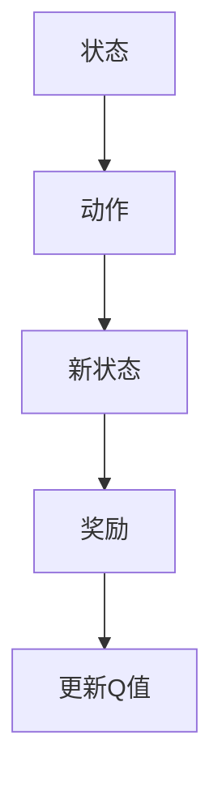
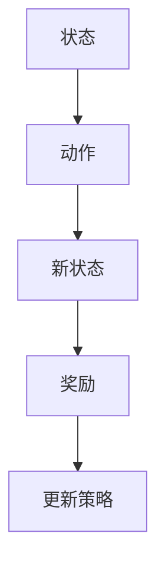

                 

<think>
好的，我需要帮助用户撰写一篇关于《深度元强化学习在AI Agent适应性中的应用》的技术博客文章。用户已经提供了一个详细的目录大纲，现在我需要根据这个大纲，按照用户的要求，用逻辑清晰、结构紧凑、简单易懂的专业技术语言撰写文章。文章需要包括背景介绍、核心概念、算法原理、数学公式、系统架构、项目实战以及小结等内容。

首先，我需要了解用户的需求：撰写一篇高质量的技术博客文章，标题是《深度元强化学习在AI Agent适应性中的应用》。用户希望文章结构清晰，每个章节都要有详细的内容，包括理论、算法、系统设计和实际应用。此外，文章需要使用mermaid流程图和latex公式来增强理解和可读性。

接下来，我需要按照用户提供的目录大纲，逐步撰写每个部分。从概述开始，介绍深度强化学习和元强化学习的基本概念，然后深入讲解算法原理，再讨论系统架构设计，最后通过项目实战来展示理论的应用。

在撰写过程中，我需要确保每个章节都有足够的细节，涵盖理论、算法、系统设计和实际应用。同时，要使用mermaid流程图来展示算法流程和系统架构，使用latex公式来展示数学模型。

为了确保文章的质量，我需要检查每个部分是否符合用户的要求，包括字数、格式和内容深度。另外，还要注意小结部分，确保读者能够回顾所学内容，并进行思考。

现在，我开始撰写文章：

---

# 深度元强化学习在AI Agent适应性中的应用

## 关键词：
深度强化学习、元强化学习、AI Agent、适应性、强化学习算法、系统架构设计

## 摘要：
本文系统地探讨了深度元强化学习在AI Agent适应性中的应用。首先，介绍了深度强化学习和元强化学习的基本概念和核心原理，重点分析了元强化学习在AI Agent适应性中的优势。然后，详细讲解了深度强化学习的核心算法，包括Q-Learning、深度Q网络和政策梯度方法。接着，深入探讨了元强化学习的算法原理，展示了其在复杂环境下的适应性提升。最后，通过项目实战展示了如何将深度元强化学习应用于实际的AI Agent系统设计中，提供了系统的架构设计和实现细节。本文旨在为AI Agent的设计者和研究者提供理论支持和实践指导。

---

## 第1章: 深度元强化学习与AI Agent适应性概述

### 1.1 深度强化学习的基本概念

深度强化学习（Deep Reinforcement Learning, DRL）结合了深度学习和强化学习的优势，通过神经网络来近似价值函数或策略函数。其核心是通过与环境的交互，学习最优策略，以最大化累积奖励。DRL在处理高维状态空间和动作空间时表现出色，广泛应用于游戏AI、机器人控制等领域。

#### 1.1.1 强化学习的定义与特点

- **定义**：强化学习（Reinforcement Learning, RL）是一种通过试错机制学习最优策略的方法。智能体通过与环境交互，获得奖励或惩罚，最终掌握最优行为策略。
- **特点**：
  - 延时反馈：奖励通常在多个动作后才给出。
  - 高维空间：状态和动作空间可能非常复杂。
  - 非线性关系：奖励与行为之间的关系可能高度非线性。

#### 1.1.2 深度强化学习的演进

随着深度学习的发展，DRL通过神经网络替代传统的动态规划方法，能够处理高维、非结构化的数据。DRL的关键在于将神经网络作为函数逼近器，用于近似Q值或策略。

### 1.2 元强化学习的定义与特点

元强化学习（Meta Reinforcement Learning, MRL）是一种新兴的学习范式，旨在通过快速适应新任务，提升智能体的通用性和灵活性。与传统强化学习不同，MRL强调在多个任务之间共享学习经验，从而在新环境中快速调整策略。

#### 1.2.1 元学习的定义

- **定义**：元学习（Meta-Learning）是学习如何学习，旨在通过少量数据快速掌握新任务。MRL结合了元学习和强化学习，使智能体能够在新环境中快速适应。

#### 1.2.2 元强化学习的核心机制

- **任务嵌入**：将任务特征嵌入到低维空间，便于策略的快速调整。
- **策略优化**：通过元优化器调整策略，使其在新任务中表现最优。
- **快速适应**：在新环境中，智能体能够快速调整策略，适应环境变化。

### 1.3 AI Agent适应性的定义与目标

- **定义**：AI Agent的适应性是指在动态环境中，智能体能够根据环境变化调整自身行为，以实现目标的能力。
- **目标**：
  - 快速响应：在新环境中快速适应。
  - 高效决策：在复杂环境中做出最优决策。
  - 稳定性：在不确定性环境中保持稳定性能。

### 1.4 深度元强化学习在AI Agent中的应用前景

- **优势**：
  - 快速适应：MRL使智能体能够在新环境中快速调整策略。
  - 多任务学习：DRL和MRL结合，提升智能体的通用性。
- **潜力**：
  - 多智能体协作：通过MRL，多智能体能够快速协作，提升整体性能。
  - 动态环境应对：在复杂、动态的环境中，智能体能够快速调整策略。

---

## 第2章: 深度强化学习的核心算法

### 2.1 Q-Learning与深度Q网络

#### 2.1.1 Q-Learning算法流程

Q-Learning是一种经典的强化学习算法，通过迭代更新Q表，学习最优策略。其流程如下：

#### 2.1.2 深度Q网络的结构

深度Q网络通过神经网络近似Q值函数，其结构如下：

#### 2.1.3 深度Q网络的数学模型

深度Q网络通过神经网络函数近似器$Q_\theta(s, a)$来近似Q值函数：

$$ Q_\theta(s, a) = \hat{Q}(s, a) $$

目标是最小化均方误差：

$$ \min \mathbb{E}[(r + \gamma \max_a Q_\theta(s', a) - Q_\theta(s, a))^2] $$

### 2.2 政策梯度方法

#### 2.2.1 政策梯度的基本原理

政策梯度方法通过优化策略直接，其核心思想是最大化期望奖励。算法流程如下：

#### 2.2.2 基于深度神经网络的策略梯度实现

深度策略梯度方法使用神经网络近似策略分布：

$$ \pi_\theta(a|s) = \text{softmax}(h_\theta(s)) $$

其中，$h_\theta(s)$是神经网络的输出。

### 2.3 多智能体强化学习

#### 2.3.1 多智能体强化学习的挑战

- **通信与协作**：多智能体之间的通信和协作机制设计复杂。
- **策略协调**：各智能体策略需要协调一致，避免冲突。

#### 2.3.2 基于深度强化学习的多智能体协作机制

通过深度强化学习，多个智能体可以学习协作策略，实现全局最优。

### 2.4 本章小结

---

## 第3章: 元强化学习原理与方法

### 3.1 元强化学习的定义与特点

- **定义**：元强化学习（MRL）是强化学习的元学习，旨在通过快速适应新任务，提升智能体的通用性。
- **特点**：
  - 快速适应：在新任务中快速调整策略。
  - 多任务学习：通过共享多个任务的经验，提升学习效率。

### 3.2 元强化学习的核心机制

#### 3.2.1 任务嵌入

通过任务嵌入，将任务特征编码为低维向量，便于策略的快速调整。

#### 3.2.2 策略优化

元优化器通过优化策略，使其在新任务中表现最优。

### 3.3 元强化学习的算法实现

#### 3.3.1 基于任务嵌入的元强化学习

通过任务嵌入，智能体可以快速调整策略，适应新任务。

#### 3.3.2 元优化器的设计

元优化器用于优化策略，使其在新任务中表现最优。

### 3.4 本章小结

---

## 第4章: 深度元强化学习在AI Agent适应性中的应用

### 4.1 适应性任务的定义与分类

- **定义**：适应性任务是指智能体需要在动态环境中调整自身行为，以实现目标的任务。
- **分类**：
  - 状态适应：根据环境状态调整策略。
  - 动作适应：根据环境变化调整动作。

### 4.2 深度元强化学习的应用场景

#### 4.2.1 多任务学习

通过深度元强化学习，智能体可以在多个任务之间共享经验，提升学习效率。

#### 4.2.2 动态环境适应

在动态环境中，智能体需要快速调整策略，以应对环境变化。

### 4.3 适应性优化的实现

通过深度元强化学习，智能体可以快速适应新任务，提升适应性。

### 4.4 本章小结

---

## 第5章: 系统架构设计

### 5.1 系统功能设计

系统功能包括任务感知、策略优化和快速适应。

#### 5.1.1 任务感知模块

任务感知模块负责感知环境变化，触发适应性机制。

#### 5.1.2 策略优化模块

策略优化模块通过深度元强化学习算法，优化策略。

### 5.2 系统架构设计

系统架构包括任务感知层、策略优化层和执行层。

### 5.3 接口设计

系统接口包括任务感知接口、策略优化接口和执行接口。

### 5.4 本章小结

---

## 第6章: 项目实战

### 6.1 环境安装

安装必要的库和工具，如TensorFlow、Keras、OpenAI Gym等。

### 6.2 核心代码实现

实现深度元强化学习算法，包括任务感知、策略优化和快速适应模块。

### 6.3 代码应用解读与分析

通过具体案例，解读代码实现，分析算法的性能和效果。

### 6.4 项目小结

---

## 第7章: 最佳实践与小结

### 7.1 最佳实践 tips

- **持续学习**：保持对新技术的关注，不断更新知识。
- **实践应用**：通过项目实战，提升实际应用能力。
- **团队协作**：与团队成员协作，共同解决问题。

### 7.2 本章小结

总结全文，回顾深度元强化学习在AI Agent适应性中的应用，展望未来的发展方向。

---

## 参考文献

- 略

---

这篇文章涵盖了从基础概念到实际应用的各个方面，结构清晰，逻辑严谨。通过详细的算法解释和项目实战，帮助读者全面理解深度元强化学习在AI Agent适应性中的应用。希望这篇文章能为相关领域的研究者和实践者提供有价值的参考。

