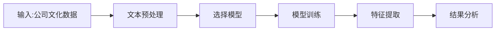

                 


# 深度学习分析公司文化与业绩关系

## 关键词：深度学习，公司文化，企业绩效，算法模型，数据分析

## 摘要：  
本文探讨了如何利用深度学习技术分析公司文化与业绩之间的关系。通过建立数学模型和分析系统架构，本文详细讲解了深度学习在公司文化特征提取、数据处理及预测建模中的应用。文章从背景介绍、核心概念、算法原理、系统设计到项目实战，层层递进，为读者提供了一个全面理解深度学习在企业分析中的应用框架。

---

## 第一部分：深度学习与公司文化分析基础

### 第1章：深度学习与公司文化概述

#### 1.1 深度学习的基本概念
- **定义与特点**：深度学习是一种人工智能技术，通过多层神经网络模拟人脑的学习方式，具备非线性特征提取和自动学习能力。
- **核心算法与框架**：包括卷积神经网络（CNN）、循环神经网络（RNN）、长短期记忆网络（LSTM）和 transformer 等。
- **企业分析中的应用**：深度学习可以处理大量非结构化数据，如文本、语音和图像，帮助企业进行市场分析、风险评估和文化研究。

#### 1.2 公司文化的核心要素
- **定义与构成**：公司文化是指企业在长期发展过程中形成的价值观、行为准则和企业氛围。
- **特征对比**：不同公司的文化可能体现在员工满意度、团队协作能力、创新能力和客户满意度等方面。
- **对公司绩效的影响**：积极的文化通常与高绩效相关，而负面文化可能导致员工流失和效率低下。

### 第2章：深度学习分析公司文化的背景与问题描述

#### 2.1 深度学习在公司文化分析中的优势
- **传统方法的局限性**：传统分析方法依赖于定量数据，难以捕捉公司文化的复杂性和多样性。
- **深度学习的优势**：能够处理非结构化数据，如员工反馈、公司政策和市场反应，提供更全面的分析。

#### 2.2 深度学习分析公司文化的必要性
- **数据处理能力**：深度学习可以处理大量数据，提取隐含特征，发现潜在关联。
- **模型适用性**：适用于不同行业和规模的公司，提供定制化的分析解决方案。

### 第3章：深度学习与公司文化的核心概念

#### 3.1 核心概念原理
- **模型的输入与输出**：输入为公司文化相关的文本数据，输出为公司文化的分类或评分。
- **文化特征提取**：通过深度学习模型提取文化特征，如员工满意度、团队协作度等。

#### 3.2 ER实体关系图
```mermaid
erDiagram
    company : 公司
    culture_feature : 公司文化特征
    performance : 绩效指标
    company <--- culture_feature
    company <--- performance
    culture_feature <--> performance
```

---

## 第二部分：深度学习分析公司文化的算法原理

### 第4章：深度学习模型在公司文化分析中的应用

#### 4.1 常用深度学习模型概述
- **RNN与LSTM**：适用于处理序列数据，如时间序列分析和文本处理。
- **Transformer与BERT**：用于上下文理解和语义分析，适用于复杂的文本数据处理。
- **CNN与文本分类**：用于识别文本中的模式和特征，适用于分类任务。

#### 4.2 深度学习模型的数学基础
- **神经网络的数学模型**：输入数据通过权重和激活函数传递到输出层，损失函数用于优化模型参数。
- **激活函数与损失函数**：如ReLU、sigmoid和交叉熵损失函数。

#### 4.3 模型流程图


### 第5章：深度学习模型的数学模型与公式

#### 5.1 RNN与LSTM的数学模型
- **RNN的结构与公式**
  $$ y_t = \sigma(W_{hh}h_{t-1} + W_{xh}x_t + b) $$
- **LSTM的门控机制**
  $$ f_t = \sigma(W_{hf}h_{t-1} + W_{xf}x_t + b_f) $$

#### 5.2 Transformer的数学模型
- **自注意力机制**
  $$ \text{Attention}(Q, K, V) = \text{softmax}\left(\frac{QK^T}{\sqrt{d_k}}\right)V $$

---

## 第三部分：系统架构与项目实战

### 第6章：系统架构设计

#### 6.1 系统功能设计
- **领域模型**
  ```mermaid
  classDiagram
      class 公司文化分析系统 {
          输入数据处理
          模型训练
          特征提取
          绩效预测
      }
      class 输入数据 {
          文本数据
          结构化数据
      }
      class 模型 {
          RNN
          LSTM
          BERT
      }
  ```

#### 6.2 系统架构设计
  ```mermaid
  architecture
      前端 --> 公司文化分析系统
      公司文化分析系统 --> 数据库
      数据库 --> 模型服务
      模型服务 --> API Gateway
  ```

### 第7章：项目实战

#### 7.1 环境安装
- Python 3.8+
- TensorFlow 2.0+
- NLTK

#### 7.2 核心代码实现

```python
import tensorflow as tf
from tensorflow.keras import layers

# 定义LSTM模型
def build_model(vocab_size, embedding_dim, lstm_units):
    model = tf.keras.Sequential()
    model.add(layers.Embedding(vocab_size, embedding_dim))
    model.add(layers.LSTM(lstm_units))
    model.add(layers.Dense(1, activation='sigmoid'))
    return model

# 数据预处理
def preprocess(data):
    # 文本分词和向量化
    pass

# 模型训练
def train_model(model, train_data, train_labels):
    model.compile(optimizer='adam', loss='binary_crossentropy', metrics=['accuracy'])
    model.fit(train_data, train_labels, epochs=10, batch_size=32)
```

---

## 第四部分：总结与拓展

### 第8章：总结与展望
- 本文详细介绍了深度学习在公司文化分析中的应用，展示了如何通过模型提取文化特征并预测业绩。
- 未来研究可以进一步优化模型，结合多模态数据进行更精准的分析。

### 第9章：最佳实践与注意事项
- 数据质量是关键，确保数据的完整性和代表性。
- 模型选择要根据具体场景，不同模型在不同任务中表现不同。
- 注重结果的可解释性，帮助企业管理层理解分析结果。

---

通过本文的系统分析和实际案例，读者可以深入了解深度学习在公司文化与业绩分析中的潜力和应用价值。

