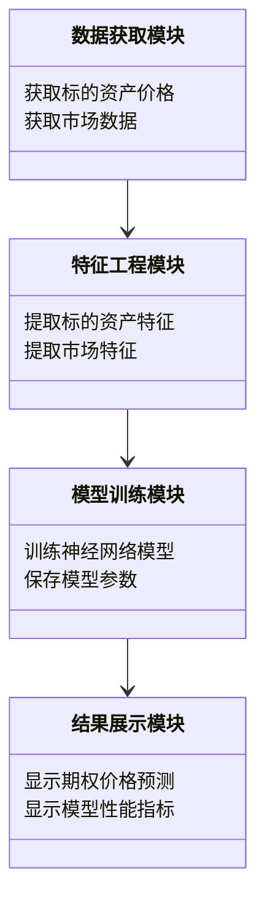
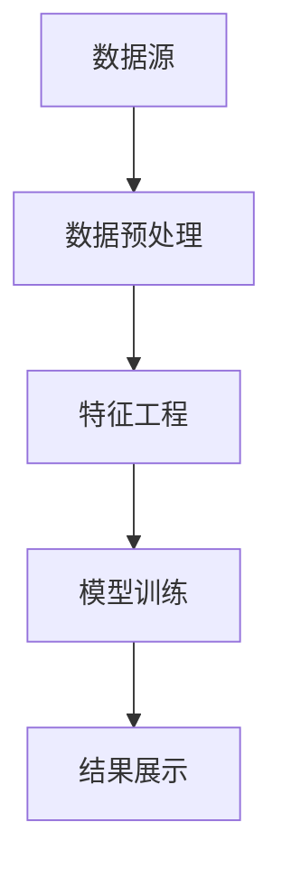
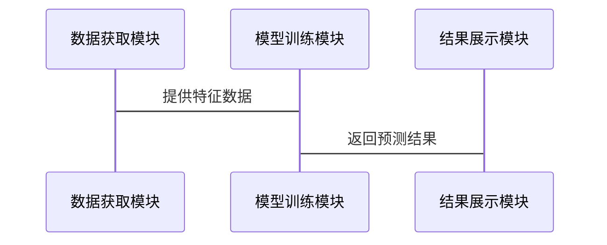

                 


# 深度学习在期权定价模型中的创新

## 关键词：深度学习，期权定价，神经网络，蒙特卡洛模拟，机器学习

## 摘要：  
本文探讨了深度学习在期权定价模型中的创新应用，分析了传统定价模型的局限性，并详细介绍了如何利用深度学习算法，如神经网络和蒙特卡洛模拟，来提升期权定价的准确性和效率。文章通过理论分析、算法实现和实际案例，展示了深度学习在金融领域的巨大潜力。

---

# 第1章: 期权定价与深度学习概述

## 1.1 期权定价的基本概念

### 1.1.1 期权的定义与分类
期权是一种金融衍生品，赋予持有者在特定时间内以预定价格买入或卖出标的资产的权利。期权可以分为看涨期权和看跌期权，以及基于执行价格的分类。

### 1.1.2 期权定价的基本原理
期权的价格由内在价值和时间价值组成。内在价值取决于标的资产的价格和执行价格，而时间价值则与期权的剩余期限和波动率有关。

### 1.1.3 传统期权定价模型的局限性
传统的Black-Scholes模型假设标的资产价格服从几何布朗运动，且波动率和无风险利率为常数。然而，这些假设在实际市场中往往不成立，导致模型定价的误差。

## 1.2 深度学习的基本概念

### 1.2.1 深度学习的定义与特点
深度学习是一种基于人工神经网络的机器学习方法，通过多层非线性变换从数据中学习特征，无需手动提取特征。

### 1.2.2 深度学习的核心算法
深度学习的核心算法包括神经网络、卷积神经网络（CNN）、循环神经网络（RNN）和长短期记忆网络（LSTM）等。

### 1.2.3 深度学习在金融领域的应用潜力
深度学习在金融领域的应用包括股票价格预测、信用评分、风险管理等。在期权定价中，深度学习可以捕捉复杂的价格模式和市场波动。

## 1.3 期权定价与深度学习的结合

### 1.3.1 期权定价问题的数学建模
期权定价问题可以通过建立数学模型来描述，如Black-Scholes方程。然而，该模型在实际中面临参数难以估计和市场非线性问题。

### 1.3.2 深度学习在期权定价中的优势
深度学习能够处理高维数据，捕捉非线性关系，且无需假设标的资产价格服从特定分布。

### 1.3.3 当前研究现状与挑战
目前，深度学习在期权定价中的研究主要集中在利用神经网络预测期权价格和波动率。然而，模型的解释性较差，且需要大量高质量的市场数据。

## 1.4 本章小结
本章介绍了期权定价的基本概念和深度学习的核心原理，分析了两者的结合潜力及当前的研究现状和挑战。

---

# 第2章: 期权定价模型的数学基础

## 2.1 Black-Scholes模型

### 2.1.1 Black-Scholes公式的推导
Black-Scholes公式用于计算欧式期权的价格，公式如下：
$$C = S_0 N(d_1) - K e^{-rT} N(d_2)$$
其中，$d_1 = \frac{\ln(S_0/K) + (r + \sigma^2/2)T}{\sigma \sqrt{T}}$，$d_2 = d_1 - \sigma \sqrt{T}$。

### 2.1.2 公式的假设条件与局限性
Black-Scholes模型假设标的资产价格服从几何布朗运动，且波动率和无风险利率为常数。这些假设在实际市场中难以满足。

### 2.1.3 公式的实际应用
尽管存在局限性，Black-Scholes模型仍然是期权定价的重要工具，广泛应用于金融衍生品定价。

## 2.2蒙特卡洛模拟在期权定价中的应用

### 2.2.1 蒙特卡洛方法的基本原理
蒙特卡洛模拟通过随机抽样和多次模拟，计算期权价格的期望值。其流程如下：
1. 生成标的资产价格的随机路径。
2. 计算每条路径对应的期权 payoff。
3. 计算 payoff 的期望值作为期权价格。

### 2.2.2 蒙特卡洛模拟在期权定价中的实现
使用Python实现蒙特卡洛模拟：
```python
import numpy as np
def black_scholes_monte_carlo(S, K, r, sigma, T, N=100000):
    np.random.seed(42)
    random_paths = np.exp(np.log(S) + np.random.normal(0, sigma*np.sqrt(T), N))
    payoff = np.maximum(random_paths - K, 0)
    price = np.mean(payoff) * np.exp(-r*T)
    return price
```

### 2.2.3 蒙特卡洛方法的优缺点
优点：能够处理高维问题，适合复杂金融工具的定价。  
缺点：计算时间较长，且依赖随机数的分布。

## 2.3 深度学习与传统期权定价模型的对比

### 2.3.1 传统模型与深度学习模型的差异
传统模型基于特定假设，而深度学习能够捕捉复杂的价格模式。  
公式对比：
$$C_{传统} = S_0 N(d_1) - K e^{-rT} N(d_2)$$  
$$C_{深度学习} = f(S, K, r, \sigma, T)$$

### 2.3.2 深度学习模型的优势与挑战
优势：能够处理非线性关系，无需假设标的资产价格分布。  
挑战：模型解释性差，需要大量数据。

### 2.3.3 深度学习在复杂期权定价中的应用前景
随着计算能力的提升，深度学习在复杂期权定价中的应用前景广阔。

## 2.4 本章小结
本章介绍了Black-Scholes模型和蒙特卡洛模拟的基本原理，并对比了深度学习模型的优势与挑战。

---

# 第3章: 深度学习在期权定价中的创新应用

## 3.1 随机森林在期权定价中的应用

### 3.1.1 随机森林的基本原理
随机森林是一种基于决策树的集成学习方法，通过随机采样和特征选择提高模型的泛化能力。

### 3.1.2 随机森林在期权定价中的实现
使用Python实现随机森林：
```python
from sklearn.ensemble import RandomForestRegressor
def random_forest定价(S, K, r, sigma, T):
    # 特征工程：提取相关特征
    features = [S, K, r, sigma, T]
    # 训练模型
    model = RandomForestRegressor(n_estimators=100)
    model.fit(features.reshape(-1, 5), [目标价格])
    return model.predict([features])
```

### 3.1.3 随机森林的优缺点
优点：计算速度快，易于实现。  
缺点：模型解释性较差。

## 3.2 神经网络在期权定价中的应用

### 3.2.1 神经网络的基本原理
神经网络通过多层非线性变换，能够捕捉数据中的复杂模式。

### 3.2.2 神经网络在期权定价中的实现
使用PyTorch实现神经网络：
```python
import torch
class OptionPriceModel(torch.nn.Module):
    def __init__(self):
        super(OptionPriceModel, self).__init__()
        self.fc1 = torch.nn.Linear(5, 10)
        self.fc2 = torch.nn.Linear(10, 5)
        self.fc3 = torch.nn.Linear(5, 1)
    
    def forward(self, x):
        x = torch.relu(self.fc1(x))
        x = torch.relu(self.fc2(x))
        x = self.fc3(x)
        return x
```

### 3.2.3 神经网络的优缺点
优点：能够捕捉复杂模式，适合高维数据。  
缺点：计算成本高，模型解释性较差。

## 3.3 其他深度学习算法的探讨

### 3.3.1 支持向量机在期权定价中的应用
支持向量机通过构建超平面，将数据点分为两类。应用于期权定价时，可以用于分类任务。

### 3.3.2 预测模型的比较与选择
比较随机森林、神经网络和支持向量机在期权定价中的表现，选择最适合任务的模型。

## 3.4 深度学习算法的数学推导

### 3.4.1 神经网络的数学模型
神经网络的前向传播公式：
$$a^{(l+1)} = \sigma(w^{(l)} a^{(l)} + b^{(l)})$$  
其中，$\sigma$ 为激活函数。

### 3.4.2 损失函数的优化
常用损失函数为均方误差：
$$L = \frac{1}{N}\sum_{i=1}^{N}(y_i - \hat{y}_i)^2$$  
优化方法通常使用梯度下降：
$$\theta = \theta - \eta \frac{\partial L}{\partial \theta}$$

### 3.4.3 梯度下降法的实现
使用Python实现梯度下降：
```python
def gradient_descent(X, y, θ, learning_rate, iterations):
    for _ in range(iterations):
        y_pred = np.dot(X, θ)
        loss = np.mean((y - y_pred)**2)
        dθ = (2/X.shape[0]) * np.dot(X.T, (y_pred - y))
        θ -= learning_rate * dθ
    return θ
```

## 3.5 本章小结
本章探讨了随机森林和神经网络在期权定价中的应用，并通过数学推导和代码实现，展示了深度学习的优势。

---

# 第4章: 深度学习期权定价系统的架构与实现

## 4.1 问题场景介绍
期权定价系统需要处理大量实时市场数据，支持多种期权类型的价格预测。

## 4.2 系统功能设计

### 4.2.1 系统模块划分
系统主要模块包括数据获取、特征工程、模型训练和结果展示。

### 4.2.2 系统功能流程
1. 数据获取：从数据源获取标的资产价格和市场数据。
2. 特征工程：提取相关特征，如标的资产价格、波动率等。
3. 模型训练：使用神经网络或随机森林训练模型。
4. 结果展示：输出期权价格预测结果。

### 4.2.3 领域模型（Mermaid 类图）


## 4.3 系统架构设计

### 4.3.1 系统架构（Mermaid 架构图）


### 4.3.2 系统接口设计
系统接口包括数据接口、模型接口和用户接口。

### 4.3.3 系统交互（Mermaid 序列图）


## 4.4 本章小结
本章设计了一个基于深度学习的期权定价系统，展示了系统的架构和功能模块。

---

# 第5章: 项目实战——基于深度学习的期权定价系统

## 5.1 环境安装与配置

### 5.1.1 安装Python环境
使用Anaconda安装Python 3.8及以上版本。

### 5.1.2 安装深度学习库
安装TensorFlow、Keras和PyTorch等深度学习库。

## 5.2 系统核心实现

### 5.2.1 数据获取与预处理
使用Yahoo Finance API获取标的资产价格数据：
```python
import yfinance as yf
data = yf.download(ticker, start=start_date, end=end_date)
```

### 5.2.2 特征工程
提取标的资产价格、波动率、成交量等特征。

### 5.2.3 模型训练
使用PyTorch训练神经网络模型：
```python
model = OptionPriceModel()
criterion = torch.nn.MSELoss()
optimizer = torch.optim.Adam(model.parameters(), lr=0.001)
```

### 5.2.4 模型评估
使用均方误差和R平方指标评估模型性能。

## 5.3 代码实现与解读

### 5.3.1 数据获取代码
```python
import yfinance as yf
def fetch_data(ticker, start, end):
    data = yf.download(ticker, start, end)
    return data
```

### 5.3.2 特征工程代码
```python
import numpy as np
def create_features(data, window_size=30):
    features = []
    for i in range(window_size, len(data)):
        feature = data.iloc[i-window_size:i].values
        features.append(feature)
    return np.array(features)
```

### 5.3.3 模型训练代码
```python
import torch
class OptionPriceModel(torch.nn.Module):
    def __init__(self):
        super(OptionPriceModel, self).__init__()
        self.fc1 = torch.nn.Linear(5, 10)
        self.fc2 = torch.nn.Linear(10, 5)
        self.fc3 = torch.nn.Linear(5, 1)
    
    def forward(self, x):
        x = torch.relu(self.fc1(x))
        x = torch.relu(self.fc2(x))
        x = self.fc3(x)
        return x
```

### 5.3.4 模型评估代码
```python
from sklearn.metrics import mean_squared_error, r2_score
def evaluate_model(y_true, y_pred):
    mse = mean_squared_error(y_true, y_pred)
    r2 = r2_score(y_true, y_pred)
    print(f"MSE: {mse}, R^2: {r2}")
```

## 5.4 实际案例分析

### 5.4.1 数据来源与处理
使用实际市场数据进行训练和测试。

### 5.4.2 模型训练与预测
训练神经网络模型，预测期权价格。

### 5.4.3 模型结果分析
分析模型的预测结果，比较传统模型与深度学习模型的定价误差。

## 5.5 本章小结
本章通过实际案例展示了深度学习在期权定价中的应用，验证了模型的有效性。

---

# 第6章: 总结与展望

## 6.1 本章总结
本文探讨了深度学习在期权定价中的创新应用，分析了传统模型的局限性，并通过理论分析、算法实现和实际案例，展示了深度学习的优势。

## 6.2 未来研究方向

### 6.2.1 深度学习模型的优化
探索更高效的神经网络架构，如Transformer和图神经网络。

### 6.2.2 多因子模型的结合
将深度学习与多因子模型结合，提高定价的准确性。

### 6.2.3 鲁棒性与解释性的提升
研究如何提高模型的鲁棒性和解释性，便于实际应用。

## 6.3 最佳实践 tips

### 6.3.1 数据预处理
确保数据质量，进行归一化或标准化处理。

### 6.3.2 模型选择
根据具体问题选择合适的深度学习模型。

### 6.3.3 模型调优
通过超参数调优和交叉验证提高模型性能。

### 6.3.4 风险管理
结合风险管理策略，降低模型的市场风险。

## 6.4 本章小结
本文总结了深度学习在期权定价中的应用，并展望了未来的研究方向和最佳实践。

---

# 参考文献
（此处列出相关的书籍、论文和技术文档）

---

# 致谢
感谢读者的耐心阅读，感谢合作伙伴和技术支持团队的贡献。

---

通过以上目录结构和内容规划，您可以逐步完成整篇技术博客文章的撰写。

