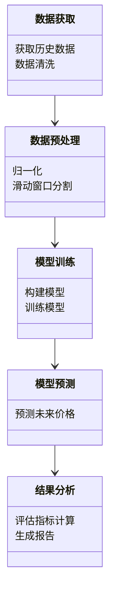
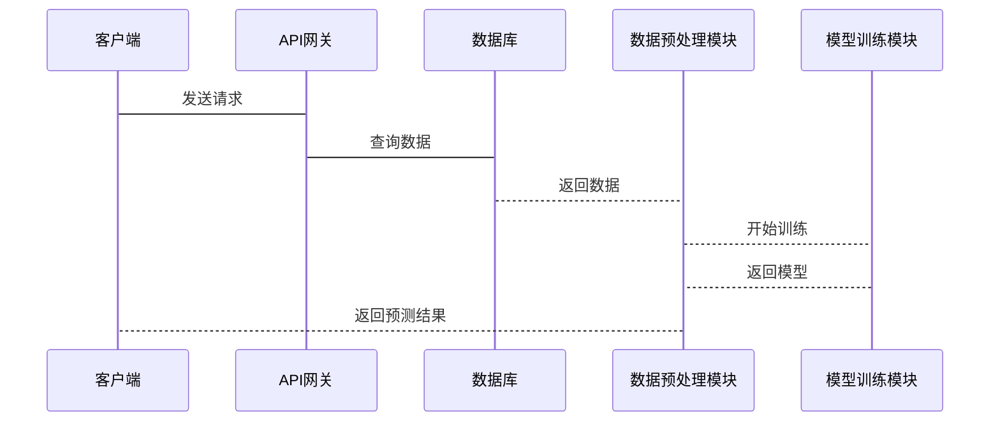

                 


# 深度学习在股市预测中的应用案例分析

## 关键词
深度学习, 股市预测, LSTM, CNN, 时间序列分析

## 摘要
本文详细探讨了深度学习在股市预测中的应用，从基本概念到算法原理，再到系统设计和项目实战，全面分析了深度学习如何帮助投资者预测股票价格。文章通过具体的案例分析，展示了LSTM和CNN等模型在股市预测中的优势，并提出了实际应用中的最佳实践建议。

## 第一部分: 深度学习在股市预测中的应用背景

## 第1章: 深度学习与股市预测概述

### 1.1 深度学习的基本概念

#### 1.1.1 深度学习的定义与特点
深度学习是一种基于人工神经网络的机器学习方法，通过多层非线性变换模拟人脑的处理过程。其特点包括：
- **层次化结构**：通过多层网络捕捉数据的高层次特征。
- **非线性能力**：能够处理复杂的非线性关系。
- **自动特征提取**：无需手动提取特征，自动从数据中学习有用的表示。

#### 1.1.2 深度学习的核心算法介绍
- **神经网络**：构建人工神经网络，模拟人脑处理信息的方式。
- **卷积神经网络（CNN）**：擅长处理图像和局部特征。
- **循环神经网络（RNN）**：适合处理序列数据，如时间序列。

#### 1.1.3 深度学习与传统机器学习的对比
| 对比维度 | 深度学习 | 传统机器学习 |
|----------|----------|---------------|
| 特征工程 | 自动提取 | 手动提取       |
| 模型复杂度 | 高       | 较低           |
| 数据量需求 | 大       | 较小           |

### 1.2 股市预测的基本概念

#### 1.2.1 股市预测的定义与目标
股市预测是指利用历史数据和市场信息，预测股票价格的未来走势。其目标是通过模型发现价格变化的规律，辅助投资者做出决策。

#### 1.2.2 股市数据的类型与特征
- **开盘价、收盘价、最高价、最低价**：反映当日价格波动。
- **成交量**：影响价格走势的重要指标。
- **时间序列**：数据按时间顺序排列，适合使用RNN进行分析。

#### 1.2.3 股市预测的挑战与难点
- **数据噪声**：市场波动大，数据可能存在噪声。
- **非线性关系**：价格变化受多种因素影响，呈现非线性。
- **过拟合风险**：模型可能过度拟合历史数据，影响未来预测。

### 1.3 深度学习在股市预测中的应用前景

#### 1.3.1 深度学习在股市预测中的优势
- **自动特征提取**：深度学习能够自动提取复杂特征，减少特征工程的工作量。
- **处理长序列数据**：RNN及其变种如LSTM适合处理长时间序列数据。
- **捕捉复杂模式**：深度学习能够发现传统方法难以捕捉的复杂模式。

#### 1.3.2 当前市场中的应用案例
- **量化交易**：利用深度学习模型进行高频交易决策。
- **风险评估**：通过模型评估投资组合的风险。
- **市场情绪分析**：结合自然语言处理技术，分析新闻和社交媒体对股价的影响。

#### 1.3.3 未来发展趋势与挑战
- **模型优化**：开发更高效的模型，减少计算资源消耗。
- **多模态数据融合**：结合文本、图像等多种数据源，提高预测准确性。
- **监管与伦理**：确保算法的透明性和公平性，避免市场操纵。

## 第2章: 深度学习与股市预测的核心概念

### 2.1 深度学习的核心概念与原理

#### 2.1.1 神经网络的基本结构
神经网络由输入层、隐藏层和输出层组成，通过权重和激活函数进行信息处理。

#### 2.1.2 深度学习中的常用模型
- **卷积神经网络（CNN）**：适用于图像识别，通过卷积核提取局部特征。
- **循环神经网络（RNN）**：适合处理序列数据，通过循环结构记忆上下文。
- **长短期记忆网络（LSTM）**：RNN的一种变种，通过门控机制解决梯度消失问题。

#### 2.1.3 深度学习的核心算法流程
1. 数据预处理：归一化、滑动窗口分割。
2. 模型训练：选择合适的优化算法（如Adam）进行参数调整。
3. 模型评估：使用均方误差（MSE）等指标评估预测效果。
4. 模型部署：将训练好的模型应用于实时数据预测。

### 2.2 股市预测中的关键问题

#### 2.2.1 数据特征的选择与处理
- **数据清洗**：处理缺失值和异常值。
- **特征工程**：构建技术指标（如移动平均线、相对强弱指数）。
- **数据归一化**：将数据缩放到0-1范围，便于模型训练。

#### 2.2.2 时间序列数据的特性
- **趋势性**：价格的长期趋势。
- **周期性**：季节性波动。
- **随机性**：不可预测的市场波动。

#### 2.2.3 预测模型的评估与优化
- **评估指标**：均方误差（MSE）、均方根误差（RMSE）、R²系数。
- **模型优化**：调整超参数，如学习率、批量大小。
- **交叉验证**：使用K折交叉验证评估模型泛化能力。

### 2.3 深度学习与股市预测的结合

#### 2.3.1 深度学习在时间序列预测中的应用
- **LSTM网络**：适合捕捉时间序列中的长期依赖关系。
- **多层感知机（MLP）**：用于处理输入特征，预测未来价格。

#### 2.3.2 深度学习在多因素分析中的优势
- **多变量建模**：同时考虑多个影响因素，如宏观经济指标、市场情绪。
- **非线性关系建模**：能够处理变量之间的非线性关系。

#### 2.3.3 深度学习在风险控制中的作用
- **波动预测**：预测价格波动幅度，帮助投资者进行风险评估。
- **异常检测**：识别市场中的异常波动，提前预警风险。

## 第3章: 深度学习算法原理

### 3.1 常用深度学习算法介绍

#### 3.1.1 循环神经网络（RNN）

##### RNN的基本结构
RNN通过循环结构处理序列数据，每个时间步的输出作为下一个时间步的输入。

##### RNN的门控机制
- **遗忘门**：决定当前状态保留多少。
- **输入门**：决定当前输入的信息。
- **输出门**：决定输出状态的信息。

##### RNN在时间序列预测中的应用
用于股票价格预测，捕捉时间序列中的模式。

#### 3.1.2 长短期记忆网络（LSTM）

##### LSTM的基本结构
LSTM通过门控机制处理长期依赖，避免梯度消失问题。

##### LSTM的门控机制
- **遗忘门**：决定保留哪些长期信息。
- **输入门**：决定更新哪些信息。
- **输出门**：决定输出什么信息。

##### LSTM网络的工作流程
1. 遗忘门计算保留的长期信息。
2. 输入门计算当前输入的信息。
3. 输出门决定输出的状态和隐藏层输出。

#### 3.1.3 卷积神经网络（CNN）

##### CNN的基本结构
包括卷积层、池化层和全连接层，适合处理局部特征。

##### CNN在时间序列中的应用
通过一维卷积处理时间序列数据，捕捉局部模式。

### 3.2 LSTM网络的原理与结构

#### LSTM网络的工作流程
1. 输入序列数据，初始化隐藏状态和细胞状态。
2. 在每个时间步，计算遗忘门、输入门和输出门。
3. 更新细胞状态和隐藏状态。
4. 输出预测结果。

#### LSTM的数学公式
- 遗忘门：$$f_t = \sigma(W_f \cdot [h_{t-1}, x_t] + b_f)$$
- 输入门：$$i_t = \sigma(W_i \cdot [h_{t-1}, x_t] + b_i)$$
- 细胞状态更新：$$c_t = f_t \cdot c_{t-1} + i_t \cdot tanh(W_c \cdot [h_{t-1}, x_t] + b_c)$$
- 输出门：$$o_t = \sigma(W_o \cdot [h_{t-1}, x_t] + b_o)$$
- 隐藏状态：$$h_t = o_t \cdot tanh(c_t)$$

### 3.3 CNN网络的原理与结构

#### CNN的基本结构
1. 卷积层：提取局部特征。
2. 池化层：降低维度，减少计算量。
3. 全连接层：分类或回归。

#### CNN在时间序列中的应用
通过一维卷积处理股票价格数据，提取时间依赖特征。

## 第4章: 深度学习在股市预测中的系统设计

### 4.1 问题场景介绍

#### 4.1.1 预测目标
预测股票的收盘价，判断买入或卖出信号。

#### 4.1.2 数据来源
使用历史价格数据和市场指标，如开盘价、收盘价、最高价、最低价、成交量。

### 4.2 系统功能设计

#### 4.2.1 系统功能模块
- 数据获取：从数据源获取股票价格数据。
- 数据预处理：清洗和归一化数据。
- 模型训练：训练深度学习模型。
- 模型预测：使用训练好的模型预测未来价格。
- 结果分析：评估预测结果，生成报告。

#### 4.2.2 领域模型


### 4.3 系统架构设计

#### 4.3.1 系统架构图


#### 4.3.2 系统接口设计
- API接口：提供数据获取和预测结果查询功能。
- 数据接口：与数据库交互，获取历史数据。

#### 4.3.3 系统交互流程


## 第5章: 项目实战

### 5.1 环境安装

#### 5.1.1 安装Python
安装最新版本的Python，如Python 3.8以上。

#### 5.1.2 安装深度学习库
使用pip安装TensorFlow、Keras、numpy、pandas等库。

### 5.2 系统核心实现源代码

#### 5.2.1 数据获取与预处理
```python
import pandas as pd
import numpy as np

# 数据获取
data = pd.read_csv('stock_prices.csv')
data = data[['开盘价', '收盘价', '最高价', '最低价', '成交量']]
data = data.values

# 数据归一化
from sklearn.preprocessing import MinMaxScaler
scaler = MinMaxScaler()
data_normalized = scaler.fit_transform(data)

# 滑动窗口分割
def create_dataset(data, window_size=60):
    X = []
    y = []
    for i in range(len(data) - window_size):
        X.append(data[i:i + window_size])
        y.append(data[i + window_size])
    return np.array(X), np.array(y)
```

#### 5.2.2 模型训练与预测
```python
from tensorflow.keras.models import Sequential
from tensorflow.keras.layers import LSTM, Dense, Dropout
from tensorflow.keras.optimizers import Adam

# 构建LSTM模型
model = Sequential()
model.add(LSTM(units=50, return_sequences=True, input_shape=(60,5)))
model.add(Dropout(0.2))
model.add(LSTM(units=50, return_sequences=False))
model.add(Dense(1))
model.compile(loss='mean_squared_error', optimizer=Adam(lr=0.001), metrics=['mae'])

# 训练模型
X_train, y_train = create_dataset(data_normalized)
model.fit(X_train, y_train, batch_size=64, epochs=50, validation_split=0.2)

# 预测结果
X_test, y_test = create_dataset(data_normalized, window_size=60)
y_pred = model.predict(X_test)
```

#### 5.2.3 模型评估
```python
from sklearn.metrics import mean_squared_error, mean_absolute_error

mse = mean_squared_error(y_test, y_pred)
mae = mean_absolute_error(y_test, y_pred)
print(f'MSE: {mse}, MAE: {mae}')
```

### 5.3 实际案例分析

#### 5.3.1 数据来源
使用某股票的历史价格数据，包含开盘价、收盘价等指标。

#### 5.3.2 数据预处理
归一化处理，滑动窗口分割为训练集和测试集。

#### 5.3.3 模型训练
使用LSTM网络进行训练，调整超参数如学习率和批量大小。

#### 5.3.4 模型预测与分析
生成预测结果，与实际数据对比，分析模型的准确性和稳定性。

### 5.4 项目小结

#### 5.4.1 项目总结
展示了如何使用深度学习模型进行股票价格预测，验证了LSTM模型的有效性。

#### 5.4.2 经验总结
- 数据预处理至关重要，归一化和滑动窗口分割影响模型性能。
- 超参数调整是关键，如学习率和批量大小的设置。
- 模型评估需要结合多个指标，如MSE和MAE，全面评估模型性能。

## 第6章: 最佳实践与小结

### 6.1 最佳实践

#### 6.1.1 数据预处理
- 选择合适的时间窗口大小。
- 清洗数据，处理缺失值和异常值。

#### 6.1.2 模型选择与优化
- 根据数据类型选择模型，如时间序列适合LSTM。
- 调整超参数，避免过拟合。

#### 6.1.3 模型评估
- 使用多种评估指标，如MSE、MAE和R²系数。
- 进行交叉验证，确保模型泛化能力。

### 6.2 小结

#### 6.2.1 深度学习的优势
- 自动特征提取。
- 处理复杂模式。
- 适用于多因素分析。

#### 6.2.2 应用中的挑战
- 数据噪声和市场波动。
- 模型过拟合风险。
- 监管与伦理问题。

### 6.3 注意事项

#### 6.3.1 数据依赖性
模型预测依赖于历史数据，市场变化可能影响准确性。

#### 6.3.2 风险提示
深度学习模型可能存在过拟合，导致预测结果不可靠。

#### 6.3.3 模型更新
定期更新模型，适应市场变化，保持预测能力。

### 6.4 拓展阅读

#### 6.4.1 深度学习前沿技术
- Transformer模型在时间序列中的应用。
- 图神经网络（GNN）用于社交网络分析。

#### 6.4.2 股市预测相关书籍
- 《机器学习实战》。
- 《时间序列分析》。

---

## 结语
本文详细探讨了深度学习在股市预测中的应用，从理论到实践，展示了如何利用LSTM和CNN等模型进行股票价格预测。通过实际案例分析，验证了深度学习在处理复杂金融市场数据中的优势，同时提出了实际应用中的最佳实践建议。未来，随着深度学习技术的不断发展，股市预测将更加精准和智能化，为投资者提供有力的决策支持。

