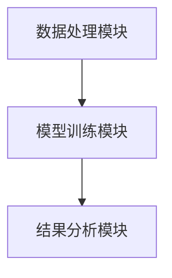
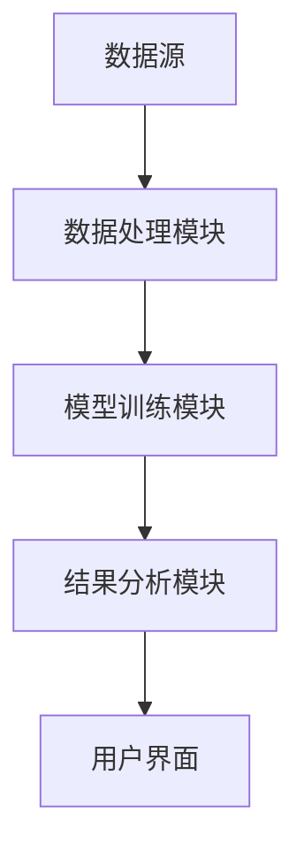
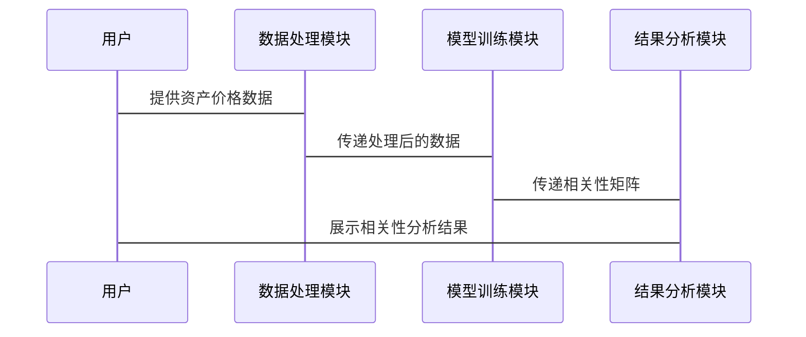

                 


# 深度学习在跨资产相关性分析中的应用

> 关键词：深度学习，资产相关性，金融分析，神经网络，跨资产分析

> 摘要：本文深入探讨了深度学习在跨资产相关性分析中的应用，从理论基础到实际应用进行了全面分析。通过介绍深度学习的基本概念、相关性分析的数学模型，以及具体算法的实现，展示了深度学习在金融领域的强大潜力。

---

# 第1章: 跨资产相关性分析概述

## 1.1 资产相关性的概念与重要性

### 1.1.1 资产相关性的定义
资产相关性是指不同资产价格之间的相互关系。通过分析资产相关性，可以了解不同资产在市场中的联动性，从而帮助投资者制定更有效的投资策略。

### 1.1.2 跨资产相关性分析的必要性
在金融市场中，资产相关性分析是风险管理、组合优化和投资决策的重要工具。通过分析不同资产之间的相关性，投资者可以更好地分散风险、优化资产配置。

### 1.1.3 跨资产相关性分析的应用场景
- 风险管理：通过分析资产相关性，可以评估投资组合的风险。
- 组合优化：通过优化资产配置，提高投资组合的收益。
- 投资决策：通过了解资产之间的关系，制定更科学的投资策略。

## 1.2 深度学习的基本概念

### 1.2.1 深度学习的定义
深度学习是一种机器学习技术，通过构建多层神经网络模型，从数据中自动提取特征并进行分类或回归预测。

### 1.2.2 深度学习的核心特点
- 多层非线性变换：深度学习通过多层网络结构，可以处理复杂的非线性关系。
- 自动特征提取：深度学习可以从数据中自动提取特征，无需人工干预。
- 高维度数据处理：深度学习适用于处理高维数据，如图像、文本和时间序列数据。

### 1.2.3 深度学习与传统机器学习的区别
| 特性 | 深度学习 | 传统机器学习 |
|------|----------|--------------|
| 数据需求 | 需要大量数据 | 数据需求较少 |
| 特征提取 | 自动提取 | 手动提取 |
| 模型复杂度 | 高复杂度 | 较低复杂度 |

## 1.3 深度学习在金融领域的应用

### 1.3.1 金融领域的数据特点
- 高维性：金融市场数据通常包含大量特征，如价格、成交量、技术指标等。
- 时间序列性：金融市场数据具有时间依赖性。
- 不确定性：金融市场数据受到多种因素影响，具有不确定性。

### 1.3.2 深度学习在金融中的优势
- 处理高维数据：深度学习可以处理复杂的高维数据，提取有用的特征。
- 捕捉非线性关系：深度学习可以捕捉数据中的非线性关系，提高预测准确性。
- 实时分析：深度学习可以实时处理金融市场数据，提供实时分析。

### 1.3.3 跨资产相关性分析中的深度学习应用
- 资产价格预测：通过分析资产相关性，预测资产价格的变化趋势。
- 风险管理：通过深度学习模型，评估投资组合的风险。
- 投资组合优化：通过分析资产相关性，优化资产配置。

## 1.4 本章小结
本章介绍了资产相关性的概念及其重要性，以及深度学习的基本概念和在金融领域的应用。深度学习作为一种强大的工具，可以有效分析资产相关性，为投资决策提供支持。

---

# 第2章: 跨资产相关性分析的数学基础

## 2.1 资产相关性的计算方法

### 2.1.1 协方差与相关系数的定义
协方差衡量两个资产价格变化的相似性，相关系数是对协方差的标准化，取值范围在-1到1之间。

$$
\text{协方差}(X, Y) = \frac{1}{n-1} \sum_{i=1}^{n} (X_i - \bar{X})(Y_i - \bar{Y})
$$

$$
\text{相关系数}(X, Y) = \frac{\text{协方差}(X, Y)}{\sigma_X \sigma_Y}
$$

### 2.1.2 资产相关性的计算公式
相关性矩阵是对称矩阵，对角线元素为1，非对角线元素为资产之间的相关系数。

### 2.1.3 资产相关性的意义
相关性矩阵可以帮助投资者了解不同资产之间的关系，从而优化资产配置。

## 2.2 深度学习中的数学基础

### 2.2.1 神经网络的数学模型
神经网络由输入层、隐藏层和输出层组成，通过激活函数和权重参数进行数据变换。

$$
a^{(l)} = \sigma(w^{(l)} a^{(l-1)} + b^{(l)})
$$

其中，$a^{(l)}$ 是第$l$层的激活值，$\sigma$是激活函数，$w^{(l)}$是权重矩阵，$b^{(l)}$是偏置项。

### 2.2.2 深度学习中的激活函数
常用的激活函数包括Sigmoid、ReLU、Tanh等，激活函数可以引入非线性，提高模型的表达能力。

### 2.2.3 深度学习中的损失函数
损失函数衡量模型预测值与真实值的差异，常用的损失函数有均方误差（MSE）和交叉熵损失。

$$
\text{MSE} = \frac{1}{n} \sum_{i=1}^{n} (y_i - \hat{y}_i)^2
$$

## 2.3 跨资产相关性分析的数学模型

### 2.3.1 资产相关性矩阵的构建
通过计算所有资产对的相关系数，构建相关性矩阵。

### 2.3.2 深度学习模型的输入输出关系
模型输入是资产的历史价格数据，输出是资产相关性矩阵。

### 2.3.3 深度学习模型的训练目标
模型通过最小化损失函数，学习资产相关性的特征表示。

## 2.4 本章小结
本章介绍了资产相关性的数学计算方法，以及深度学习中的数学基础。通过数学模型，可以更好地理解深度学习在资产相关性分析中的应用。

---

# 第3章: 深度学习模型在跨资产相关性分析中的应用

## 3.1 常见的深度学习模型

### 3.1.1 卷积神经网络（CNN）
CNN适用于处理图像和时间序列数据，可以提取局部特征。

### 3.1.2 循环神经网络（RNN）
RNN适用于处理序列数据，可以捕捉时间依赖性。

### 3.1.3 变量自编码器（VAE）
VAE是一种生成模型，可以学习数据的潜在表示。

### 3.1.4 图神经网络（GNN）
GNN适用于处理图结构数据，可以分析资产之间的关系。

## 3.2 深度学习模型的选择与优化

### 3.2.1 模型选择的依据
- 数据类型：图像、文本、时间序列等。
- 任务目标：分类、回归、生成等。
- 数据量：小样本数据选择简单模型，大数据选择复杂模型。

### 3.2.2 模型优化的策略
- 超参数调优：学习率、批量大小等。
- 正则化技术：L2正则化、Dropout等。
- 模型融合：集成学习、投票法等。

### 3.2.3 模型调参的方法
使用网格搜索或随机搜索进行超参数调优。

## 3.3 深度学习模型在跨资产相关性分析中的具体应用

### 3.3.1 基于CNN的资产相关性分析
CNN可以提取资产价格的局部特征，分析资产的相关性。

### 3.3.2 基于RNN的资产相关性分析
RNN可以捕捉资产价格的时间依赖性，分析资产的相关性。

### 3.3.3 基于GNN的资产相关性分析
GNN可以分析资产之间的关系，构建资产相关性网络。

## 3.4 本章小结
本章介绍了常见的深度学习模型，并讨论了它们在跨资产相关性分析中的应用。通过选择合适的模型，可以提高分析的准确性。

---

# 第4章: 跨资产相关性分析的算法原理

## 4.1 资产相关性分析的算法流程

### 4.1.1 数据预处理
- 数据清洗：处理缺失值、异常值。
- 数据标准化：归一化或标准化数据。
- 数据分割：训练集、验证集、测试集。

### 4.1.2 特征提取
- 从历史价格中提取技术指标。
- 使用深度学习模型提取特征。

### 4.1.3 模型训练
- 定义模型结构。
- 定义损失函数和优化器。
- 进行模型训练。

### 4.1.4 模型评估
- 使用验证集评估模型性能。
- 计算相关性矩阵的准确率。

## 4.2 深度学习算法的实现步骤

### 4.2.1 数据输入
- 将资产价格数据输入模型。
- 数据格式：二维数组或序列数据。

### 4.2.2 网络结构设计
- 设计模型的输入层、隐藏层和输出层。
- 使用适当的激活函数和正则化技术。

### 4.2.3 损失函数计算
- 使用MSE或交叉熵损失函数。
- 计算模型预测值与真实值的差异。

### 4.2.4 模型优化
- 使用梯度下降优化器（如Adam）。
- 调整学习率和批量大小。

## 4.3 深度学习模型的训练与优化

### 4.3.1 梯度下降算法
- 使用随机梯度下降或批量梯度下降。
- 优化模型参数，减少损失函数。

### 4.3.2 正则化技术
- 使用L2正则化防止过拟合。
- 使用Dropout随机屏蔽部分神经元。

### 4.3.3 模型调参
- 调整超参数，如学习率、批量大小、层数等。

## 4.4 本章小结
本章详细讲解了资产相关性分析的算法流程和深度学习模型的实现步骤。通过优化模型，可以提高资产相关性分析的准确性。

---

# 第5章: 系统分析与架构设计

## 5.1 系统功能设计

### 5.1.1 系统模块划分
- 数据处理模块：负责数据的清洗和预处理。
- 模型训练模块：负责模型的训练和优化。
- 结果分析模块：负责分析和展示相关性矩阵。

### 5.1.2 系统功能流程
1. 数据处理模块接收输入数据。
2. 模型训练模块进行模型训练。
3. 结果分析模块展示相关性矩阵。

### 5.1.3 系统功能模块图


## 5.2 系统架构设计

### 5.2.1 系统架构图


### 5.2.2 系统交互设计
- 用户输入数据源。
- 系统处理数据并训练模型。
- 系统展示相关性分析结果。

## 5.3 系统接口设计

### 5.3.1 数据接口
- 数据输入接口：接收资产价格数据。
- 数据输出接口：输出相关性矩阵。

### 5.3.2 模型接口
- 模型训练接口：训练深度学习模型。
- 模型预测接口：预测资产相关性。

## 5.4 系统交互流程

### 5.4.1 交互流程图


## 5.5 本章小结
本章介绍了系统的功能设计和架构设计，展示了系统的模块划分和交互流程。

---

# 第6章: 项目实战

## 6.1 环境安装

### 6.1.1 安装Python
安装Python 3.8及以上版本。

### 6.1.2 安装深度学习框架
安装TensorFlow或Keras框架。

### 6.1.3 安装数据处理库
安装Pandas、NumPy等数据处理库。

## 6.2 系统核心实现源代码

### 6.2.1 数据处理代码
```python
import pandas as pd
import numpy as np

# 读取数据
data = pd.read_csv('asset_prices.csv')

# 数据清洗
data = data.dropna()
data = data.values
```

### 6.2.2 模型训练代码
```python
import tensorflow as tf
from tensorflow.keras import layers

# 定义模型
model = tf.keras.Sequential([
    layers.Dense(64, activation='relu'),
    layers.Dense(128, activation='relu'),
    layers.Dense(1, activation='sigmoid')
])

# 编译模型
model.compile(optimizer='adam', loss='binary_crossentropy', metrics=['accuracy'])

# 训练模型
model.fit(X_train, y_train, epochs=10, batch_size=32)
```

### 6.2.3 模型评估代码
```python
# 评估模型
loss, accuracy = model.evaluate(X_test, y_test)
print(f'Loss: {loss}, Accuracy: {accuracy}')
```

## 6.3 代码应用解读与分析

### 6.3.1 数据处理模块
- 读取数据并进行清洗，确保数据的完整性。
- 数据标准化或归一化处理，确保模型输入一致。

### 6.3.2 模型训练模块
- 定义模型结构，选择合适的激活函数和优化器。
- 调整模型参数，如学习率和批量大小。

### 6.3.3 结果分析模块
- 展示相关性矩阵，分析资产之间的关系。
- 提供可视化界面，方便用户理解和使用。

## 6.4 实际案例分析

### 6.4.1 案例背景
分析某段时间内多个资产的价格数据，计算它们的相关性。

### 6.4.2 数据准备
从数据源获取资产价格数据，进行清洗和预处理。

### 6.4.3 模型训练
训练深度学习模型，计算资产相关性矩阵。

### 6.4.4 结果展示
通过可视化工具展示相关性矩阵，帮助用户理解资产之间的关系。

## 6.5 本章小结
本章通过实际案例，展示了深度学习在跨资产相关性分析中的具体应用。通过代码实现，可以更好地理解和应用相关性分析。

---

# 第7章: 总结与最佳实践

## 7.1 本章小结

### 7.1.1 核心内容回顾
- 资产相关性的定义和重要性。
- 深度学习的基本概念和优势。
- 深度学习模型在跨资产相关性分析中的应用。

### 7.1.2 关键点总结
- 深度学习可以有效分析资产相关性。
- 模型选择和优化是关键。
- 系统设计和实现是保障。

## 7.2 最佳实践 tips

### 7.2.1 模型选择
- 根据数据类型选择合适的模型。
- 尝试不同的模型，选择性能最好的。

### 7.2.2 数据处理
- 仔细清洗数据，确保数据质量。
- 进行数据标准化或归一化。

### 7.2.3 模型优化
- 调整超参数，如学习率和批量大小。
- 使用正则化技术防止过拟合。

## 7.3 注意事项

### 7.3.1 数据质量问题
- 数据清洗是关键，确保数据的完整性和准确性。
- 处理缺失值和异常值。

### 7.3.2 模型过拟合
- 使用正则化技术防止过拟合。
- 交叉验证评估模型性能。

## 7.4 拓展阅读

### 7.4.1 深度学习经典论文
- "Deep Learning"（Ian Goodfellow等）
- "A Neural Network based...

