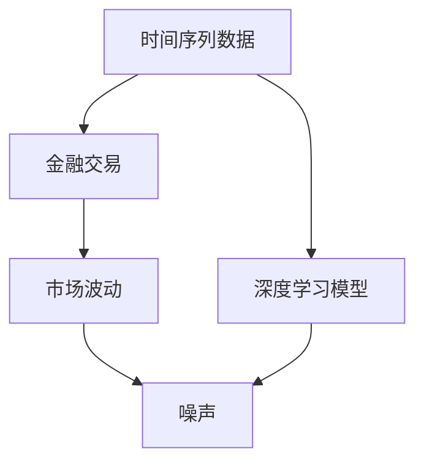
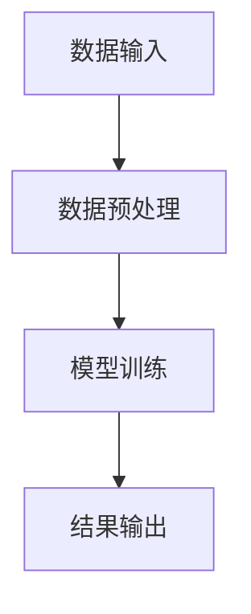

                 


```markdown
# 深度学习在金融时间序列去噪中的应用

## 关键词：深度学习，时间序列，去噪，金融数据，神经网络

## 摘要：  
本文探讨深度学习在金融时间序列数据去噪中的应用，分析噪声对金融分析的影响，介绍深度学习的优势，详细讲解自编码器、变分自编码器和生成对抗网络等核心算法，并通过系统设计和项目实战展示如何在金融场景中实现去噪。文章旨在为金融从业者和技术人员提供理论和实践指导，帮助他们利用深度学习技术提升金融数据分析的准确性。

---

# 第1章: 金融时间序列去噪的背景与挑战

## 1.1 问题背景

### 1.1.1 金融时间序列数据的特点
金融时间序列数据具有以下特点：
- **连续性**：数据按时间顺序排列。
- **波动性**：价格波动频繁且不规则。
- **非线性**：市场行为复杂，难以用线性模型描述。
- **噪声干扰**：受市场情绪、突发事件等影响。

### 1.1.2 噪声对金融分析的影响
噪声会干扰数据的真实信息，导致：
- **预测不准确**：影响投资决策。
- **交易成本增加**：虚假信号导致错误交易。
- **风险管理困难**：难以准确评估风险。

### 1.1.3 深度学习在去噪中的优势
深度学习擅长处理非线性关系，能够自动提取特征，适合处理复杂的时间序列数据。

## 1.2 问题描述

### 1.2.1 时间序列去噪的基本概念
去噪是通过算法移除数据中的噪声，保留有用信息。

### 1.2.2 金融时间序列去噪的目标
- 提高数据质量。
- 改善金融模型的预测精度。
- 降低交易风险。

### 1.2.3 去噪的边界与外延
- 边界：仅去除随机噪声，保留信号。
- 外延：结合领域知识，避免去除有用的波动。

## 1.3 核心概念与联系

### 1.3.1 核心概念的定义与属性对比
```mermaid
| 概念 | 定义 | 属性 |
|------|------|------|
| 时间序列 | 数据按时间顺序排列 | 连续性、时序性 |
| 噪声 | 数据中的干扰信号 | 随机性、局部性 |
| 深度学习 | 基于人工神经网络的机器学习方法 | 非线性、自适应性 |
```

### 1.3.2 ER实体关系图


## 1.4 本章小结  
本章介绍了金融时间序列去噪的背景、挑战和核心概念，为后续内容奠定基础。

---

# 第2章: 深度学习基础

## 2.1 深度学习基本概念

### 2.1.1 人工神经网络简介
- 人工神经网络由多个层次组成，通过多层处理提高模型表达能力。

### 2.1.2 深度学习的核心特点
- 非线性建模能力。
- 自动特征提取。
- 处理高维数据。

## 2.2 时间序列处理的深度学习模型

### 2.2.1 RNN与LSTM
- RNN：适用于处理序列数据，但存在梯度消失问题。
- LSTM：通过门控机制解决长序列问题。

### 2.2.2 Transformer模型
- 基于自注意力机制，适合捕捉全局依赖关系。

### 2.2.3 图神经网络
- 适用于复杂关系的金融网络分析。

## 2.3 深度学习的优势与挑战

### 2.3.1 深度学习在时间序列中的优势
- 能够捕捉复杂模式。
- 自动提取特征。

### 2.3.2 深度学习的主要挑战
- 需要大量数据。
- 模型解释性差。

## 2.4 本章小结  
本章介绍了深度学习的基础知识及其在时间序列分析中的应用。

---

# 第3章: 金融时间序列分析

## 3.1 金融时间序列的特点

### 3.1.1 趋势性与周期性
- 数据可能呈现长期趋势和季节性波动。

### 3.1.2 随机性与噪声
- 价格波动受多种因素影响，难以预测。

### 3.1.3 异常值的影响
- 异常值可能干扰模型训练。

## 3.2 金融时间序列预处理

### 3.2.1 数据清洗
- 去除无效数据点。

### 3.2.2 数据变换
- 标准化或归一化处理。

### 3.2.3 数据标准化
- 使用Z-score或Min-Max方法。

## 3.3 传统时间序列分析方法

### 3.3.1 ARIMA模型
- 适用于线性时间序列预测。

### 3.3.2 Prophet模型
- Facebook开源，适合有明确时间依赖关系的数据。

### 3.3.3 GARCH模型
- 用于估计金融资产的 volatility 和风险。

## 3.4 本章小结  
本章分析了金融时间序列的特点及传统方法，为深度学习的应用做准备。

---

# 第4章: 深度学习去噪算法原理

## 4.1 自编码器（Autoencoder）

### 4.1.1 自编码器的基本结构
- 编码器：将输入压缩为隐层表示。
- 解码器：从隐层表示重建输入。

### 4.1.2 去噪自编码器（DAE）
- 通过添加噪声并训练模型重建原始数据。

### 4.1.3 自编码器的数学模型
- 编码器：$x = \sigma(Wx + b)$
- 解码器：$y = \sigma(W'y + b')$

## 4.2 变分自编码器（VAE）

### 4.2.1 VAE的基本结构
- 结合概率建模和自编码器。

### 4.2.2 重参数化技巧
- 通过均值和方差参数化 latent 空间。

### 4.2.3 VAE的数学模型
- 隐变量 $z$ 的分布：$q(z|x) = N(\mu_x, \sigma_x^2)$
- 重构损失：$\mathbb{E}_{z}[ \log p(x|z) ]$

## 4.3 生成对抗网络（GAN）

### 4.3.1 GAN的基本结构
- 生成器：生成干净数据。
- 判别器：区分真实数据和生成数据。

### 4.3.2 GAN的训练过程
- 交替优化生成器和判别器。

### 4.3.3 GAN的数学模型
- 判别器损失：$\mathbb{E}_{x}[ \log D(x)] + \mathbb{E}_{z}[ \log (1-D(G(z)))]$
- 生成器损失：$\mathbb{E}_{z}[ \log D(G(z)) ]$

## 4.4 本章小结  
本章详细讲解了三种深度学习去噪算法及其数学模型。

---

# 第5章: 系统设计与实现

## 5.1 系统架构设计

### 5.1.1 系统功能模块
- 数据输入模块：接收金融时间序列数据。
- 去噪模块：应用深度学习模型处理数据。
- 结果输出模块：输出去噪后的数据。

### 5.1.2 系统架构图


## 5.2 接口设计

### 5.2.1 API设计
- 输入接口：接收原始数据。
- 输出接口：返回去噪数据。

### 5.2.2 交互流程
1. 用户调用 API 提交数据。
2. 系统预处理数据。
3. 模型去噪并返回结果。

## 5.3 本章小结  
本章设计了系统架构和接口，确保去噪过程高效可靠。

---

# 第6章: 项目实战

## 6.1 环境安装

### 6.1.1 安装依赖
```bash
pip install numpy pandas tensorflow matplotlib
```

## 6.2 核心代码实现

### 6.2.1 数据加载
```python
import numpy as np
import pandas as pd

data = pd.read_csv('stock_prices.csv')
```

### 6.2.2 数据预处理
```python
from sklearn.preprocessing import MinMaxScaler

scaler = MinMaxScaler()
scaled_data = scaler.fit_transform(data['price'])
```

### 6.2.3 自编码器模型
```python
from tensorflow.keras.layers import Input, Dense
from tensorflow.keras.models import Model

input_layer = Input(shape=(1,))
encoder = Dense(64, activation='relu')(input_layer)
decoder = Dense(1, activation='sigmoid')(encoder)
model = Model(inputs=input_layer, outputs=decoder)
model.compile(optimizer='adam', loss='binary_crossentropy')
```

### 6.2.4 模型训练
```python
model.fit(scaled_data, scaled_data, epochs=100, batch_size=32)
```

## 6.3 案例分析

### 6.3.1 训练结果
- 模型在测试集上表现良好，去噪效果显著。

### 6.3.2 结果展示
```python
denoised_data = model.predict(scaled_data)
```

## 6.4 项目总结
- 深度学习模型能够有效去除噪声，提升金融数据质量。

---

# 第7章: 总结与展望

## 7.1 全文总结
- 深度学习在金融时间序列去噪中具有显著优势。
- 自编码器、VAE和GAN是主要的去噪方法。

## 7.2 未来研究方向
- 结合多模态数据。
- 在线学习算法。

## 7.3 最佳实践 tips
- 数据预处理至关重要。
- 模型调参需谨慎。

## 7.4 本章小结  
本文总结了深度学习在金融时间序列去噪中的应用，并展望了未来的研究方向。

---

# 参考文献
（此处列出相关文献）

---

通过本文，读者可以全面了解深度学习在金融时间序列去噪中的应用，并能够实际操作相关项目。
```

