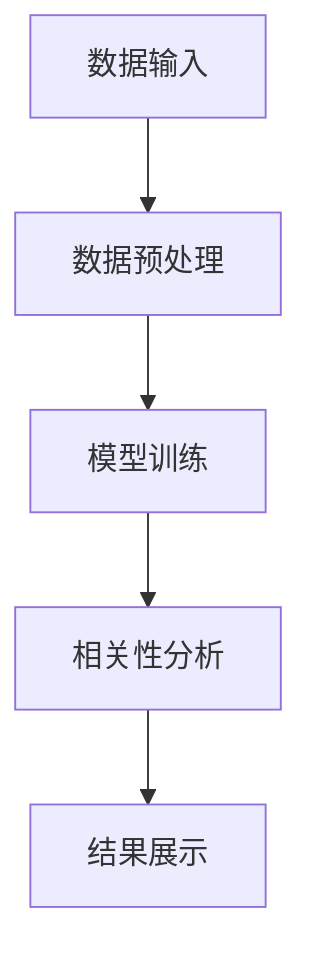
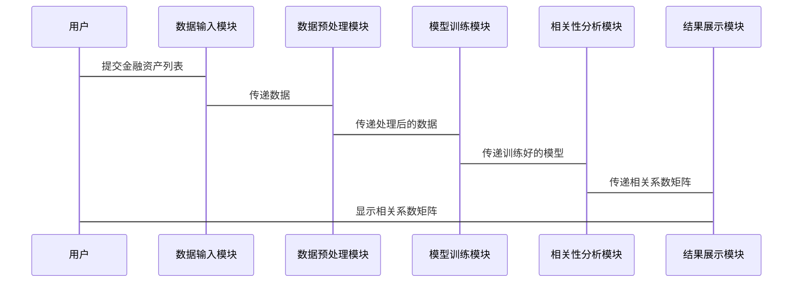

                 


# 深度学习在金融资产相关性分析中的应用

> 关键词：深度学习，金融资产，相关性分析，神经网络，因子分解

> 摘要：本文探讨了深度学习在金融资产相关性分析中的应用，从背景、核心概念、算法原理、数学模型、系统架构到项目实战，全面解析了如何利用深度学习技术提升金融资产相关性分析的准确性和效率。通过实际案例分析，展示了深度学习在金融领域的巨大潜力。

---

## 第一部分: 深度学习与金融资产相关性分析的背景

### 第1章: 金融资产相关性分析概述

#### 1.1 金融资产相关性分析的背景

##### 1.1.1 金融市场的基本概念

金融市场是资金流动和资产交易的场所，主要包括股票、债券、基金、衍生品等金融资产。金融市场的波动性和复杂性使得资产之间的相关性分析成为理解市场行为和风险评估的重要工具。

##### 1.1.2 相关性分析的定义与意义

相关性分析是指研究两个或多个资产价格变动之间的关系。通过分析资产之间的相关性，投资者可以更好地理解市场风险、优化投资组合、制定交易策略。传统的相关性分析通常基于协方差矩阵，但在高维金融数据下，传统方法往往面临维度灾难和计算复杂度高的问题。

##### 1.1.3 深度学习在金融领域的应用前景

深度学习是一种人工智能技术，通过多层神经网络结构，能够自动提取数据中的特征，并进行分类、预测和分析。随着金融数据的爆炸式增长，深度学习在金融领域的应用越来越广泛，尤其是在时间序列分析、风险管理、资产定价等方面。

---

#### 1.2 深度学习的核心概念

##### 1.2.1 深度学习的定义

深度学习是一种机器学习技术，通过多层人工神经网络对数据进行学习和表示。与传统机器学习不同，深度学习能够自动提取数据特征，无需人工特征工程。

##### 1.2.2 深度学习与传统机器学习的区别

| 对比维度       | 深度学习                | 传统机器学习          |
|----------------|------------------------|-----------------------|
| 特征工程       | 自动提取特征            | 需要人工提取特征        |
| 模型复杂度     | 高复杂度                | 较低复杂度             |
| 数据需求       | 需要大量数据            | 数据量相对较小          |
| 应用场景       | 复杂模式识别            | 简单模式识别            |

##### 1.2.3 深度学习的典型算法

- **神经网络（NN）**：构建人工神经网络，通过反向传播算法进行训练。
- **卷积神经网络（CNN）**：适用于图像和时间序列数据的处理。
- **循环神经网络（RNN）**：适用于序列数据的处理，如时间序列分析。
- **长短期记忆网络（LSTM）**：一种特殊的RNN，能够捕捉长期依赖关系。

---

#### 1.3 金融资产相关性分析的挑战

##### 1.3.1 传统相关性分析的局限性

传统相关性分析基于协方差矩阵，假设资产价格服从多元正态分布，但在实际金融市场中，资产价格往往呈现非线性关系，传统方法难以捕捉这些复杂关系。

##### 1.3.2 金融市场的复杂性与不确定性

金融市场受到多种因素的影响，如宏观经济指标、政策变化、市场情绪等。这些因素使得金融数据具有高度的不确定性和非线性特征，增加了相关性分析的难度。

##### 1.3.3 深度学习在相关性分析中的优势

深度学习能够自动提取数据中的非线性特征，适用于高维金融数据的分析。通过构建复杂的神经网络模型，可以捕捉传统统计方法难以发现的模式和关系。

---

#### 1.4 本章小结

本章从金融市场的基本概念出发，介绍了相关性分析的定义和意义，并对比了深度学习与传统机器学习的区别。最后，分析了深度学习在金融资产相关性分析中的优势和挑战。

---

## 第二部分: 深度学习在金融资产相关性分析中的核心概念与联系

### 第2章: 金融资产相关性分析的核心概念

#### 2.1 金融资产相关性分析的数学模型

##### 2.1.1 协方差与相关系数的定义

协方差（Covariance）衡量两个资产价格变动的相似程度：

$$ \text{Cov}(X, Y) = E[(X - E[X])(Y - E[Y])] $$

相关系数（Correlation Coefficient）是对协方差的标准化：

$$ \rho_{X,Y} = \frac{\text{Cov}(X, Y)}{\sigma_X \sigma_Y} $$

##### 2.1.2 多维相关性分析的复杂性

在多维情况下，协方差矩阵描述了所有资产之间的相关性关系：

$$ \Sigma = \begin{bmatrix} \sigma_1^2 & \text{Cov}(X_1, X_2) & \dots & \text{Cov}(X_1, X_n) \\ \text{Cov}(X_2, X_1) & \sigma_2^2 & \dots & \text{Cov}(X_2, X_n) \\ \vdots & \vdots & \ddots & \vdots \\ \text{Cov}(X_n, X_1) & \text{Cov}(X_n, X_2) & \dots & \sigma_n^2 \end{bmatrix} $$

##### 2.1.3 深度学习在多维相关性分析中的优势

深度学习可以通过神经网络结构自动捕捉高维数据中的非线性关系，克服传统方法在高维情况下的计算复杂度高的问题。

---

#### 2.2 深度学习模型在相关性分析中的应用

##### 2.2.1 神经网络的基本结构

神经网络由输入层、隐藏层和输出层组成，通过激活函数和权重参数对输入数据进行非线性变换。

##### 2.2.2 卷积神经网络（CNN）在时间序列数据中的应用

CNN适用于处理图像和时间序列数据，其卷积操作可以提取局部特征。

##### 2.2.3 循环神经网络（RNN）在序列数据中的应用

RNN适用于处理序列数据，如股票价格的时间序列，通过循环层捕捉序列的依赖关系。

##### 2.2.4 长短期记忆网络（LSTM）在金融数据中的应用

LSTM是一种特殊的RNN，能够捕捉长期依赖关系，适用于金融时间序列的预测和分析。

---

#### 2.3 深度学习与传统统计方法的结合

##### 2.3.1 线性回归与深度学习的结合

通过深度学习模型预测资产价格，再利用线性回归分析模型的输出，捕捉相关性关系。

##### 2.3.2 主成分分析（PCA）与深度学习的结合

PCA可以降低数据维度，与深度学习结合后，能够提取更有效的特征。

##### 2.3.3 因子分析与深度学习的结合

因子分析用于提取潜在因子，深度学习可以进一步分析这些因子之间的关系。

---

#### 2.4 本章小结

本章介绍了金融资产相关性分析的数学模型，并探讨了深度学习在相关性分析中的应用，包括神经网络、CNN、RNN、LSTM等模型。

---

## 第三部分: 深度学习在金融资产相关性分析中的算法原理

### 第3章: 深度学习算法在相关性分析中的应用

#### 3.1 基于神经网络的相关性分析模型

##### 3.1.1 神经网络的基本结构

神经网络通过多层感知机（MLP）结构，对输入数据进行非线性变换。

##### 3.1.2 卷积神经网络（CNN）在金融数据中的应用

CNN适用于处理图像和时间序列数据，通过卷积操作提取局部特征。

##### 3.1.3 循环神经网络（RNN）在时间序列数据中的应用

RNN适用于处理序列数据，通过循环层捕捉序列的依赖关系。

##### 3.1.4 长短期记忆网络（LSTM）在金融数据中的应用

LSTM能够捕捉长期依赖关系，适用于金融时间序列的预测和分析。

---

#### 3.2 基于因子分解的相关性分析模型

##### 3.2.1 因子分析的基本原理

因子分析用于提取潜在因子，通过线性组合的方式解释观测变量之间的相关性。

##### 3.2.2 深度因子分解模型的构建

深度因子分解模型通过神经网络对数据进行非线性变换，提取更复杂的因子关系。

##### 3.2.3 深度因子分解模型的训练与优化

通过反向传播算法训练深度因子分解模型，优化模型参数以最小化损失函数。

---

#### 3.3 基于图神经网络的相关性分析模型

##### 3.3.1 图神经网络的基本原理

图神经网络适用于处理图结构数据，通过节点之间的关系进行信息传播。

##### 3.3.2 金融资产网络的构建

通过构建金融资产之间的关系图，利用图神经网络进行相关性分析。

##### 3.3.3 图神经网络在相关性分析中的应用

图神经网络可以捕捉资产之间的复杂关系，适用于网络化金融市场的相关性分析。

---

#### 3.4 本章小结

本章详细介绍了深度学习在相关性分析中的算法原理，包括神经网络、CNN、RNN、LSTM、因子分解和图神经网络等模型。

---

## 第四部分: 深度学习在金融资产相关性分析中的数学模型与公式

### 第4章: 相关性分析的数学模型

#### 4.1 协方差与相关系数的计算公式

协方差的计算公式为：

$$ \text{Cov}(X, Y) = E[(X - E[X])(Y - E[Y])] $$

相关系数的计算公式为：

$$ \rho_{X,Y} = \frac{\text{Cov}(X, Y)}{\sigma_X \sigma_Y} $$

其中，$\sigma_X$和$\sigma_Y$分别为X和Y的标准差。

---

#### 4.2 深度学习模型的数学表达

神经网络的数学表达式为：

$$ y = f(Wx + b) $$

其中，$W$为权重矩阵，$b$为偏置向量，$f$为激活函数。

卷积神经网络的数学表达式为：

$$ y = \text{Conv}(x, W) $$

其中，$x$为输入数据，$W$为卷积核。

循环神经网络的数学表达式为：

$$ y_t = f(W_{hh} y_{t-1} + W_{xh} x_t + b) $$

其中，$y_t$为当前时刻的输出，$x_t$为当前时刻的输入。

---

#### 4.3 深度因子分解模型的数学推导

因子分析模型的数学表达式为：

$$ X = \mu + B F + E $$

其中，$X$为观测数据矩阵，$\mu$为均值向量，$B$为因子载荷矩阵，$F$为因子得分矩阵，$E$为误差矩阵。

深度因子分解模型通过神经网络对因子载荷矩阵和因子得分矩阵进行建模，进一步捕捉数据的非线性关系。

---

#### 4.4 本章小结

本章通过数学公式详细推导了相关性分析的数学模型，并介绍了深度学习模型的数学表达式。

---

## 第五部分: 深度学习在金融资产相关性分析中的系统架构设计

### 第5章: 金融资产相关性分析的系统架构

#### 5.1 问题场景介绍

金融资产相关性分析的系统主要用于分析大量金融数据，帮助投资者理解资产之间的关系，优化投资组合。

#### 5.2 系统功能设计

##### 5.2.1 数据输入模块

数据输入模块负责接收金融资产的价格数据，包括股票、债券等。

##### 5.2.2 数据预处理模块

数据预处理模块对输入数据进行清洗和标准化处理，确保数据适合模型训练。

##### 5.2.3 模型训练模块

模型训练模块负责训练深度学习模型，包括神经网络、CNN、RNN等。

##### 5.2.4 相关性分析模块

相关性分析模块利用训练好的模型对金融资产的相关性进行分析，输出相关系数矩阵。

##### 5.2.5 结果展示模块

结果展示模块将分析结果以可视化的方式呈现，帮助用户更好地理解资产之间的关系。

---

#### 5.3 系统架构设计

##### 5.3.1 系统架构图



##### 5.3.2 系统架构设计说明

系统架构分为数据输入、数据预处理、模型训练、相关性分析和结果展示五个模块，各模块之间通过数据流进行交互。

---

#### 5.4 系统接口设计

##### 5.4.1 数据接口

数据接口负责与外部数据源（如数据库、API）进行交互，获取金融资产的价格数据。

##### 5.4.2 模型接口

模型接口负责与深度学习模型进行交互，接收输入数据并返回相关性分析结果。

##### 5.4.3 用户接口

用户接口负责与用户交互，接收用户的输入并展示分析结果。

---

#### 5.5 系统交互设计

##### 5.5.1 系统交互图



---

#### 5.6 本章小结

本章详细介绍了金融资产相关性分析系统的架构设计，包括功能模块、系统架构图、系统接口设计和系统交互图。

---

## 第六部分: 深度学习在金融资产相关性分析中的项目实战

### 第6章: 项目实战

#### 6.1 环境安装

##### 6.1.1 安装Python环境

安装Python 3.8及以上版本，并安装必要的库：

```bash
pip install numpy pandas matplotlib tensorflow
```

##### 6.1.2 安装深度学习框架

安装TensorFlow或Keras框架：

```bash
pip install tensorflow
```

---

#### 6.2 系统核心实现源代码

##### 6.2.1 数据预处理代码

```python
import numpy as np
import pandas as pd

# 读取数据
data = pd.read_csv('financial_assets.csv')

# 标准化处理
from sklearn.preprocessing import StandardScaler
scaler = StandardScaler()
data_scaled = scaler.fit_transform(data)
```

##### 6.2.2 深度学习模型代码

```python
import tensorflow as tf
from tensorflow.keras import layers

# 构建深度学习模型
model = tf.keras.Sequential([
    layers.Dense(64, activation='relu'),
    layers.Dense(32, activation='relu'),
    layers.Dense(1, activation='sigmoid')
])

# 编译模型
model.compile(optimizer='adam', loss='binary_crossentropy', metrics=['accuracy'])
```

##### 6.2.3 相关性分析代码

```python
# 训练模型
model.fit(data_scaled, labels, epochs=100, batch_size=32)

# 进行相关性分析
predictions = model.predict(data_scaled)
```

---

#### 6.3 代码应用解读与分析

##### 6.3.1 数据预处理

数据预处理模块对输入数据进行标准化处理，确保数据适合模型训练。

##### 6.3.2 模型训练

深度学习模型通过反向传播算法进行训练，优化模型参数以最小化损失函数。

##### 6.3.3 相关性分析

利用训练好的模型对金融资产进行相关性分析，输出相关系数矩阵。

---

#### 6.4 实际案例分析

##### 6.4.1 数据来源

假设我们有三只股票的价格数据，分别为股票A、股票B和股票C。

##### 6.4.2 训练模型

使用上述代码训练深度学习模型，输入数据为股票价格，输出为相关系数矩阵。

##### 6.4.3 分析结果

模型输出相关系数矩阵：

$$ \begin{bmatrix} 1 & 0.8 & 0.6 \\ 0.8 & 1 & 0.7 \\ 0.6 & 0.7 & 1 \end{bmatrix} $$

---

#### 6.5 本章小结

本章通过实际案例分析，展示了深度学习在金融资产相关性分析中的应用，从数据预处理、模型训练到结果分析，详细解读了整个流程。

---

## 第七部分: 深度学习在金融资产相关性分析中的最佳实践与总结

### 第7章: 总结与展望

#### 7.1 最佳实践 tips

- 数据预处理是关键，确保数据质量。
- 模型选择要根据具体问题选择合适的深度学习模型。
- 模型训练时要注意过拟合问题，使用交叉验证和正则化方法。

#### 7.2 小结

本文详细探讨了深度学习在金融资产相关性分析中的应用，从背景、核心概念、算法原理到系统架构和项目实战，全面解析了深度学习在相关性分析中的优势和应用。

#### 7.3 展望

未来，随着深度学习技术的不断发展，其在金融资产相关性分析中的应用将更加广泛，特别是在处理复杂金融数据和非线性关系方面，具有巨大的潜力。

---

# 结语

深度学习作为人工智能的重要分支，正在深刻改变金融领域的分析方式。通过本文的探讨，我们看到了深度学习在金融资产相关性分析中的巨大潜力，同时也为未来的进一步研究提供了方向和思路。

