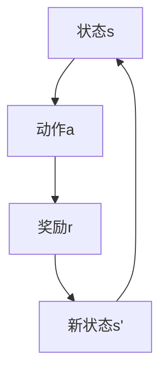
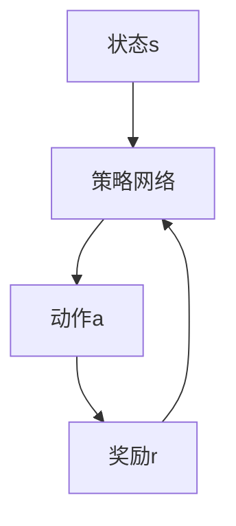
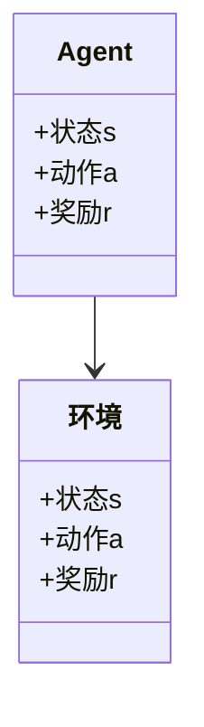
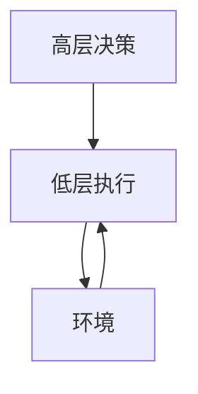

                 

# 深度强化学习在AI Agent协作决策中的应用

## 关键词

- 深度强化学习
- AI Agent
- 协作决策
- 多智能体系统
- 算法原理

## 摘要

本文深入探讨了深度强化学习在AI Agent协作决策中的应用，通过详细分析核心算法、系统架构设计和实际项目案例，揭示了如何利用深度强化学习实现多智能体的有效协作与决策。文章从理论基础到实践应用，为读者提供了全面的指导和深入的见解。

---

## 目录大纲

### 第一章：深度强化学习与AI Agent协作决策概述

#### 1.1 深度强化学习的背景与概念
- 1.1.1 深度学习与强化学习的结合
- 1.1.2 AI Agent的定义与特点
- 1.1.3 协作决策的核心概念

#### 1.2 深度强化学习在AI Agent中的应用
- 1.2.1 多智能体协作的基本原理
- 1.2.2 深度强化学习在协作中的优势
- 1.2.3 实际应用场景分析

### 第二章：深度强化学习的核心算法原理

#### 2.1 Q-learning算法
- 2.1.1 Q-learning的基本原理
- 2.1.2 Q-learning的数学模型
$$ Q(s,a) = r + \gamma \max Q(s',a') $$
- 2.1.3 Q-learning的实现流程

#### 2.2 策略梯度法（Policy Gradient）
- 2.2.1 策略梯度的基本原理
- 2.2.2 策略梯度的数学模型
$$ \nabla \theta \leftarrow \nabla J(\theta) $$
- 2.2.3 策略梯度的实现流程

### 第三章：多智能体协作决策的系统架构设计

#### 3.1 系统功能设计
- 3.1.1 多智能体协作的领域模型

#### 3.2 系统架构设计
- 3.2.1 分层架构设计

#### 3.3 接口设计与交互流程

### 第四章：项目实战

#### 4.1 环境安装
- 安装Python和相关库（如TensorFlow、Keras）
- 安装强化学习框架（如OpenAI Gym）

#### 4.2 核心代码实现
- 多智能体协作的代码实现
- 使用Q-learning算法实现简单协作任务
- 使用策略梯度法实现复杂协作任务

#### 4.3 案例分析
- 案例1：多智能体协作实现交通信号灯控制
- 案例2：多智能体协作实现机器人协作抓取

### 第五章：最佳实践

#### 5.1 小结与总结
- 深度强化学习在AI Agent协作决策中的重要性
- 各种算法的优缺点对比

#### 5.2 注意事项
- 算法选择的注意事项
- 系统设计中的常见问题及解决方案

#### 5.3 拓展阅读
- 推荐相关书籍和论文
- 提供进一步学习的资源链接

---

通过以上目录结构，本文将从理论到实践，全面系统地探讨深度强化学习在AI Agent协作决策中的应用，帮助读者深入理解并掌握相关技术。

